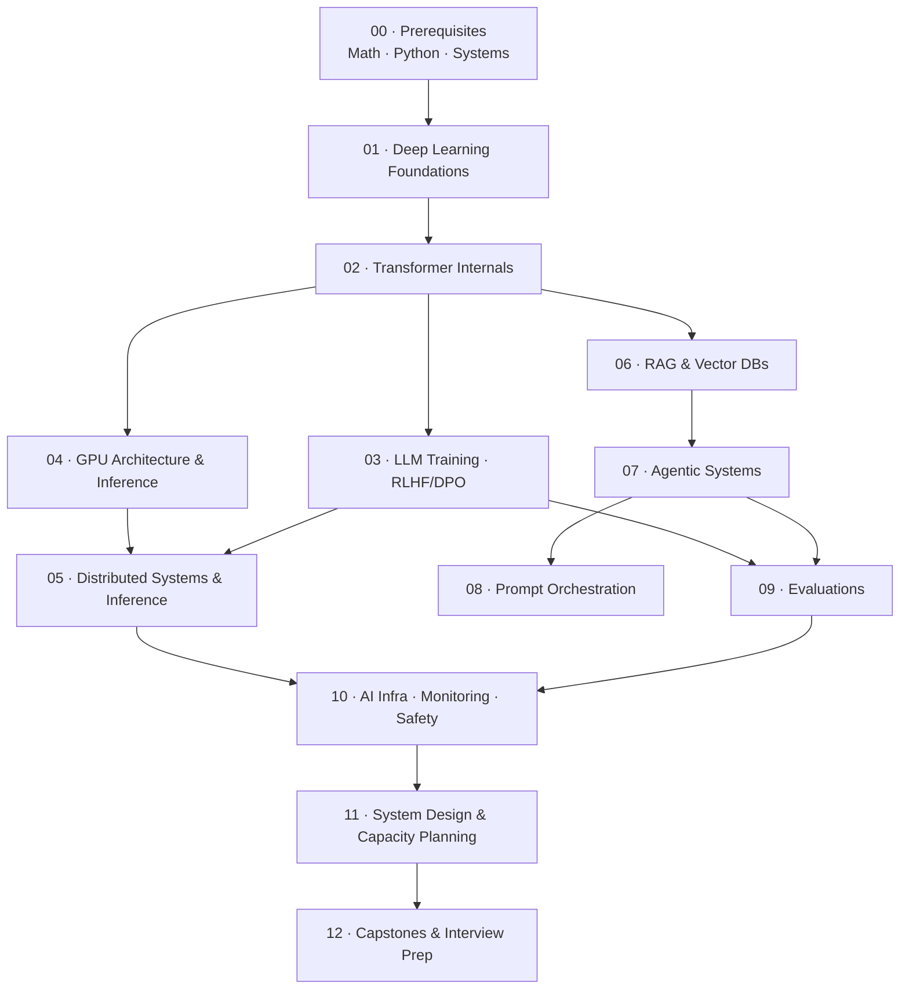

# Senior AI/ML Engineer Bootcamp — From Fundamentals to Frontier Labs

> A complete, build-first syllabus to become a **Senior AI/ML Engineer** capable of designing, building, serving, evaluating, and operating LLMs and agentic systems at scale — targeting roles at **Anthropic, OpenAI**, and equivalent frontier labs.

This is not a reading list. It is a **12-month, project-driven curriculum** where every module ends with something you *built* and can defend in an interview.

---

## How to use this syllabus

1. **Build, don't just read.** Each module has a capstone deliverable. If you can't build it, you don't know it.
2. **Keep a lab notebook.** One repo per module. Commit experiments, benchmarks, and write-ups.
3. **Read the primary sources.** Papers > blog posts > tutorials. Every module lists the canonical papers.
4. **Measure everything.** Latency, throughput, cost, accuracy. Senior engineers reason in numbers.
5. **Re-derive from scratch.** You should be able to implement attention, a KV cache, and PPO without copying.

### Suggested cadence
- **Full-time (already a SWE):** ~6 months at 30–40 hrs/week.
- **Part-time (employed):** ~12 months at 12–15 hrs/week.
- **Each module:** ~70% building, 20% reading, 10% writing up.

---

## The 15 mastery areas (from the brief) → where they live

| # | Mastery area | Module |
|---|--------------|--------|
| 1 | Transformer internals | [02](modules/02-transformer-internals.md) |
| 2 | Distributed inference | [05](modules/05-distributed-systems-and-inference.md) |
| 3 | GPU architecture | [04](modules/04-gpu-architecture-and-inference.md) |
| 4 | RAG systems | [06](modules/06-rag-and-vector-databases.md) |
| 5 | Agent systems | [07](modules/07-agentic-systems.md) |
| 6 | Vector databases | [06](modules/06-rag-and-vector-databases.md) |
| 7 | Prompt orchestration | [08](modules/08-prompt-orchestration.md) |
| 8 | Model evaluation | [09](modules/09-evaluations.md) |
| 9 | RLHF / DPO | [03](modules/03-llm-training-rlhf-dpo.md) |
| 10 | AI infrastructure | [10](modules/10-ai-infrastructure-and-production.md) |
| 11 | Distributed systems | [05](modules/05-distributed-systems-and-inference.md) |
| 12 | Production monitoring | [10](modules/10-ai-infrastructure-and-production.md) |
| 13 | Safety systems | [10](modules/10-ai-infrastructure-and-production.md) |
| 14 | Cost optimization | [11](modules/11-system-design-and-capacity-planning.md) |
| 15 | Large-scale system design | [11](modules/11-system-design-and-capacity-planning.md) |

Plus capacity estimation (**QPS, GPU count, storage, network bandwidth**) → [Module 11](modules/11-system-design-and-capacity-planning.md).

---

## Curriculum map



---

## Phases & timeline

### Phase 1 — Foundations (Weeks 1–8)
- [00 · Prerequisites](modules/00-prerequisites.md) — math, Python, systems, CUDA setup
- [01 · Deep Learning Foundations](modules/01-deep-learning-foundations.md) — autograd, optimization, training loop from scratch

### Phase 2 — Modeling (Weeks 9–20)
- [02 · Transformer Internals](modules/02-transformer-internals.md) — build a GPT + modern attention variants
- [03 · LLM Training, RLHF & DPO](modules/03-llm-training-rlhf-dpo.md) — pretraining → SFT → RLHF/DPO

### Phase 3 — Systems & Serving (Weeks 21–32)
- [04 · GPU Architecture & Inference](modules/04-gpu-architecture-and-inference.md) — CUDA, kernels, quantization, vLLM
- [05 · Distributed Systems & Inference](modules/05-distributed-systems-and-inference.md) — parallelism, FSDP, multi-node serving

### Phase 4 — Applied LLM Systems (Weeks 33–44)
- [06 · RAG & Vector Databases](modules/06-rag-and-vector-databases.md)
- [07 · Agentic Systems](modules/07-agentic-systems.md)
- [08 · Prompt Orchestration](modules/08-prompt-orchestration.md)
- [09 · Evaluations](modules/09-evaluations.md)

### Phase 5 — Production & Scale (Weeks 45–52)
- [10 · AI Infrastructure, Monitoring & Safety](modules/10-ai-infrastructure-and-production.md)
- [11 · System Design & Capacity Planning](modules/11-system-design-and-capacity-planning.md)
- [12 · Capstones & Interview Prep](modules/12-capstones-and-interview-prep.md)

---

## Starter code (labs)

Runnable, build-first starter code lives in [labs/](labs/README.md) — fill-in-the-blanks
projects with spec tests as your definition of done:
- [lab01_micrograd](labs/lab01_micrograd/) — autograd engine from scratch ([Module 01](modules/01-deep-learning-foundations.md))
- [lab02_nanogpt](labs/lab02_nanogpt/) — GPT from scratch ([Module 02](modules/02-transformer-internals.md))
- [lab04_inference_bench](labs/lab04_inference_bench/) — vLLM/LLM serving benchmark ([Module 04](modules/04-gpu-architecture-and-inference.md))
- [lab06_rag](labs/lab06_rag/) — RAG retrieval core: cosine, exact + IVF index, hybrid fusion, recall@k/MRR ([Module 06](modules/06-rag-and-vector-databases.md))
- [lab07_agent](labs/lab07_agent/) — a ReAct agent loop with pluggable tools + brain ([Module 07](modules/07-agentic-systems.md))

```bash
cd labs && uv sync --extra dev
uv run pytest            # smoke tests (green)
uv run pytest -m todo    # the exercises you implement
```

## Learn by running (notebooks)

Twelve **teaching notebooks** derive every concept from scratch — runnable offline with NumPy
(no GPU/API needed). See [notebooks/README.md](notebooks/README.md) for the full index.

| Notebooks | Topic |
|-----------|-------|
| [01](notebooks/01_autograd_and_training.ipynb)–[03](notebooks/03_pretraining_and_scaling_laws.ipynb) | autograd, transformers from scratch, pretraining & scaling laws |
| [04](notebooks/04_finetuning_sft_and_peft.ipynb)–[05](notebooks/05_alignment_rlhf_and_dpo.ipynb) | SFT/LoRA fine-tuning, RLHF & a runnable DPO trainer |
| [06](notebooks/06_inference_and_serving.ipynb)–[07](notebooks/07_distributed_training_and_inference.ipynb) | inference/serving math, distributed training (TP/PP/ZeRO/FSDP) |
| [08](notebooks/08_rag_and_vector_databases.ipynb)–[10](notebooks/10_multi_agent_systems.ipynb) | RAG & vector DBs, AI agents, multi-agent systems |
| [11](notebooks/11_evaluations.ipynb)–[12](notebooks/12_prompt_orchestration.ipynb) | evaluations (CI gates, LLM-as-judge), prompt orchestration |

```bash
cd labs && uv sync --extra viz       # notebooks reuse the labs env
uv run --with jupyter jupyter lab    # open ../notebooks/*.ipynb
```

## Interview prep (Q&A bank)

A complete, **answer-included** question bank for **Anthropic / OpenAI**-level Senior AI / Applied AI
Engineer loops lives in [interview-prep/](interview-prep/README.md):

| File | Round |
|------|-------|
| [01 · Coding](interview-prep/01-coding.md) | Practical ML coding (attention, sampler, KV cache, metrics) + DSA |
| [02 · ML & LLM Depth](interview-prep/02-ml-and-llm-depth.md) | Transformers, training, RLHF/DPO, inference, distributed, scaling |
| [03 · System Design](interview-prep/03-system-design.md) | ChatGPT-scale serving, RAG, agent platform — with capacity math |
| [04 · Applied LLM](interview-prep/04-applied-llm.md) | RAG, agents, prompting, evals, cost/latency (Applied-AI core) |
| [05 · Safety & Alignment](interview-prep/05-safety-alignment.md) | RSP/Preparedness, prompt injection, red-teaming, interpretability |
| [06 · Behavioral & Mission](interview-prep/06-behavioral-mission.md) | "Why Anthropic", STAR stories, questions to ask |
| [07 · Rapid-Fire](interview-prep/07-rapid-fire.md) | 130+ one-line recall flashcards |
| [08 · Mock Interview](interview-prep/08-mock-interview.md) | Self-run loop simulation, scoring rubrics, retro, day-of checklist |
| [09 · Key Papers](interview-prep/09-papers.md) | Annotated must-know papers — discuss each in 2 minutes |
| [10 · Numbers & Hardware](interview-prep/10-numbers-and-hardware.md) | GPU specs, capacity math, night-before cheat sheet |
| [11 · Debugging](interview-prep/11-debugging.md) | Find-the-bug round: broken ML code + fixes (verified) |
| [12 · Math, Stats & Classic ML](interview-prep/12-math-stats.md) | Probability, statistics, training math, pre-LLM ML, metrics |
| [13 · Take-Home & Portfolio](interview-prep/13-take-home-portfolio.md) | Acing the take-home + project deep-dive; reviewer rubric |
| [14 · CUDA & GPU Kernels](interview-prep/14-cuda-and-kernels.md) | Performance round: execution model, roofline, tiling, FlashAttention, Triton |
| [15 · Glossary & Quick-Reference](interview-prep/15-glossary.md) | A–Z one-line definitions of every term in the bank |
| [16 · Negotiation & Leveling](interview-prep/16-negotiation-and-leveling.md) | Getting the right level + negotiating comp/equity |
| [17 · Company & Lab Research](interview-prep/17-company-research.md) | Know the lab: research framework, Anthropic profile, questions to ask |
| [flashcards.csv](interview-prep/flashcards.csv) | The 132 cards as CSV — import into Anki for spaced repetition |

## Reference material
- [Resources](resources.md) — books, courses, papers, blogs, tooling
- [Skills checklist](skills-checklist.md) — self-assessment you should ace before interviewing
- [Agentic AI Course](agentic-ai/README.md) — a complete, runnable applied companion course (4 courses, 4 notebooks, 4 portfolio projects) that maps onto Modules [07](modules/07-agentic-systems.md) & [08](modules/08-prompt-orchestration.md); every example runs offline via a deterministic mock LLM

---

## What "senior" means here

A senior AI engineer at a frontier lab can:
- Implement a transformer, KV cache, and an RL fine-tuning loop **from scratch**.
- Read a model card / architecture diagram and **estimate** memory, FLOPs, latency, and cost.
- Take a model from research checkpoint to **production serving** with SLAs.
- Design an **agentic system** with tools, memory, planning, and safety guardrails.
- Build **evals** that actually catch regressions and unsafe behavior.
- Reason about **trade-offs** (latency vs. cost vs. quality) with real numbers.
- Communicate clearly and write design docs.

Each module is built to push you toward that bar.
