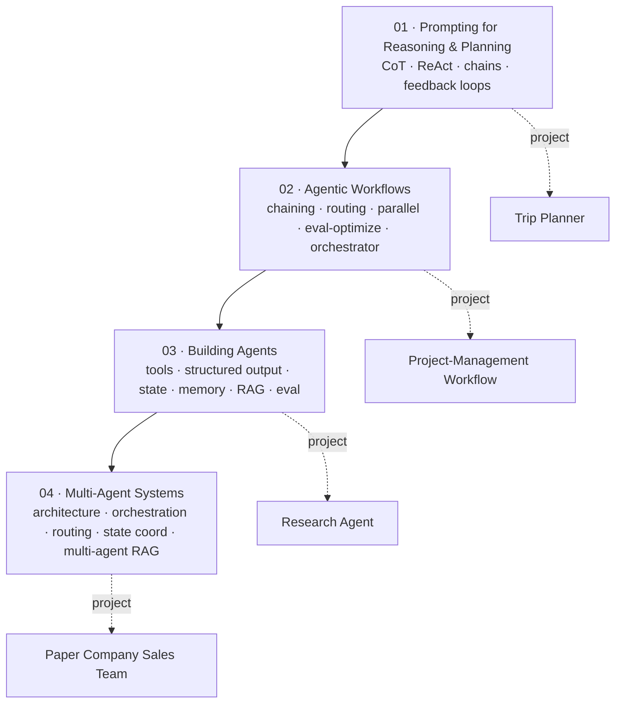

# Agentic AI — A Complete, Runnable Course

> A from-scratch, build-first **Agentic AI course**.
> Four courses, ~71 lessons, four portfolio projects — every concept explained, every
> pattern implemented in Python, and **everything runnable offline** (no API key required)
> thanks to a deterministic mock LLM that you swap for a real model with one env var.

You will go beyond single chatbots to engineer **coordinated teams of AI agents**: from advanced
prompting (Chain-of-Thought, ReAct) → agentic workflow patterns (routing, parallelization,
evaluator-optimizer, orchestrator-workers) → real agents (tools, structured outputs, state,
memory, RAG, evaluation) → full **multi-agent systems**.

---

## What makes this version different

| | Typical course | This version |
|---|---|---|
| Runs without an OpenAI key | No | **Yes** — deterministic [`MockLLM`](shared/llm.py) fallback |
| Code explained line-by-line | Partly | **Every pattern**, in the [course docs](courses/) + [notebooks](notebooks/) |
| Reproducible outputs | No | **Yes** — scripted mock replies in notebooks |
| Self-contained repo | Hosted | **Yes** — `uv sync` and go |
| Real model when you want it | Yes | **Yes** — set `OPENAI_API_KEY`, same code |

---

## The program at a glance



| # | Course | Hours | You build | Project |
|---|--------|------:|-----------|---------|
| 01 | [Prompting for Effective LLM Reasoning & Planning](courses/01-prompting.md) | 13 | role prompts, CoT, ReAct, prompt chains with Pydantic gates, self-correcting feedback loops | [Trip Planner](projects/01_trip_planner/) |
| 02 | [Agentic Workflows](courses/02-agentic-workflows.md) | 14 | the five workflow patterns + a reusable agent library | [Project-Management Workflow](projects/02_project_management_workflow/) |
| 03 | [Building Agents](courses/03-building-agents.md) | 11 | tool use, structured outputs, state machines, memory, web/SQL/vector tools, agentic RAG, eval | [Research Agent](projects/03_research_agent/) |
| 04 | [Multi-Agent Systems](courses/04-multi-agent-systems.md) | 14 | multi-agent architecture, orchestration, routing, shared-state coordination, multi-agent RAG | [Paper Company Sales Team](projects/04_sales_team/) |

---

## The 15 skills (from the syllabus) → where they live

| Skill | Course / artifact |
|-------|-------------------|
| Iterative & role-based prompting | [01 §2–3](courses/01-prompting.md), [nb01](notebooks/01_prompting.ipynb) |
| Chain-of-Thought & ReAct | [01 §4](courses/01-prompting.md), [nb01](notebooks/01_prompting.ipynb) |
| Prompt chaining with validation | [01 §6](courses/01-prompting.md), [Project 1](projects/01_trip_planner/) |
| Feedback / self-correction loops | [01 §7](courses/01-prompting.md) |
| Prompt-chaining workflow | [02 §2](courses/02-agentic-workflows.md) |
| Routing workflow | [02 §3](courses/02-agentic-workflows.md), [nb02](notebooks/02_agentic_workflows.ipynb) |
| Parallelization workflow | [02 §4](courses/02-agentic-workflows.md) |
| Evaluator-optimizer workflow | [02 §5](courses/02-agentic-workflows.md) |
| Orchestrator-workers workflow | [02 §6](courses/02-agentic-workflows.md), [Project 2](projects/02_project_management_workflow/) |
| Tool use / function calling | [03 §2](courses/03-building-agents.md), [nb03](notebooks/03_building_agents.ipynb) |
| Structured outputs (Pydantic) | [03 §3](courses/03-building-agents.md) |
| State management | [03 §4](courses/03-building-agents.md) |
| Short- & long-term memory | [03 §5, §9](courses/03-building-agents.md) |
| External APIs / web / SQL / MCP | [03 §6–8](courses/03-building-agents.md) |
| Agentic RAG | [03 §8](courses/03-building-agents.md), [Project 3](projects/03_research_agent/) |
| Agent evaluation | [03 §10](courses/03-building-agents.md) |
| Multi-agent architecture & orchestration | [04 §2–4](courses/04-multi-agent-systems.md), [nb04](notebooks/04_multi_agent_systems.ipynb) |
| Multi-agent routing & state coordination | [04 §5–6](courses/04-multi-agent-systems.md) |
| Multi-agent RAG | [04 §7](courses/04-multi-agent-systems.md), [Project 4](projects/04_sales_team/) |

---

## Prerequisites

Basic Python · basic prompting · OpenAI API familiarity (optional here) · comfort with JSON.
No math beyond high-school. No GPU. **No API key required** to complete every lesson.

---

## Quick start

```bash
cd agentic-ai

# Offline mode (default) — runs everything with the deterministic mock LLM:
uv sync --extra dev

# Online mode — real models. Install the SDK and set your key:
uv sync --extra dev --extra openai
export OPENAI_API_KEY=sk-...          # Windows (PowerShell): $env:OPENAI_API_KEY="sk-..."

# Sanity check the LLM client (works in both modes):
uv run python -c "from shared.llm import get_llm, user; print(get_llm().chat([user('hello')]))"
```

See [setup.md](setup.md) for the full guide (Azure OpenAI, optional extras, troubleshooting).

### Run the notebooks

```bash
uv sync --extra dev --extra viz
uv run jupyter lab          # open notebooks/*.ipynb, pick the .venv kernel
```

### Rebuild the notebooks (after editing a builder)

```bash
uv run python notebooks/build_all.py
```

---

## How to study this course

1. **Read the course doc, run the notebook, then do the project.** Each course is a triple:
   a markdown deep-dive ([courses/](courses/)), a runnable notebook ([notebooks/](notebooks/)),
   and a portfolio project ([projects/](projects/)).
2. **Run offline first, then flip on a real model.** Patterns are identical; only the
   "intelligence" changes. Seeing both teaches you what the *orchestration* actually does.
3. **Type the code.** Don't copy. The patterns (loop, route, reflect, delegate) are the point.
4. **Finish the four projects.** They are the portfolio that proves proficiency.

### Suggested pace
- **Intensive:** 3–4 weeks at ~15 hrs/week (one course + project per week).
- **Steady:** 8 weeks at ~7 hrs/week.

---

## Repository layout

```
agentic-ai/
├── README.md                 ← you are here (master syllabus)
├── setup.md                  ← environment + API key guide
├── pyproject.toml            ← uv project (offline by default)
├── shared/llm.py             ← unified LLM client (real OpenAI OR offline mock)
├── courses/                  ← four lesson-by-lesson deep dives
│   ├── 01-prompting.md
│   ├── 02-agentic-workflows.md
│   ├── 03-building-agents.md
│   └── 04-multi-agent-systems.md
├── notebooks/                ← four runnable teaching notebooks (+ builders in src/)
└── projects/                 ← four portfolio projects (spec + starter + rubric)
```

---

## Meet the patterns you'll master

```mermaid
flowchart LR
    subgraph Prompting
      cot[Chain-of-Thought] --> react[ReAct]
    end
    subgraph Workflows
      chain[Prompt Chaining] --> route[Routing]
      route --> par[Parallelization]
      par --> evopt[Evaluator-Optimizer]
      evopt --> orch[Orchestrator-Workers]
    end
    subgraph Agents
      tools[Tools] --> mem[Memory]
      mem --> rag[Agentic RAG]
    end
    subgraph Multi-Agent
      arch[Architecture] --> coord[State Coordination]
      coord --> marag[Multi-Agent RAG]
    end
    react --> chain
    orch --> tools
    rag --> arch
```



> **Note:** all code, explanations, and the offline runtime here are original and
> written to be studied and run independently.
