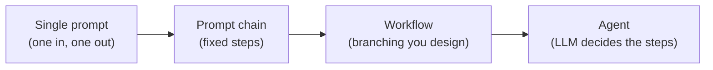
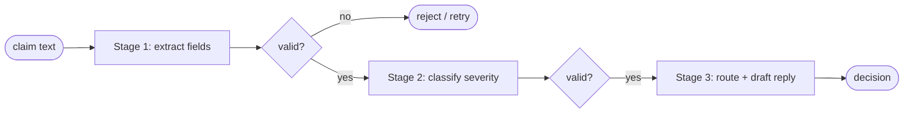
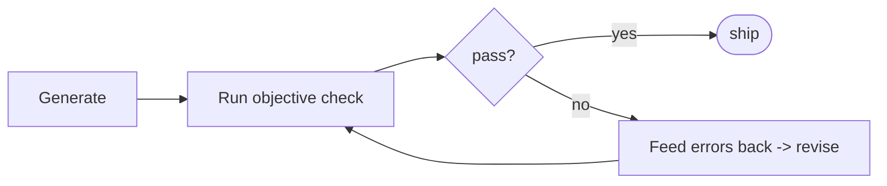

# Course 01 · Prompting for Effective LLM Reasoning and Planning

> **13 hours · 14 lessons · Project: [Trip Planner](../projects/01_trip_planner/)**
>
> Pairs with notebook [`01_prompting.ipynb`](../notebooks/01_prompting.ipynb).

Prompting *is* programming an LLM. Before agents, workflows, or tools, you must reliably get a
model to **reason** (think before answering) and **plan** (decompose a goal into steps). This
course builds that foundation: role prompting → Chain-of-Thought → ReAct → prompt chaining →
self-correcting feedback loops.

All code uses the course's [`shared.llm`](../shared/llm.py) client, so it runs offline with the
mock and online with a real model — unchanged.

| Lesson | Section below |
|--------|---------------|
| L1 Introduction | [§1](#1-what-agentic-ai-is-l1) |
| L2 The Role of Prompting | [§2](#2-how-llms-turn-prompts-into-actions-l2) |
| L3–L4 Role-Based Prompting | [§3](#3-role-based-prompting-l3l4) |
| L5–L6 Chain-of-Thought & ReAct | [§4](#4-chain-of-thought--react-l5l6) |
| L7–L8 Prompt Instruction Refinement | [§5](#5-prompt-instruction-refinement-l7l8) |
| L9–L10 Chaining Prompts | [§6](#6-prompt-chaining-with-validation-l9l10) |
| L11–L12 Feedback Loops | [§7](#7-llm-feedback-loops-l11l12) |
| L13–L14 Review & Project | [§8](#8-course-review--project-l13l14) |

---

## 1. What Agentic AI is (L1)

An **AI agent** is an LLM placed *in a loop* with the ability to **reason**, **plan**, and **act**
(use tools, call APIs, read/write memory) toward a goal — instead of producing a single reply.

The spectrum of autonomy:



> **Principle that runs through the whole course:** use the *least autonomy* that solves the
> task. A fixed chain you can test beats an open-ended agent you can't.

This course lives at the left of that spectrum — making a *single* model turn reliable — because
everything to the right is built from reliable turns.

---

## 2. How LLMs turn prompts into actions (L2)

An LLM is a next-token predictor conditioned on your prompt. You steer it with a **message list**
of roles:

- **system** — identity, rules, output contract (highest leverage).
- **user** — the task / input.
- **assistant** — prior model turns (this is how you build multi-turn context).

```python
from shared.llm import get_llm, system, user

llm = get_llm()  # real model if OPENAI_API_KEY is set, else the offline mock
reply = llm.chat([
    system("You are a precise assistant. Answer in one sentence."),
    user("Why is prompting the foundation of agentic AI?"),
])
print(reply)
```

Three levers decide output quality, in order of impact:

1. **Role/instructions** (the system prompt) — *who* the model is and *what rules* bind it.
2. **Context** — the facts/examples it may use (later: retrieval, memory, tool results).
3. **Output format** — the contract the next step depends on (often JSON).

Everything below is a disciplined way to pull these three levers.

---

## 3. Role-Based Prompting (L3–L4)

**Idea:** assigning a concrete **role/persona** shifts the model's tone, vocabulary, and the
knowledge it foregrounds. "You are a senior tax attorney" yields different (often better) output
than no role at all — it conditions the distribution toward expert text.

A reusable template — **R-T-C-E-O** (Role, Task, Context, Examples, Output) — is the backbone of
the whole course:

```python
from shared.llm import get_llm, system, user

def rtceo(role, task, context="", examples="", output_format=""):
    """Compose a disciplined prompt from the five high-leverage components."""
    sys = f"ROLE: {role}"
    if output_format:
        sys += f"\n\nOUTPUT FORMAT (follow exactly):\n{output_format}"
    msg = f"TASK: {task}"
    if context:
        msg += f"\n\nCONTEXT:\n{context}"
    if examples:
        msg += f"\n\nEXAMPLES:\n{examples}"
    return [system(sys), user(msg)]

llm = get_llm()
messages = rtceo(
    role="You are Ada Lovelace, the 19th-century mathematician. Stay in character.",
    task="Explain what an algorithm is to a curious child.",
    output_format="2–3 sentences, warm and vivid, no modern jargon.",
)
print(llm.chat(messages))
```

**Iterative development** (the L4 skill): you rarely nail a persona on the first try. The workflow
is *draft → inspect output → tighten one component → repeat*. Common fixes: pin the era/voice,
forbid specific failure modes ("never break character"), add one example of the target style.

> Project tie-in: the [Trip Planner](../projects/01_trip_planner/) gives each agent a
> sharp role ("You are a meticulous travel itinerary builder…") so its outputs are predictable.

---

## 4. Chain-of-Thought & ReAct (L5–L6)

### Chain-of-Thought (CoT)

LLMs answer better when allowed to **think step by step** before committing. CoT simply *asks for
the reasoning first*. It trades tokens for accuracy on multi-step problems (math, logic, planning).

```python
from shared.llm import get_llm, system, user

llm = get_llm()
cot = llm.chat([
    system("Solve step by step. Show your reasoning, then end with 'ANSWER: <value>'."),
    user("A store sells pens at 3 for $4. How much do 12 pens cost?"),
])
print(cot)   # reasoning lines, then ANSWER: $16
```

Practical CoT tips:
- Put **"think step by step"** (or a worked example — *few-shot CoT*) in the prompt.
- Force a **delimited final answer** so the next program step can parse it.
- For production, you can hide the reasoning and surface only the parsed answer.

### ReAct = Reason + Act

CoT only *thinks*. **ReAct** interleaves **Thought → Action → Observation**, letting the model
*act on the world* (call a tool), read the result, and continue. It is the canonical agent loop.

```text
Thought: I need the population to compute density.
Action: lookup
Action Input: population of France
Observation: 68 million
Thought: Now divide by area.
Action: calculator
Action Input: 68000000 / 551695
Observation: 123.3
Thought: I have the answer.
Final Answer: ~123 people per km².
```

The loop is just **string protocol + a parser + a tool dispatcher**:

```python
import re
from shared.llm import get_llm, system, user, assistant, tool as tool_msg

def calculator(expr: str) -> str:
    if not re.fullmatch(r"[0-9+\-*/(). ]+", expr):
        return "ERROR: only arithmetic allowed"
    return str(eval(expr, {"__builtins__": {}}, {}))  # sandboxed: no builtins

TOOLS = {"calculator": calculator}

REACT_SYSTEM = system(
    "Answer using this exact format, one block per turn:\n"
    "Thought: <your reasoning>\n"
    "Action: <tool name>\nAction Input: <input>\n"
    "or, when done:\nThought: <reasoning>\nFinal Answer: <answer>\n"
    f"Available tools: {list(TOOLS)}"
)

def react(question, llm, max_steps=5):
    history = [REACT_SYSTEM, user(question)]
    for _ in range(max_steps):
        text = llm.chat(history)
        history.append(assistant(text))
        if "Final Answer:" in text:
            return text.split("Final Answer:")[-1].strip()
        m = re.search(r"Action:\s*(\w+)\s*Action Input:\s*(.+)", text, re.S)
        if not m:
            return "(no action parsed)"
        name, arg = m.group(1).strip(), m.group(2).strip()
        obs = TOOLS.get(name, lambda _: "ERROR: unknown tool")(arg)
        history.append(tool_msg(f"Observation: {obs}"))
    return "(max steps reached)"

# Offline-reproducible demo: script the model's ReAct turns.
from shared.llm import MockLLM
scripted = MockLLM(scripted=[
    "Thought: I should compute this.\nAction: calculator\nAction Input: 3*4",
    "Thought: I have the result.\nFinal Answer: 12",
])
print(react("What is 3 times 4?", scripted))   # -> 12
```

With a real model, delete the `scripted=[...]` and pass `get_llm()` — the loop is identical.
The notebook runs both. CoT vs ReAct in one line: **CoT thinks; ReAct thinks *and does*.**

---

## 5. Prompt Instruction Refinement (L7–L8)

A vague prompt produces vague output. **Refinement** = systematically tuning the five R-T-C-E-O
components until the output is *reliable and machine-parseable*. The L8 exercise turns a generic
"recipe analyzer" into a precise **dietary consultant that emits structured JSON**.

The discipline: change **one component at a time** and observe the effect.

| Symptom | Component to tighten |
|---------|----------------------|
| Wrong tone / shallow | **Role** — make it a specific expert |
| Misses requirements | **Task** — enumerate explicit steps/constraints |
| Hallucinates facts | **Context** — supply the source; forbid outside info |
| Inconsistent shape | **Output** — give an exact schema + one example |
| Ignores edge cases | **Examples** — add a tricky few-shot example |

```python
from shared.llm import get_llm, system, user, extract_json

REFINED = system(
    "ROLE: You are a registered dietitian.\n"
    "TASK: Analyze the recipe. Flag allergens and estimate macros.\n"
    "RULES: Use ONLY the ingredients given. If unsure, say 'unknown'.\n"
    'OUTPUT: JSON exactly like '
    '{"allergens": ["..."], "calories": <int>, "vegan": <bool>, "notes": "..."}'
)

llm = get_llm()
raw = llm.chat([REFINED, user("Recipe: oats, almond milk, banana, peanut butter.")])
data = extract_json(raw)     # robust JSON extraction (handles ```json fences, prose)
print(data["allergens"])     # -> peanuts / tree nuts
```

> **Output format is a contract.** The moment a later program step parses the reply, you must pin
> the shape. `extract_json` + a retry (see [`shared.llm.BaseLLM.json`](../shared/llm.py)) makes it
> robust; Course 3 upgrades this to Pydantic validation.

---

## 6. Prompt Chaining with validation (L9–L10)

A **prompt chain** decomposes a task into stages where **each stage's output feeds the next**.
Between stages you insert **gate checks** that validate the hand-off — if a stage produces garbage,
you catch it *before* it poisons the rest. The L10 exercise builds a 3-stage **insurance-claim
triage** chain with Pydantic gates.



```python
from pydantic import BaseModel, ValidationError
from shared.llm import get_llm, system, user, extract_json

class Claim(BaseModel):           # the gate's contract between stage 1 and 2
    policy_id: str
    amount: float
    category: str

def stage_extract(text, llm):
    raw = llm.chat([
        system('Extract fields as JSON: {"policy_id": str, "amount": number, "category": str}.'),
        user(text),
    ])
    return Claim(**extract_json(raw))     # raises ValidationError -> gate fails fast

def stage_route(claim: Claim, llm):
    return llm.chat([
        system("Given a validated claim, reply with one of: AUTO_APPROVE, REVIEW, DENY."),
        user(claim.model_dump_json()),
    ]).strip()

def triage(text, llm):
    try:
        claim = stage_extract(text, llm)          # stage 1 + gate
    except (ValidationError, ValueError) as e:
        return f"REJECTED at extraction: {e}"
    return stage_route(claim, llm)                # stage 2 (only runs on valid input)
```

**Why gates matter:** chains *compound errors*. A 90%-reliable stage run four times is only
~66% reliable end-to-end. Validation gates convert silent corruption into loud, recoverable
failures — the difference between a demo and a system.

> This pattern is the heart of [Project 1](../projects/01_trip_planner/): extract trip
> constraints → build a day-by-day plan → validate against constraints.

---

## 7. LLM Feedback Loops (L11–L12)

A **feedback loop** makes a system *self-improving*: the agent acts, gathers **objective
feedback** on its own output, and uses that feedback to revise — repeating until the output
passes. The L12 exercise has an AI **write code, run it against unit tests, read the failures, and
debug itself**.



The key is that feedback is **objective** (a test result, a validator, a tool error) — not the
model grading itself blind.

```python
from shared.llm import get_llm, system, user, assistant

def self_correcting_code(task, tests, llm, max_iters=3):
    history = [system("You write Python. Return ONLY a function body."), user(task)]
    for attempt in range(1, max_iters + 1):
        code = llm.chat(history)
        ok, report = run_tests(code, tests)     # objective feedback (your test harness)
        if ok:
            return code, attempt
        # feed the *actual failures* back so the model can debug itself
        history += [assistant(code),
                    user(f"Tests failed:\n{report}\nFix the code. Return ONLY the function.")]
    return code, max_iters

def run_tests(code, tests):
    ns = {}
    try:
        exec(code, ns)
        for inp, expected in tests:
            assert ns["solve"](inp) == expected, f"solve({inp!r}) != {expected!r}"
        return True, "all passed"
    except Exception as e:           # the error string IS the feedback signal
        return False, str(e)
```

This is the bridge to Course 2's **Evaluator-Optimizer** pattern (a *second* agent supplies the
feedback) and Course 3's **agent evaluation**.

---

## 8. Course review & Project (L13–L14)

**You can now:** craft role prompts, force step-by-step reasoning (CoT), build a ReAct act-loop,
refine instructions to a JSON contract, chain validated stages, and close a self-correcting
feedback loop. These five techniques are the atoms of every agent in the rest of the program.

### Project — Trip Planner
Build a multi-component travel assistant that:
1. **Extracts** structured trip constraints from a free-text request (role prompt + JSON contract).
2. **Reasons** a day-by-day itinerary (CoT) and **acts** via a (mock) weather/activities tool (ReAct).
3. **Validates & revises** the plan against the constraints in a **feedback loop** until it passes.

→ Full brief, starter code, and rubric: [projects/01_trip_planner/](../projects/01_trip_planner/)

### Checklist before moving on
- [ ] I can explain when to use CoT vs ReAct.
- [ ] I can write a prompt with an exact JSON output contract and parse it safely.
- [ ] I can build a 3-stage chain with a validation gate between stages.
- [ ] I can close a feedback loop using an *objective* signal.

**Next:** [Course 02 · Agentic Workflows](02-agentic-workflows.md) — compose these turns into
routing, parallel, evaluator-optimizer, and orchestrator-workers patterns.
