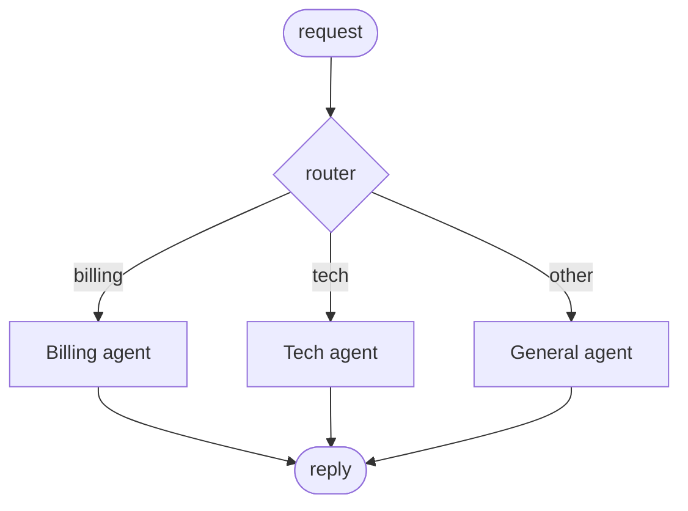
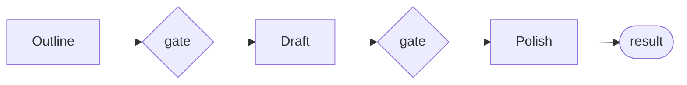
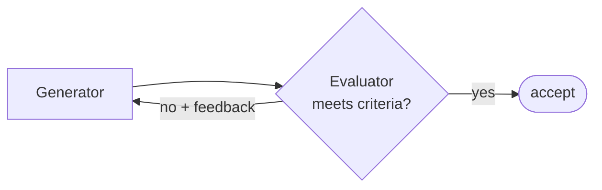
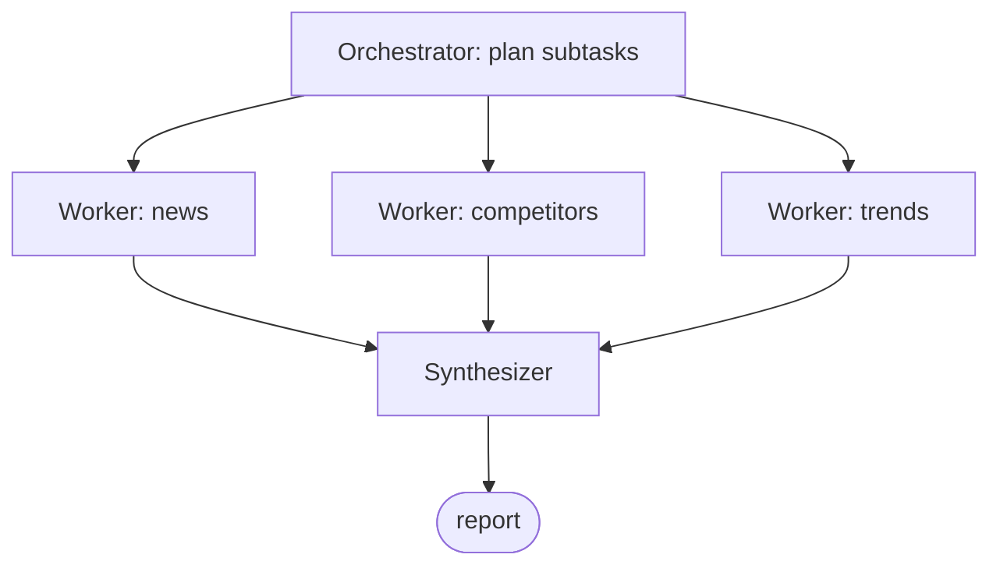

# Course 02 · Agentic Workflows

> **14 hours · 17 lessons · Project: [AI-Powered Agentic Workflow for Project Management](../projects/02_project_management_workflow/)**
>
> Pairs with notebook [`02_agentic_workflows.ipynb`](../notebooks/02_agentic_workflows.ipynb).

A single smart prompt only goes so far. Real systems **compose** model calls into *workflows* —
control flow that you design, with the LLM filling in the hard steps. This course teaches the five
canonical patterns (from Anthropic's *Building Effective Agents*) and how to model, visualize, and
implement them in Python: **Prompt Chaining, Routing, Parallelization, Evaluator-Optimizer, and
Orchestrator-Workers**.

| Lesson | Section |
|--------|---------|
| L1 Introduction | [§1](#1-workflows-vs-agents-l1) |
| L2 Understanding Agentic Workflows | [§2](#2-the-anatomy-of-an-agent-l2) |
| L3–L4 Workflow Modeling | [§3](#3-modeling--visualizing-workflows-l3l4) |
| L5 Workflow Implementation | [§4](#4-a-reusable-agent-base-class-l5) |
| L6–L7 Prompt Chaining | [§5](#5-pattern-prompt-chaining-l6l7) |
| L8–L9 Routing | [§6](#6-pattern-routing-l8l9) |
| L10–L11 Parallelization | [§7](#7-pattern-parallelization-l10l11) |
| L12–L13 Evaluator-Optimizer | [§8](#8-pattern-evaluator-optimizer-l12l13) |
| L14–L15 Orchestrator-Workers | [§9](#9-pattern-orchestrator-workers-l14l15) |
| L16–L17 Review & Project | [§10](#10-review--project-l16l17) |

---

## 1. Workflows vs. Agents (L1)

- **Workflow** — *you* write the control flow; the LLM executes well-defined sub-steps.
  Predictable, debuggable, cheap. Most production "AI features" are workflows.
- **Agent** — the *LLM* decides the control flow at runtime. Flexible, but harder to make reliable.

This course is about **workflows**: deterministic skeletons with LLM-powered joints. The four
projects in this course are mostly workflows — and that's the point. Reach for an agent
(Course 3–4) only when the path genuinely can't be predetermined.

---

## 2. The anatomy of an agent (L2)

Every agent — whether a single node in a workflow or a standalone actor — has four parts:

| Component | What it is | Example |
|-----------|------------|---------|
| **Persona** | role + rules (system prompt) | "You are a meticulous QA reviewer." |
| **Knowledge** | facts it can use | retrieved docs, memory, the task input |
| **Tools** | actions it can take | calculator, web search, SQL |
| **Interaction** | how it's called & returns | text in → JSON out |

By LLM-interaction model, agents come in flavors you'll mix in workflows:
**reflexive** (one shot), **chain** (fixed multi-step), **router** (classify→dispatch),
**parallel** (fan-out→aggregate), and **reflective** (generate→critique→revise).

---

## 3. Modeling & visualizing workflows (L3–L4)

Before coding, **draw the graph**: nodes are agents/steps, edges are data hand-offs. A picture
exposes missing validation, dead ends, and accidental sequential bottlenecks. Mermaid is perfect
for this (and lives in your repo next to the code):



A good workflow model answers: *What are the nodes? What flows along each edge (and in what
shape)? Where do we validate? What runs in parallel? Where can it fail and how do we recover?*

---

## 4. A reusable Agent base class (L5)

Translate the model into code with **one small `Agent` class** you reuse as a workflow building
block. This is the spine of [Project 2](../projects/02_project_management_workflow/), which asks
for a *library* of agent types.

```python
from __future__ import annotations
from dataclasses import dataclass, field
from shared.llm import BaseLLM, get_llm, system, user

@dataclass
class Agent:
    """One node in a workflow: a persona + an LLM, callable as text -> text."""
    name: str
    instructions: str                      # the persona / rules (system prompt)
    llm: BaseLLM = field(default_factory=get_llm)

    def run(self, task: str, context: str = "") -> str:
        messages = [system(self.instructions)]
        content = task if not context else f"{task}\n\nCONTEXT:\n{context}"
        messages.append(user(content))
        return self.llm.chat(messages)

# Specialized agents are just instances with different instructions:
summarizer = Agent("summarizer", "Summarize the input in 2 bullet points.")
translator = Agent("translator", "Translate the input to formal French.")
```

Composition is now ordinary Python: call agents in sequence, in branches, or in parallel. The five
patterns below are all *ways of wiring `Agent` instances together*.

---

## 5. Pattern: Prompt Chaining (L6–L7)

**Decompose a task into a fixed sequence**, each step consuming the previous output. Add a
validation **gate** between steps so errors surface early (see [Course 1 §6](01-prompting.md#6-prompt-chaining-with-validation-l9l10)).



```python
def chain(task: str, steps: list[Agent], gate=None) -> str:
    """Run agents in sequence; optional gate(text)->bool validates each hand-off."""
    data = task
    for agent in steps:
        data = agent.run(data)
        if gate and not gate(data):
            raise ValueError(f"{agent.name} produced output that failed the gate")
    return data

outline = Agent("outliner", "Produce a 3-bullet outline for the topic.")
draft   = Agent("writer",   "Expand the outline into a short paragraph.")
polish  = Agent("editor",   "Tighten the paragraph; fix grammar.")

result = chain("benefits of unit tests", [outline, draft, polish],
               gate=lambda t: len(t) > 0)
```

**Use when** the task has clear, ordered sub-tasks (translate→summarize, extract→validate→route).
**Cost:** latency adds up (steps are serial). **Win:** each step is simple, testable, swappable.

---

## 6. Pattern: Routing (L8–L9)

**Classify the input, then dispatch to a specialist.** A cheap "router" call picks the path; the
chosen specialist does the real work. This keeps each specialist prompt focused (and lets you use
a small model to route, a big one to answer).

```python
import json
from shared.llm import get_llm, system, user, extract_json

def router(query: str, routes: dict[str, Agent], llm) -> str:
    labels = list(routes)
    decision = llm.chat([
        system(f"Classify the query into exactly one of {labels}. "
               'Reply as JSON: {"route": "<label>", "reason": "<why>"}.'),
        user(query),
    ])
    choice = extract_json(decision)["route"]
    choice = choice if choice in routes else labels[-1]   # safe fallback
    return routes[choice].run(query)

routes = {
    "billing": Agent("billing", "You handle billing/refund questions. Be precise about money."),
    "technical": Agent("technical", "You debug technical product issues step by step."),
    "general": Agent("general", "You answer general questions politely."),
}
# Offline-reproducible: script the router's classification.
from shared.llm import MockLLM
llm = MockLLM(scripted=['{"route": "billing", "reason": "mentions refund"}',
                        "Your refund will post in 3–5 days."])
print(router("I want a refund on my last invoice", routes, llm))
```

**Use when** inputs fall into distinct categories needing different handling. **Watch out for:**
mis-routes — always include a default route and consider a confidence threshold.

---

## 7. Pattern: Parallelization (L10–L11)

Run independent sub-tasks **concurrently**, then **aggregate**. Two flavors:
- **Sectioning** — split work into independent pieces (analyze a doc by section).
- **Voting** — run the *same* task N times and combine (majority vote, best-of-N) for reliability.

Because each LLM call is I/O-bound (a network wait), Python **threads** give real speedups.

```python
from concurrent.futures import ThreadPoolExecutor

def parallel(task: str, workers: list[Agent], synthesizer: Agent) -> str:
    with ThreadPoolExecutor(max_workers=len(workers)) as pool:
        findings = list(pool.map(lambda a: f"[{a.name}] {a.run(task)}", workers))
    return synthesizer.run(task, context="\n".join(findings))

workers = [
    Agent("risk", "Analyze ONLY the financial risks in the document."),
    Agent("legal", "Analyze ONLY the legal/compliance issues."),
    Agent("ops", "Analyze ONLY the operational concerns."),
]
synth = Agent("synth", "Merge the analyses into one prioritized brief. Remove duplicates.")
report = parallel("Q3 vendor contract …", workers, synth)
```

**Use when** sub-tasks don't depend on each other (latency win) or when you want to reduce
variance (voting). **Aggregation is a real design choice** — concatenate, vote, or have a
synthesizer agent reconcile conflicts.

---

## 8. Pattern: Evaluator-Optimizer (L12–L13)

A **generator** proposes; an **evaluator** critiques against explicit criteria; the generator
revises. Loop until the evaluator passes it or you hit a cap. This is [Course 1's feedback
loop](01-prompting.md#7-llm-feedback-loops-l11l12) with a *second agent* as the judge.



```python
import json
from shared.llm import get_llm, system, user, extract_json

def evaluator_optimizer(task, generator: Agent, evaluator: Agent, max_rounds=3):
    draft = generator.run(task)
    for _ in range(max_rounds):
        verdict = extract_json(evaluator.run(
            task, context=f"CANDIDATE:\n{draft}\n\n"
            'Reply JSON: {"pass": bool, "feedback": "specific, actionable"}'))
        if verdict["pass"]:
            return draft, "accepted"
        draft = generator.run(f"{task}\n\nRevise using this feedback:\n{verdict['feedback']}")
    return draft, "max_rounds"

gen = Agent("writer", "Write a product tagline.")
crit = Agent("critic", "You are a brand editor. Judge clarity and punch. Be strict.")
```

**Use when** quality is judgeable against clear criteria and iteration helps (writing, code, plans).
**Key:** the evaluator must give *specific, actionable* feedback — "be punchier" is useless;
"cut to ≤6 words, lead with the benefit" works.

---

## 9. Pattern: Orchestrator-Workers (L14–L15)

The most powerful pattern: a central **orchestrator** *dynamically* decomposes a task into subtasks
at runtime, **delegates** each to a worker, then **synthesizes** the results. Unlike fixed chaining,
the subtasks aren't known in advance — the orchestrator plans them.



```python
import json
from shared.llm import get_llm, system, user, extract_json

def orchestrate(goal, orchestrator: Agent, worker_factory, synthesizer: Agent):
    plan = extract_json(orchestrator.run(
        goal, context='Return JSON: {"subtasks": [{"id": int, "instruction": str}]}'))
    results = []
    for st in plan["subtasks"]:
        worker = worker_factory(st)              # spin up a worker per planned subtask
        results.append(f"[{st['id']}] {worker.run(st['instruction'])}")
    return synthesizer.run(goal, context="\n".join(results))

orchestrator = Agent("planner",
    "Break the goal into 2–4 independent research subtasks.")
make_worker = lambda st: Agent(f"worker-{st['id']}", "You are a focused analyst. Be concise.")
synth = Agent("synth", "Combine the worker findings into a structured report.")
```

**Use when** the decomposition depends on the input (research reports, multi-file code changes).
This is exactly [Project 2](../projects/02_project_management_workflow/): an orchestrator plans a
technical project, delegates to typed worker agents, and assembles a project plan.

---

## 10. Review & Project (L16–L17)

### Picking a pattern

| If the task… | Use |
|---|---|
| has fixed ordered steps | **Prompt Chaining** |
| splits into known categories | **Routing** |
| has independent sub-parts / needs voting | **Parallelization** |
| needs iterative quality improvement | **Evaluator-Optimizer** |
| needs runtime-planned decomposition | **Orchestrator-Workers** |
| genuinely can't be predetermined | a real **Agent** (Course 3) |

Patterns **compose**: a router can dispatch to a chain; an orchestrator's workers can each be
evaluator-optimizer loops.

### Project — AI-Powered Agentic Workflow for Project Management
Build a **reusable library of agent types** (action, knowledge-augmented, evaluation, routing,
orchestrator) and use them to run a multi-step workflow that turns a high-level project goal into
an executable plan with tasks, risks, and a schedule.

→ [projects/02_project_management_workflow/](../projects/02_project_management_workflow/)

### Checklist
- [ ] I can implement all five patterns from scratch.
- [ ] I can choose the right pattern for a task and justify it.
- [ ] I can draw a workflow as a graph before coding it.
- [ ] I can compose patterns (router → chain, orchestrator → workers).

**Next:** [Course 03 · Building Agents](03-building-agents.md) — give these nodes real tools,
structured outputs, state, memory, and retrieval.
