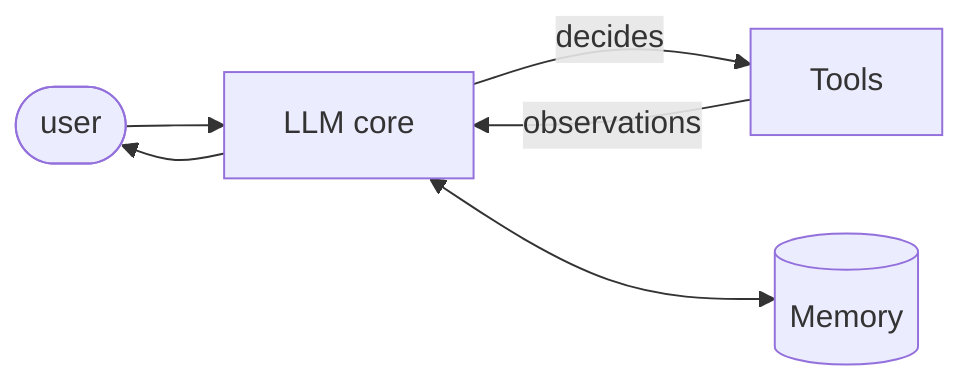
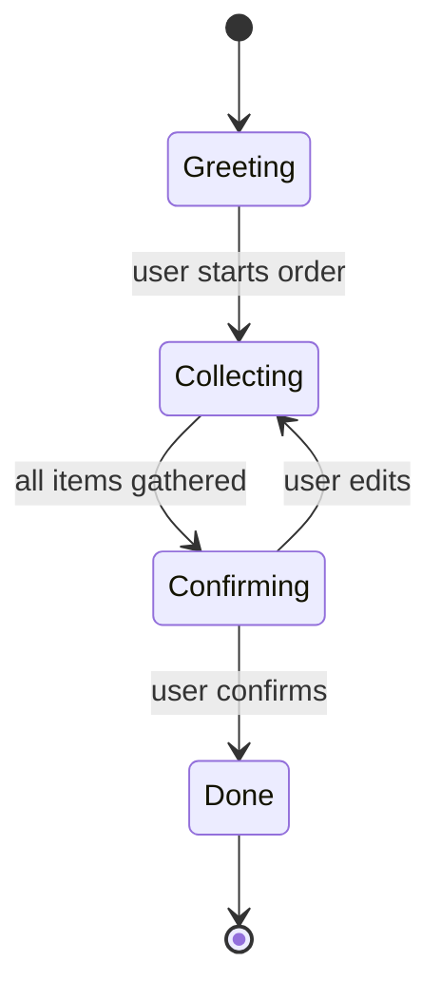
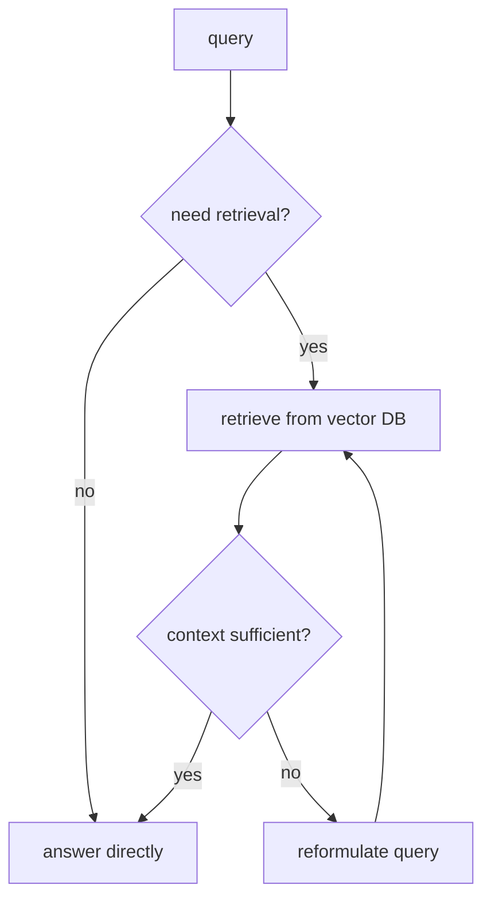

# Course 03 · Building Agents

> **11 hours · 23 lessons · Project: [Research Agent](../projects/03_research_agent/)**
>
> Pairs with notebook [`03_building_agents.ipynb`](../notebooks/03_building_agents.ipynb).

Now we build **real agents**: LLMs that take actions through **tools**, return **structured
outputs**, track **state**, remember across turns (**short- and long-term memory**), reach the
outside world (**APIs, web search, SQL, vector DBs**), do **agentic RAG**, and are **evaluated**
for reliability.

| Lessons | Topic | Section |
|---------|-------|---------|
| L1 | Introduction | [§1](#1-what-makes-an-agent-l1) |
| L2–L3 | Tools / function calling | [§2](#2-tools--function-calling-l2l3) |
| L4–L5 | Structured outputs (Pydantic) | [§3](#3-structured-outputs-with-pydantic-l4l5) |
| L6–L7 | State management | [§4](#4-state-management-l6l7) |
| L8–L9 | Short-term memory | [§5](#5-short-term-memory-l8l9) |
| L10–L11 | External tools & APIs (MCP) | [§6](#6-external-tools-apis--mcp-l10l11) |
| L12–L13 | Web-search agents | [§7](#7-web-search-agents-l12l13) |
| L14–L15 | Database agents (text2SQL) | [§8](#8-database-agents-text2sql-l14l15) |
| L16–L17 | Agentic RAG | [§9](#9-agentic-rag-l16l17) |
| L18–L19 | Long-term memory | [§10](#10-long-term-memory-l18l19) |
| L20–L21 | Agent evaluation | [§11](#11-agent-evaluation-l20l21) |
| L22–L23 | Conclusion & Project | [§12](#12-conclusion--project-l22l23) |

---

## 1. What makes an agent (L1)

An agent = **LLM (reasoning) + Tools (acting) + Memory (state) + a loop (autonomy)**. Course 1 gave
us the loop (ReAct); Course 2 gave us composition. Here we make each capability production-grade.



---

## 2. Tools / function calling (L2–L3)

A **tool** is a function the model can invoke. Modern LLMs support **function calling**: you
describe each tool with a JSON schema; the model replies with the function name + arguments to
call; you execute it and feed the result back.

The four parts of a good tool: **name**, **description** (the model reads this to decide *when* to
use it), **parameter schema**, and **forgiving error messages** (the model reads errors and retries).

```python
from __future__ import annotations
import json, re
from dataclasses import dataclass
from typing import Callable

@dataclass
class Tool:
    name: str
    description: str
    func: Callable[..., object]
    schema: dict        # JSON schema for the arguments (the "agent-computer interface")

    def __call__(self, **kwargs) -> str:
        try:
            return str(self.func(**kwargs))
        except Exception as e:                       # errors become text the agent can act on
            return f"ERROR: {e}. Check arguments against the schema and retry."

def _calculator(expression: str) -> float:
    if not re.fullmatch(r"[0-9+\-*/(). ]+", expression):
        raise ValueError("only arithmetic characters allowed")
    return eval(expression, {"__builtins__": {}}, {})

calculator = Tool(
    name="calculator",
    description="Evaluate an arithmetic expression, e.g. '2*(3+4)'. Use for any math.",
    func=_calculator,
    schema={"type": "object",
            "properties": {"expression": {"type": "string"}},
            "required": ["expression"]},
)
print(calculator(expression="2*(3+4)"))   # 14
print(calculator(expression="os.system('x')"))  # ERROR: ... (safely rejected)
```

With the real OpenAI SDK you pass `tools=[{"type":"function","function":{...schema...}}]` and read
`response.choices[0].message.tool_calls`. The *design* — schema + description + error handling —
is identical regardless of provider. **Security note:** never `eval`/`exec` untrusted strings or
run shell commands from tool inputs; whitelist and sandbox (see the regex guard above).

---

## 3. Structured outputs with Pydantic (L4–L5)

Free text is unparseable. **Structured outputs** make the model return JSON that conforms to a
**schema**, which you validate with **Pydantic** — turning "hope it's valid" into a typed object or
a clear error.

```python
from pydantic import BaseModel, Field, ValidationError
from shared.llm import get_llm, system, user, extract_json

class Ticket(BaseModel):
    title: str
    priority: str = Field(description="one of: low, medium, high")
    tags: list[str] = []
    estimate_hours: float

def extract_ticket(text: str, llm) -> Ticket | str:
    schema = json.dumps(Ticket.model_json_schema())
    raw = llm.chat([
        system(f"Extract a support ticket as JSON matching this schema:\n{schema}\n"
               "Return ONLY JSON."),
        user(text),
    ])
    try:
        return Ticket(**extract_json(raw))         # validated, typed object
    except (ValidationError, ValueError) as e:
        return f"validation failed: {e}"           # caller can retry / repair

import json
from shared.llm import MockLLM
llm = MockLLM(scripted=['{"title":"Login broken","priority":"high",'
                        '"tags":["auth"],"estimate_hours":3}'])
print(extract_ticket("Users can't log in since the deploy.", llm))
```

Why Pydantic: **validation, type coercion, defaults, and self-documenting schemas** in one place.
The `model_json_schema()` you send to the model is the *same* contract you validate against — no
drift. This is the reliability backbone for every downstream step.

---

## 4. State management (L6–L7)

Agents that do more than one thing need **state**: where am I in the workflow, what have I
collected, what's allowed next. Model it as an explicit **state machine** — far more debuggable
than implicit state buried in prompt history.



```python
from __future__ import annotations
from dataclasses import dataclass, field
from enum import Enum

class State(str, Enum):
    GREETING = "greeting"
    COLLECTING = "collecting"
    CONFIRMING = "confirming"
    DONE = "done"

# Allowed transitions — the machine *rejects* illegal jumps.
TRANSITIONS = {
    State.GREETING: {State.COLLECTING},
    State.COLLECTING: {State.CONFIRMING},
    State.CONFIRMING: {State.COLLECTING, State.DONE},
    State.DONE: set(),
}

@dataclass
class OrderSession:
    state: State = State.GREETING
    cart: list[str] = field(default_factory=list)

    def transition(self, to: State) -> None:
        if to not in TRANSITIONS[self.state]:
            raise ValueError(f"illegal transition {self.state} -> {to}")
        self.state = to

s = OrderSession()
s.transition(State.COLLECTING); s.cart.append("A4 paper")
s.transition(State.CONFIRMING); s.transition(State.DONE)
print(s.state, s.cart)
```

The state object becomes part of the agent's context each turn ("current step: confirming; cart:
[...]"), and the allowed transitions constrain what the agent may do next — preventing the classic
"LLM wanders off the workflow" failure.

---

## 5. Short-term memory (L8–L9)

**Short-term memory** = the working context of the *current* session: recent turns the model needs
for coherence. The challenge is the finite context window — you can't keep everything.

Three strategies:
- **Full history** — keep every turn (simple; blows the window on long chats).
- **Sliding window** — keep the last *k* turns (bounded; forgets early context).
- **Summary/compaction** — periodically summarize old turns into a compact note (best of both).

```python
from collections import deque
from shared.llm import system, user, assistant

class ChatMemory:
    """Sliding-window short-term memory with a persistent system prompt."""
    def __init__(self, persona: str, k_turns: int = 6):
        self.persona = persona
        self.turns: deque[dict] = deque(maxlen=k_turns)   # auto-drops oldest

    def add(self, role: str, content: str) -> None:
        self.turns.append({"role": role, "content": content})

    def messages(self) -> list[dict]:
        return [system(self.persona), *self.turns]

mem = ChatMemory("You are a friendly barista bot.", k_turns=4)
mem.add("user", "I'd like a latte."); mem.add("assistant", "Hot or iced?")
mem.add("user", "Iced, oat milk.")
# llm.chat(mem.messages())  -> coherent reply that remembers "iced oat latte"
```

For production, combine window + summary: when the window fills, summarize the dropped turns into a
single "memory" system note. (Long-term memory in §10 persists *across* sessions.)

---

## 6. External tools, APIs & MCP (L10–L11)

Agents become useful when they touch real systems via **HTTP APIs**: `GET` to read live data,
`POST`/`PUT` to take actions. Wrap each call as a tool with auth handled safely.

```python
import httpx   # uv sync --extra web

def weather_tool(city: str) -> str:
    """Real-time weather as an agent tool (uses a public API)."""
    geo = httpx.get("https://geocoding-api.open-meteo.com/v1/search",
                    params={"name": city, "count": 1}, timeout=10).json()
    if not geo.get("results"):
        return f"ERROR: unknown city {city!r}"
    loc = geo["results"][0]
    wx = httpx.get("https://api.open-meteo.com/v1/forecast",
                   params={"latitude": loc["latitude"], "longitude": loc["longitude"],
                           "current": "temperature_2m"}, timeout=10).json()
    return f"{city}: {wx['current']['temperature_2m']}°C"
```

**MCP (Model Context Protocol)** is an emerging open standard that lets agents discover and call
tools/data sources through a *uniform* interface — instead of bespoke glue per integration, a model
speaks one protocol to many "MCP servers" (files, databases, SaaS). Think of it as **USB-C for
agent tools**: write a tool server once, any MCP-aware agent can use it. Security essentials for any
external tool: **store keys in env vars (never in code), validate inputs, set timeouts, handle
rate limits, and least-privilege scopes.**

---

## 7. Web-search agents (L12–L13)

To answer questions about *current* events, agents **search the web**, then **ground** their answer
in the retrieved snippets (citing sources, ignoring noise) to avoid hallucination. A search API
like **Tavily** returns clean, LLM-ready results.

```python
from shared.llm import get_llm, system, user

def web_search(query: str) -> list[dict]:
    """Return [{title, url, content}, ...]. Swap in Tavily/SerpAPI in production."""
    try:
        from tavily import TavilyClient   # uv sync --extra web ; needs TAVILY_API_KEY
        import os
        return TavilyClient(os.environ["TAVILY_API_KEY"]).search(query)["results"]
    except Exception:
        # offline stub so the pattern runs without a key
        return [{"title": "stub", "url": "http://example.com",
                 "content": f"(offline) no live results for {query!r}"}]

def answer_with_search(question: str, llm) -> str:
    hits = web_search(question)
    sources = "\n".join(f"[{i+1}] {h['title']}: {h['content']}" for i, h in enumerate(hits))
    return llm.chat([
        system("Answer ONLY from the sources. Cite as [n]. If unsupported, say you don't know."),
        user(f"Question: {question}\n\nSOURCES:\n{sources}"),
    ])
```

The pattern — *retrieve → ground → cite* — is the same one RAG uses (§9); the only difference is the
retrieval source (web vs. your vector DB).

---

## 8. Database agents (text2SQL) (L14–L15)

Let agents query private structured data by translating **natural language → SQL**. Give the model
the **schema**, ask for a query, then execute it (read-only!) and summarize the rows.

```python
import sqlite3
from shared.llm import get_llm, system, user

SCHEMA = """TABLE games(id INTEGER, title TEXT, platform TEXT, year INTEGER, genre TEXT)"""

def text2sql(question: str, llm, conn: sqlite3.Connection) -> str:
    sql = llm.chat([
        system(f"Given this schema:\n{SCHEMA}\nWrite ONE read-only SQLite SELECT that answers "
               "the question. Return ONLY SQL, no prose."),
        user(question),
    ]).strip().strip("`").removeprefix("sql").strip()
    if not sql.lower().lstrip().startswith("select"):    # guardrail: reads only
        return "ERROR: only SELECT queries are permitted"
    rows = conn.execute(sql).fetchall()                  # parameterize / sandbox in prod
    return llm.chat([system("Answer the question from these rows."),
                     user(f"Q: {question}\nROWS: {rows}")])
```

**Critical safety:** never let an agent run arbitrary SQL on a writable connection. Use a
**read-only** user, allow-list `SELECT`, set row/time limits, and prefer parameterized queries. An
agent that can `DROP TABLE` is a liability, not a feature.

---

## 9. Agentic RAG (L16–L17)

Plain **RAG** = embed query → retrieve nearest chunks → stuff into the prompt → answer. **Agentic
RAG** adds a reasoning loop: the agent decides *whether* to retrieve, **reformulates** weak queries,
**judges** if the retrieved context is sufficient, and **retries** — instead of blindly using the
first hit.



```python
# Vector store with ChromaDB (uv sync --extra rag). Offline fallback shown below.
from shared.llm import get_llm, system, user

def build_index(docs: list[str]):
    try:
        import chromadb
        client = chromadb.Client()
        col = client.create_collection("kb")
        col.add(documents=docs, ids=[str(i) for i in range(len(docs))])
        return col
    except Exception:
        return docs   # offline: fall back to keyword search over the list

def retrieve(index, query: str, k: int = 2) -> list[str]:
    if hasattr(index, "query"):
        return index.query(query_texts=[query], n_results=k)["documents"][0]
    # offline keyword scorer
    scored = sorted(index, key=lambda d: -sum(w in d.lower() for w in query.lower().split()))
    return scored[:k]

def agentic_rag(question, index, llm, max_retries=2):
    query = question
    for _ in range(max_retries + 1):
        ctx = retrieve(index, query)
        verdict = llm.chat([
            system('Reply JSON {"sufficient": bool, "better_query": str}.'),
            user(f"Q: {question}\nCONTEXT:\n{ctx}")])
        from shared.llm import extract_json
        v = extract_json(verdict)
        if v["sufficient"]:
            return llm.chat([system("Answer from context only, cite."),
                             user(f"Q: {question}\nCONTEXT:\n{ctx}")])
        query = v["better_query"]            # reformulate and retry
    return "I couldn't find enough information."
```

Embeddings + a vector DB do **semantic** retrieval (meaning, not keywords). The "agentic" part is
the **reflection** — and it's what makes [Project 3](../projects/03_research_agent/) a
*research* agent rather than a lookup.

---

## 10. Long-term memory (L18–L19)

**Long-term memory** persists *across sessions*. Three kinds (mirroring human memory):

| Type | Stores | Example |
|------|--------|---------|
| **Semantic** | facts about the user/world | "user is vegetarian" |
| **Episodic** | past events/interactions | "last week they booked Tokyo" |
| **Procedural** | how-to / learned skills | "this user prefers terse replies" |

Implementation: write memories to a **vector store**; at the start of a session, **retrieve the
relevant ones** by semantic similarity and inject them into context.

```python
class LongTermMemory:
    """Persist + semantically recall memories across sessions (vector DB in prod)."""
    def __init__(self, index):
        self.index = index            # a vector store (ChromaDB) keyed by user
    def remember(self, text: str) -> None:
        self.index.add(text)          # store a memory
    def recall(self, context: str, k: int = 3) -> list[str]:
        return retrieve(self.index, context, k=k)   # most relevant memories

# At session start: mem = ltm.recall(current_topic); inject into the system prompt.
```

Best practices: write memories **selectively** (not every turn), **deduplicate**, **decay/expire**
stale facts, and **scope by user**. Long-term memory is what turns a chatbot into a *personalized
assistant*.

---

## 11. Agent evaluation (L20–L21)

Agents are stochastic and multi-step, so you must **evaluate** them deliberately. Three strategies:

| Strategy | Measures | Use when |
|----------|----------|----------|
| **Response** | final answer quality | output is the only thing that matters |
| **Step** | each tool call / decision | you need to localize *where* it fails |
| **Trajectory** | the whole path vs. an ideal | reasoning/efficiency matters |

What to measure: **task completion**, **output quality**, **correct tool use**, and **system
metrics** (latency, cost, #steps). Use **LLM-as-judge** for fuzzy quality, plus deterministic
checks where possible.

```python
from shared.llm import get_llm, system, user, extract_json

def judge(question, answer, reference, llm) -> dict:
    return extract_json(llm.chat([
        system('Score the answer 1-5 for correctness vs the reference. '
               'Reply JSON {"score": int, "reason": str}.'),
        user(f"Q: {question}\nANSWER: {answer}\nREFERENCE: {reference}")]))

def eval_suite(agent_fn, cases, llm) -> float:
    scores = []
    for c in cases:
        ans = agent_fn(c["question"])
        scores.append(judge(c["question"], ans, c["reference"], llm)["score"])
    return sum(scores) / len(scores)     # mean score; track over time as a CI gate
```

Build a **fixed test set** of (input, expected) cases and run it on every change — this is your
regression gate. Pair LLM-as-judge with exact checks (did it call the right tool? valid JSON?
under budget?). [Project 3](../projects/03_research_agent/) ships such an eval harness.

---

## 12. Conclusion & Project (L22–L23)

**You can now** give an agent tools, force structured outputs, manage state, add short- and
long-term memory, reach APIs/web/SQL/vector DBs, do agentic RAG, and evaluate the result.

### Project — Research Agent for the video-game industry
Build a **stateful research agent** that:
1. Answers from a **local vector DB** (game facts) via RAG.
2. Falls back to **web search** when the DB is insufficient (agentic retrieval decision).
3. Returns **structured, cited** answers (Pydantic) and remembers the session.
4. Ships an **evaluation** harness over a fixed question set.

→ [projects/03_research_agent/](../projects/03_research_agent/)

### Checklist
- [ ] I can define a tool (schema + description + safe errors) and wire function calling.
- [ ] I can force and validate structured output with Pydantic.
- [ ] I can manage agent state with an explicit machine.
- [ ] I can implement short- and long-term memory.
- [ ] I can build agentic RAG with a retrieval-sufficiency loop.
- [ ] I can evaluate an agent with response/step/trajectory strategies.

**Next:** [Course 04 · Multi-Agent Systems](04-multi-agent-systems.md) — coordinate *teams* of
these agents.
