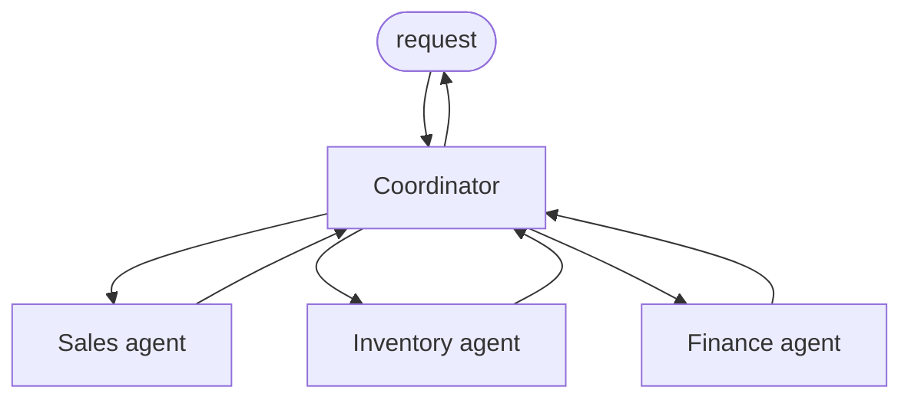
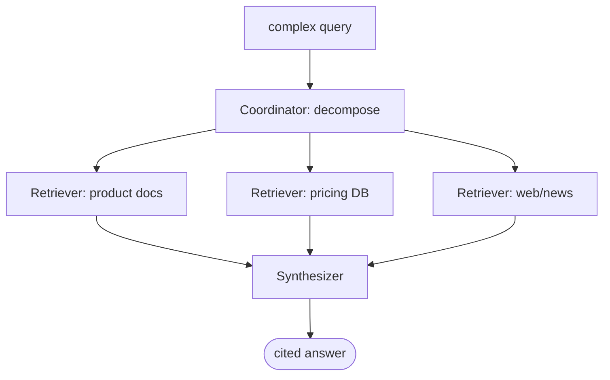

# Course 04 · Multi-Agent Systems

> **14 hours · 17 lessons · Project: [Paper Company Sales Team](../projects/04_sales_team/)**
>
> Pairs with notebook [`04_multi_agent_systems.ipynb`](../notebooks/04_multi_agent_systems.ipynb).

One agent can only do so much. **Multi-agent systems** coordinate *teams* of specialized agents —
each with its own role, tools, and memory — to solve problems too big for one. This course covers
architecture, orchestration, inter-agent routing/data-flow, shared-state coordination (including
**conflict resolution**), and **multi-agent RAG**.

| Lessons | Topic | Section |
|---------|-------|---------|
| L1 | Introduction | [§1](#1-why-multiple-agents-l1) |
| L2–L3 | Designing architecture | [§2](#2-designing-multi-agent-architecture-l2l3) |
| L4–L5 | Architecture in Python | [§3](#3-architecture-in-python-l4l5) |
| L6–L7 | Orchestration | [§4](#4-orchestration-sequential-parallel-conditional-l6l7) |
| L8–L9 | Routing & data flow | [§5](#5-routing--data-flow-l8l9) |
| L10–L11 | State management | [§6](#6-state-management-across-agents-l10l11) |
| L12–L13 | Orchestration + state coordination | [§7](#7-state-coordination--conflict-resolution-l12l13) |
| L14–L15 | Multi-agent RAG | [§8](#8-multi-agent-rag-l14l15) |
| L16–L17 | Review & Project | [§9](#9-review--project-l16l17) |

---

## 1. Why multiple agents (L1)

Specialization beats generalization once a task spans distinct skills. A company doesn't have one
employee who does everything — it has **roles** (sales, inventory, finance) that **coordinate**.
Multi-agent systems mirror this: each agent has a narrow, well-tested job; a coordination layer
routes work and reconciles results.

**Use multiple agents when:** the task decomposes into distinct specialties, sub-tasks can run
concurrently, or different steps need different tools/permissions. **Don't** when a single agent or
a [Course 2 workflow](02-agentic-workflows.md) suffices — every extra agent adds latency, cost, and
coordination bugs.



---

## 2. Designing multi-agent architecture (L2–L3)

Core design decisions:

1. **Agents & responsibilities** — one clear job each (single-responsibility principle).
2. **Topology** — how they connect:
   - **Centralized (hub-and-spoke):** a coordinator owns control flow (easiest to reason about).
   - **Decentralized (peer-to-peer):** agents hand off directly (flexible, harder to debug).
   - **Hierarchical:** managers of managers (scales to complex orgs).
3. **Interfaces** — the message/data contract between agents (use Pydantic, like Course 3 §3).
4. **Shared vs. private state** — what's global (the "blackboard") vs. local to an agent.

> **Start centralized.** A coordinator + specialists is the most reliable architecture and the one
> the Paper Company project uses. Add peer hand-offs only where they clearly help.

---

## 3. Architecture in Python (L4–L5)

Build on the `Agent` class from [Course 2 §4](02-agentic-workflows.md#4-a-reusable-agent-base-class-l5).
Give agents **typed messages** and a **registry** so the coordinator can address them by name.

```python
from __future__ import annotations
from dataclasses import dataclass, field
from shared.llm import BaseLLM, get_llm, system, user

@dataclass
class Message:
    """Typed envelope passed between agents (the inter-agent contract)."""
    sender: str
    recipient: str
    content: str

@dataclass
class Agent:
    name: str
    instructions: str
    llm: BaseLLM = field(default_factory=get_llm)
    def handle(self, msg: Message) -> Message:
        reply = self.llm.chat([system(self.instructions), user(msg.content)])
        return Message(sender=self.name, recipient=msg.sender, content=reply)

class Registry:
    """Name -> Agent lookup so the coordinator can dispatch by role."""
    def __init__(self) -> None:
        self.agents: dict[str, Agent] = {}
    def register(self, agent: Agent) -> None:
        self.agents[agent.name] = agent
    def send(self, msg: Message) -> Message:
        return self.agents[msg.recipient].handle(msg)

reg = Registry()
reg.register(Agent("inventory", "You report stock levels. Be precise and numeric."))
reply = reg.send(Message("coordinator", "inventory", "How many reams of A4 are in stock?"))
print(reply.content)
```

This tiny substrate — typed messages + a registry — is enough to build every topology in §2.

---

## 4. Orchestration: sequential, parallel, conditional (L6–L7)

The **coordinator** decides *how* specialist agents run. Three primitives (which compose):

```python
from concurrent.futures import ThreadPoolExecutor

class Coordinator:
    def __init__(self, registry: Registry):
        self.reg = registry

    def sequential(self, steps: list[str], task: str) -> str:
        """Pipe output of each agent into the next (data dependency)."""
        data = task
        for name in steps:
            data = self.reg.send(Message("coord", name, data)).content
        return data

    def parallel(self, names: list[str], task: str) -> list[str]:
        """Fan out the same task to many agents at once (no dependency)."""
        with ThreadPoolExecutor(max_workers=len(names)) as pool:
            msgs = pool.map(lambda n: self.reg.send(Message("coord", n, task)), names)
        return [m.content for m in msgs]

    def conditional(self, task: str, predicate, if_true: str, if_false: str) -> str:
        """Branch to a different agent based on a runtime condition."""
        target = if_true if predicate(task) else if_false
        return self.reg.send(Message("coord", target, task)).content
```

- **Sequential** when step N needs step N-1's output.
- **Parallel** when steps are independent (latency win — see [Course 2 §7](02-agentic-workflows.md#7-pattern-parallelization-l10l11)).
- **Conditional** when the path depends on data (a quote request vs. a stock query).

A real system **mixes** all three: parallel-gather facts → conditional-decide → sequential-finalize.

---

## 5. Routing & data flow (L8–L9)

A **routing agent** inspects each request and forwards it to the right specialist — the multi-agent
version of [Course 2's routing pattern](02-agentic-workflows.md#6-pattern-routing-l8l9). It also
manages **data flow**: what information each agent needs and produces.

```python
from shared.llm import system, user, extract_json

class Router:
    def __init__(self, llm, specialists: dict[str, str]):
        self.llm = llm
        self.specialists = specialists      # name -> description

    def route(self, request: str) -> str:
        catalog = "\n".join(f"- {n}: {d}" for n, d in self.specialists.items())
        decision = self.llm.chat([
            system(f"Route the request to ONE specialist:\n{catalog}\n"
                   'Reply JSON: {"agent": "<name>", "urgency": "low|high"}.'),
            user(request)])
        return extract_json(decision)["agent"]
```

**Data-flow rule:** pass agents *only what they need* (least context). Over-sharing bloats prompts,
leaks information across roles, and makes failures hard to localize. Define each agent's input/output
shape explicitly (Pydantic) and let the coordinator translate between them.

---

## 6. State management across agents (L10–L11)

Multi-turn, multi-agent tasks need **shared state** — a single source of truth all agents read and
update (a "blackboard"). Without it, agents make contradictory assumptions.

```python
from dataclasses import dataclass, field

@dataclass
class SharedState:
    """The blackboard: one source of truth for the whole system."""
    facts: dict[str, object] = field(default_factory=dict)
    history: list[str] = field(default_factory=list)

    def update(self, key: str, value: object, by: str) -> None:
        self.facts[key] = value
        self.history.append(f"{by} set {key}={value!r}")

    def snapshot(self) -> str:
        """Compact view injected into each agent's context."""
        return "; ".join(f"{k}={v}" for k, v in self.facts.items())

state = SharedState()
state.update("customer_budget", 500, by="sales")
state.update("in_stock", True, by="inventory")
print(state.snapshot())   # customer_budget=500; in_stock=True
```

Each agent receives the **snapshot** in its context and writes results back, so the team stays
consistent across turns.

---

## 7. State coordination & conflict resolution (L12–L13)

When agents run **concurrently** they can touch shared state at the same time — causing **race
conditions** and **conflicts** (two agents reserve the last item). Coordination techniques:

- **Locks** — serialize access to a contended resource (correct, but reduces parallelism).
- **Versioning / optimistic concurrency** — detect a conflicting update and retry.
- **Coordinator arbitration** — a single writer reconciles proposals from workers.

```python
import threading

class CoordinatedInventory:
    """Thread-safe shared resource: a lock prevents overselling under concurrency."""
    def __init__(self, stock: dict[str, int]):
        self.stock = stock
        self._lock = threading.Lock()

    def reserve(self, item: str, qty: int, agent: str) -> str:
        with self._lock:                       # only one agent in the critical section
            have = self.stock.get(item, 0)
            if have < qty:
                return f"CONFLICT: {agent} wanted {qty} {item}, only {have} left"
            self.stock[item] = have - qty
            return f"OK: {agent} reserved {qty} {item} ({self.stock[item]} left)"
```

**Detect → resolve → record.** Whether by lock, version, or arbiter, the goal is a system that stays
**consistent** even when agents act simultaneously. This is the trickiest part of multi-agent
engineering — and exactly what the Paper Company project stresses (concurrent sales vs. stock).

---

## 8. Multi-agent RAG (L14–L15)

Extend [agentic RAG](03-building-agents.md#9-agentic-rag-l16l17) across **multiple specialized
retrieval agents**, each owning a different source, plus a **synthesis agent** that combines their
findings into one judged answer.



```python
def multi_agent_rag(query, retrievers: dict[str, callable], synthesizer: Agent) -> str:
    # each retriever agent owns one source and returns evidence for its domain
    evidence = []
    for name, retrieve in retrievers.items():
        evidence.append(f"[{name}]\n{retrieve(query)}")
    return synthesizer.handle(
        Message("coord", synthesizer.name,
                f"Question: {query}\n\nEVIDENCE FROM SOURCES:\n" + "\n\n".join(evidence))
    ).content
```

**Why multi-agent RAG:** different sources need different retrieval logic (a SQL pricing DB vs. a
vector doc store vs. live web). Specialized retrievers each do their job well; the synthesizer
resolves conflicts and cites sources — answering questions no single retriever could.

---

## 9. Review & Project (L16–L17)

**You can now** design a multi-agent architecture, implement agents with typed messaging,
orchestrate them (sequential/parallel/conditional), route requests, share and **coordinate state
under concurrency**, and run multi-agent RAG.

### Project — Paper Company Sales Team
Design and build a **complete multi-agent system** for a real business: a paper company's sales
operation. It must combine **architecture** (specialist agents: inventory, quoting, sales,
finance), **orchestration** (handle a customer request end-to-end), **state management** (shared
inventory/cart), and **routing** (direct each request to the right agent) — coordinating concurrent
actions without overselling stock.

→ [projects/04_sales_team/](../projects/04_sales_team/)

### Checklist
- [ ] I can choose a topology (centralized/decentralized/hierarchical) and justify it.
- [ ] I can implement typed inter-agent messaging + a registry.
- [ ] I can orchestrate agents sequentially, in parallel, and conditionally.
- [ ] I can route requests to specialists with a routing agent.
- [ ] I can manage shared state and resolve conflicts under concurrency.
- [ ] I can build a multi-agent RAG system with specialized retrievers + a synthesizer.

### You've finished the program
Across four courses you built: reliable prompts → composable workflows → real tool-using agents →
coordinated multi-agent systems. The [four projects](../projects/) are your portfolio. Ship them,
write them up, and you can defend agentic AI engineering end to end.

**Back to:** [course index](../README.md) · [projects](../projects/) · [notebooks](../notebooks/)
