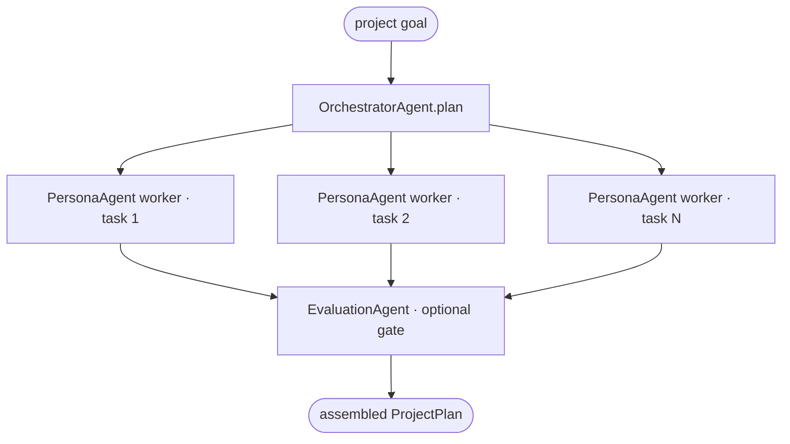

# Project 02 · AI-Powered Agentic Workflow for Project Management

> **Course:** [02 · Agentic Workflows](../../courses/02-agentic-workflows.md)
> · **Notebook:** [02_agentic_workflows.ipynb](../../notebooks/02_agentic_workflows.ipynb)

Build a **reusable library of agent types**, then use it to run a multi-step workflow that turns a
high-level project goal into an executable plan (tasks, roles, risks). This is the
**orchestrator-workers** pattern with an **evaluator-optimizer** quality gate.

---

## Deliverable 1 — the agent library

| Agent | Responsibility |
|-------|----------------|
| `DirectPromptAgent` | bare prompt → reply (baseline) |
| `PersonaAgent` | persona/system prompt shapes the output |
| `KnowledgeAgent` | answers using **only** supplied knowledge (grounding) |
| `EvaluationAgent` | generate → critique → revise loop against criteria |
| `RoutingAgent` | classify a request and dispatch to a specialist |
| `OrchestratorAgent` | decompose a goal into ordered, delegable subtasks |

These are intentionally small and composable — the same building blocks power every workflow in
the course.

## Deliverable 2 — the workflow

`run_project_workflow(goal, llm, ...)`:



---

## Run

```bash
cd agentic-ai
uv run python projects/02_project_management_workflow/solution.py
uv run --extra dev pytest projects/02_project_management_workflow -q
```

Edit the first import in [`test_workflow.py`](test_workflow.py) to point at `starter` while you work.

---

## Grading rubric

| Criterion | Pass | Strong |
|-----------|------|--------|
| Agent library | each agent works in isolation | clean interfaces, reusable, documented |
| Orchestration | plans + delegates | sensible decomposition, role assignment |
| Evaluation gate | loops once | converges with specific feedback, bounded rounds |
| Assembly | returns a plan | readable plan with status per task |
| Code quality | runs | typed, `ruff` clean, no duplication |

## Stretch goals

- Add a `RoutingAgent` front door that sends "bug", "feature", "research" requests to different
  worker personas.
- Persist the plan to JSON and reload it to resume a project.
- Add parallel execution of independent subtasks (see Course 2 §7).
