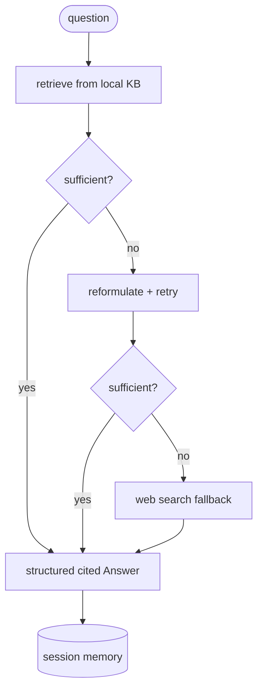

# Project 03 · Research Agent

> **Course:** [03 · Building Agents](../../courses/03-building-agents.md)
> · **Notebook:** [03_building_agents.ipynb](../../notebooks/03_building_agents.ipynb)

Build a **stateful research agent** for the video-game industry that answers questions from a local
knowledge base when it can, **falls back to web search** when it can't, returns **structured, cited**
answers, **remembers** the session, and ships with an **evaluation** harness.



---

## Requirements

1. **Agentic retrieval** — retrieve from the local KB, then *decide* (via the LLM) whether the
   context is sufficient; reformulate the query once if not.
2. **Web fallback** — if the KB still can't answer, call `web_search` and answer from those results.
3. **Structured output** — return a validated `Answer` (`answer`, `sources`, `confidence`).
4. **Memory** — append each interaction to `self.memory` (and note whether the web was used).
5. **Evaluation** — `evaluate(agent, cases, judge_llm)` returns a mean 1-5 score over a fixed set.

---

## Run

```bash
cd agentic-ai
uv run python projects/03_research_agent/solution.py
uv run --extra dev pytest projects/03_research_agent -q
```

Edit the first import in [`test_research_agent.py`](test_research_agent.py) to target `starter`
while you work.

To go live: `uv sync --extra openai --extra rag --extra web`, set `OPENAI_API_KEY` and
`TAVILY_API_KEY`, then replace the keyword `retrieve` with a ChromaDB collection and the
`web_search` stub with Tavily.

---

## Grading rubric

| Criterion | Pass | Strong |
|-----------|------|--------|
| Agentic RAG | retrieves + answers | judges sufficiency, reformulates, avoids needless web calls |
| Web fallback | triggers when empty | triggers only when KB truly insufficient; cites web sources |
| Structured output | valid `Answer` | calibrated confidence, real citations |
| Memory | stores Q/A | usable for follow-ups; tracks web usage |
| Evaluation | returns a number | fixed test set, sensible scoring, repeatable |

## Stretch goals

- Replace the keyword index with **ChromaDB** + OpenAI embeddings (true semantic retrieval).
- Add a **tool** to compute release-year math ("how many years between X and Y?").
- Add follow-up handling that uses `memory` ("and who made it?").
