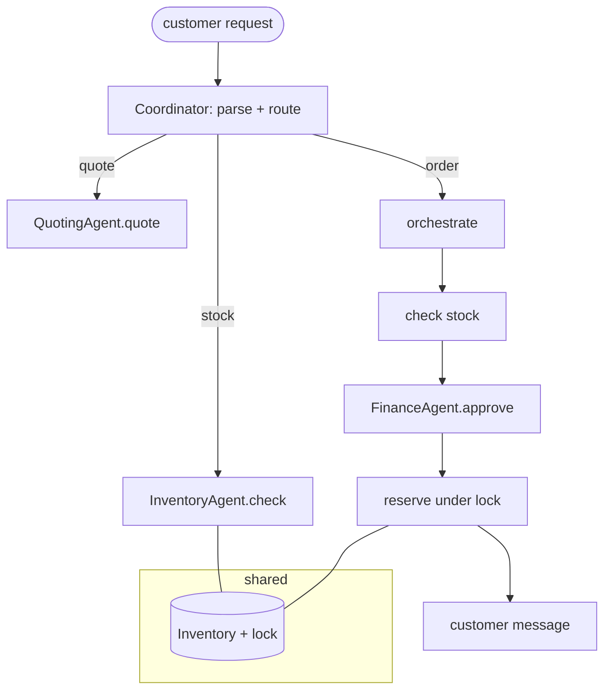

# Project 04 · Paper Company Sales Team (Capstone)

> **Course:** [04 · Multi-Agent Systems](../../courses/04-multi-agent-systems.md)
> · **Notebook:** [04_multi_agent_systems.ipynb](../../notebooks/04_multi_agent_systems.ipynb)

The capstone. Build a **multi-agent sales operation** for a paper company. Free-text customer
requests are parsed, **routed** by intent, and **orchestrated** through a team of specialist agents
that share state safely — even under concurrent load.



---

## The team

| Agent | Responsibility |
|-------|----------------|
| `SalesCoordinator` | Parses the request (LLM), **routes** by intent, **orchestrates** the order flow, writes the customer reply |
| `InventoryAgent` | Reads availability; performs the **atomic reserve** against shared `Inventory` |
| `QuotingAgent` | Prices an order (per-ream table + bulk discount) |
| `FinanceAgent` | Approves/holds based on the customer budget |

**Shared state:** a single `Inventory` guarded by a `threading.Lock`, so simultaneous orders for the
same stock can never oversell.

---

## Requirements

1. **Routing** — classify each request as `stock` / `quote` / `order` and dispatch accordingly.
2. **Orchestration** — an order runs check-stock → quote → finance-approve → reserve, short-circuiting
   with a clear `rejected` reason at any failed step.
3. **Shared state + concurrency** — reserving is atomic; concurrent orders never drive stock negative.
4. **Structured results** — every call returns a dict with a `status`
   (`info` / `quoted` / `confirmed` / `rejected`).
5. **LLM narrative layer** — the model parses requests and writes the customer-facing message; the
   business logic stays deterministic.

---

## Run

```bash
cd agentic-ai
uv run python projects/04_sales_team/solution.py
uv run --extra dev pytest projects/04_sales_team -q
```

Expected demo: order 1 confirmed (bulk-discounted), order 2 rejected (insufficient stock), and the
concurrency test shows only as many orders confirmed as stock allows — the rest rejected, stock never
negative.

Edit the first import in [`test_sales_team.py`](test_sales_team.py) to target `starter` while you work.

---

## Grading rubric

| Criterion | Pass | Strong |
|-----------|------|--------|
| Routing | handles the 3 intents | clean dispatch, no dead paths |
| Orchestration | runs the order steps | short-circuits with precise reasons |
| Concurrency | uses the lock | proven no-oversell under many threads |
| Quoting/finance | correct totals | bulk discount + budget enforcement |
| Narrative | returns a message | on-brand, derived from the real outcome |

## Stretch goals

- Add a **`RestockAgent`** that reorders when stock crosses a threshold.
- Promote `Inventory` to a SQLite table and reserve inside a transaction.
- Add a **supervisor** that audits rejected orders and suggests substitutes (`recycled A4` for `A4`).
- Go live with `get_llm()` + real customer emails parsed into orders.
