# The Cracked AI Engineer

### A Complete, End-to-End Handbook — From First Principles to Frontier Labs

> The book I wish existed when I decided to become the kind of AI engineer that Anthropic, Google DeepMind, OpenAI, and Microsoft fight to hire.

---

## Who this book is for

You want to be a **"cracked" AI engineer** — not someone who calls an API and glues a chatbot together, but the kind of person who can go from a blank file to a trained, aligned, and deployed model, and explain every line along the way.

This book assumes you are willing to do the hard thing: build from scratch, read the papers, write the kernels, and ship work in public. It does not assume you already know any of it.

Every chapter follows the same philosophy:

1. **First principles** — what the concept *actually* is, derived not memorized.
2. **Clean code** — minimal, runnable examples you can type yourself.
3. **Realistic code** — how it looks in a production or research codebase.
4. **Why we do it** — the real-world impact, the failure it prevents, the money or latency it saves.
5. **Interview signal** — the questions you'll be asked and how a strong candidate answers.

---

## The bar (read this first)

Engineers at frontier labs share three traits. Hold yourself to all three:

1. **Idea → code → trained model → deployed system**, without hand-holding.
2. **Transformers from first principles** — you could rebuild one from scratch and defend every design choice.
3. **Public proof of work** — things you built that others use, cite, or depend on.

> Anthropic and peers hire *exceptional software engineers who learned ML*, not prompt tinkerers. Never let your raw engineering atrophy.

---

## How to use this book

- **Read in order** if you're early. Each part builds on the last.
- **Jump to a part** if you're filling gaps. Each chapter is self-contained enough to stand alone.
- **Do the exercises.** Reading about backprop is worthless; implementing it is everything. Worked solutions and full interview answers live in the [Solutions & Answer Key](solutions/README.md) — attempt first, then check.
- **Build the capstones.** Each part ends with a project that becomes portfolio proof.

---

## Table of Contents

### Part I — Foundations
| # | Chapter | What you'll master |
|---|---------|--------------------|
| 1 | [Introduction: The Bar](part-1-foundations/01-introduction.md) | The mindset, the three traits, how to self-assess |
| 2 | [Mathematical Foundations](part-1-foundations/02-mathematics.md) | Linear algebra, probability, calculus, optimization |
| 3 | [Programming Mastery](part-1-foundations/03-programming.md) | Advanced Python, systems language, profiling |
| 4 | [CS Fundamentals](part-1-foundations/04-cs-fundamentals.md) | DSA, OS, computer architecture, distributed systems |

### Part II — Core Deep Learning
| # | Chapter | What you'll master |
|---|---------|--------------------|
| 5 | [Neural Networks from Scratch](part-2-deep-learning/05-neural-networks-from-scratch.md) | Backprop by hand, MLP & CNN in NumPy |
| 6 | [The Transformer from Scratch](part-2-deep-learning/06-transformer-from-scratch.md) | Attention, multi-head, a working GPT |

### Part III — The Modern LLM Stack
| # | Chapter | What you'll master |
|---|---------|--------------------|
| 7 | [LLM Architecture Deep Dive](part-3-llm-stack/07-llm-architecture.md) | RoPE, RMSNorm, GQA, SwiGLU, tokenization |
| 8 | [Pretraining & Scaling Laws](part-3-llm-stack/08-pretraining.md) | Data, objectives, Chinchilla, mixed precision |
| 9 | [Post-training & Alignment](part-3-llm-stack/09-alignment.md) | SFT, RLHF, DPO, RLAIF, Constitutional AI |
| 10 | [Inference Optimization](part-3-llm-stack/10-inference-optimization.md) | KV cache, speculative decoding, quantization |
| 11 | [Fine-tuning: LoRA, QLoRA, PEFT](part-3-llm-stack/11-fine-tuning.md) | Parameter-efficient adaptation |
| 12 | [RAG & Agents](part-3-llm-stack/12-rag-and-agents.md) | Embeddings, retrieval, tools, planning, MCP |
| 13 | [Evaluation](part-3-llm-stack/13-evaluation.md) | Benchmarks, LLM-as-judge, red-teaming |

### Part IV — Systems & Infrastructure
| # | Chapter | What you'll master |
|---|---------|--------------------|
| 14 | [Distributed Training](part-4-systems/14-distributed-training.md) | Data/tensor/pipeline parallelism, FSDP, ZeRO |
| 15 | [GPU Programming](part-4-systems/15-gpu-programming.md) | CUDA, Triton, FlashAttention, roofline |
| 16 | [Frameworks: PyTorch & JAX](part-4-systems/16-frameworks.md) | Autograd internals, JIT, functional ML |
| 17 | [Serving & MLOps](part-4-systems/17-serving-mlops.md) | vLLM, containers, observability, cost |

### Part V — Career & Mastery
| # | Chapter | What you'll master |
|---|---------|--------------------|
| 18 | [Specialization Tracks](part-5-career/18-specialization.md) | Research eng, inference/systems, applied/agents |
| 19 | [Getting Hired & Interview Prep](part-5-career/19-getting-hired.md) | Portfolio, OSS, writing, the interview loop |

### Part VI — Frontier & Specialized Topics
| # | Chapter | What you'll master |
|---|---------|--------------------|
| 20 | [Diffusion & Multimodal Models](part-6-frontier/20-diffusion-multimodal.md) | Diffusion from scratch, latent diffusion, CFG, vision-language models |
| 21 | [Deep Reinforcement Learning](part-6-frontier/21-deep-rl.md) | MDPs, Q-learning, policy gradients, PPO, GRPO, RL for LLMs |
| 22 | [Mechanistic Interpretability](part-6-frontier/22-interpretability.md) | Probing, superposition, SAEs, circuits, activation steering |
| 23 | [Alternative Architectures: Beyond the Transformer](part-6-frontier/23-alternative-architectures.md) | SSMs/Mamba, linear attention, RWKV/RetNet, hybrids |

> **Part VI is optional.** These are deep-dive electives that turn a chosen [specialization track](part-5-career/18-specialization.md) into world-class depth — beyond a text-only education.

### Solutions & Answer Key

Every exercise has a worked solution (with runnable code) and every "Interview signal" question has a full model answer in the companion **[Solutions & Answer Key](solutions/README.md)**. Try each problem yourself before peeking — the struggle is where the learning is.

### Interactive notebooks

A few chapters are best *seen running*. The **[`notebooks/`](notebooks/)** folder has self-contained companions (NumPy + matplotlib only — no GPU, no frameworks) that render the visuals the text describes:

| Notebook | Chapter | You'll see |
| --- | --- | --- |
| [05-neural-network-from-scratch](notebooks/05-neural-network-from-scratch.ipynb) | 5 | loss curve + non-linear decision boundary |
| [06-attention-heatmaps](notebooks/06-attention-heatmaps.ipynb) | 6 | attention weights, causal mask, multi-head |
| [20-diffusion-from-scratch](notebooks/20-diffusion-from-scratch.ipynb) | 20 | forward noising + reverse denoising trajectory |
| [22-interpretability-toys](notebooks/22-interpretability-toys.ipynb) | 22 | probe, steering, superposition, SAE |
| [23-alt-architecture-benchmarks](notebooks/23-alt-architecture-benchmarks.ipynb) | 23 | quadratic-vs-linear cost, KV cache vs SSM state |

---

## A realistic timeline

```mermaid
gantt
    title 18-Month Path to Cracked
    dateFormat  X
    axisFormat %s
    section Foundations
    Math + Python + DSA + NN basics      :0, 3
    section Build
    Full LLM build + PyTorch + project    :3, 6
    section Specialize
    Reproduce a paper + OSS + writing     :9, 9
```

- **Months 0–3:** Math, Python/DSA, neural nets from scratch, build an MLP and a transformer.
- **Months 3–9:** Full LLM build (data → tokenizer → pretrain → SFT → DPO), PyTorch deeply, first serious project.
- **Months 9–18:** Specialize, reproduce a frontier paper, make real open-source contributions, write about it, apply.

---

## The golden rule

> Depth beats breadth. One world-class skill plus public proof beats a checklist of half-learned buzzwords every single time.

Now turn to [Chapter 1](part-1-foundations/01-introduction.md) and let's begin.
