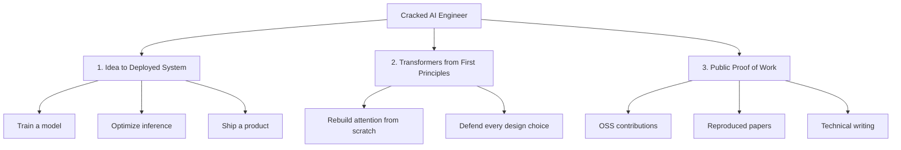
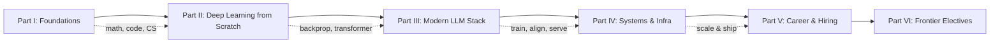

# Chapter 1 — Introduction: The Bar

> "The best engineers I've worked with aren't the ones who know the most frameworks. They're the ones who can take any problem down to its fundamentals and rebuild it." — a sentiment echoed across frontier labs.

This chapter is short on code and long on calibration. Before you spend 18 months learning, you need an honest picture of the target. Skip this and you'll optimize for the wrong things.

---

## 1.1 What "cracked" actually means

The word gets thrown around, so let's define it precisely. A **cracked AI engineer** is someone who:

- Can take a research idea and turn it into **working, efficient code** the same day.
- Understands the **full stack** — from the CUDA kernel up to the product API.
- Has **taste**: knows which experiments are worth running and which are dead ends.
- Ships **proof of work** the community actually uses.

It is *not* about credentials. Several of the most influential people in modern AI do not have PhDs. It is about **demonstrated ability to build hard things**.

### The three traits (your north star)

---

## 1.2 The most common failure modes

You will be tempted by these. Recognize them now.

| Failure mode | What it looks like | The fix |
|--------------|--------------------|---------|
| **API tinkerer** | You can prompt GPT but can't explain a softmax | Build from scratch (Part II) |
| **Tutorial tourist** | 40 finished tutorials, 0 original projects | Build *one* thing nobody told you to build |
| **Paper hoarder** | You "read" 200 papers, reproduced 0 | Reproduce 1 paper end-to-end |
| **Breadth addict** | You know 1 inch of everything, 1 mile of nothing | Pick a specialization (Part V) |
| **Atrophied engineer** | You learned ML but can't pass a coding screen | Keep DSA sharp (Chapter 4) |

> The single highest-signal thing you can do is **reproduce a frontier result and write it up**. It simultaneously proves traits 1, 2, and 3.

---

## 1.3 Why first principles matter more in AI than almost anywhere

In web development, you can be productive for years without knowing how TCP works. AI is different, and here's the concrete reason:

When your training run diverges at 3 a.m., the loss spiking to `NaN`, **no Stack Overflow answer will save you**. You need to reason: *Is it the learning rate? A bad batch? fp16 overflow in the attention softmax? A bug in my gradient accumulation?* Every one of those requires understanding the math and the systems underneath.

**Real-world impact:** A single failed large training run can cost tens of thousands to millions of dollars in compute. The engineer who understands *why* bf16 is more stable than fp16 for training (more exponent bits, fewer mantissa bits → wider dynamic range, less overflow) saves the run. The one who only knows "use mixed precision because it's faster" does not.

This is why the whole book insists on building from scratch. You are not building toys for their own sake — you are building the **mental models** that let you debug and innovate when the map runs out.

---

## 1.4 How to self-assess (be brutally honest)

Rate yourself 0–3 on each. 0 = no idea, 1 = heard of it, 2 = can use it, 3 = can teach it and debug it under pressure.

**Foundations**
- [ ] Derive backpropagation for a 2-layer MLP by hand
- [ ] Explain why we use cross-entropy loss for classification, from the MLE perspective
- [ ] Implement attention in NumPy without looking anything up
- [ ] Pass a medium/hard LeetCode problem in 25 minutes

**LLM stack**
- [ ] Explain the difference between MHA, MQA, and GQA and *why* GQA exists
- [ ] Describe what a KV cache stores and why it makes generation faster
- [ ] Explain DPO and how it differs from RLHF, mathematically
- [ ] Design an eval for a task where there's no single correct answer

**Systems**
- [ ] Explain the difference between data, tensor, and pipeline parallelism
- [ ] Describe why FlashAttention is faster *without* changing the math
- [ ] Write (or read) a basic Triton kernel
- [ ] Reason about whether a workload is compute-bound or memory-bound

If most scores are 0–1, that's the point of this book. By the end, they should be 2–3. **Re-take this assessment every two months** — it's your progress bar.

---

## 1.5 The compounding strategy

The people who make it don't grind randomly. They compound:

1. **Learn a concept** (e.g., LoRA) → 
2. **Implement it from scratch** (write the low-rank adapter) → 
3. **Apply it to something real** (fine-tune a small model on your data) → 
4. **Write about it** (a blog post explaining LoRA clearly) → 
5. **The writeup gets you noticed** → opportunities → harder problems → repeat.

Each loop produces an artifact (code + writing) that is simultaneously learning *and* proof of work. This is the cheat code: **never learn passively when you could produce an artifact.**

---

## 1.6 What the rest of the book does

- **Part I** makes sure your foundation can bear weight.
- **Part II** has you build neural nets and a transformer from nothing.
- **Part III** is the modern LLM engineer's core craft.
- **Part IV** is what separates "good" from "cracked" — the systems.
- **Part V** turns ability into a job offer.
- **Part VI** is optional frontier electives — diffusion/multimodal, deep RL, interpretability — to deepen your chosen spike.

---

## Interview signal

> **Q: "Why do you want to work here / in AI?"** (asked everywhere)

Weak answer: "AI is the future and I'm passionate about it."

Strong answer: Specific, technical, and shows proof of work. *"I reproduced the DPO paper on a 1B model last month and was surprised how much more stable it was than my PPO baseline — I wrote up why. I want to work on alignment because the post-training stack is where capability and safety actually meet, and that's the problem I find myself thinking about unprompted."*

The difference is **evidence**. Everything in this book exists to give you that evidence.

---

## Key takeaways

- "Cracked" = idea→deployment ability + first-principles depth + public proof.
- Avoid the five failure modes; especially, don't let raw engineering atrophy.
- First principles aren't academic in AI — they're how you debug million-dollar runs.
- Compound: learn → build → apply → write → repeat. Every loop is an artifact.
- Self-assess honestly every two months.

**Next:** [Chapter 2 — Mathematical Foundations](02-mathematics.md)
