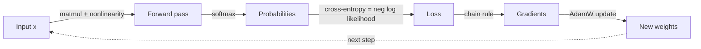

# Chapter 2 — Mathematical Foundations

> You do not need a math PhD. You need *fluency* in four areas: linear algebra, probability, calculus, and optimization. Fluency means you see a neural network and *see the math*, not a black box.

This chapter is deliberately practical. For every concept we answer: what is it, how do I compute it in code, and **where does it show up in a real model**.

---

## 2.1 Why math, really

A transformer is, almost entirely, **matrix multiplications glued together with a couple of nonlinearities**. When you understand the linear algebra, attention stops being magic and becomes "queries dotted with keys, scaled, softmaxed, used to weight values." When you understand calculus, backprop stops being magic and becomes "the chain rule applied at scale." When you understand probability, the loss function stops being arbitrary and becomes "maximize the likelihood of the data."

**The payoff is debugging power.** Loss is `NaN`? You'll suspect the softmax overflow. Model won't learn? You'll check the gradient magnitudes. Quantization destroyed accuracy? You'll reason about dynamic range. None of that is possible without the math.

---

## 2.2 Linear Algebra

### The objects

| Object | Shape | In a model |
|--------|-------|-----------|
| Scalar | `()` | a single loss value, a learning rate |
| Vector | `(d,)` | a token embedding, a bias |
| Matrix | `(m, n)` | a weight layer, attention scores |
| Tensor | `(b, t, d, ...)` | a batch of sequences of embeddings |

### Matrix multiplication — the single most important operation

If `A` is `(m, k)` and `B` is `(k, n)`, then `C = A @ B` is `(m, n)` where `C[i,j] = sum_k A[i,k] * B[k,j]`.

**Why it matters:** A linear layer `y = x @ W.T + b` *is* a matrix multiply. Attention is *three* matrix multiplies. Over 90% of the FLOPs (floating-point operations) in an LLM are matmuls. This is exactly why GPUs — which are matmul machines — power modern AI.

```python
import numpy as np

# A linear layer: project a batch of token embeddings (d_in=4) to d_out=3
x = np.random.randn(2, 4)        # (batch=2, d_in=4)
W = np.random.randn(3, 4)        # (d_out=3, d_in=4)  -- PyTorch stores it this way
b = np.random.randn(3)           # (d_out=3,)

y = x @ W.T + b                  # (2, 3)
print(y.shape)                   # (2, 3)
```

> **Real-world note:** The reason weight matrices are stored as `(out, in)` in PyTorch is a convention so that `x @ W.T` works for a row-major batch. Getting shapes right is half the job of an ML engineer; the other half is knowing what to do when they're wrong.

### Dot products and similarity

The dot product `a · b = Σ aᵢbᵢ` measures alignment. It's the heart of attention ("how much should token *i* attend to token *j*?" → dot product of their query and key) and of embeddings ("how similar are these two documents?" → cosine similarity, a normalized dot product).

```python
def cosine_similarity(a, b):
    return (a @ b) / (np.linalg.norm(a) * np.linalg.norm(b))

doc1 = np.array([0.2, 0.9, 0.1])
doc2 = np.array([0.25, 0.85, 0.05])
print(cosine_similarity(doc1, doc2))  # ~0.99 -> very similar
```

**Where it shows up:** Every RAG system (Chapter 12) retrieves documents by cosine similarity between query and document embeddings. Every attention head scores tokens with dot products.

### Matrix decompositions: eigen and SVD

**Eigendecomposition:** For a square matrix `A`, an eigenvector `v` satisfies `A v = λ v` — `A` only *stretches* `v` by `λ`, doesn't rotate it. Eigenvalues tell you the "principal directions" and their importance.

**SVD (Singular Value Decomposition):** Any matrix `A = U Σ Vᵀ`. The singular values in `Σ` tell you how much "energy" is in each dimension. This is the mathematical basis for:
- **PCA** (dimensionality reduction).
- **Low-rank approximation** — keep the top-k singular values to approximate a big matrix with a small one. **This is literally the idea behind LoRA** (Chapter 11): a weight *update* is approximated as a product of two skinny matrices `B @ A` of rank `r`.

```python
A = np.random.randn(100, 100)
U, S, Vt = np.linalg.svd(A)
# Rank-10 approximation keeps 10 of 100 singular values:
r = 10
A_approx = U[:, :r] @ np.diag(S[:r]) @ Vt[:r, :]
error = np.linalg.norm(A - A_approx) / np.linalg.norm(A)
print(f"Rank-{r} approx relative error: {error:.3f}")
```

> **Why this is a big deal:** LoRA fine-tunes a 70B model by training adapters that are <1% of the parameters, because it bets (correctly) that the *update* to the weights is low-rank. SVD is the theory that makes that bet sound.

### Norms

A norm measures "size." The L2 norm `‖x‖₂ = √(Σxᵢ²)` is used everywhere: gradient clipping (cap `‖grad‖`), weight decay (penalize `‖W‖`), and normalization layers.

```python
grad = np.array([3.0, 4.0])
print(np.linalg.norm(grad))  # 5.0 -> if this exceeds a threshold, we clip
```

**Real-world:** *Gradient clipping* — "if the gradient norm exceeds 1.0, scale it down to 1.0" — is what stops a single bad batch from blowing up a multi-week training run. Production training configs almost always set `max_grad_norm`.

---

## 2.3 Probability & Statistics

### Why ML is probabilistic

A language model does not output "the next word." It outputs a **probability distribution over the entire vocabulary**, and we sample from it. Understanding distributions is understanding what the model actually produces.

### Core distributions

| Distribution | Use in ML |
|--------------|-----------|
| Bernoulli / Categorical | Output of a classifier / language model |
| Gaussian (Normal) | Weight initialization, noise, diffusion models |
| Uniform | Dropout masks, random sampling |

### The softmax — turning scores into probabilities

Models output raw scores ("logits"). Softmax converts them to a probability distribution:

$$\text{softmax}(z)_i = \frac{e^{z_i}}{\sum_j e^{z_j}}$$

```python
def softmax(z):
    z = z - np.max(z)          # subtract max for NUMERICAL STABILITY (prevents overflow)
    e = np.exp(z)
    return e / e.sum()

logits = np.array([2.0, 1.0, 0.1])
print(softmax(logits))         # [0.659, 0.242, 0.099], sums to 1
```

> **The `z - max(z)` trick is interview gold.** Without it, `exp(large number)` overflows to `inf`. Subtracting the max makes the largest exponent 0, keeping everything in a safe range — and it doesn't change the result because softmax is shift-invariant. This *exact* bug appears in real codebases and the fix is this one line.

### Maximum Likelihood Estimation (MLE) — where the loss comes from

This is the conceptual key that unlocks everything. **We don't pick loss functions arbitrarily.** We pick the model parameters that make the observed data most probable. That principle *derives* the loss.

For classification, maximizing likelihood is equivalent to minimizing **cross-entropy loss**:

$$\mathcal{L} = -\sum_i y_i \log(\hat{y}_i)$$

For a language model predicting the next token, the loss is exactly the negative log-likelihood of the correct next token. That's it. "Train an LLM" means "adjust weights so the true next tokens get high probability."

```python
def cross_entropy(probs, true_class):
    return -np.log(probs[true_class] + 1e-12)  # epsilon avoids log(0)

probs = softmax(np.array([2.0, 1.0, 0.1]))
print(cross_entropy(probs, true_class=0))   # low loss: model was confident & correct
print(cross_entropy(probs, true_class=2))   # high loss: model was confident & wrong
```

**Real-world impact:** *Perplexity*, the headline metric for language models, is just `exp(cross_entropy)`. When a paper reports perplexity 8, they mean the model is, on average, as uncertain as if choosing uniformly among 8 words. Lower is better. You now understand it from first principles.

### KL divergence — the distance between distributions

$$D_{KL}(P \| Q) = \sum_i P_i \log\frac{P_i}{Q_i}$$

It measures how much distribution `Q` differs from `P`. It is **everywhere** in alignment:
- **RLHF/PPO** adds a KL penalty so the fine-tuned model doesn't drift too far from the base model (Chapter 9).
- **DPO**'s loss is derived directly from a KL-constrained objective.
- **Knowledge distillation** trains a small model to match a big model's output distribution by minimizing KL.

```python
def kl_divergence(p, q):
    return np.sum(p * np.log((p + 1e-12) / (q + 1e-12)))

p = np.array([0.7, 0.2, 0.1])
q = np.array([0.6, 0.3, 0.1])
print(kl_divergence(p, q))  # small -> distributions are close
```

> **Interview-worthy nuance:** KL is *not symmetric*: `D_KL(P‖Q) ≠ D_KL(Q‖P)`. "Forward" vs "reverse" KL produce mean-seeking vs mode-seeking behavior. Being able to discuss this signals real understanding.

### Expectation, variance, and the bias–variance tradeoff

- **Expectation** `E[X]` = the average outcome. Training minimizes the *expected* loss over the data distribution.
- **Variance** = spread. High-variance models overfit; high-bias models underfit. Regularization (weight decay, dropout) trades a little bias for a lot less variance.

---

## 2.4 Calculus & Optimization

### The gradient — the direction of steepest ascent

The gradient `∇f` is the vector of partial derivatives. It points in the direction that increases `f` fastest. Training does the opposite: step *against* the gradient to *decrease* the loss. That's gradient descent in one sentence.

### The chain rule — the engine of backprop

If `y = f(g(x))`, then `dy/dx = f'(g(x)) · g'(x)`. Backpropagation is **the chain rule applied mechanically through a computation graph**, reusing intermediate results so it's efficient. Chapter 5 implements this from scratch; here's the seed:

```python
# f(x) = (3x + 1)^2 ; compute df/dx at x=2 by chaining
x = 2.0
# forward
u = 3*x + 1        # = 7
y = u**2           # = 49
# backward (chain rule)
dy_du = 2*u        # 14
du_dx = 3
dy_dx = dy_du * du_dx   # 42
print(dy_dx)       # 42.0
```

### Gradient Descent and its variants

```python
# Minimize f(x) = x^2, whose gradient is 2x. Minimum is at x=0.
x = 10.0
lr = 0.1
for step in range(50):
    grad = 2 * x
    x = x - lr * grad      # the update rule: step against the gradient
print(round(x, 4))         # approaches 0
```

| Optimizer | Idea | When used |
|-----------|------|-----------|
| **SGD** | step against the gradient | classic, still used for vision |
| **SGD + momentum** | accumulate a velocity to push through noise | faster, smoother |
| **Adam** | per-parameter adaptive learning rates (1st & 2nd moment estimates) | the default for transformers |
| **AdamW** | Adam with *decoupled* weight decay | the actual default for LLMs |

```python
# Minimal Adam for one parameter, to demystify the "magic" optimizer.
m, v, t = 0.0, 0.0, 0
x, lr, b1, b2, eps = 10.0, 0.1, 0.9, 0.999, 1e-8
for _ in range(100):
    t += 1
    g = 2 * x                       # gradient of x^2
    m = b1 * m + (1 - b1) * g       # 1st moment (mean of gradients)
    v = b2 * v + (1 - b2) * g * g   # 2nd moment (uncentered variance)
    m_hat = m / (1 - b1**t)         # bias correction
    v_hat = v / (1 - b2**t)
    x -= lr * m_hat / (np.sqrt(v_hat) + eps)
print(round(x, 4))                  # approaches 0
```

> **Why AdamW for LLMs?** Transformers have wildly different gradient scales across layers (attention vs embeddings vs LayerNorm). Adam's per-parameter adaptive step sizes handle this gracefully where plain SGD would need painful tuning. The "W" (decoupled weight decay) fixes a subtle bug where L2 regularization interacted badly with Adam's scaling. Knowing *why* AdamW is the default — not just *that* it is — is exactly the kind of depth interviewers probe for.

### Learning rate: the most important hyperparameter

Too high → divergence (`NaN`). Too low → glacial training, stuck in bad regions. In practice we use a **schedule**: linear *warmup* (start tiny, ramp up — stabilizes early training when gradients are chaotic) then *cosine decay* (smoothly anneal to near-zero — lets the model settle into a good minimum).

```python
import math
def lr_schedule(step, warmup=2000, total=100000, max_lr=3e-4):
    if step < warmup:
        return max_lr * step / warmup                     # linear warmup
    progress = (step - warmup) / (total - warmup)
    return 0.5 * max_lr * (1 + math.cos(math.pi * progress))  # cosine decay
```

**Real-world:** This warmup-then-cosine schedule is in essentially every modern LLM training recipe (GPT, LLaMA, etc.). The warmup specifically prevents the early-training instability that otherwise spikes the loss in the first few hundred steps.

### Convexity, local minima, and why deep learning works anyway

Neural network loss surfaces are **non-convex** — riddled with local minima and saddle points in theory. In practice, in very high dimensions, most critical points are saddle points (not bad minima), and SGD's noise helps escape them. You don't need a global optimum; you need a "good enough" minimum, and the geometry of high-dimensional loss landscapes tends to provide many.

---

## 2.5 Putting it together: the math of one training step

Here's the entire mathematical pipeline of training, which you now understand piece by piece:



1. **Forward:** linear algebra (matmuls) + nonlinearities produce logits.
2. **Softmax:** probability theory turns logits into a distribution.
3. **Loss:** MLE says cross-entropy is the right objective.
4. **Backward:** calculus (chain rule) computes gradients.
5. **Update:** optimization (AdamW) adjusts weights against the gradient.

Every concept in this chapter is one stage of that loop. Internalize the loop and the rest of the book is elaboration on it.

---

## Interview signal

- **Q: "Why subtract the max before softmax?"** → Numerical stability; prevents `exp` overflow; result unchanged by shift-invariance.
- **Q: "Derive the gradient of cross-entropy + softmax."** → It famously simplifies to `(ŷ − y)`. Being able to show this is a classic ML interview question.
- **Q: "Why Adam over SGD for transformers?"** → Per-parameter adaptive learning rates handle heterogeneous gradient scales; AdamW fixes weight-decay coupling.
- **Q: "What is KL divergence and where have you used it?"** → Distance between distributions; RLHF penalty, DPO derivation, distillation. Mention the asymmetry.
- **Q: "What's perplexity?"** → `exp(cross-entropy)`; average branching factor of the model's uncertainty.

---

## Exercises

1. Implement softmax and verify it's shift-invariant: `softmax(z) == softmax(z + 100)`.
2. Implement cross-entropy and confirm that confident-correct → low loss, confident-wrong → high loss.
3. Build the rank-`r` SVD approximation of a random matrix and plot error vs `r`. Connect this to LoRA.
4. Implement gradient descent *and* Adam on `f(x,y) = x² + 10y²` (an ill-conditioned bowl). Watch Adam handle the conditioning better.
5. By hand, derive `d/dx` of `softmax(x)ᵢ`. Then verify numerically with finite differences.

## Key takeaways

- A transformer is mostly matmuls; GPUs win because they're matmul machines.
- Softmax + cross-entropy = MLE; perplexity = `exp(loss)`.
- SVD/low-rank is the theory behind LoRA.
- Backprop = chain rule at scale; AdamW = adaptive steps + decoupled decay.
- KL divergence underpins RLHF, DPO, and distillation — and it's asymmetric.

**Next:** [Chapter 3 — Programming Mastery](03-programming.md)
