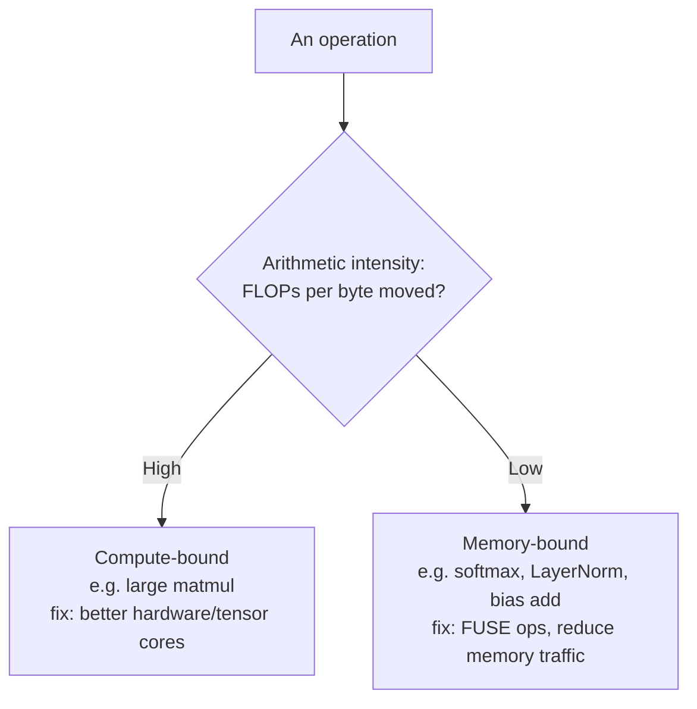
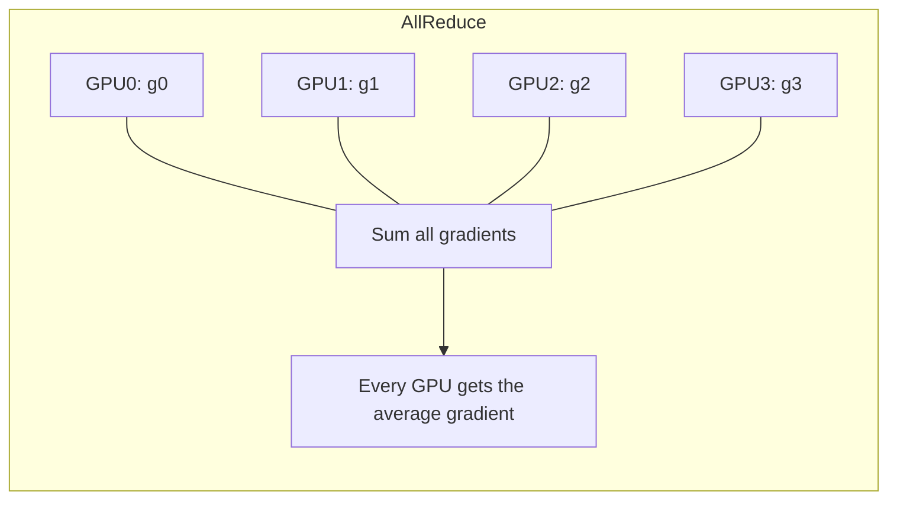
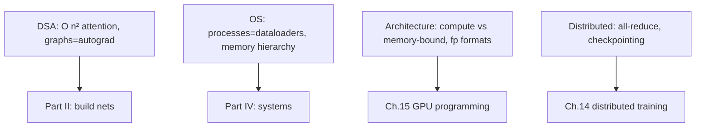

# Chapter 4 — CS Fundamentals

> The "ML" in "ML engineer" gets the glamour, but the "engineer" gets you hired. Frontier labs still run real coding interviews, and the systems you build are constrained by CPU caches, memory bandwidth, and network latency. This chapter is the computer-science bedrock.

We cover four pillars: **data structures & algorithms**, **operating systems**, **computer architecture** (which matters more for ML than most realize), and **distributed systems**.

---

## 4.1 Data Structures & Algorithms — you still have to pass the bar

Yes, even at AI labs, you'll face algorithmic interviews. More importantly, DSA is how you reason about efficiency every day.

### Complexity analysis — the universal language

Big-O describes how cost grows with input size. You must be able to state and justify the complexity of anything you write.

| Complexity | Name | Example |
|-----------|------|---------|
| O(1) | constant | hash lookup |
| O(log n) | logarithmic | binary search |
| O(n) | linear | scan an array |
| O(n log n) | linearithmic | good sorting |
| O(n²) | quadratic | naïve pairwise (e.g., attention over sequence length!) |
| O(2ⁿ) | exponential | brute-force subsets |

> **The single most important O() in modern AI:** self-attention is **O(n²)** in sequence length `n`. That quadratic is *the* reason long context is expensive and why FlashAttention, sliding-window attention, and linear-attention variants exist (Chapters 6, 7, 15). When someone asks "why is 1M-token context hard?", the answer starts with this O(n²).

### Core data structures and where they appear in ML

| Structure | ML appearance |
|-----------|---------------|
| **Hash map** | Tokenizer vocab (token ↔ id), feature stores, caches |
| **Array / dynamic array** | Tensors are contiguous arrays under the hood |
| **Heap / priority queue** | Beam search, top-k sampling, scheduling requests |
| **Trie** | BPE merges, prefix matching, autocomplete |
| **Graph** | Computation graphs (autograd!), knowledge graphs, model parallelism plans |
| **Queue** | Request batching in inference servers, data prefetch buffers |

### Algorithms worth mastering

```python
import heapq

# Top-k sampling: keep the k most-probable tokens. A heap does this in O(n log k).
def top_k_tokens(logits: list[float], k: int) -> list[int]:
    # nlargest returns indices of the k biggest logits
    return heapq.nlargest(k, range(len(logits)), key=lambda i: logits[i])

print(top_k_tokens([0.1, 3.2, 1.1, 2.9, 0.4], k=2))  # [1, 3]
```

```python
# Binary search: the backbone of many O(log n) tricks, incl. nucleus (top-p) sampling
# over a cumulative distribution.
def first_index_ge(cumulative: list[float], target: float) -> int:
    lo, hi = 0, len(cumulative)
    while lo < hi:
        mid = (lo + hi) // 2
        if cumulative[mid] < target:
            lo = mid + 1
        else:
            hi = mid
    return lo
```

**Patterns to drill** (these cover the bulk of interview questions): two pointers, sliding window, BFS/DFS, dynamic programming, binary search, heap/top-k, hashing, backtracking. The goal isn't memorization — it's *recognizing* which pattern a problem maps to.

### Recursion, DP, and graph traversal

Dynamic programming (caching overlapping subproblems) and graph traversal (BFS/DFS) deserve special attention because **autograd is literally a reverse traversal of a computation graph** (Chapter 5), and many optimizations are DP.

```python
# DFS over a computation graph to produce a topological order — exactly what
# autograd does before running the backward pass in reverse.
def topo_sort(node, visited, order):
    if node in visited:
        return
    visited.add(node)
    for parent in node.parents:        # edges to inputs
        topo_sort(parent, visited, order)
    order.append(node)                 # post-order => topological
```

---

## 4.2 Operating Systems — the machine your code actually runs on

You don't need to write a kernel, but you must understand the abstractions, because they explain your performance and your bugs.

### Processes vs threads (ties back to Chapter 3's concurrency)

- **Process:** isolated memory space. `multiprocessing` uses these to escape the GIL.
- **Thread:** shares memory within a process. Cheap, but the GIL limits CPU parallelism in Python.

**Why it matters:** A PyTorch `DataLoader` with `num_workers=8` spawns **8 processes** to load and preprocess data in parallel while the GPU trains. If you set it to 0, your expensive GPU sits idle waiting on the CPU. Understanding processes explains this knob.

### The memory hierarchy and virtual memory

```
registers  <  L1 cache  <  L2/L3 cache  <  RAM  <  SSD  <  network
 ~1 cycle      ~4 cycles    ~tens          ~hundreds  ~10⁵+   ~10⁶+
 (fastest, smallest)  ............................  (slowest, largest)
```

Every level down is ~an order of magnitude slower. **Performance is largely the art of keeping data in fast memory.** This principle scales all the way up to GPUs, where the equivalent hierarchy (registers → shared memory → HBM) is *the* thing FlashAttention exploits (Chapter 15).

### Paging, mmap, and large datasets

`mmap` maps a file into virtual address space so you can access a 100GB dataset as if it were an array, with the OS paging in only what you touch. Many fast data loaders and model-weight loaders (e.g., loading a `safetensors` file) use memory mapping to avoid loading everything into RAM at once.

### System calls, I/O, and why your data loader is the bottleneck

Disk and network I/O are *orders of magnitude* slower than compute. A surprising amount of "slow training" is actually **I/O-bound**: the GPU finishes and waits for the next batch. The fixes — prefetching, more loader workers, caching, sharding data into large sequential files — all come from understanding the OS I/O path.

> **Real-world:** Teams have *doubled* training throughput not by touching the model at all, but by fixing the input pipeline — switching from millions of tiny files to a few large sharded archives (e.g., WebDataset/tar shards) so reads are sequential and the GPU never starves.

---

## 4.3 Computer Architecture — the secret weapon for ML performance

This is the pillar most self-taught engineers skip, and it's exactly where the *cracked* ones pull ahead. Modern ML performance is an architecture problem.

### Compute-bound vs memory-bound (the most important framing in ML systems)

Every operation is limited by one of two things:
- **Compute-bound:** limited by how fast the chip can do math (FLOPs). Big matmuls are usually here.
- **Memory-bound:** limited by how fast you can move data to/from memory (bandwidth). Elementwise ops (activations, normalization, adding bias) are usually here.



> **Why this is the crux of GPU optimization:** LLM inference at batch size 1 is *memory-bound* — you spend most time *moving weights* from GPU memory, not computing. That single fact explains why quantization (Chapter 10) speeds up inference (smaller weights = less to move) and why **kernel fusion** (Chapter 15) helps (compute once data is loaded instead of round-tripping to memory). If you can articulate the compute/memory-bound distinction, you instantly sound like a systems person.

### The roofline model

A roofline plot has two ceilings: peak compute (flat top) and peak memory bandwidth (sloped). Where your kernel sits tells you whether to optimize math or data movement. We use it concretely in Chapter 15.

### Caches, locality, and why memory layout matters

Data laid out contiguously and accessed sequentially flies; scattered access thrashes the cache. This is why tensors are **contiguous** and why `tensor.contiguous()` exists in PyTorch — a transpose can make memory access strided and slow, and you sometimes need to re-pack it.

```python
import torch
x = torch.randn(1000, 1000)
xt = x.t()                       # transpose: a VIEW, non-contiguous (strided)
# xt.view(-1)  # would error — view needs contiguous memory
xt_contig = xt.contiguous()      # re-pack into contiguous memory; now reshape works
```

### Floating point: fp32, fp16, bf16, fp8 — dynamic range vs precision

This is foundational for mixed-precision training and quantization.

| Format | Bits | Exponent / Mantissa | Trade-off |
|--------|------|---------------------|-----------|
| fp32 | 32 | 8 / 23 | full precision, 4 bytes |
| fp16 | 16 | 5 / 10 | small range → overflow risk in training |
| **bf16** | 16 | 8 / 7 | same range as fp32, less precision → **stable for training** |
| fp8 | 8 | 4/3 or 5/2 | extreme speed/memory, needs care |

> **The key insight interviewers probe:** bf16 keeps fp32's 8 exponent bits, so it has the same *dynamic range* and rarely overflows — at the cost of mantissa precision. fp16 has only 5 exponent bits, so large activations overflow to `inf`, which is why fp16 training needs **loss scaling** and bf16 (on modern hardware) usually doesn't. This is a direct consequence of the bit layout — pure computer architecture.

---

## 4.4 Distributed Systems — because one machine is never enough

Training a frontier model spans thousands of GPUs across hundreds of machines. The distributed-systems concepts below are the vocabulary of Chapter 14.

### The fundamental challenge

When work is split across machines, you must **coordinate** them and **move data** between them — and the network is slow and unreliable relative to compute. Most of distributed training is hiding or minimizing communication.

### Collective communication operations

These primitives (from MPI/NCCL) are how GPUs sync. You must know them cold:

| Operation | What it does | Used for |
|-----------|--------------|----------|
| **All-Reduce** | Sum a value across all GPUs, give result to all | Averaging gradients in data parallelism |
| **All-Gather** | Each GPU collects every GPU's shard | Reassembling sharded weights (FSDP/ZeRO) |
| **Reduce-Scatter** | Sum across GPUs, scatter pieces | Sharded gradient reduction |
| **Broadcast** | One GPU sends to all | Distributing initial weights |



> **Real-world:** In standard data-parallel training, each GPU computes gradients on its slice of the batch, then an **all-reduce** averages them so every GPU applies the *same* update and the models stay in sync. The all-reduce is often the throughput bottleneck — which is why fast interconnects (NVLink, InfiniBand) and overlapping communication with computation matter enormously.

### CAP, consistency, and fault tolerance

For training systems specifically, the practical concern is **fault tolerance**: with thousands of GPUs running for weeks, hardware *will* fail. Hence **checkpointing** — periodically saving model + optimizer state so a crashed run resumes from the last checkpoint instead of from zero. A run without checkpointing is a run waiting to waste weeks of compute.

### Latency, throughput, and batching

- **Latency:** time for one request. Matters for interactive use (a chatbot reply).
- **Throughput:** requests per second. Matters for cost-efficiency (serving millions of users).

These trade off, and **batching** is the lever (Chapter 17): grouping requests raises throughput (better GPU utilization) but can raise per-request latency. Designing around this tradeoff is core to serving.

---

## 4.5 How the pillars connect to the rest of the book



You'll feel this chapter pay off repeatedly: the O(n²) of attention, autograd as graph traversal, the memory hierarchy behind FlashAttention, bf16 vs fp16 in mixed precision, and all-reduce in distributed training all trace straight back here.

---

## Interview signal

- **Q: "What's the time complexity of self-attention and why does it matter?"** → O(n²) in sequence length; it's why long context is expensive and motivates FlashAttention/sparse attention.
- **Q: "Is LLM inference compute-bound or memory-bound?"** → At small batch, memory-bound (dominated by moving weights); this is why quantization and fusion help.
- **Q: "bf16 vs fp16 for training?"** → bf16 has fp32's exponent range (8 bits) so it rarely overflows; fp16 needs loss scaling. Range vs precision tradeoff from the bit layout.
- **Q: "Explain all-reduce and where it's used."** → Sum-and-distribute across GPUs; averages gradients in data-parallel training; often the comm bottleneck.
- **Q: "Why does your DataLoader have multiple workers?"** → Separate processes preprocess data in parallel (escaping the GIL) so the GPU never starves on I/O.

---

## Exercises

1. Implement top-k and top-p (nucleus) sampling using a heap and binary search respectively; analyze their complexity.
2. Write a topological sort of a small DAG — you'll reuse this exact code for autograd in Chapter 5.
3. Benchmark sequential vs strided memory access over a large array; explain the gap via cache locality.
4. Simulate all-reduce across 4 "GPUs" (lists) by averaging gradients; verify all end with identical weights.
5. Classify ten common neural-net ops as compute-bound or memory-bound and justify each.

## Key takeaways

- You still need DSA fluency; complexity analysis is daily reasoning, and attention's O(n²) drives modern architecture choices.
- OS concepts explain your real bottlenecks: dataloader processes, the memory hierarchy, I/O-bound training.
- Computer architecture is the cracked engineer's edge: compute- vs memory-bound, the roofline, and fp32/bf16/fp16/fp8 tradeoffs.
- Distributed systems vocabulary — all-reduce, checkpointing, latency/throughput — is the foundation of training and serving at scale.

**Next:** [Chapter 5 — Neural Networks from Scratch](../part-2-deep-learning/05-neural-networks-from-scratch.md)
