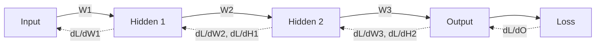

# Chapter 5 — Neural Networks from Scratch

> If you can build a neural network with nothing but NumPy — forward pass, backward pass, training loop — then deep learning stops being magic forever. This chapter is the most important hands-on rite of passage in the book.

We build up from a single neuron to a multi-layer perceptron, implement backpropagation by hand, then build a tiny autograd engine (the thing PyTorch is, conceptually). Everything here is runnable.

---

## 5.1 Why build from scratch

PyTorch will do all of this for you in three lines. So why suffer?

Because **the people who can debug and innovate are the ones who know what's underneath the abstraction.** When your gradients vanish, when your loss is `NaN`, when you need a custom layer with a custom backward — you need to *know* what `.backward()` actually does. Building it once buys you that intuition permanently.

> This is also Karpathy's thesis in "Neural Networks: Zero to Hero." The from-scratch build is not academic hazing; it's the fastest path to genuine understanding.

---

## 5.2 The neuron — a linear function plus a squish

A single neuron: take inputs `x`, multiply by weights `w`, add bias `b`, then apply a nonlinearity `σ`.

$$y = \sigma(w \cdot x + b)$$

Without the nonlinearity, stacking neurons would just be one big linear function (a matrix times a matrix is still a matrix). **The nonlinearity is what lets networks model curves, not just lines** — it's the source of their power.

```python
import numpy as np

def relu(x):
    return np.maximum(0, x)           # the workhorse nonlinearity: max(0, x)

def neuron(x, w, b):
    return relu(x @ w + b)

x = np.array([0.5, -1.2, 3.0])
w = np.array([0.2, 0.8, -0.5])
b = 0.1
print(neuron(x, w, b))
```

### Activation functions and why they matter

| Activation | Formula | Notes |
|-----------|---------|-------|
| **Sigmoid** | `1/(1+e⁻ˣ)` | squashes to (0,1); saturates → vanishing gradients |
| **Tanh** | `(eˣ−e⁻ˣ)/(eˣ+e⁻ˣ)` | zero-centered (0±); still saturates |
| **ReLU** | `max(0,x)` | cheap, no saturation for x>0; default for years |
| **GELU** | `x·Φ(x)` | smooth ReLU; standard in transformers |
| **SwiGLU** | gated variant | used in LLaMA/PaLM (Chapter 7) |

> **Why ReLU beat sigmoid historically:** sigmoid's gradient is near zero when inputs are large or small ("saturation"), so gradients *vanish* in deep stacks and learning stalls. ReLU's gradient is exactly 1 for positive inputs, so signal flows through deep networks. This single change helped unlock deep learning around 2012.

---

## 5.3 The Multi-Layer Perceptron (MLP)

Stack neurons into **layers**, stack layers into a network. Each layer is a matrix multiply + bias + activation. Information flows input → hidden layers → output. This is the **forward pass**.

```python
class MLP:
    def __init__(self, sizes):
        # He initialization: scale by sqrt(2/fan_in) keeps activation variance
        # stable through depth → prevents vanishing/exploding signal.
        self.W = [np.random.randn(a, b) * np.sqrt(2/a)
                  for a, b in zip(sizes[:-1], sizes[1:])]
        self.b = [np.zeros(b) for b in sizes[1:]]

    def forward(self, x):
        self.cache = [x]                          # save activations for backprop
        for i, (W, b) in enumerate(zip(self.W, self.b)):
            z = x @ W + b
            x = relu(z) if i < len(self.W) - 1 else z   # no ReLU on output layer
            self.cache.append(x)
        return x

net = MLP([4, 16, 16, 3])         # 4 inputs → two hidden layers of 16 → 3 outputs
out = net.forward(np.random.randn(8, 4))   # batch of 8
print(out.shape)                  # (8, 3)
```

> **Why weight initialization matters:** if weights are too large, activations explode; too small, they vanish. **He/Kaiming init** (for ReLU) and **Xavier/Glorot init** (for tanh) scale the initial weights so the variance of activations stays roughly constant across layers. Bad init can make a network completely fail to train — a real, common, and easily-overlooked bug.

---

## 5.4 Backpropagation — derived, not memorized

This is the heart of the chapter. **Backprop is just the chain rule applied backward through the network, reusing intermediate results.** We compute how much each weight contributed to the loss, then nudge each weight to reduce it.

### The intuition



Forward: data flows left→right producing a loss. Backward: the gradient of the loss flows right→left, and at each layer we compute (a) the gradient w.r.t. that layer's weights (to update them) and (b) the gradient w.r.t. its input (to pass further back).

### Deriving the two rules you need

For a linear layer `z = x W + b` with an incoming gradient `dz = ∂L/∂z`:

- `∂L/∂W = xᵀ · dz`  (how the weights should change)
- `∂L/∂b = sum(dz)`  (how the bias should change)
- `∂L/∂x = dz · Wᵀ`  (gradient to send to the previous layer)

For ReLU `a = max(0, z)`: the gradient passes through where `z > 0`, and is zero elsewhere → `∂L/∂z = ∂L/∂a · (z > 0)`.

### Full implementation

```python
def softmax(z):
    z = z - z.max(axis=-1, keepdims=True)
    e = np.exp(z)
    return e / e.sum(axis=-1, keepdims=True)

def cross_entropy(logits, y):
    p = softmax(logits)
    n = len(y)
    loss = -np.log(p[np.arange(n), y] + 1e-12).mean()
    # The beautiful result: d(loss)/d(logits) = (p - onehot(y)) / n
    dlogits = p.copy()
    dlogits[np.arange(n), y] -= 1
    dlogits /= n
    return loss, dlogits

class TrainableMLP(MLP):
    def backward(self, dout):
        grads_W, grads_b = [], []
        for i in reversed(range(len(self.W))):
            a_prev = self.cache[i]            # input to this layer
            grads_W.insert(0, a_prev.T @ dout)        # ∂L/∂W = xᵀ·dz
            grads_b.insert(0, dout.sum(axis=0))       # ∂L/∂b = Σ dz
            if i > 0:                                  # propagate to previous layer
                dprev = dout @ self.W[i].T             # ∂L/∂x = dz·Wᵀ
                dprev *= (self.cache[i] > 0)           # through ReLU
                dout = dprev
        return grads_W, grads_b

# --- One full training step on toy data ---
np.random.seed(0)
net = TrainableMLP([4, 16, 3])
X = np.random.randn(32, 4)
y = np.random.randint(0, 3, size=32)
lr = 0.1
for step in range(300):
    logits = net.forward(X)
    loss, dlogits = cross_entropy(logits, y)
    gW, gb = net.backward(dlogits)
    for i in range(len(net.W)):
        net.W[i] -= lr * gW[i]            # gradient descent update
        net.b[i] -= lr * gb[i]
    if step % 50 == 0:
        print(f"step {step}: loss {loss:.4f}")
```

> **The "(p − y)" magic:** the gradient of softmax + cross-entropy combined simplifies to just `predicted_probs − true_onehot`. This elegant cancellation is why we *always* pair softmax with cross-entropy — and deriving it is a classic interview question. The probabilities minus the truth: that's your error signal.

---

## 5.5 Building a tiny autograd engine (this is what PyTorch *is*)

Manually writing `backward` for every architecture doesn't scale. The breakthrough idea: have each operation remember how to compute its own local gradient, build a graph as you compute, then traverse it backward automatically. This is **reverse-mode automatic differentiation** — the engine inside PyTorch, JAX, and TensorFlow.

```python
class Value:
    """A scalar that tracks its gradient — a micro version of a PyTorch tensor."""
    def __init__(self, data, _children=()):
        self.data = data
        self.grad = 0.0
        self._backward = lambda: None      # how to push grad to inputs
        self._prev = set(_children)

    def __add__(self, other):
        other = other if isinstance(other, Value) else Value(other)
        out = Value(self.data + other.data, (self, other))
        def _backward():
            self.grad += out.grad          # d(a+b)/da = 1
            other.grad += out.grad         # d(a+b)/db = 1
        out._backward = _backward
        return out

    def __mul__(self, other):
        other = other if isinstance(other, Value) else Value(other)
        out = Value(self.data * other.data, (self, other))
        def _backward():
            self.grad += other.data * out.grad   # d(a*b)/da = b
            other.grad += self.data * out.grad   # d(a*b)/db = a
        out._backward = _backward
        return out

    def relu(self):
        out = Value(max(0.0, self.data), (self,))
        def _backward():
            self.grad += (out.data > 0) * out.grad
        out._backward = _backward
        return out

    def backward(self):
        # Topological order (Chapter 4!), then apply chain rule in reverse.
        topo, visited = [], set()
        def build(v):
            if v not in visited:
                visited.add(v)
                for child in v._prev:
                    build(child)
                topo.append(v)
        build(self)
        self.grad = 1.0                    # dL/dL = 1
        for v in reversed(topo):
            v._backward()

# Verify against hand calculus: f = (a*b + a), df/da = b+1, df/db = a
a = Value(3.0); b = Value(4.0)
f = a * b + a
f.backward()
print(a.grad, b.grad)      # 5.0 (=b+1), 3.0 (=a)
```

> **This 40-line engine is conceptually the whole of `autograd`.** Real PyTorch operates on tensors (not scalars) with fused C++/CUDA kernels and a more sophisticated graph, but the *idea* — record operations, store local gradients, traverse the graph backward — is exactly this. Build this once and `loss.backward()` will never be mysterious again. Notice the topological sort from Chapter 4 doing real work.

---

## 5.6 The training loop, regularization, and common pathologies

### The canonical loop

```python
# Pseudocode you will write thousands of times:
for epoch in range(num_epochs):
    for batch in dataloader:
        logits = model(batch.x)          # 1. forward
        loss = loss_fn(logits, batch.y)  # 2. compute loss
        loss.backward()                  # 3. backprop (autograd)
        optimizer.step()                 # 4. update weights
        optimizer.zero_grad()            # 5. RESET grads (they accumulate!)
```

> **The #1 beginner bug:** forgetting `optimizer.zero_grad()`. PyTorch *accumulates* gradients by default (useful for gradient accumulation across micro-batches), so if you don't zero them, you're summing gradients across steps and training silently breaks.

### Regularization — fighting overfitting

| Technique | What it does | Why |
|-----------|--------------|-----|
| **Weight decay (L2)** | penalize large weights | simpler models generalize better |
| **Dropout** | randomly zero activations during training | prevents co-adaptation; acts like an ensemble |
| **Early stopping** | stop when val loss rises | the model has begun memorizing |
| **Data augmentation** | perturb inputs | more effective data, more robustness |

```python
def dropout(x, p=0.5, training=True):
    if not training:
        return x
    mask = (np.random.rand(*x.shape) > p) / (1 - p)   # inverted dropout: scale to keep E[x]
    return x * mask
```

### Vanishing & exploding gradients — and their cures

In deep networks, gradients can shrink toward 0 (nothing learns) or blow up to `inf` (`NaN` loss). The cures are foundational and recur throughout the book:

- **Better activations** (ReLU/GELU vs sigmoid) — keep gradients flowing.
- **Normalization** (BatchNorm, LayerNorm) — keep activations well-scaled.
- **Residual connections** (`x + f(x)`) — give gradients a direct highway backward. *This is the key trick that made very deep networks (ResNets, transformers) trainable.*
- **Gradient clipping** — cap the gradient norm to stop explosions.
- **Careful initialization** — start in a stable regime.

```python
# Residual connection — deceptively simple, profoundly important:
def residual_block(x, layer):
    return x + layer(x)     # gradient of x+f(x) w.r.t x is 1 + f'(x): the "1" never vanishes
```

> **Why residuals are everywhere:** every transformer block wraps attention and the MLP in residual connections. The `+x` guarantees a gradient path with derivative ≥ 1 straight back to the input, so even a 100-layer network trains. Without residuals, GPT-scale models would not converge. This is one of the highest-leverage ideas in deep learning.

---

## 5.7 Convolutional layers (briefly, for completeness)

CNNs apply a small filter across an image, exploiting **spatial locality** and **weight sharing** — the same filter detects an edge anywhere in the image, using far fewer parameters than a dense layer. While transformers now dominate, CNNs remain important for vision, are common interview fodder, and teach the valuable idea of an **inductive bias** (building assumptions about the data into the architecture).

```python
# Conceptual 2D convolution (one filter, no padding/stride) — clarity over speed.
def conv2d_single(image, kernel):
    H, W = image.shape
    kH, kW = kernel.shape
    out = np.zeros((H - kH + 1, W - kW + 1))
    for i in range(out.shape[0]):
        for j in range(out.shape[1]):
            out[i, j] = np.sum(image[i:i+kH, j:j+kW] * kernel)  # dot the patch with the filter
    return out
```

> **Inductive bias is the concept to carry forward:** CNNs *assume* locality and translation-invariance, which is great for images. Transformers make *fewer* assumptions (any token can attend to any other), so they need more data but scale further — exactly the tradeoff that made them win for language. Discussing inductive bias intelligently is a strong interview signal.

---

## 5.8 Capstone: train a real classifier from scratch

Put it together: use your `TrainableMLP` (or the autograd engine) to classify a real dataset (e.g., MNIST digits or scikit-learn's `digits`). Targets to hit:

1. Forward pass, cross-entropy loss, manual backward — all your own code.
2. Mini-batching and an AdamW-style optimizer (port the Adam snippet from Chapter 2).
3. A train/validation split with early stopping.
4. >95% test accuracy on `digits`.

This is your first portfolio artifact: *"I implemented a neural net and backprop from scratch in NumPy and trained it to 97% on digits."* Write it up (Chapter 19).

---

## Interview signal

- **Q: "What does `.backward()` actually do?"** → Builds/traverses the computation graph in reverse topological order, applying the chain rule, accumulating `∂L/∂param` at each node.
- **Q: "Derive the gradient of softmax + cross-entropy."** → `p − onehot(y)`; explain the cancellation.
- **Q: "Why do residual connections help training?"** → They provide a gradient path with derivative 1, preventing vanishing gradients in deep nets; essential for transformers.
- **Q: "Why ReLU over sigmoid?"** → Sigmoid saturates → vanishing gradients; ReLU's gradient is 1 for x>0, so signal flows in deep nets.
- **Q: "What's the bug if your model won't learn at all?"** → Check: forgot zero_grad, bad init (vanishing/exploding), LR too high/low, or a shape bug — and try overfitting one batch.

---

> **▶ Run it live:** [`notebooks/05-neural-network-from-scratch.ipynb`](../notebooks/05-neural-network-from-scratch.ipynb) trains a vectorized NumPy MLP on two moons and plots the **loss curve** and the **non-linear decision boundary** forming. (NumPy + matplotlib only.)

## Exercises

1. Implement the full `TrainableMLP` above and confirm it can overfit a single batch to ~0 loss.
2. Extend the `Value` autograd engine with `tanh`, `exp`, and `**` (power); verify each gradient via finite differences.
3. Add momentum, then full Adam, to your from-scratch optimizer; compare convergence on the same problem.
4. Implement dropout and show it reduces the train/val gap on a small dataset.
5. Replace your MLP's manual backward with the autograd engine and confirm identical gradients.

## Key takeaways

- A neuron is linear-plus-nonlinearity; the nonlinearity is what gives networks their power.
- Backprop is the chain rule applied backward through a graph — softmax+CE gives the clean `p − y`.
- A 40-line scalar autograd engine *is* conceptually PyTorch; build it once and `.backward()` is demystified.
- Residual connections, normalization, good init, and gradient clipping are the cures for vanishing/exploding gradients — and they recur for the rest of the book.
- Always reset gradients; always try overfitting one batch when debugging.

**Next:** [Chapter 6 — The Transformer from Scratch](06-transformer-from-scratch.md)
