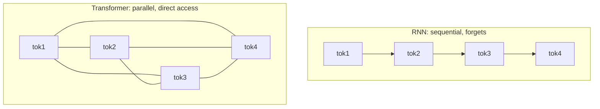
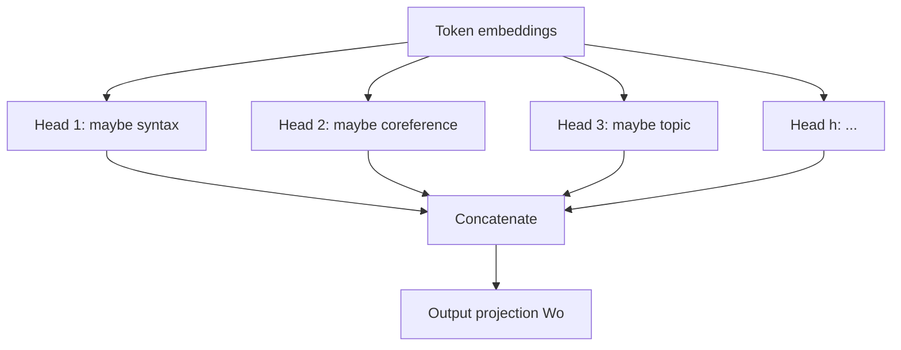
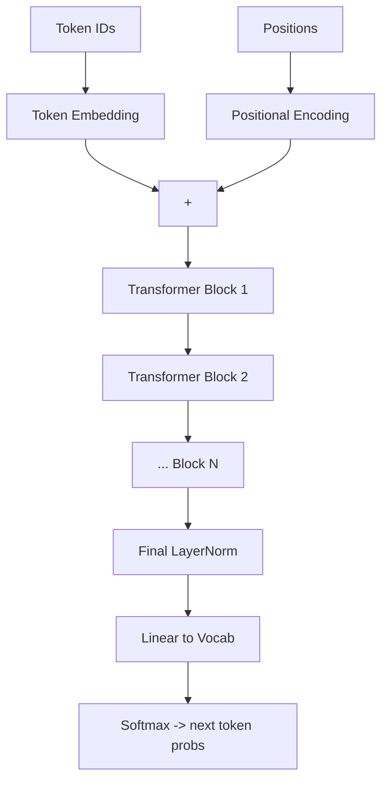

# Chapter 6 — The Transformer from Scratch

> "Attention Is All You Need" (2017) is the most important paper in modern AI. This chapter builds a working transformer — the architecture behind GPT, Claude, Gemini, and LLaMA — from the ground up. If you internalize one chapter in this book, make it this one.

By the end you will have a small GPT you can train on text, and you'll understand every line. This directly proves **trait #2** (transformers from first principles) from Chapter 1.

---

## 6.1 The problem transformers solved

Before transformers, sequence models were **RNNs/LSTMs**: they processed tokens one at a time, carrying a hidden state. Two fatal weaknesses:

1. **Sequential → slow.** You can't parallelize across time; token *t* needs token *t−1*'s state. Training on GPUs (which love parallelism) was inefficient.
2. **Long-range forgetting.** Information from 500 tokens ago had to survive 500 sequential updates; it decayed.

The transformer's insight: **let every token directly attend to every other token, all at once.** This is fully parallelizable (great for GPUs) and gives any token direct access to any other (no decay). The cost is the O(n²) we met in Chapter 4 — but that tradeoff changed the world.



---

## 6.2 Self-attention — the core mechanism

The idea in one sentence: **each token asks a question (query), every token offers a label (key), and we retrieve a weighted blend of their content (values) based on how well keys match the query.**

### Queries, Keys, Values

For each token embedding `x`, we produce three vectors via learned projections:

- **Query (Q):** "what am I looking for?"
- **Key (K):** "what do I contain / advertise?"
- **Value (V):** "what information do I carry?"

The analogy: a **database lookup**. Your query is matched against all keys (by dot product = similarity), the matches become weights (softmax), and you retrieve a weighted sum of values. The difference from a real database: it's *soft* — you retrieve a blend, not one row.

### The formula

$$\text{Attention}(Q, K, V) = \text{softmax}\!\left(\frac{QK^\top}{\sqrt{d_k}}\right)V$$

Let's earn every symbol:

1. `QKᵀ` — dot product of every query with every key → an `(n × n)` matrix of raw attention scores ("how relevant is token *j* to token *i*").
2. `/ √dₖ` — **scaling**. Without it, for large `dₖ` the dot products grow large, pushing softmax into saturated regions where gradients vanish. Dividing by `√dₖ` keeps the variance ~1. *This is the "scaled" in "scaled dot-product attention" and a favorite interview question.*
3. `softmax(...)` — turn scores into weights that sum to 1 per row.
4. `... V` — weighted sum of value vectors → the output for each token.

### Implementation

```python
import numpy as np

def softmax(x):
    x = x - x.max(axis=-1, keepdims=True)
    e = np.exp(x)
    return e / e.sum(axis=-1, keepdims=True)

def self_attention(X, Wq, Wk, Wv):
    Q = X @ Wq            # (n, d_k) — queries
    K = X @ Wk            # (n, d_k) — keys
    V = X @ Wv            # (n, d_v) — values
    d_k = Q.shape[-1]
    scores = Q @ K.T / np.sqrt(d_k)        # (n, n) scaled scores
    weights = softmax(scores)              # (n, n) each row sums to 1
    return weights @ V                     # (n, d_v) blended output

n, d_model, d_k = 4, 8, 8
X = np.random.randn(n, d_model)            # 4 tokens, each an 8-dim embedding
Wq = np.random.randn(d_model, d_k)
Wk = np.random.randn(d_model, d_k)
Wv = np.random.randn(d_model, d_k)
out = self_attention(X, Wq, Wk, Wv)
print(out.shape)                           # (4, 8)
```

> **Why this is revolutionary:** the word "bank" in "river bank" vs "savings bank" gets *different* representations because it attends to different context words. Attention is how transformers do **context-dependent meaning** — the foundation of their language ability.

---

## 6.3 Causal masking — don't peek at the future

For a language model that predicts the *next* token, token *i* must only attend to tokens `≤ i`. If it could see future tokens, it would "cheat" during training and be useless at generation (where the future doesn't exist yet). We enforce this by setting future scores to `−∞` before softmax (so they become 0 weight).

```python
def causal_self_attention(X, Wq, Wk, Wv):
    Q, K, V = X @ Wq, X @ Wk, X @ Wv
    d_k = Q.shape[-1]
    scores = Q @ K.T / np.sqrt(d_k)
    n = X.shape[0]
    mask = np.triu(np.ones((n, n)), k=1).astype(bool)   # upper triangle = future
    scores[mask] = -np.inf                              # block attention to the future
    weights = softmax(scores)
    return weights @ V
```

> **This single mask is the difference between a "decoder" (GPT-style, generates text) and an "encoder" (BERT-style, sees the whole sequence for understanding).** GPT, Claude, LLaMA are decoder-only with causal masking. Knowing this distinction cold is table stakes.

---

## 6.4 Multi-Head Attention — many perspectives at once

One attention operation learns *one* kind of relationship. Real language has many simultaneously: syntax, coreference, topic, tense. **Multi-head attention runs several attention operations ("heads") in parallel**, each with its own Q/K/V projections, then concatenates and mixes their outputs. Each head can specialize.



```python
def multi_head_attention(X, Wq, Wk, Wv, Wo, num_heads):
    n, d_model = X.shape
    d_head = d_model // num_heads          # split dimensions across heads
    Q, K, V = X @ Wq, X @ Wk, X @ Wv       # (n, d_model)

    def split(M):                          # (n, d_model) -> (heads, n, d_head)
        return M.reshape(n, num_heads, d_head).transpose(1, 0, 2)

    Qh, Kh, Vh = split(Q), split(K), split(V)
    outputs = []
    mask = np.triu(np.ones((n, n)), k=1).astype(bool)
    for h in range(num_heads):
        scores = Qh[h] @ Kh[h].T / np.sqrt(d_head)
        scores[mask] = -np.inf
        outputs.append(softmax(scores) @ Vh[h])
    concat = np.concatenate(outputs, axis=-1)   # (n, d_model)
    return concat @ Wo                          # final mix across heads
```

> **Real-world:** Researchers have found heads that track subject-verb agreement, heads that point to the previous occurrence of a token ("induction heads" — central to in-context learning), and more. Mechanistic interpretability (a big research area at Anthropic) studies exactly these specialized heads. Multi-head attention isn't just an engineering trick; it's where a lot of the model's reasoning machinery lives.

---

## 6.5 Positional encoding — putting order back in

Attention is **permutation-invariant**: it treats input as a *set*, not a *sequence*. "Dog bites man" and "man bites dog" would look identical. We must inject position information.

The original paper used **sinusoidal** encodings — fixed sine/cosine waves of different frequencies added to embeddings:

```python
def sinusoidal_positional_encoding(seq_len, d_model):
    pos = np.arange(seq_len)[:, None]
    i = np.arange(d_model)[None, :]
    angle = pos / np.power(10000, (2 * (i // 2)) / d_model)
    pe = np.zeros((seq_len, d_model))
    pe[:, 0::2] = np.sin(angle[:, 0::2])    # even dims: sine
    pe[:, 1::2] = np.cos(angle[:, 1::2])    # odd dims: cosine
    return pe
```

> **Why sinusoids?** Different frequencies let the model represent position at multiple scales, and the linear relationship between `sin/cos` of nearby positions lets it learn *relative* offsets. Modern LLMs (LLaMA, etc.) instead use **RoPE** (Rotary Position Embedding), which rotates Q and K by position-dependent angles and generalizes better to longer sequences — covered in depth in Chapter 7. For now, the key idea: *attention needs help knowing order, and positional encoding provides it.*

---

## 6.6 The full transformer block

A transformer block wraps attention and a feed-forward network (FFN), each with a **residual connection** (Chapter 5 — the gradient highway) and **layer normalization** (keeps activations well-scaled). The FFN is a small MLP applied to each token independently — it's where much of the model's "knowledge" is stored.

```python
def layer_norm(x, gamma, beta, eps=1e-5):
    mu = x.mean(axis=-1, keepdims=True)
    var = x.var(axis=-1, keepdims=True)
    return gamma * (x - mu) / np.sqrt(var + eps) + beta   # normalize, then rescale

def gelu(x):                                   # smooth activation used in transformers
    return 0.5 * x * (1 + np.tanh(np.sqrt(2/np.pi) * (x + 0.044715 * x**3)))

def transformer_block(x, params, num_heads):
    # Pre-norm (modern style): normalize BEFORE the sublayer, add residual after.
    h = layer_norm(x, params['ln1_g'], params['ln1_b'])
    x = x + multi_head_attention(h, params['Wq'], params['Wk'],
                                 params['Wv'], params['Wo'], num_heads)   # residual
    h = layer_norm(x, params['ln2_g'], params['ln2_b'])
    ff = gelu(h @ params['W1'] + params['b1']) @ params['W2'] + params['b2']   # FFN
    x = x + ff                                                            # residual
    return x
```

> **Pre-norm vs post-norm — a real design decision:** the original paper put LayerNorm *after* the sublayer ("post-norm"). Modern LLMs put it *before* ("pre-norm") because it makes very deep transformers far more stable to train — the residual path stays clean. GPT-2 onward use pre-norm. This is exactly the kind of "why is it built this way?" detail that separates someone who *read about* transformers from someone who *understands* them.

### The FFN: where knowledge lives

The feed-forward network expands to a larger dimension (typically 4×), applies a nonlinearity, then projects back. Recent interpretability work suggests these layers act like **key-value memories** storing factual associations. They contain ~2/3 of a transformer's parameters.

---

## 6.7 Assembling a GPT

Stack the pieces: token embeddings + positional encodings → N transformer blocks → final LayerNorm → a linear projection to vocabulary logits → softmax for next-token probabilities.

```python
def gpt_forward(token_ids, params, num_heads, num_layers):
    # 1. Embed tokens and add positions
    x = params['token_emb'][token_ids]                       # (seq, d_model)
    x = x + sinusoidal_positional_encoding(len(token_ids), x.shape[-1])
    # 2. Pass through the stack of transformer blocks
    for layer in range(num_layers):
        x = transformer_block(x, params['blocks'][layer], num_heads)
    # 3. Final norm + project to vocabulary
    x = layer_norm(x, params['lnf_g'], params['lnf_b'])
    logits = x @ params['head']                              # (seq, vocab_size)
    return logits                                            # softmax(logits[-1]) = next-token dist
```



That's it. **GPT-3 is this exact structure** — just with 96 layers, 96 heads, `d_model=12288`, and 175B parameters trained on hundreds of billions of tokens. Architecturally, your from-scratch model and GPT-3 are siblings. The differences are scale, data, and the refinements in Chapter 7.

---

## 6.8 Generation: turning the model into a writer

To generate text, feed a prompt, take the next-token distribution, **sample** a token, append it, and repeat (autoregressive generation).

```python
def generate(params, prompt_ids, num_heads, num_layers, max_new=50, temperature=1.0):
    ids = list(prompt_ids)
    for _ in range(max_new):
        logits = gpt_forward(np.array(ids), params, num_heads, num_layers)
        next_logits = logits[-1] / temperature      # temperature controls randomness
        probs = softmax(next_logits)
        next_id = np.random.choice(len(probs), p=probs)   # sample from the distribution
        ids.append(int(next_id))
    return ids
```

### Decoding strategies (you must know these)

| Strategy | How | When to use |
|----------|-----|-------------|
| **Greedy** | always pick argmax | deterministic, can be repetitive |
| **Temperature** | scale logits before softmax | <1 = focused/safe, >1 = creative/wild |
| **Top-k** | sample from k most likely | cut off the long tail of garbage |
| **Top-p (nucleus)** | sample from smallest set with cumulative prob ≥ p | adaptive cutoff, very common |
| **Beam search** | track several candidate sequences | translation/structured output |

> **Why temperature matters in production:** a customer-support bot runs at low temperature (≈0.2) for consistent, safe answers; a brainstorming assistant runs hotter (≈0.9) for variety. The `temperature`, `top_p`, and `top_k` knobs in every LLM API are *exactly* these. Now you know precisely what they do to the logits.

---

## 6.9 From your toy to the real thing: nanoGPT

Your NumPy version teaches the concepts; to actually *train* efficiently you'll use PyTorch with autograd and a GPU. **Karpathy's `nanoGPT`** (~300 lines) is the canonical reference implementation and your recommended next step. It's the same architecture you just built, in trainable PyTorch. Reproducing and modifying it is a superb portfolio project.

```python
# The PyTorch version of attention is remarkably close to your NumPy version:
import torch, torch.nn.functional as F

def attention_torch(q, k, v, causal=True):
    # q,k,v: (batch, heads, seq, d_head)
    d_k = q.size(-1)
    scores = q @ k.transpose(-2, -1) / (d_k ** 0.5)
    if causal:
        n = q.size(-2)
        mask = torch.triu(torch.ones(n, n, device=q.device), diagonal=1).bool()
        scores = scores.masked_fill(mask, float('-inf'))
    return F.softmax(scores, dim=-1) @ v
# In production you'd call F.scaled_dot_product_attention, which dispatches to FlashAttention (Ch.15).
```

---

## 6.10 Capstone: train your own GPT

Targets:
1. Implement a character-level GPT in PyTorch (port this chapter; or start from `nanoGPT`).
2. Train it on a small corpus (TinyShakespeare is the classic).
3. Generate text and watch it go from gibberish → words → Shakespeare-ish.
4. Experiment: vary layers/heads/`d_model`; plot loss vs model size (a baby scaling law — preview of Chapter 8).

Artifact: *"I built and trained a GPT from scratch; here's what each component does and what I learned tuning it."* This is one of the strongest entry-level portfolio pieces you can have.

---

## Interview signal

- **Q: "Walk me through scaled dot-product attention."** → Q·Kᵀ similarity, scale by √dₖ (prevents softmax saturation), softmax to weights, weighted sum of V.
- **Q: "Why divide by √dₖ?"** → Keeps dot-product variance ~1 so softmax gradients don't vanish at large dₖ.
- **Q: "Why multiple heads?"** → Each head learns a different relation (syntax, coreference, induction); concatenation combines them.
- **Q: "Encoder vs decoder?"** → Decoder uses causal masking (no future peeking) for generation; encoder is bidirectional for understanding.
- **Q: "Why residual + LayerNorm in every block?"** → Residuals give a gradient highway (train deep nets); LayerNorm keeps activations scaled; pre-norm improves stability.
- **Q: "Why do transformers need positional encoding?"** → Attention is permutation-invariant; without positions it can't tell word order.

---

> **▶ Run it live:** [`notebooks/06-attention-heatmaps.ipynb`](../notebooks/06-attention-heatmaps.ipynb) visualizes real **attention heatmaps** — token-identity attention, the causal mask, and per-head differences. (NumPy + matplotlib only.)

## Exercises

1. Implement scaled dot-product attention in NumPy; verify each attention row sums to 1.
2. Add causal masking and confirm token *i* has zero weight on tokens > *i*.
3. Implement multi-head attention and verify output shape equals the single-head `d_model`.
4. Build the full block (pre-norm + residual + FFN) and stack N of them.
5. Port to PyTorch, train a char-level GPT on TinyShakespeare, and generate samples.
6. Ablate: remove the `√dₖ` scaling and observe training instability — feel *why* it's there.

## Key takeaways

- Attention lets every token directly attend to every other — parallel (GPU-friendly) and no long-range decay, at O(n²) cost.
- Scaled dot-product attention = softmax(QKᵀ/√dₖ)V; the √dₖ prevents softmax saturation.
- Causal masking makes a decoder (GPT); multi-head attention learns many relations at once.
- A transformer block = pre-norm + attention + residual, then pre-norm + FFN + residual; the FFN holds most parameters/knowledge.
- A GPT is just embeddings → N blocks → norm → vocab projection; GPT-3 is this at scale.
- Decoding (greedy/temperature/top-k/top-p) is how the model becomes a writer; those are the API knobs you already know.

**Next:** [Chapter 7 — LLM Architecture Deep Dive](../part-3-llm-stack/07-llm-architecture.md)
