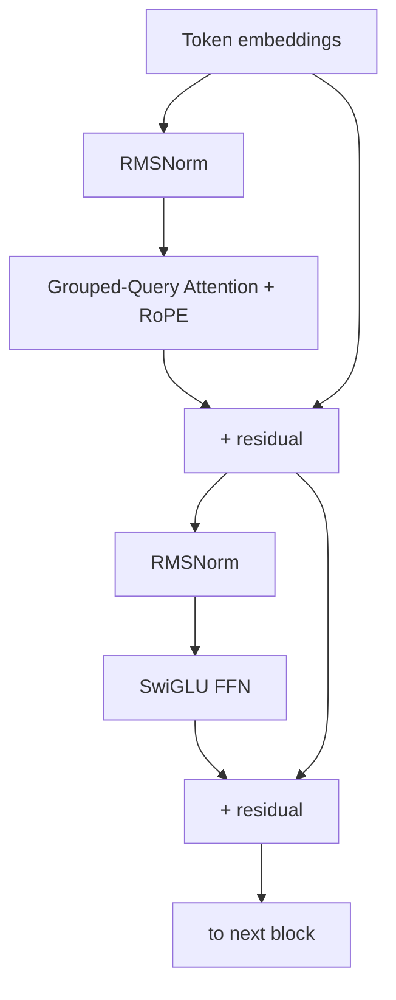
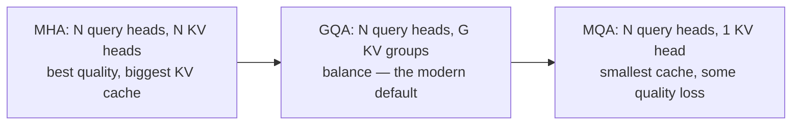
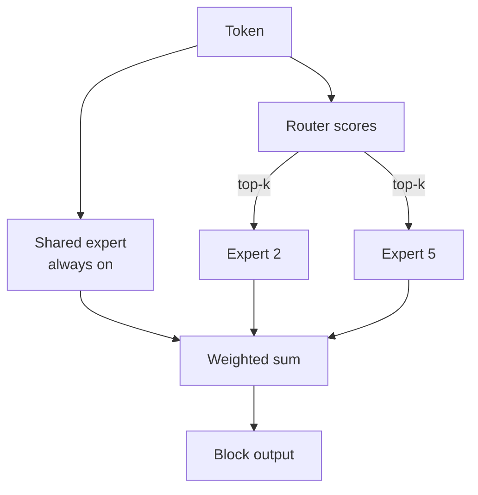
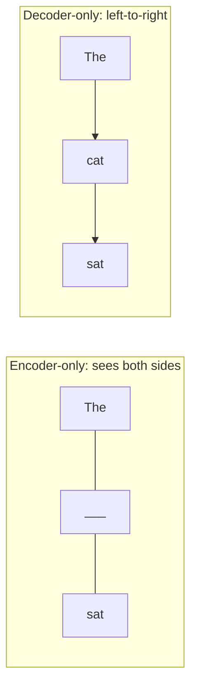
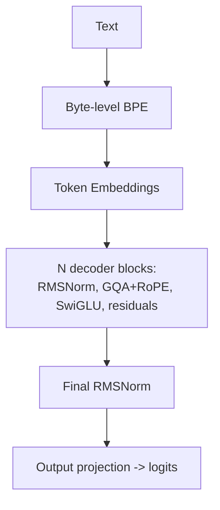

# Chapter 7 — LLM Architecture Deep Dive

> Your from-scratch GPT (Chapter 6) is the 2019 design. Modern LLMs — LLaMA, Mistral, Qwen, Gemma — add a handful of refinements that massively improve quality, stability, speed, and context length. This chapter is those refinements, each explained from first principles with the problem it solves.

Knowing these by name *and by motivation* is exactly what separates "I took an LLM course" from "I understand how Llama 3 is built." Every one is a common interview topic.

---

## 7.1 The modern decoder block at a glance



Compared to vanilla GPT, the upgrades are: **RMSNorm** (not LayerNorm), **RoPE** (not absolute positional encoding), **Grouped-Query Attention** (not plain multi-head), and **SwiGLU** (not GELU MLP). Let's take each in turn.

---

## 7.2 Tokenization — how text becomes numbers

Before any architecture, text must become integers. This is **tokenization**, and it's more consequential than beginners expect.

### Why not just use words or characters?

- **Words:** vocabulary explodes (millions), can't handle typos/new words ("out-of-vocabulary").
- **Characters:** tiny vocab, but sequences become very long → expensive (remember O(n²)), and the model must learn spelling from scratch.

**Subword tokenization** is the sweet spot: common words stay whole, rare words split into pieces. "tokenization" → `["token", "ization"]`. New/rare words are always representable as a sequence of subwords.

### Byte-Pair Encoding (BPE) — the dominant algorithm

BPE starts from bytes/characters and **greedily merges the most frequent adjacent pair**, repeatedly, until it reaches the target vocab size. Used by GPT, LLaMA, and most modern models.

```python
from collections import Counter

def byte_pair_merge(tokens, num_merges):
    """Minimal BPE: repeatedly merge the most frequent adjacent pair."""
    tokens = list(tokens)
    merges = []
    for _ in range(num_merges):
        pairs = Counter(zip(tokens, tokens[1:]))   # count adjacent pairs
        if not pairs:
            break
        best = max(pairs, key=pairs.get)           # most frequent pair
        merges.append(best)
        # merge every occurrence of `best` into one token
        new_tokens, i = [], 0
        while i < len(tokens):
            if i < len(tokens) - 1 and (tokens[i], tokens[i+1]) == best:
                new_tokens.append(tokens[i] + tokens[i+1])
                i += 2
            else:
                new_tokens.append(tokens[i]); i += 1
        tokens = new_tokens
    return tokens, merges

text = list("low lower lowest")
result, merges = byte_pair_merge(text, num_merges=5)
print(merges)        # watch 'l','o' merge, then 'lo','w', etc.
```

> **Real-world impact of tokenization:**
> - **Cost & context.** APIs bill per *token*, and context windows are measured in tokens. Efficient tokenization = more text per dollar and per context window.
> - **The "strawberry" problem.** LLMs struggle to count letters in words because they see *tokens*, not characters — "strawberry" might be 2–3 tokens, so the model literally can't "see" individual r's. This famous failure is a *tokenization* artifact, not a reasoning failure.
> - **Non-English penalty.** Many tokenizers were trained mostly on English, so other languages use *more* tokens for the same meaning — making them slower and costlier. A real fairness/efficiency issue.
> - **Numbers & code.** How digits and whitespace are tokenized affects arithmetic and coding ability. Llama and others special-case digit tokenization for this reason.

Modern implementations use **byte-level BPE** (operate on raw bytes, so *any* input is representable) via fast Rust libraries (HF `tokenizers`, OpenAI `tiktoken`).

---

## 7.3 RoPE — Rotary Position Embedding

**Problem with absolute positional encodings (Chapter 6):** they assign a fixed vector to "position 5." But what matters for language is usually *relative* distance ("the adjective two words before the noun"), and absolute encodings generalize poorly beyond the training length.

**RoPE's idea:** instead of *adding* position vectors, **rotate** each query and key by an angle proportional to its position. When you then take the dot product `q·k`, the result depends only on the *relative* offset between positions — exactly what language needs.

```python
import numpy as np

def apply_rope(x, positions, base=10000):
    """Rotate pairs of dimensions by position-dependent angles."""
    d = x.shape[-1]
    freqs = 1.0 / (base ** (np.arange(0, d, 2) / d))     # frequency per dim-pair
    angles = positions[:, None] * freqs[None, :]          # (seq, d/2)
    cos, sin = np.cos(angles), np.sin(angles)
    x1, x2 = x[..., 0::2], x[..., 1::2]                   # even/odd dims as pair components
    # standard 2D rotation applied to each pair
    rot_even = x1 * cos - x2 * sin
    rot_odd  = x1 * sin + x2 * cos
    out = np.empty_like(x)
    out[..., 0::2], out[..., 1::2] = rot_even, rot_odd
    return out
```

> **Why RoPE won:** (1) it encodes *relative* position naturally, which matches how language works; (2) it extends to longer contexts better, and tricks like **NTK-aware scaling / position interpolation** let you stretch a model trained at 4K tokens to 32K+ by adjusting RoPE's base frequency — *this is how "long-context" versions of models are often made*. RoPE is in LLaMA, Mistral, Qwen, Gemma, and most current models. Expect to be asked "how would you extend a model's context length?" — the answer involves RoPE scaling.

---

## 7.4 RMSNorm — cheaper, equally effective normalization

LayerNorm (Chapter 6) subtracts the mean and divides by the standard deviation. **RMSNorm** drops the mean-centering and just divides by the root-mean-square:

$$\text{RMSNorm}(x) = \frac{x}{\sqrt{\frac{1}{d}\sum x_i^2 + \epsilon}} \cdot \gamma$$

```python
def rms_norm(x, gamma, eps=1e-6):
    rms = np.sqrt(np.mean(x**2, axis=-1, keepdims=True) + eps)
    return x / rms * gamma          # no mean subtraction, no bias term
```

> **Why bother?** RMSNorm has fewer operations (no mean, no bias) → it's faster and uses less memory, yet matches LayerNorm's quality empirically. At the scale of training trillions of tokens, shaving operations off a layer that runs *twice per block × 80 blocks × every token* is real money and time. LLaMA, Mistral, Gemma all use RMSNorm. Small idea, big aggregate impact — a recurring theme in LLM engineering.

---

## 7.5 Attention efficiency: MHA → MQA → GQA

This is one of the most-asked architecture topics because it directly trades quality for inference speed/memory.

### The KV cache problem (preview of Chapter 10)

During generation, we cache the Keys and Values of past tokens so we don't recompute them. But this **KV cache grows with sequence length × number of heads × layers** and becomes the dominant memory cost for long contexts. Standard Multi-Head Attention (MHA) stores K and V for *every* head — expensive.

### The spectrum



| Variant | Query heads | KV heads | Tradeoff |
|---------|-------------|----------|----------|
| **MHA** (multi-head) | N | N | Best quality, largest KV cache |
| **MQA** (multi-query) | N | 1 | Tiny KV cache, faster, slight quality drop |
| **GQA** (grouped-query) | N | G (1<G<N) | Sweet spot — near-MHA quality, much smaller cache |

```python
# GQA: multiple query heads SHARE each key/value head.
def grouped_query_attention(Q_heads, K_groups, V_groups, group_size):
    outputs = []
    for h, q in enumerate(Q_heads):
        g = h // group_size               # which KV group this query head uses
        scores = q @ K_groups[g].T / np.sqrt(q.shape[-1])
        outputs.append(softmax_rows(scores) @ V_groups[g])
    return outputs

def softmax_rows(s):
    s = s - s.max(axis=-1, keepdims=True)
    e = np.exp(s); return e / e.sum(axis=-1, keepdims=True)
```

> **Why GQA is everywhere now (LLaMA 2/3, Mistral):** it cuts the KV cache by the grouping factor (e.g., 8×) with almost no quality loss. Smaller KV cache → you can serve longer contexts and more concurrent users on the same GPU → directly lower cost-per-token. This is a textbook example of an architecture choice driven by *inference economics*, not just accuracy. If asked "how would you reduce serving memory?", GQA is a top answer.

### Multi-head Latent Attention (MLA) — compressing the KV cache, not sharing it

GQA/MQA shrink the cache by **sharing** KV heads (fewer of them). **MLA** (DeepSeek-V2/V3) takes a different route: keep all the heads' expressiveness but **cache a single small low-rank "latent" vector** per token, and **reconstruct** the full keys and values on the fly via learned up-projections.

```python
# MLA: cache a compressed latent c (small), expand to per-head K,V when needed.
def mla_cache_and_expand(x_token, W_dkv, W_uk, W_uv):
    c = x_token @ W_dkv          # down-project to a small latent (THIS is cached)
    K = c @ W_uk                 # up-project latent -> keys  (recomputed, not cached)
    V = c @ W_uv                 # up-project latent -> values
    return c, K, V               # store only c; K,V are rebuilt each step
```

> **Why MLA matters:** the cached latent can be *smaller than even MQA's single KV head*, yet because each head still gets its own up-projected K/V, quality matches or beats full MHA — DeepSeek-V2 reports a **~93% KV-cache reduction** vs its dense baseline *while improving* quality, a win GQA/MQA can't claim (they trade a little quality for the savings). The catch is a subtlety with RoPE (you can't rotate a compressed latent cleanly), so MLA splits each head into a **compressed** part plus a small **decoupled RoPE** part that carries position. MLA is a major reason DeepSeek-V3 serves a 600B+-param model cheaply; naming it (and the RoPE-decoupling wrinkle) is strong frontier signal.

---

## 7.6 SwiGLU — the gated feed-forward network

The vanilla FFN is `Linear → GELU → Linear`. **SwiGLU** replaces it with a *gated* variant: one projection produces values, another produces a gate (via the SiLU/Swish activation), and they're multiplied elementwise before the output projection.

```python
def silu(x):
    return x / (1 + np.exp(-x))           # Swish/SiLU: x * sigmoid(x)

def swiglu_ffn(x, W_gate, W_up, W_down):
    gate = silu(x @ W_gate)               # the "gate" controls information flow
    up = x @ W_up                         # the "value"
    return (gate * up) @ W_down           # gated, then project down
```

> **Why gating helps:** the multiplicative gate lets the network *dynamically* control how much each feature passes through — a more expressive function than a fixed nonlinearity. Empirically SwiGLU improves quality at equal parameter count. (To keep parameter count constant despite the extra projection, the hidden dimension is scaled to ~⅔×4.) Used in LLaMA, PaLM, Mistral. The honest origin story — Noam Shazeer's paper concluding "we attribute its success to divine benevolence" — is a fun signal you've read the primary sources.

---

## 7.7 Mixture of Experts (MoE) — scaling parameters without scaling compute

A major frontier technique (Mixtral, GPT-4-class models, DeepSeek, Gemini are reported to use it). Instead of one big FFN, have *many* expert FFNs and a **router** that sends each token to only a few (e.g., 2 of 8). The model has huge *total* parameters but only activates a fraction per token.

```python
def moe_layer(x_token, experts, router_W, top_k=2):
    scores = softmax_rows(x_token @ router_W)          # router picks experts
    top = np.argsort(scores)[-top_k:]                  # top-k experts for this token
    out = np.zeros_like(x_token)
    for e in top:
        out += scores[e] * experts[e](x_token)         # weighted sum of chosen experts
    return out
```

> **Why MoE matters:** it decouples *knowledge capacity* (total params) from *compute cost* (active params). A Mixtral 8×7B has ~47B total parameters but only ~13B active per token — roughly 13B-model speed with much-greater-than-13B quality. The cost is complexity: load balancing across experts, expert-parallel training/serving, and memory to hold all experts. Expect MoE questions if you target frontier-lab roles.

### Routing: token-choice vs expert-choice

The router is the heart of an MoE, and there are two ways to match tokens to experts:

- **Token-choice (top-k):** each *token* picks its top-k experts (the code above). Simple and standard (Mixtral), but the router can **collapse** — sending most tokens to a few favourite experts while others starve.
- **Expert-choice:** each *expert* picks the top-C tokens it wants. This guarantees perfect load balance by construction (every expert gets exactly C tokens), at the cost of some tokens getting many experts and others none.

### Load balancing — the central MoE problem

With token-choice you must actively prevent router collapse. The classic fix is an **auxiliary load-balancing loss** that pushes the fraction of tokens per expert toward uniform:

$$\mathcal{L}_{\text{aux}} = \alpha \cdot N_{\text{experts}} \sum_{e} f_e \cdot p_e$$

where $f_e$ is the fraction of tokens routed to expert $e$ and $p_e$ is the mean router probability for $e$. Minimizing it spreads load evenly.

> **The modern twist — auxiliary-loss-free balancing (DeepSeek-V3):** an aux loss is a *tax on quality* (it fights the router's real preferences). DeepSeek-V3 instead adds a **per-expert bias** to the routing scores that is nudged up for under-used experts and down for over-used ones — balancing load **without** a gradient penalty on the model. It's a clever, much-cited 2024 trick: keep the balance, drop the quality tax.

### Shared + fine-grained experts (DeepSeekMoE)

Two refinements now common at the frontier:

- **Fine-grained experts:** use *many small* experts (e.g., 64) instead of a few big ones, and route to more of them — more combinations of specialists, better specialization per parameter.
- **Shared experts:** a few experts that *every* token always uses, to absorb common/general computation, so the routed experts are free to specialize. DeepSeek combines both.



> **Serving cost of MoE:** the flip side of cheap *compute* is expensive *memory and communication* — you must hold **all** experts in GPU memory and do an **all-to-all** exchange to send tokens to the device that owns their expert (**expert parallelism**, Chapter 14). A **capacity factor** caps tokens per expert; overflow tokens are **dropped** (skip the layer via the residual). So MoE trades memory/bandwidth and routing complexity for parameter scale at fixed FLOPs — the right tradeoff at the frontier, often not worth it at small scale.

---

## 7.8 Multi-Token Prediction (MTP) — predict more than one step ahead

Standard LLMs predict **one** next token per position. **Multi-Token Prediction** adds auxiliary heads (or extra lightweight layers) that predict the **next 2–4 tokens** at once, training the model on a denser signal.

```python
# Instead of one head, attach D heads predicting t+1, t+2, ..., t+D.
def mtp_loss(hidden, heads, targets):          # targets: (D, seq) future tokens
    loss = 0.0
    for d, head in enumerate(heads):           # head d predicts d+1 steps ahead
        logits = head(hidden)
        loss += cross_entropy(logits[:-(d+1)], targets[d][d+1:])
    return loss / len(heads)
```

> **Two wins for one idea:** (1) **better training** — forcing the model to plan several tokens ahead is a richer objective and improved quality in DeepSeek-V3; (2) **faster inference** — those extra heads double as a built-in **draft model** for self-**speculative decoding** (Chapter 10), so the model verifies its own guesses and decodes 1.5–3× faster with identical output. Medusa popularized the inference angle; DeepSeek-V3 used MTP in pretraining. A clean example of an architecture choice paying off at *both* train and serve time.

---

## 7.9 Model families: decoder-only vs encoder-only vs encoder-decoder

Everything above assumes a **decoder-only** stack, but it's one of three lineages — know all three and *why decoder-only won* for general LLMs.

| Family | Attention | Objective | Best at | Examples |
| --- | --- | --- | --- | --- |
| **Encoder-only** | bidirectional | masked LM (fill the blank) | understanding, embeddings, classification | BERT, RoBERTa |
| **Decoder-only** | causal (left-to-right) | next-token (causal LM) | generation, in-context learning | GPT, LLaMA, Claude |
| **Encoder-decoder** | encoder bi + decoder causal + cross-attn | span corruption / seq2seq | translation, summarization | T5, BART |



> **Why decoder-only dominates LLMs:** a single causal next-token objective is **self-supervised on raw text at massive scale**, learns to *generate*, and exhibits **in-context learning** (few-shot from the prompt) — all with the simplest possible architecture, which scales cleanly. Encoder-only models (BERT) can't generate (great for embeddings/retrieval — Chapter 12). Encoder-decoders shine when input and output are distinct sequences (translation) via **cross-attention**, and they persist in some multimodal and seq2seq systems, but for *general* chat/reasoning LLMs the field consolidated on decoder-only. Being able to explain this consolidation — not just name the families — is the signal.

---

## 7.10 Context length — the long-context frontier

Long context (128K, 1M+ tokens) is a major battleground. The obstacles and solutions tie together everything above:

| Obstacle | Why | Solution |
|----------|-----|----------|
| Attention is O(n²) | compute & memory blow up | FlashAttention (Ch.15), sliding-window attention |
| KV cache grows with length | memory dominates | GQA/MQA, KV-cache quantization, PagedAttention (Ch.10) |
| Positions exceed training range | RoPE doesn't extrapolate freely | RoPE scaling / position interpolation |
| Model ignores the middle | "lost in the middle" | better training data, attention tweaks |

> **Real-world:** "lost in the middle" — models recall the beginning and end of a long context far better than the middle — is a known, *measurable* failure. It's why naive "stuff everything into the prompt" RAG underperforms thoughtful retrieval and reranking (Chapter 12). Long context is not a solved problem; understanding *why* is valuable.

---

## 7.11 Putting it together: anatomy of a modern model

A LLaMA-style model = byte-level BPE tokenizer → token embeddings → N × (RMSNorm → GQA-with-RoPE → residual → RMSNorm → SwiGLU → residual) → final RMSNorm → tied output projection → logits. You now understand *every* component and, crucially, *why each replaced its predecessor*.



---

## Interview signal

- **Q: "MHA vs MQA vs GQA — what and why?"** → Number of KV heads; GQA balances quality and KV-cache size; chosen for inference economics. Top answer for "reduce serving memory."
- **Q: "Why RoPE over absolute positions?"** → Encodes relative position; extends to longer context via scaling/interpolation — the mechanism behind long-context model variants.
- **Q: "Why RMSNorm over LayerNorm?"** → Fewer ops (no mean/bias), same quality; aggregate speed/memory win at scale.
- **Q: "What is MoE and its main challenge?"** → Many experts, route to top-k; decouples capacity from compute; challenge is load balancing (aux loss, or DeepSeek's aux-loss-free bias).
- **Q: "Token-choice vs expert-choice routing?"** → Tokens pick experts (simple, can collapse) vs experts pick tokens (balanced, some tokens unserved).
- **Q: "What is MLA and why use it over GQA?"** → Cache one small low-rank latent per token, up-project to per-head K/V; smaller cache than MQA *and* MHA-level quality; needs a decoupled RoPE part.
- **Q: "What is Multi-Token Prediction?"** → Extra heads predict several future tokens; denser training signal *and* a built-in self-speculative draft for faster decoding.
- **Q: "Decoder-only vs encoder-only vs encoder-decoder?"** → Causal-generation vs bidirectional-understanding vs seq2seq-with-cross-attention; decoder-only won general LLMs via simple scalable next-token + in-context learning.
- **Q: "Why can't LLMs count letters in 'strawberry'?"** → Tokenization — they see tokens, not characters.
- **Q: "How would you extend a model's context window?"** → RoPE scaling/position interpolation + FlashAttention + GQA/KV-cache management, then fine-tune.

---

## Exercises

1. Implement BPE training on a small corpus; tokenize new words and observe subword splits. Count tokens for the same sentence in English vs another language.
2. Implement RoPE and verify that the attention score between positions depends only on their *difference*.
3. Implement RMSNorm and benchmark it against LayerNorm; confirm comparable output, fewer ops.
4. Implement GQA and measure KV-cache memory vs MHA at several group sizes.
5. Implement a toy MoE with a router and 4 experts; add a load-balancing loss and watch expert utilization even out. Then add a **shared expert** and an **aux-loss-free bias** update, and compare expert balance.
6. Implement an **MLA** block: down-project to a latent, cache only the latent, up-project to per-head K/V; compare cached bytes/token vs MHA and GQA.
7. Add two **Multi-Token Prediction** heads to a tiny model; verify the extra heads predict t+1 and t+2 and that the main next-token loss is unaffected.

## Key takeaways

- Modern LLMs upgrade vanilla GPT with RMSNorm, RoPE, GQA, and SwiGLU — each solves a concrete problem.
- Tokenization (byte-level BPE) drives cost, context, multilingual fairness, and quirks like the "strawberry" problem.
- RoPE encodes relative position and enables long-context extension via scaling.
- GQA trades a sliver of quality for a much smaller KV cache — an inference-economics decision.
- MoE decouples total capacity from per-token compute; its challenge is load balancing (aux loss, or aux-loss-free bias), with shared/fine-grained experts and expert parallelism at the frontier.
- MLA compresses the KV cache to a low-rank latent (smaller than MQA, MHA-level quality) at the cost of a RoPE-decoupling wrinkle.
- Multi-Token Prediction densifies the training signal and doubles as a self-speculative draft for faster decoding.
- Decoder-only won general LLMs (simple, scalable next-token + in-context learning); encoder-only owns embeddings, encoder-decoder owns seq2seq.
- Long context is bottlenecked by O(n²) attention and KV-cache growth — the through-line to Chapters 10 and 15.

**Next:** [Chapter 8 — Pretraining & Scaling Laws](08-pretraining.md)
