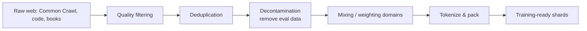
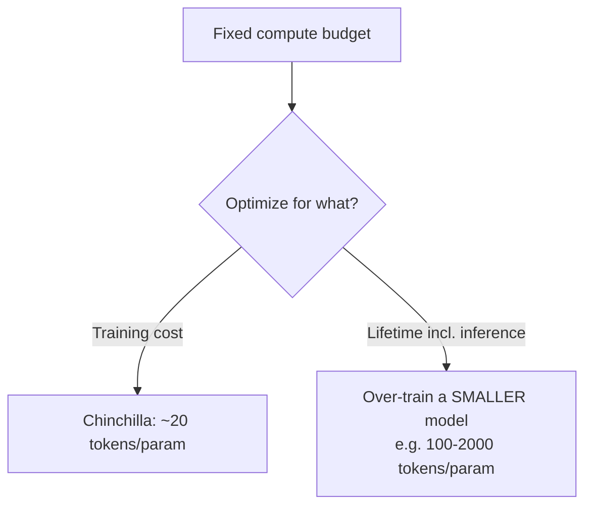

# Chapter 8 — Pretraining & Scaling Laws

> Pretraining is where a model learns *everything it knows* — grammar, facts, reasoning patterns, code — by predicting the next token over trillions of words. It's also where the money goes: a frontier pretraining run can cost tens to hundreds of millions of dollars. Understanding it is understanding what an LLM fundamentally *is*.

This chapter covers the objective, the data, the scaling laws that tell you how to spend compute, and the engineering (mixed precision, checkpointing) that makes giant runs survivable.

---

## 8.1 What pretraining actually is

The objective is breathtakingly simple: **predict the next token.** Given "The capital of France is", maximize the probability of "Paris". Do this over a huge, diverse corpus, and the model is forced to learn syntax, facts, translation, arithmetic, and reasoning — because all of those help predict the next token.

$$\mathcal{L}_{\text{pretrain}} = -\sum_{t} \log P_\theta(x_t \mid x_{<t})$$

This is the **cross-entropy / negative log-likelihood** from Chapter 2, applied autoregressively (Chapter 6). That's the entire training objective of GPT, Claude, and LLaMA's base models.

> **The profound idea (worth internalizing):** *next-token prediction at scale is enough to induce general capabilities.* To predict the next token in a murder-mystery's final sentence, a model benefits from tracking characters, motives, and clues — i.e., a crude world model. "It's just predicting the next word" undersells what that task *requires* at scale. This is the empirical bet the whole field is built on.

```python
# Pretraining loss in PyTorch is just shifted cross-entropy:
import torch.nn.functional as F

def pretrain_loss(logits, input_ids):
    # Predict token t+1 from everything up to t -> shift by one.
    shift_logits = logits[:, :-1, :].reshape(-1, logits.size(-1))
    shift_labels = input_ids[:, 1:].reshape(-1)
    return F.cross_entropy(shift_logits, shift_labels)
```

---

## 8.2 Data — the real moat

Architecture is largely commoditized; **data quality is where models are won or lost.** A pretraining corpus is assembled and cleaned through a brutal pipeline:



| Stage | What & why |
|-------|-----------|
| **Quality filtering** | Remove spam, boilerplate, gibberish. Classifiers/heuristics keep "human-like, useful" text. Garbage in → garbage out. |
| **Deduplication** | Duplicate text wastes compute and causes memorization. Near-dedup (MinHash/LSH) removes near-copies. Big quality lever. |
| **Decontamination** | Remove anything overlapping with eval benchmarks, or your scores are fraudulent (the model just memorized the test). |
| **Mixing** | Weight domains (web, code, math, books, multilingual). More code/math → better reasoning. This recipe is closely guarded. |
| **Packing** | Concatenate documents into fixed-length sequences so no compute is wasted on padding. |

> **Real-world impact:** The leap in open models (e.g., the FineWeb / RefinedWeb line of work) came largely from *better data pipelines*, not new architectures. Adding more high-quality **code** to pretraining famously improves *general reasoning*, not just coding — a striking, much-cited result. When people say "data is the moat," this is what they mean.

> **Security & ethics note:** pretraining data raises real issues — copyright, PII, and the risk of training on poisoned/backdoored web data. A responsible engineer treats data provenance, consent, and contamination as first-class concerns, not afterthoughts.

---

## 8.3 Scaling laws — the equations that guide billion-dollar bets

This is one of the most important practical topics for anyone training models. Scaling laws describe how loss improves *predictably* as you increase **parameters (N)**, **data (D)**, and **compute (C)**.

### The key finding

Test loss falls as a **power law**: plot loss vs compute on log-log axes and you get a straight line. This means you can train small models, fit the line, and **extrapolate** how a far larger model will perform — *before* spending the money. Frontier labs use exactly this to de-risk huge runs.

$$L(N) \approx L_\infty + \left(\frac{N_c}{N}\right)^{\alpha}$$

### Chinchilla — the result you must know

The 2022 **Chinchilla** paper (DeepMind) corrected a widespread mistake. Earlier models like GPT-3 (175B params) were **undertrained** — too many parameters, too little data. Chinchilla showed that for a *fixed compute budget*, you should scale parameters and tokens **together**, roughly:

> **~20 training tokens per parameter** is compute-optimal.

A 70B Chinchilla-optimal model (trained on ~1.4T tokens) **beat** the 175B GPT-3 while being smaller and cheaper to run. This reshaped the entire field.

```python
# Chinchilla rule of thumb: pick model size and token count together.
def chinchilla_tokens(num_params: float) -> float:
    return 20 * num_params           # ~20 tokens per parameter (compute-optimal)

print(chinchilla_tokens(7e9))        # 7B params -> ~140B tokens (compute-optimal floor)
```

### The crucial caveat: inference changes the math

Chinchilla optimizes *training* compute. But if you'll serve a model to billions of requests, **inference** cost dominates lifetime cost. So labs deliberately "**over-train**" smaller models far past 20 tokens/param — LLaMA 3 8B saw **~15 trillion** tokens (~1875 tokens/param!) — because a smaller model that's cheap to serve is worth the extra training. 

> **This is a brilliant interview talking point:** "Chinchilla-optimal minimizes *training* compute, but for a model you'll serve a lot, you train a *smaller* model on *far more* data than Chinchilla suggests, trading extra training cost for much lower inference cost over the model's lifetime." Saying this signals you think about total system economics, like a frontier engineer.



### Emergent abilities (and the debate)

Some capabilities (multi-step arithmetic, certain reasoning) appear to "switch on" only past a scale threshold — **emergent abilities**. There's healthy debate about whether emergence is real or a metric artifact (smooth underlying improvement made to look sudden by a harsh pass/fail metric). Knowing *both sides* signals scientific maturity.

---

## 8.4 The engineering of a giant training run

Scaling laws tell you *what* to train; this section is *how to survive it*. (Distributed parallelism gets its own treatment in Chapter 14; here are the run-level essentials.)

### Mixed-precision training

Train in 16-bit to halve memory and roughly double throughput on tensor cores, while keeping a 32-bit master copy of weights for stable updates.

- **bf16** (Chapter 4): same exponent range as fp32 → rarely overflows → usually **no loss scaling needed**. The modern default.
- **fp16**: needs **loss scaling** (multiply the loss before backprop so small gradients don't underflow to zero, then unscale before the update) to avoid vanishing gradients.

```python
# Modern bf16 mixed precision in PyTorch — short and standard:
import torch
scaler = torch.cuda.amp.GradScaler(enabled=False)  # bf16 typically needs no scaler
for batch in dataloader:
    with torch.autocast("cuda", dtype=torch.bfloat16):
        loss = model(batch).loss          # forward in bf16
    loss.backward()                       # grads computed; master weights stay fp32
    optimizer.step(); optimizer.zero_grad()
```

> **Why this is essential, not optional:** mixed precision is the difference between a run fitting on your GPUs or not, and between it taking 1 month or 2. Every large model is trained this way. The bf16-vs-fp16 reasoning (range vs precision) from Chapter 4 is the foundation.

### Gradient checkpointing — trade compute for memory

Activations stored for backprop consume enormous memory. **Gradient (activation) checkpointing** discards most activations in the forward pass and *recomputes* them during backward — saving memory (often enabling much larger models/batches) at ~30% extra compute. A key knob when you're memory-bound.

### Gradient accumulation — simulate a huge batch

Large batches stabilize training, but may not fit in memory. Accumulate gradients over several micro-batches before stepping, simulating a big batch on small hardware.

```python
accum_steps = 8
optimizer.zero_grad()
for i, batch in enumerate(dataloader):
    loss = model(batch).loss / accum_steps      # scale so the sum equals a true average
    loss.backward()                             # gradients ACCUMULATE (don't zero yet)
    if (i + 1) % accum_steps == 0:
        optimizer.step(); optimizer.zero_grad() # step once per 8 micro-batches
```

### Checkpointing & fault tolerance — non-negotiable at scale

With thousands of GPUs running for weeks, hardware *will* fail (Chapter 4). Save model + optimizer + scheduler + RNG state periodically so a crash resumes from the last checkpoint, not from zero. A run without robust checkpointing is one hardware blip away from wasting weeks and millions.

### Stability: the things that kill runs

| Symptom | Likely cause | Fix |
|---------|-------------|-----|
| Loss → `NaN` | fp16 overflow, LR too high, bad data batch | bf16, lower/clip, skip bad shards |
| Loss spike then recovers/diverges | optimizer state, rare data | LR warmup, gradient clipping, z-loss |
| Loss plateaus early | LR too low, dead neurons, bad init | tune schedule, check init |

> **Real-world war stories:** large runs (e.g., the BLOOM and OPT training logbooks, published openly) document constant loss spikes, hardware failures, and manual interventions. Reading those logbooks is one of the best ways to understand what training at scale *actually* feels like — it's far messier than a clean loss curve.

---

## 8.5 The full pretraining pipeline


The output of pretraining is a **base model**: it has vast knowledge but only "autocompletes" — it doesn't follow instructions or behave as an assistant. Turning it into a helpful, harmless assistant is **post-training**, the subject of Chapter 9. 

---

## Interview signal

- **Q: "What's the pretraining objective?"** → Autoregressive next-token prediction = cross-entropy / NLL over a huge corpus.
- **Q: "Explain Chinchilla / compute-optimal scaling."** → ~20 tokens/param for fixed *training* compute; jointly scale N and D; GPT-3 was undertrained.
- **Q: "Then why do modern small models train on 15T tokens?"** → To minimize *lifetime* cost: over-train a smaller model to cut inference cost. Total-economics thinking.
- **Q: "bf16 vs fp16 in training?"** → bf16 = fp32 range, no loss scaling; fp16 needs loss scaling to avoid underflow.
- **Q: "What is gradient checkpointing?"** → Recompute activations in backward to save memory; ~30% more compute for big memory savings.
- **Q: "Why is data quality so important?"** → Architecture is commoditized; dedup/filtering/decontamination and domain mix drive most of the quality gap.
- **Q: "What are emergent abilities and are they real?"** → Capabilities appearing past a scale threshold; debated as possibly a metric artifact — discuss both sides.

---

## Exercises

1. Implement next-token cross-entropy with the correct shift; verify loss drops as a tiny model memorizes a short text.
2. Plot loss vs model size for several tiny models on the same data — observe a baby scaling law (log-log near-linear).
3. Implement gradient accumulation and confirm the effective gradient equals a single large-batch gradient.
4. Implement a simple near-dedup with MinHash on a toy corpus; measure how much data it removes.
5. Compute Chinchilla-optimal tokens for 1B/7B/70B params, then compute the "over-trained" token counts real models used; discuss the tradeoff.

## Key takeaways

- Pretraining = next-token prediction at scale; that single objective induces broad capabilities.
- Data pipelines (filter, dedup, decontaminate, mix) are the real moat — quality beats architecture.
- Scaling laws make loss predictable; Chinchilla says ~20 tokens/param is training-optimal.
- For models you'll *serve*, over-train smaller models — optimize lifetime cost, not just training cost.
- bf16 mixed precision, gradient checkpointing, accumulation, and robust checkpointing are what make giant runs feasible and survivable.
- Pretraining yields a *base* model; making it an assistant is post-training (Chapter 9).

**Next:** [Chapter 9 — Post-training & Alignment](09-alignment.md)
