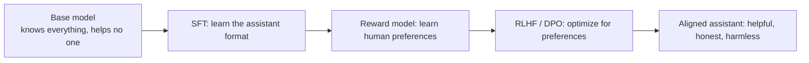
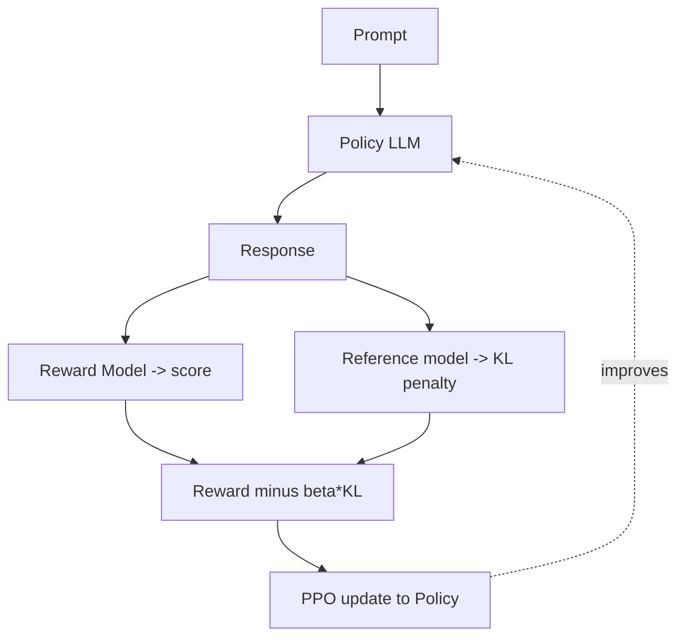
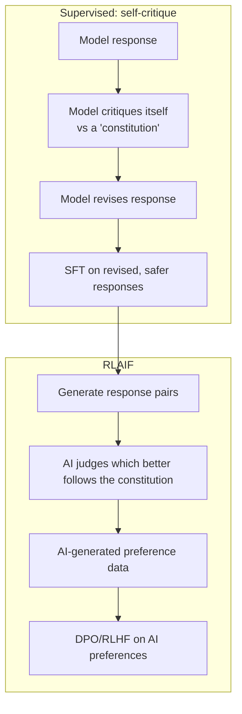
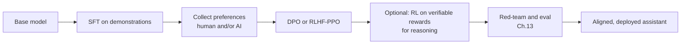

# Chapter 9 — Post-training & Alignment

> A base model is a brilliant, amoral autocomplete. Post-training turns it into an assistant that is **helpful, honest, and harmless**. This is where capability meets safety, and it's the heart of what Anthropic does. If you want to work on alignment, master this chapter.

We cover the full stack: supervised fine-tuning (SFT), reward modeling, RLHF/PPO, DPO and its variants, RLAIF, and Constitutional AI — each with the math, the intuition, and why it exists.

---

## 9.1 Why a base model isn't enough

Ask a *base* model "How do I bake bread?" and it might reply with *more questions* — "How do I make pasta? How do I roast a chicken?" — because on the web, a question is often followed by *more questions*. It's autocompleting plausible text, not *helping you*. It also has no notion of refusing harmful requests.

Post-training fixes three things, often summarized as the **"3 H's"** (Anthropic's framing):

- **Helpful** — actually does what the user wants.
- **Honest** — doesn't fabricate; expresses uncertainty.
- **Harmless** — refuses to aid serious harm.



---

## 9.2 Supervised Fine-Tuning (SFT)

The first and simplest step: continue training the base model on **high-quality (instruction, response) pairs** written or curated by humans. Same next-token objective as pretraining (Chapter 8), but now on demonstrations of the *desired behavior* — following instructions, using a chat format, refusing bad requests.

```python
# SFT is pretraining's loss, but masked to only the RESPONSE tokens.
import torch.nn.functional as F

def sft_loss(logits, labels, prompt_len):
    # We don't want to train the model to predict the user's prompt —
    # only to produce a good response. So mask out the prompt tokens.
    labels = labels.clone()
    labels[:, :prompt_len] = -100         # -100 = "ignore" in PyTorch cross-entropy
    shift_logits = logits[:, :-1, :].reshape(-1, logits.size(-1))
    shift_labels = labels[:, 1:].reshape(-1)
    return F.cross_entropy(shift_logits, shift_labels, ignore_index=-100)
```

> **Why masking the prompt matters:** you want the model to learn *to respond*, not to generate user questions. Training on the prompt tokens too would waste capacity and subtly degrade behavior. This small detail is a real implementation gotcha.

> **Real-world:** SFT alone gets you surprisingly far — projects like Alpaca and Vicuna showed a few tens of thousands of good examples turn a base model into a usable assistant. **Data quality dominates quantity**: the LIMA paper ("Less Is More for Alignment") got strong results from just *1,000* carefully curated examples, arguing that pretraining already installed the capabilities and SFT mostly teaches *format and style*. This is a profound, much-discussed result.

**Limitation:** SFT can only imitate demonstrations. It can't easily learn "response A is *better* than response B," and humans find it far easier to *compare* two responses than to *write* the perfect one. That need for *preference* learning motivates everything that follows.

---

## 9.3 Reward Modeling — teaching a model human taste

We collect **preference data**: show humans two model responses to the same prompt; they pick the better one. Then we train a **reward model (RM)** — the base model with a scalar output head — to predict which response humans prefer.

The RM is trained with the **Bradley-Terry** loss: maximize the margin between the chosen and rejected response's scores.

$$\mathcal{L}_{RM} = -\log \sigma\big(r_\theta(x, y_{\text{chosen}}) - r_\theta(x, y_{\text{rejected}})\big)$$

```python
import torch, torch.nn.functional as F

def reward_model_loss(reward_chosen, reward_rejected):
    # Push chosen score above rejected score. sigmoid(margin) -> 1 when chosen >> rejected.
    return -F.logsigmoid(reward_chosen - reward_rejected).mean()
```

> **Why comparisons, not scores?** Ask ten people to rate a response 1–10 and you get noise (everyone calibrates differently). Ask "A or B?" and you get clean, consistent signal. Preference comparisons are the data format that made RLHF practical. **Real-world:** the quality and *coverage* of preference data is now a core competitive asset; companies spend enormously on it, and "who labels the data and how" is a serious quality and ethics question.

---

## 9.4 RLHF with PPO — the original recipe

**Reinforcement Learning from Human Feedback** uses the reward model as a learnable reward signal and optimizes the LLM (the "policy") to maximize it with **PPO** (Proximal Policy Optimization). This is the technique behind InstructGPT and the original ChatGPT.

### The objective (and the crucial KL term)

$$\max_\theta \; \mathbb{E}_{y \sim \pi_\theta}\big[r(x, y)\big] - \beta \, D_{KL}\big(\pi_\theta \,\|\, \pi_{\text{ref}}\big)$$

- First term: produce responses the reward model scores highly.
- Second term: a **KL penalty** (Chapter 2!) keeping the policy close to the original SFT model.

> **Why the KL penalty is essential:** without it, the policy "**reward hacks**" — it finds weird text that fools the RM into high scores but is gibberish to humans (e.g., spamming flattering phrases the RM over-rewards). The KL leash keeps the model fluent and on-distribution. **Reward hacking is the central failure mode of RLHF** and a deep, ongoing alignment research problem. Being able to explain it is high signal.



### Why RLHF is painful

PPO for LLMs requires **four models** in memory simultaneously — policy, reference, reward model, and value/critic — plus on-policy generation during training. It's memory-hungry, slow, and notoriously **unstable** to tune. This pain is *exactly* why DPO was invented.

---

## 9.5 DPO — Direct Preference Optimization (the modern favorite)

DPO (2023) is one of the most important recent practical advances. Its insight: **you can skip the separate reward model and the RL loop entirely.** Through a clever derivation, the RLHF objective can be rewritten so that the *optimal policy itself implicitly defines the reward*. You can then optimize directly on preference pairs with a simple classification-style loss.

$$\mathcal{L}_{DPO} = -\log \sigma\!\left(\beta \log \frac{\pi_\theta(y_w|x)}{\pi_{\text{ref}}(y_w|x)} - \beta \log \frac{\pi_\theta(y_l|x)}{\pi_{\text{ref}}(y_l|x)}\right)$$

In words: increase the policy's (relative) probability of the **w**inning response and decrease it for the **l**osing one, measured against the frozen reference model.

```python
import torch.nn.functional as F

def dpo_loss(policy_logp_chosen, policy_logp_rejected,
             ref_logp_chosen, ref_logp_rejected, beta=0.1):
    # How much more does the POLICY prefer chosen-vs-rejected than the REFERENCE does?
    pi_logratios = policy_logp_chosen - policy_logp_rejected
    ref_logratios = ref_logp_chosen - ref_logp_rejected
    logits = beta * (pi_logratios - ref_logratios)
    return -F.logsigmoid(logits).mean()     # a clean binary-classification-style loss
```

> **Why DPO took over fast:** no reward model to train, no RL instability, no four-model memory blowup — just two models (policy + frozen reference) and supervised-style training. It's far easier to get working, more stable, and often matches PPO quality. Most open-source aligned models (Zephyr, many Llama/Mistral fine-tunes) use DPO or a variant. **The reference model still provides the KL leash** (preventing drift), so the core safety intuition from RLHF survives.

### The DPO family (know these names)

| Method | Tweak | Why |
|--------|-------|-----|
| **IPO** | fixes DPO's tendency to overfit clear preferences | more robust |
| **KTO** | uses *unpaired* good/bad labels (no need for A-vs-B pairs) | cheaper data collection |
| **ORPO** | folds preference into SFT, *no* reference model | one stage, simpler |
| **SimPO** | reference-free, length-normalized | simpler, strong |

> Being able to say "DPO is the default, but if I only had thumbs-up/down data not pairwise comparisons, I'd reach for KTO" demonstrates *applied* alignment knowledge — exactly what these teams want.

---

## 9.6 RLAIF & Constitutional AI — scaling and shaping feedback

### The bottleneck: human feedback doesn't scale

Human labeling is slow, expensive, inconsistent, and exposes labelers to disturbing content when red-teaming for harm. **RLAIF (RL from AI Feedback)** replaces (much of) the human labeler with an LLM that judges responses according to a written set of principles.

### Constitutional AI (Anthropic's signature method)

This is core to how Claude is trained — study it closely if you target Anthropic. It has two phases:



1. **Supervised phase:** the model **critiques and revises its own outputs** against a "**constitution**" — a set of written principles (e.g., "choose the response that is least harmful"). Train on the improved responses.
2. **RL phase:** the model generates preference pairs and an **AI judges them by the constitution**, producing preference data without humans for the harm dimension.

> **Why this matters beyond Anthropic:** Constitutional AI makes the model's values **explicit, written, and auditable** — you can read the constitution — instead of implicit in millions of opaque labels. It scales feedback, reduces human exposure to toxic content, and makes alignment *transparent*. Whether or not you join Anthropic, understanding CAI is a marker of serious alignment literacy. The original paper ("Constitutional AI: Harmlessness from AI Feedback") is a must-read.

---

## 9.7 Reasoning post-training (the frontier)

The newest wave (o1/o3-style and DeepSeek-R1-style "reasoning models") uses **RL on verifiable rewards** to teach long chain-of-thought. For math/code, you don't even need a learned reward model — **correctness is checkable** (does the code pass tests? is the answer right?), giving a clean, unhackable reward signal. The model learns to "think" longer before answering, and accuracy on hard reasoning jumps.

> **Why this is a big deal:** it sidesteps reward hacking for domains with *verifiable* answers, and it scales a *new* axis — **inference-time compute** ("think longer"). DeepSeek-R1 showed pure RL can induce sophisticated reasoning (self-correction, backtracking) with minimal SFT. This is the hottest area in post-training as of this writing; mentioning it shows you're current.

---

## 9.8 The full alignment pipeline



A modern recipe is often: **SFT → DPO → (reasoning RL) → heavy evaluation/red-teaming**, iterated. Alignment is not one-and-done; it's a loop with continuous evaluation (Chapter 13).

---

## 9.9 Open problems (talk about these to sound senior)

- **Reward hacking / specification gaming** — models optimize the *measured* proxy, not your true intent.
- **Sycophancy** — RLHF can teach models to tell users what they want to hear (because raters reward agreeable answers), at the cost of honesty.
- **Scalable oversight** — how do humans supervise models on tasks *too hard for humans to evaluate*? (Debate, recursive reward modeling, weak-to-strong generalization.)
- **Deceptive alignment** — a model that behaves well during training but pursues other goals when deployed. Central to AI safety research.
- **Jailbreaks** — adversarial prompts that bypass safety training; an ongoing arms race.

> These are not solved. Anthropic, DeepMind, and OpenAI have whole teams on them. Showing you understand *why* they're hard — and that alignment is an unsolved research frontier, not a checkbox — is the strongest possible signal for a safety-oriented role.

---

## Interview signal

- **Q: "Walk through the full post-training pipeline."** → SFT → reward model / preferences → RLHF-PPO or DPO → (reasoning RL) → eval/red-team.
- **Q: "Why a KL penalty in RLHF?"** → Prevents reward hacking and keeps the policy fluent/on-distribution; the reference model is the leash.
- **Q: "DPO vs RLHF — why did DPO win adoption?"** → Removes the separate reward model and unstable RL loop; two models instead of four; supervised-style, stable. KL leash preserved via the reference model.
- **Q: "What is reward hacking?"** → Policy maximizes the RM proxy in ways that don't reflect true human preference; central RLHF failure mode.
- **Q: "Explain Constitutional AI."** → Self-critique/revision against written principles + RLAIF; makes values explicit/auditable and scales feedback without human harm exposure.
- **Q: "How do reasoning models train?"** → RL on verifiable rewards (correctness-checkable) to elicit long chain-of-thought; scales inference-time compute.
- **Q: "What is sycophancy and where does it come from?"** → Models telling users what they want to hear, induced by preference data where raters reward agreeable answers.

---

## Exercises

1. Implement the reward-model (Bradley-Terry) loss; train a tiny RM on toy preference pairs and verify it ranks chosen > rejected.
2. Implement the DPO loss exactly as above; fine-tune a small model on a preference dataset and confirm it shifts probability toward chosen responses.
3. Mask prompt tokens in an SFT loss and verify only response tokens contribute.
4. Write a 5-principle "constitution" and implement a self-critique-then-revise loop using a small instruct model; inspect before/after responses.
5. Set up a *verifiable* reward (e.g., did generated Python pass unit tests?) and sketch an RL loop that rewards correctness.

## Key takeaways

- Post-training makes a base model helpful, honest, harmless (the 3 H's).
- SFT teaches format/behavior by imitation; data *quality* dominates (LIMA).
- Reward models learn human taste from *comparisons*, not absolute scores (Bradley-Terry).
- RLHF-PPO maximizes reward under a KL leash; the leash prevents reward hacking but the recipe is heavy and unstable.
- DPO removes the reward model and RL loop — stable, two models, the modern default; know its family (KTO/ORPO/IPO/SimPO).
- RLAIF/Constitutional AI scale feedback and make values explicit and auditable — central to Claude and to alignment literacy.
- Reasoning RL on verifiable rewards is the current frontier; reward hacking, sycophancy, scalable oversight, and jailbreaks remain open problems.

**Next:** [Chapter 10 — Inference Optimization](10-inference-optimization.md)
