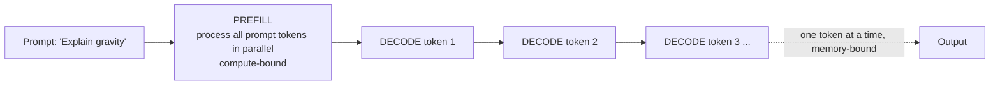
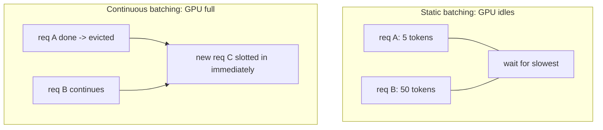
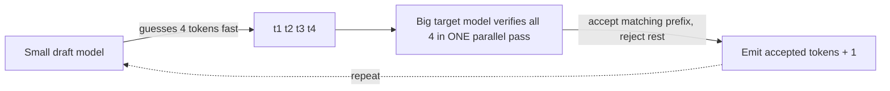
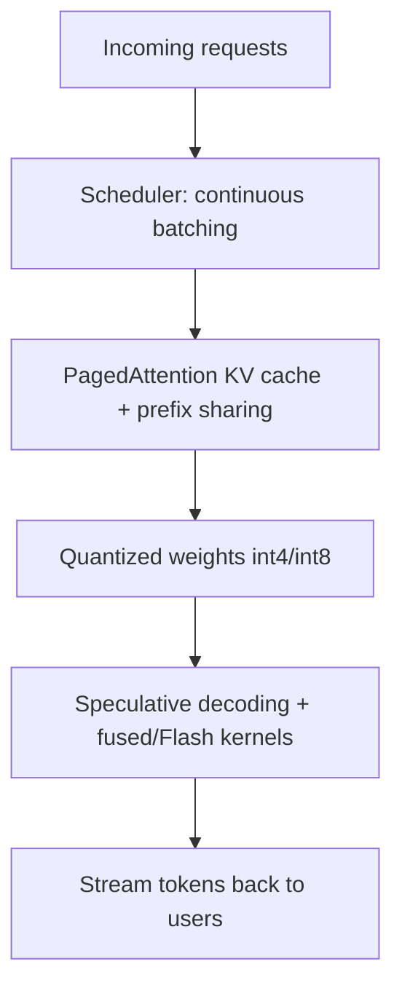

# Chapter 10 — Inference Optimization

> Training happens once; **inference happens billions of times.** For a deployed model, inference is where almost all the compute cost and user-facing latency live. The engineers who can make models serve faster and cheaper are worth their weight in GPUs — this is the core of the "inference/systems" specialization.

This chapter explains *why* LLM inference is slow, then the techniques that fix it: KV caching, batching, quantization, speculative decoding, and the systems (PagedAttention/vLLM) that tie them together.

---

## 10.1 The two phases of LLM inference

Generation has two distinct phases with completely different performance profiles — understanding this split is the foundation of everything else.



1. **Prefill:** process the entire prompt at once. All tokens go through in parallel → big matmuls → **compute-bound** → uses the GPU well.
2. **Decode:** generate output tokens **one at a time**, each depending on the last. Tiny matmuls (one token) but you must read the *entire model's weights* from memory for each token → **memory-bound** → the GPU's compute units sit mostly idle.

> **The single most important inference insight:** decode is *memory-bandwidth-bound*, not compute-bound (recall Chapter 4). You spend your time *moving weights from GPU memory*, not doing math. This one fact explains why **quantization** speeds up decode (smaller weights = less to move), why **batching** is so effective (amortize the weight-loading across many requests), and why a GPU can look "0% busy" while generating slowly. Say this in an interview and you sound like a systems engineer.

---

## 10.2 The KV cache — the foundational optimization

When generating token 100, naïve attention would recompute the Keys and Values for tokens 1–99 every single step. That's enormously wasteful. The **KV cache** stores past Keys and Values so each new token only computes its *own* K and V and attends to the cached rest.

```python
class KVCache:
    """Store past keys/values so we never recompute them during generation."""
    def __init__(self):
        self.k, self.v = None, None

    def update(self, new_k, new_v):
        # Append this token's K,V to the running cache.
        self.k = new_k if self.k is None else torch_cat(self.k, new_k)
        self.v = new_v if self.v is None else torch_cat(self.v, new_v)
        return self.k, self.v

# Without cache: step t recomputes K,V for all t tokens -> O(t^2) total work.
# With cache:    step t computes K,V for ONE token -> O(t) total work. Huge.
```

> **The catch — KV cache is a memory hog.** Its size = `2 (K&V) × layers × kv_heads × head_dim × seq_len × batch × bytes`. For a 70B model with long context and many users, the KV cache can exceed the *model weights* in memory. This is *the* central problem of LLM serving, and it's why:
> - **GQA/MQA** (Chapter 7) exist — fewer KV heads → smaller cache.
> - **KV-cache quantization** (store K/V in int8) exists.
> - **PagedAttention** (below) exists — to stop wasting cache memory.

```python
def kv_cache_bytes(layers, kv_heads, head_dim, seq_len, batch, dtype_bytes=2):
    return 2 * layers * kv_heads * head_dim * seq_len * batch * dtype_bytes

# Llama-3-70B-ish, 8 KV heads (GQA), 8k context, batch 32:
print(kv_cache_bytes(80, 8, 128, 8192, 32) / 1e9, "GB")   # tens of GB just for KV!
```

---

## 10.3 Batching — the throughput multiplier

Since decode is memory-bound (you're loading the weights anyway), processing **many requests together** lets you reuse each weight-load across all of them — dramatically increasing throughput for nearly free.

### Static vs continuous batching

- **Static batching:** wait to collect a batch, run it, return all together. Problem: requests finish at different times; the whole batch waits for the slowest, wasting the GPU.
- **Continuous (in-flight) batching:** the breakthrough. As soon as one request finishes, **immediately slot a new one into the batch** at the token level — the GPU never idles.



> **Real-world impact:** continuous batching (pioneered by Orca, productionized by **vLLM** and TGI) can improve throughput **several-fold** over static batching on real traffic. It's the single biggest serving-throughput win and the default in modern inference servers. If asked "how do you raise serving throughput?", lead with continuous batching.

---

## 10.4 PagedAttention & vLLM — virtual memory for the KV cache

The KV cache traditionally needed a *contiguous* block of memory sized for the *maximum* possible sequence length. Most requests are shorter, so huge chunks were reserved-but-unused — **fragmentation** wasting 60–80% of KV memory.

**PagedAttention** (the idea behind **vLLM**) borrows the operating system's **virtual memory / paging** trick (Chapter 4): split the KV cache into fixed-size **blocks** that don't need to be contiguous, and allocate them on demand via a "block table." 

> **Why it's brilliant:** near-zero memory waste → far more requests fit in the same GPU → higher throughput and longer contexts. It also enables **prefix sharing**: requests with a common prompt prefix (e.g., the same long system prompt) physically *share* those KV blocks — copy-on-write, just like OS process forking. **This is the canonical example in the book of CS fundamentals (OS paging) directly producing a frontier ML systems breakthrough.** vLLM is the most popular open-source inference server largely because of it.

---

## 10.5 Quantization — smaller weights, faster everything

Quantization stores weights (and sometimes activations) in **lower precision** — int8, int4, even lower — instead of 16-bit. Since decode is memory-bound, halving or quartering weight size *directly* speeds it up *and* shrinks the memory footprint so bigger models fit on smaller GPUs.

$$x_{\text{int}} = \text{round}\!\left(\frac{x_{\text{float}}}{s}\right), \qquad s = \frac{\max|x|}{2^{b-1}-1}$$

```python
import numpy as np

def quantize_int8(weights):
    scale = np.abs(weights).max() / 127.0      # map the range into [-127, 127]
    q = np.round(weights / scale).astype(np.int8)
    return q, scale

def dequantize(q, scale):
    return q.astype(np.float32) * scale         # approximate reconstruction

w = np.random.randn(1000).astype(np.float32)
q, s = quantize_int8(w)
err = np.abs(w - dequantize(q, s)).mean()
print(f"int8 mean abs error: {err:.5f}  (memory: 4x smaller)")
```

### The landscape (know the named methods)

| Method | Type | Idea |
|--------|------|------|
| **GPTQ** | weight-only, post-training | layer-wise, error-compensating int4 |
| **AWQ** | weight-only, post-training | protect "salient" weights important to activations |
| **GGUF/llama.cpp** | weight-only | CPU/edge-friendly k-quants |
| **SmoothQuant** | weight+activation | shift quantization difficulty from activations to weights |
| **QLoRA** | quantized base + LoRA | 4-bit frozen base, train adapters (Chapter 11) |

> **Why quantization is everywhere:** it's how a 70B model runs on a single 24GB consumer GPU, how phones run 3B models locally, and how serving costs drop. The tradeoff is small accuracy loss — and the art is minimizing it. **Outliers** are the enemy: a few large-magnitude activation values blow up the quantization range; AWQ and SmoothQuant exist specifically to handle them. Discussing the outlier problem shows real depth.

**Quantization-Aware Training (QAT)** vs **Post-Training Quantization (PTQ):** PTQ quantizes an already-trained model (fast, easy, slight accuracy loss); QAT simulates quantization *during* training so the model adapts (better accuracy, more expensive). PTQ is the common default.

---

## 10.6 Speculative decoding — break the one-token-at-a-time barrier

Decode is slow because it's sequential. **Speculative decoding** uses a small, fast "**draft**" model to *guess* several tokens ahead, then the big "**target**" model **verifies them all in a single parallel forward pass** (cheap, because verification is one prefill-like step). Accepted guesses are free speedups; the math guarantees the output distribution is *identical* to the target model alone.



```python
def speculative_step(draft_model, target_model, context, k=4):
    # 1. Draft model proposes k tokens cheaply and sequentially.
    proposed = draft_model.generate(context, num_tokens=k)
    # 2. Target model scores all k+context in ONE parallel forward pass.
    target_probs = target_model.forward(context + proposed)
    # 3. Accept the longest prefix consistent with the target's distribution.
    accepted = verify_and_accept(proposed, target_probs)   # provably same distribution
    return accepted   # often 2-3x fewer expensive target steps
```

> **Why it's "free" quality:** the acceptance rule (rejection sampling) guarantees the final outputs are distributed *exactly* as if the big model generated them alone — you get **2–3× speedups with zero quality loss**. Variants: **Medusa** (extra heads predict multiple tokens, no separate draft model), **EAGLE**, and **n-gram/prompt lookup** (draft from the prompt itself). A top answer to "how do you cut latency without hurting quality?"

---

## 10.7 Other essential techniques

| Technique | What | Why |
|-----------|------|-----|
| **FlashAttention** | IO-aware exact attention (Ch.15) | faster attention, less memory, no approximation |
| **Operator/kernel fusion** | merge ops into one kernel | fewer memory round-trips (Ch.4 memory-bound!) |
| **CUDA graphs** | record & replay GPU launch sequence | kills per-kernel launch overhead in decode |
| **Tensor parallelism** | split a model across GPUs (Ch.14) | serve models too big for one GPU |
| **Prompt/prefix caching** | reuse KV for shared prefixes | huge win for repeated system prompts/RAG |
| **Disaggregated serving** | run prefill and decode on separate GPUs | each phase gets hardware suited to its profile |

> **Prompt caching is a quiet giant:** if every request shares a 2,000-token system prompt, caching its KV means you pay to process it *once*, not per request. Anthropic and OpenAI expose **prompt caching** in their APIs at a discount for exactly this reason — it's a direct application of the prefix-sharing idea from PagedAttention.

---

## 10.8 Metrics you must speak fluently

| Metric | Meaning | Who cares |
|--------|---------|-----------|
| **TTFT** (time to first token) | latency of prefill | interactive feel; dominated by prompt length |
| **TPOT / ITL** (time per output token) | decode speed | "how fast it types"; memory-bound |
| **Throughput** (tokens/sec, req/sec) | aggregate output | cost efficiency at scale |
| **Goodput** | throughput meeting latency SLAs | the metric that actually matters |

> **The fundamental tension:** bigger batches raise *throughput* (cheaper) but can hurt *per-request latency* (slower TTFT/TPOT). Serving is the art of maximizing throughput *subject to* latency SLAs — i.e., maximizing **goodput**. Framing it this way is exactly how serving engineers think.

---

## 10.9 Putting it together: a modern serving stack



A production server (vLLM, TGI, TensorRT-LLM, SGLang) combines: continuous batching + PagedAttention + quantization + FlashAttention + (often) speculative decoding + prefix caching. Each technique in this chapter is one layer of that stack, and they compound.

---

## Interview signal

- **Q: "Why is LLM decoding slow / memory-bound?"** → Sequential, one token at a time, must reload all weights per token; compute units idle. Prefill is compute-bound, decode is memory-bound.
- **Q: "What does the KV cache store and what's its downside?"** → Past K/V to avoid recompute (O(t²)→O(t)); downside is memory growth with seq_len × batch, often exceeding model size.
- **Q: "Explain PagedAttention."** → OS-style paging for the KV cache: non-contiguous blocks on demand → kills fragmentation, enables prefix sharing → big throughput win (vLLM).
- **Q: "How does quantization speed up inference?"** → Decode is memory-bound; smaller weights = less to move + smaller footprint. Mention outliers (AWQ/SmoothQuant).
- **Q: "How do you cut latency without hurting quality?"** → Speculative decoding (provably identical distribution), prefix caching, FlashAttention.
- **Q: "How do you raise throughput?"** → Continuous batching first, then PagedAttention, quantization, bigger batches within SLA.
- **Q: "TTFT vs TPOT — what affects each?"** → TTFT ~ prefill (prompt length, compute-bound); TPOT ~ decode (memory-bound, model size).

---

## Exercises

1. Implement a KV cache for your Chapter 6 GPT; measure generation speedup vs the no-cache version and confirm identical outputs.
2. Compute KV-cache size for a 7B and 70B model at 4k/32k context; see why GQA matters.
3. Implement int8 weight quantization; measure memory savings and accuracy degradation on a small model.
4. Simulate continuous vs static batching with requests of varying lengths; measure GPU "idle" time.
5. Implement toy speculative decoding with a small draft + large target; measure the acceptance rate and speedup.

## Key takeaways

- Inference has two phases: prefill (compute-bound) and decode (memory-bound, the bottleneck).
- The KV cache turns O(t²) generation into O(t) but becomes the dominant memory cost — driving GQA, KV quantization, and PagedAttention.
- Continuous batching is the biggest throughput win; PagedAttention (OS paging for KV) eliminates fragmentation and enables prefix sharing.
- Quantization (int8/int4; GPTQ/AWQ) speeds memory-bound decode and shrinks footprints; outliers are the challenge.
- Speculative decoding gives 2–3× speedups with provably identical output.
- Serving = maximize goodput: throughput subject to latency SLAs. Production stacks compose all of the above.

**Next:** [Chapter 11 — Fine-tuning: LoRA, QLoRA, PEFT](11-fine-tuning.md)
