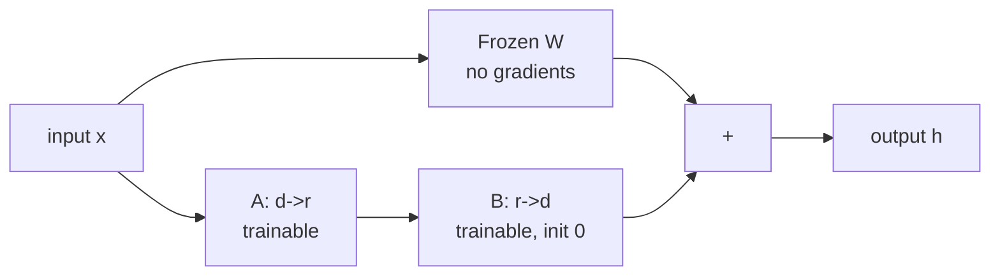
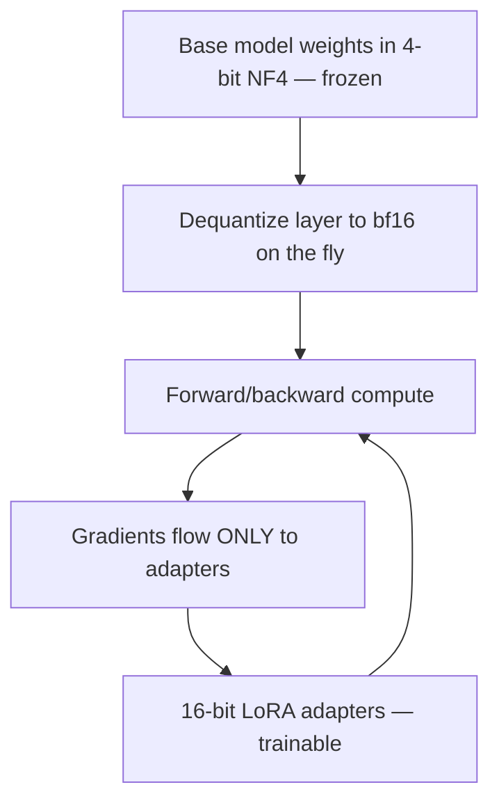
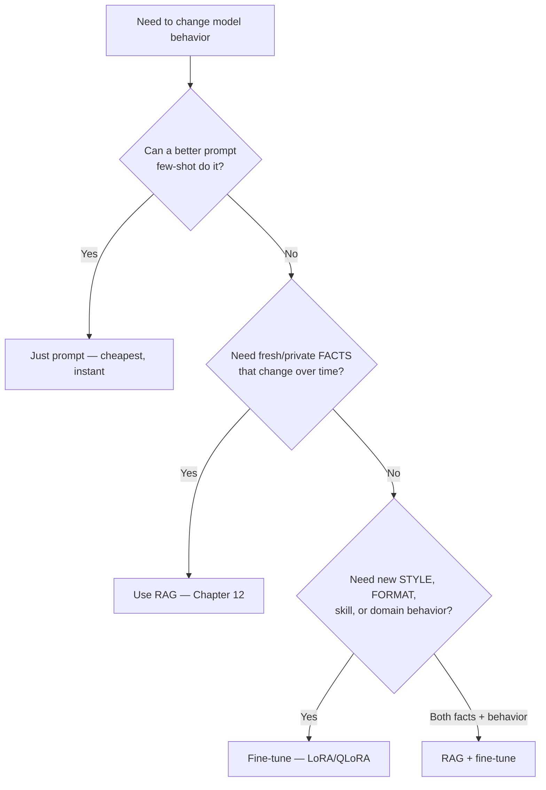

# Chapter 11 — Fine-tuning: LoRA, QLoRA, PEFT

> Fine-tuning a 70B model the naïve way needs ~1TB of GPU memory and a cluster. **Parameter-Efficient Fine-Tuning (PEFT)** lets you adapt that same model on a *single* GPU by training less than 1% of its parameters — with almost no quality loss. This is one of the highest-leverage practical skills in applied AI.

This chapter explains why full fine-tuning is so expensive, then LoRA (the dominant method) from the linear algebra up, QLoRA (which makes it run on consumer hardware), and how to actually use it well.

---

## 11.1 Why not just full fine-tune?

Full fine-tuning updates *every* weight. The memory cost is brutal — and it's dominated by the **optimizer state**, not the weights themselves. With AdamW (Chapter 2), for every parameter you must store:

| Item | Bytes/param (fp16 weights, fp32 optim) |
|------|----------------------------------------|
| Weights | 2 |
| Gradients | 2 |
| Adam momentum (m) | 4 |
| Adam variance (v) | 4 |
| fp32 master weights | 4 |
| **Total** | **~16 bytes/param** |

```python
def full_finetune_memory_gb(num_params, bytes_per_param=16):
    return num_params * bytes_per_param / 1e9

print(full_finetune_memory_gb(7e9))    # ~112 GB just for a 7B model — before activations!
print(full_finetune_memory_gb(70e9))   # ~1.1 TB for 70B
```

> **The takeaway:** a 7B model needs ~112GB *before* activations — already beyond a single 80GB GPU. A 70B needs over a terabyte. Most people and teams simply can't afford full fine-tuning. PEFT exists to break this barrier — and it turns out you usually don't *need* to update every weight anyway.

---

## 11.2 LoRA — Low-Rank Adaptation

LoRA is built on the **low-rank** insight from Chapter 2's SVD. The hypothesis: **the *update* a model needs during fine-tuning is "low rank"** — it lives in a much smaller subspace than the full weight matrix. So instead of learning a full `d×d` update `ΔW`, learn it as the product of two skinny matrices.

### The mechanism

For a frozen weight `W` (shape `d×k`), LoRA adds a trainable update `ΔW = B·A` where `A` is `r×k` and `B` is `d×r`, with **rank `r` tiny** (e.g., 8, 16, 64):

$$h = Wx + \Delta W x = Wx + \frac{\alpha}{r} B A x$$

- `W` stays **frozen** (no gradients, no optimizer state — that's where the savings come from).
- Only `A` and `B` train. Parameters: `r·k + d·r` instead of `d·k` — orders of magnitude fewer.
- `A` is init random (Gaussian), `B` init **zero** → so `ΔW = 0` at the start → training begins exactly at the pretrained model (stable).
- `α/r` is a scaling factor controlling the update's strength.

```python
import numpy as np

class LoRALayer:
    def __init__(self, d_in, d_out, r=8, alpha=16):
        self.W = np.random.randn(d_out, d_in)      # FROZEN pretrained weight
        self.A = np.random.randn(r, d_in) * 0.01   # trainable, small random
        self.B = np.zeros((d_out, r))              # trainable, ZERO -> no-op at start
        self.scale = alpha / r

    def forward(self, x):
        frozen = x @ self.W.T                       # original path (no grad)
        update = (x @ self.A.T) @ self.B.T * self.scale   # low-rank trainable path
        return frozen + update

    def num_trainable(self):
        return self.A.size + self.B.size            # tiny vs self.W.size
```

```python
# Parameter savings for a single 4096x4096 attention projection:
d, r = 4096, 8
full = d * d                       # 16,777,216 params
lora = r * d + d * r               # 65,536 params
print(f"LoRA trains {lora/full*100:.2f}% of the weights")   # 0.39%
```



### Why LoRA is a big deal in practice

> - **Memory:** the frozen base has *no* optimizer state. You only pay AdamW's 16 bytes/param for the *tiny* adapters → a 7B fine-tune drops from ~112GB to something that fits comfortably on one GPU.
> - **Tiny, swappable artifacts:** a LoRA adapter is a few MB, not tens of GB. You can store hundreds of task-specific adapters and **hot-swap** them on top of one shared base model.
> - **Multi-tenant serving:** servers like vLLM/LoRAX serve *thousands* of LoRA adapters over a single base model — one GPU, many customers' custom models. This is how "fine-tuning as a service" is economically possible.
> - **No inference penalty (if merged):** because `ΔW = BA` is just a matrix, you can **merge** it back into `W` (`W' = W + BA`) for deployment → zero extra latency. (Keep it unmerged if you want to hot-swap adapters.)

### The knobs that matter

| Hyperparameter | Effect | Typical |
|----------------|--------|---------|
| **rank `r`** | capacity of the adapter | 8–64 (higher = more capacity, more params) |
| **`alpha`** | update strength (`α/r` scale) | often `2r` |
| **target modules** | which layers get LoRA | attention q/k/v/o; often MLP too |
| **dropout** | regularize the adapter | 0–0.1 |

> **Practical tip worth stating in interviews:** applying LoRA to *more* modules (including the MLP layers, not just attention) often matters more than cranking `r` very high. And there's a quality ceiling — for tasks requiring the model to learn substantial *new knowledge* (vs new *behavior/format*), full fine-tuning or continued pretraining can still win. LoRA shines at adapting *style, format, and task-following*.

---

## 11.3 QLoRA — LoRA on a 4-bit base

QLoRA (2023) combined quantization (Chapter 10) with LoRA to fine-tune a **65B model on a single 48GB GPU** — a watershed for the open-source community. The idea: **freeze the base model in 4-bit, train LoRA adapters in 16-bit on top.**

Three innovations:

1. **4-bit NormalFloat (NF4):** a quantization data type information-theoretically optimal for the (roughly normal) distribution of neural-net weights — better than plain int4.
2. **Double quantization:** quantize the quantization constants too, squeezing out extra memory.
3. **Paged optimizers:** use NVIDIA unified memory to page optimizer state to CPU during memory spikes, preventing OOM crashes.

```python
# Conceptually (real code uses bitsandbytes + peft):
# 1. Load base model weights in 4-bit NF4, frozen.
# 2. Attach 16-bit LoRA adapters to target modules.
# 3. Forward: dequantize a layer's weights to bf16 on the fly, compute, attach LoRA path.
# 4. Backward: gradients flow ONLY into the LoRA adapters; the 4-bit base never updates.
```

> **Why QLoRA mattered so much:** it **democratized** fine-tuning. Before it, adapting a large model required a cluster; after it, a researcher with one gaming GPU could fine-tune a 33B/65B model overnight. A huge fraction of open-source fine-tunes (the entire "local LLM" ecosystem) run on QLoRA. The small accuracy cost of the 4-bit base is usually negligible because the 16-bit adapters compensate. This is the answer to "how would you fine-tune a big model on limited hardware?"



---

## 11.4 The broader PEFT family

LoRA is dominant, but know the landscape — interviewers probe whether you know the alternatives and tradeoffs:

| Method | Idea | Note |
|--------|------|------|
| **LoRA** | low-rank additive update | the default |
| **QLoRA** | LoRA on 4-bit base | best for limited hardware |
| **DoRA** | decompose into magnitude + direction | often beats LoRA at equal params |
| **Prefix/Prompt tuning** | learn soft "virtual tokens" prepended to input | tiny, but usually weaker |
| **(IA)³** | learned scaling vectors on activations | extremely few params |
| **Adapters (Houlsby)** | insert small bottleneck MLPs between layers | the original PEFT; adds inference latency |
| **Full fine-tune** | update everything | max quality, max cost — still wins for big domain shifts |

---

## 11.5 Knowledge distillation — making a small model inherit a big one's skill

PEFT adapts a model in place; **distillation** *compresses* a large, capable **teacher** into a smaller, cheaper **student** that keeps most of its ability. It's how many production "small" models are actually made.

The key idea: don't train the student only on hard labels ("the answer is *cat*"). Train it to match the teacher's **full output distribution** — the soft probabilities over *all* classes/tokens. Those soft targets carry **"dark knowledge"**: a teacher saying "90% cat, 8% dog, 2% fox" tells the student that dog is more cat-like than fox — far richer signal than a one-hot label.

$$\mathcal{L} = (1-\alpha)\underbrace{\text{CE}(y, z_s)}_{\text{hard labels}} + \alpha T^2 \underbrace{\text{KL}\big(\sigma(z_t/T)\,\|\,\sigma(z_s/T)\big)}_{\text{match the teacher}}$$

Temperature $T>1$ *softens* both distributions to expose the relative probabilities of non-target classes; the $T^2$ factor keeps the soft-loss gradient magnitude comparable to the hard loss.

```python
import torch.nn.functional as F

def distillation_loss(student_logits, teacher_logits, labels, T=2.0, alpha=0.5):
    hard = F.cross_entropy(student_logits, labels)                  # ground truth
    soft = F.kl_div(F.log_softmax(student_logits / T, dim=-1),
                    F.softmax(teacher_logits / T, dim=-1),
                    reduction="batchmean") * (T * T)                # match the teacher
    return (1 - alpha) * hard + alpha * soft
```

### Flavours you should know

| Type | What the student matches | Use |
| --- | --- | --- |
| **Response / logit-based** | teacher's output distribution (above) | the classic (DistilBERT) |
| **Feature-based** | teacher's hidden states / attention maps | tighter transfer, needs internals |
| **Sequence-level (hard)** | text the teacher *generates* (synthetic data) | distilling generative/reasoning LLMs |
| **On-policy** | teacher scores the *student's own* samples | reduces train/inference mismatch |

> **Why distillation is everywhere now:** it's how frontier capability reaches small models. **DistilBERT** (40% smaller, ~97% of BERT) was the early proof; today **Gemma 2/3** and **Llama 3.2** ship distilled from larger siblings, and **DeepSeek-R1's reasoning was distilled into small Qwen/Llama** students from teacher-generated chains-of-thought — a 7B suddenly reasoning above its weight. Distillation, **quantization** (Ch.10), and **pruning** are the three compression levers: distillation transfers skill into a smaller net (changes *training*), quantization shrinks *numeric precision*, pruning removes *weights*. Naming all three and their differences is high interview signal.

---

## 11.6 When to fine-tune vs RAG vs prompt (a decision you'll be asked to make)

A constant real-world question: should I fine-tune at all? Often the answer is *no* — try cheaper options first.



> **The crisp mental model:** **RAG changes what the model *knows*; fine-tuning changes how the model *behaves*.** Need it to cite your latest internal docs? RAG. Need it to always answer in your company's JSON schema, legal tone, or a specialized medical style? Fine-tune. Need both? Do both. Reaching for fine-tuning when a prompt or RAG would do is a classic junior mistake — and saying *that* in an interview signals maturity.

---

## 11.7 A practical LoRA fine-tune (the real workflow)

```python
# The real-world stack: Hugging Face peft + transformers. Shape of a LoRA SFT run.
from peft import LoraConfig, get_peft_model
from transformers import AutoModelForCausalLM

model = AutoModelForCausalLM.from_pretrained("base-model", load_in_4bit=True)  # QLoRA
config = LoraConfig(
    r=16, lora_alpha=32, lora_dropout=0.05,
    target_modules=["q_proj", "k_proj", "v_proj", "o_proj",   # attention
                    "gate_proj", "up_proj", "down_proj"],     # + MLP (often helps)
    task_type="CAUSAL_LM",
)
model = get_peft_model(model, config)
model.print_trainable_parameters()    # e.g., "trainable: 0.6% of all params"
# ... then a normal SFT training loop (Chapter 9): only adapters update.
# Save just the adapter (a few MB):  model.save_pretrained("my-adapter")
```

**A clean evaluation discipline** (ties to Chapter 13): always compare the fine-tune against the base model on a *held-out* set, and watch for **catastrophic forgetting** — fine-tuning too hard on a narrow task can degrade general abilities. LoRA's frozen base actually *helps* here (the original knowledge is preserved in `W`), one more reason it's popular.

---

## Interview signal

- **Q: "Why is full fine-tuning so memory-expensive?"** → AdamW optimizer state dominates: ~16 bytes/param (weights+grads+m+v+master). A 7B model needs ~112GB before activations.
- **Q: "Explain LoRA and why it works."** → Freeze W, learn a low-rank update BA (rank r); based on the hypothesis that the fine-tuning update is low-rank. B init zero → starts as a no-op. Only adapters get optimizer state.
- **Q: "Does LoRA add inference latency?"** → No if you merge `W' = W + BA`; keep it separate only to hot-swap adapters.
- **Q: "What does QLoRA add?"** → 4-bit NF4 frozen base + 16-bit adapters + double quantization + paged optimizers → fine-tune huge models on one GPU.
- **Q: "Fine-tune vs RAG vs prompt?"** → Prompt first; RAG for changing *knowledge/facts*; fine-tune for changing *behavior/style/format*; combine when needed.
- **Q: "How does knowledge distillation work and why soft labels?"** → Train a small student to match a teacher's softened output distribution (KL at temperature T) ± hard-label CE; soft targets carry "dark knowledge" (relative class probabilities), richer than one-hot. Sequence-level distillation trains on teacher-generated text — how R1 reasoning reached small models.
- **Q: "Distillation vs quantization vs pruning?"** → All compression: distillation transfers skill to a *smaller* net (training-time), quantization lowers *numeric precision*, pruning removes *weights*.
- **Q: "How do you serve many custom models cheaply?"** → Multi-LoRA serving: one base + thousands of swappable adapters on shared hardware.

---

## Exercises

1. Implement the `LoRALayer` above; confirm it's a no-op at initialization (because B=0) and that only A,B receive gradients.
2. Compute trainable-parameter percentage for ranks 4/16/64 on a 4096×4096 layer.
3. Fine-tune a small model with HF `peft` LoRA on a style-transfer task; compare outputs to the base model.
4. Merge the adapter into the base (`W + BA`) and verify identical outputs to the unmerged version.
5. Run the same task with prompt-only, RAG, and LoRA; write up which wins and why — a great portfolio post.
6. Distill a small student from a larger teacher on a classification task using the temperature-scaled KL loss; compare student accuracy *with* vs *without* the teacher's soft labels.

## Key takeaways

- Full fine-tuning is dominated by optimizer-state memory (~16 bytes/param) — usually infeasible for large models.
- LoRA freezes the base and learns a tiny low-rank update (BA); built on the low-rank/SVD insight, B init zero for a stable start.
- LoRA adapters are tiny, swappable, mergeable (no inference penalty), and enable multi-tenant serving.
- QLoRA = LoRA on a 4-bit NF4 frozen base; it democratized large-model fine-tuning to single GPUs.
- Knowledge distillation transfers a teacher's skill into a smaller student via soft (temperature-scaled) targets or teacher-generated data — how many production small models and distilled reasoners are built.
- RAG changes *knowledge*; fine-tuning changes *behavior* — choose deliberately, and try prompting first.

**Next:** [Chapter 12 — RAG & Agents](12-rag-and-agents.md)
