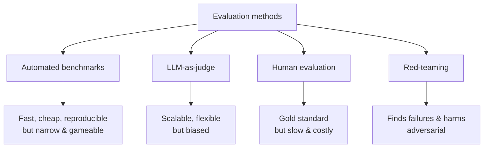

# Chapter 13 — Evaluation

> Evaluation is the most underrated skill in AI engineering — and therefore one of the highest-signal. Anyone can train or prompt a model; the engineer who can **rigorously measure whether it's actually good** is rare and invaluable. At frontier labs, evals *are* the product compass: you can't improve what you can't measure.

This chapter covers why eval is hard, the spectrum of methods (benchmarks → LLM-as-judge → human → red-teaming), how to build evals that don't lie to you, and the metrics that matter.

---

## 13.1 Why evaluation is the hard part

Traditional ML is easy to grade: accuracy, F1, a single number. Generative models break this because **there's no single correct output.** Ask for a summary or a poem and there are countless good answers and countless bad ones. How do you put a number on "good"?

This is genuinely hard, and getting it wrong is catastrophic: you ship a model you *think* is better and it's worse, or you optimize a metric that doesn't reflect real quality (Goodhart's Law — Chapter 9's reward hacking, again).



> **The pro mindset:** no single method suffices. Strong teams **triangulate** — cheap automated evals for fast iteration, LLM-judges for scale, human eval for ground truth on what matters, and red-teaming for safety. Saying "I'd use a layered eval strategy, not one metric" is itself a senior signal.

---

## 13.2 Automated benchmarks — fast, cheap, and dangerously narrow

Standardized test sets with known answers. Essential for quick iteration and comparison.

| Benchmark | Measures |
|-----------|----------|
| **MMLU** | broad knowledge across 57 subjects |
| **GSM8K / MATH** | grade-school / competition math reasoning |
| **HumanEval / MBPP** | code generation (does it pass unit tests?) |
| **HellaSwag / ARC** | commonsense reasoning |
| **GPQA** | graduate-level "Google-proof" questions |
| **MT-Bench / Arena-Hard** | multi-turn instruction following |
| **SWE-bench** | resolve real GitHub issues (agentic coding) |

### The two big traps

> **1. Contamination.** If benchmark questions leaked into pretraining data, the model *memorized the answers* and the score is fraudulent. This is rampant and under-reported. Mitigations: decontamination (Chapter 8), private/held-out test sets, and freshly generated benchmarks. Always ask "could this model have seen this test?"
>
> **2. Saturation & Goodhart.** Once everyone optimizes for a benchmark, scores stop reflecting real ability — the benchmark is "saturated" or gamed. MMLU near 90% no longer distinguishes top models. *"When a measure becomes a target, it ceases to be a good measure."* This is why new, harder benchmarks (GPQA, SWE-bench, ARC-AGI) keep appearing.

```python
# Code benchmarks are special: the reward is VERIFIABLE (Chapter 9). No judgment needed.
def evaluate_code_task(model_output: str, test_cases: list) -> float:
    passed = 0
    for inp, expected in test_cases:
        try:
            if run_in_sandbox(model_output, inp) == expected:   # ALWAYS sandbox untrusted code
                passed += 1
        except Exception:
            pass
    return passed / len(test_cases)        # pass rate — objective, ungameable by style
```

> **Why verifiable benchmarks are gold:** code and math can be *checked*, not judged — no bias, no ambiguity. This is exactly why they anchor reasoning-model training (Chapter 9). When a task has a checkable answer, *use that*; reserve fuzzy methods for genuinely open-ended outputs.

---

## 13.3 LLM-as-a-Judge — scalable evaluation of open-ended quality

For outputs with no ground truth (summaries, chat, creative writing), use a strong LLM to *grade* other models' outputs against a rubric. It's the workhorse of modern eval because it's far cheaper and faster than humans and correlates surprisingly well with human judgment.

```python
JUDGE_PROMPT = """You are grading an AI response. Rate 1-10 on:
- Helpfulness: does it fully address the request?
- Accuracy: is it factually correct?
- Clarity: is it well-organized and clear?

Question: {question}
Response: {response}

Think step by step, then output JSON: {{"score": N, "reasoning": "..."}}"""

def llm_judge(question, response, judge_model):
    out = judge_model(JUDGE_PROMPT.format(question=question, response=response))
    return parse_json(out)
```

### Pairwise > pointwise (the same lesson as reward modeling)

Asking a judge "is A or B better?" is far more reliable than "rate A from 1–10," because absolute scores drift but comparisons are stable (Chapter 9). **Chatbot Arena** scales this to humans: anonymous A/B battles → **Elo ratings**. It's the most trusted public ranking precisely because it's pairwise, blind, and crowd-sourced on real prompts.

### Known biases of LLM judges (state these to show rigor)

| Bias | The judge tends to... | Mitigation |
|------|----------------------|------------|
| **Position** | favor the first (or second) option | swap order, average both |
| **Verbosity** | prefer longer answers | length-control, penalize padding |
| **Self-preference** | favor outputs from its own model family | use a different judge model |
| **Sycophancy** | agree with assertions in the prompt | neutral rubric, blind grading |

> **Real-world:** LLM-judges are how teams iterate quickly — run 500 prompts through a candidate model, auto-grade, get a quality estimate in minutes for dollars. But you must **validate the judge against human labels** on a sample, and correct for its biases. A naive LLM-judge that always prefers longer answers will happily tell you your verbose-but-worse model is "better." Calibrating the judge is the real skill.

---

## 13.4 Human evaluation — still the gold standard

When the stakes are high, humans judge. Used for final model decisions, preference data (Chapter 9), and anything subtle (tone, safety, helpfulness). The challenges are practical: clear rubrics, **inter-annotator agreement** (do labelers agree? measure with Cohen's/Fleiss' kappa), labeler training, and cost/latency.

> **Real-world:** every major model release is gated partly on human evals and A/B tests with real users. It's slow and expensive, which is exactly why automated and LLM-judge evals exist — to *reduce* how often you need humans, not replace them. The art is using cheap evals for iteration and reserving human eval for the decisions that matter.

---

## 13.5 Red-teaming & safety evaluation

Capability evals ask "is it good?" Safety evals ask "**can it be made to do harm?**" Red-teaming is adversarial: deliberately try to make the model produce dangerous, biased, or policy-violating output.

- **Jailbreaks:** prompts crafted to bypass safety training (roleplay framings, encoding tricks, "ignore previous instructions").
- **Harmful capabilities:** can it give actionable dangerous instructions, generate CSAM/violence, assist cyberattacks?
- **Bias & fairness:** does it behave differently across demographics?
- **Automated red-teaming:** use models to generate adversarial prompts at scale.

> **Why this is central at frontier labs:** before release, models undergo extensive red-teaming and safety evals (Anthropic's Responsible Scaling Policy, OpenAI's Preparedness Framework, etc.). "Dangerous capability evaluations" — testing for bio/cyber uplift — gate whether a model ships at all. If you want safety/alignment roles, *demonstrated red-teaming and eval design* is among the strongest signals you can show. And per this book's ethics: red-team to *defend*, document responsibly, never to build attack tools.

---

## 13.6 Building evals that don't lie to you

The meta-skill: a *good* eval harness. Principles the best practitioners follow:

1. **Eval-driven development.** Build the eval set *before/while* building the feature — like test-driven development. It defines "done" and catches regressions.
2. **Make it representative.** Your eval set must mirror *real* production inputs, including the messy edge cases — not just easy happy-path examples.
3. **Separate the axes.** Score correctness, safety, format, latency, and cost *separately*. A single blended number hides what's actually happening.
4. **Hold out & rotate.** Keep a private test set to detect overfitting to your own eval; refresh it as the system evolves.
5. **Track regressions over time.** Every change runs the suite; you catch the fix-that-breaks-three-other-things.
6. **Measure cost and latency**, not just quality — a 2% quality gain at 5× cost is often a bad trade (Chapter 17).

```python
# An eval harness is just disciplined engineering — versioned data, multiple metrics, tracked over time.
def run_eval_suite(model, eval_set):
    results = {"correctness": [], "faithfulness": [], "latency_ms": [], "cost": []}
    for ex in eval_set:
        t0 = time.perf_counter()
        out = model(ex.input)
        results["latency_ms"].append((time.perf_counter() - t0) * 1000)
        results["correctness"].append(check_correct(out, ex.expected))
        results["faithfulness"].append(check_grounded(out, ex.context))  # for RAG (Ch.12)
        results["cost"].append(estimate_cost(ex.input, out))
    return {k: sum(v) / len(v) for k, v in results.items()}   # aggregate per axis
```

> **This is the highest-leverage, most-overlooked artifact you can build:** a rigorous, domain-specific eval harness. It's also a fantastic portfolio piece (Chapter 19) — "I built an eval framework for X and used it to improve quality by Y%" is a sentence that gets you hired, because it proves you can *measure*, which is rarer than the ability to *build*.

---

## 13.7 Metrics reference

| Metric | Use | Note |
|--------|-----|------|
| **Perplexity** | language modeling (Ch.2) | `exp(loss)`; lower=better; only comparable on same tokenizer/data |
| **Accuracy / pass@k** | tasks with right answers | pass@k: any of k samples correct (code) |
| **BLEU / ROUGE** | translation / summarization | n-gram overlap; weak proxy, gameable, mostly legacy |
| **BERTScore** | semantic similarity to reference | embedding-based, better than n-gram |
| **Elo / win-rate** | head-to-head model comparison | from pairwise battles (Arena) |
| **Faithfulness / relevance** | RAG (Ch.12) | grounded in context? addresses query? |
| **Calibration (ECE)** | does confidence match accuracy? | crucial for honesty/safety |

> **Calibration deserves a callout:** a *calibrated* model's stated confidence matches its real accuracy — when it says "70% sure," it's right ~70% of the time. This is core to **honesty** (Chapter 9): we want models that *know what they don't know*. RLHF can actually *hurt* calibration (models become overconfidently agreeable). Measuring **Expected Calibration Error** is a sophisticated signal.

---

## Interview signal

- **Q: "How do you evaluate an LLM with no single correct answer?"** → Layered: automated benchmarks for iteration, LLM-as-judge (pairwise) for scale, human eval for ground truth, red-teaming for safety. Triangulate; don't trust one number.
- **Q: "What's wrong with benchmark scores?"** → Contamination (memorized test) and saturation/Goodhart (gamed once targeted). Use held-out/fresh sets, decontaminate, prefer verifiable tasks.
- **Q: "Biases of LLM-as-judge?"** → Position, verbosity, self-preference, sycophancy; mitigate with order-swapping, length control, a different judge, neutral rubrics — and validate against humans.
- **Q: "Why pairwise over pointwise scoring?"** → Comparisons are far more stable/reliable than absolute scores (same reason as reward modeling).
- **Q: "How would you build an eval for feature X?"** → Representative held-out set built up front, separate axes (correctness/safety/format/latency/cost), track regressions, validate any auto-judge against humans.
- **Q: "What is calibration and why care?"** → Confidence matching accuracy; core to honesty; RLHF can degrade it; measure with ECE.

---

## Exercises

1. Build an LLM-as-judge with a clear rubric; grade 30 responses, then validate it against your own human labels and measure agreement.
2. Demonstrate position bias: run your judge with A/B then B/A and measure how often the verdict flips; add order-averaging to fix it.
3. Build a verifiable code-eval that sandboxes outputs and computes pass@k.
4. Construct a small contamination test: check n-gram overlap between a benchmark and a "training" corpus.
5. Build a multi-axis eval harness (correctness, faithfulness, latency, cost) and run two models through it; write up the tradeoffs.
6. Compute Expected Calibration Error for a classifier and plot a reliability diagram.

## Key takeaways

- Eval is the underrated, high-signal skill: you can't improve what you can't measure, and generative outputs have no single right answer.
- Triangulate methods: automated benchmarks (watch contamination & saturation), LLM-as-judge (watch biases; prefer pairwise; validate vs humans), human eval (gold standard), red-teaming (safety).
- Prefer *verifiable* tasks (code/math) when possible — objective and ungameable.
- Build eval-driven: representative held-out sets, separated axes, regression tracking, cost & latency, calibration.
- A rigorous domain-specific eval harness is one of the most valuable and hireable artifacts you can produce.

**Next:** [Chapter 14 — Distributed Training](../part-4-systems/14-distributed-training.md)
