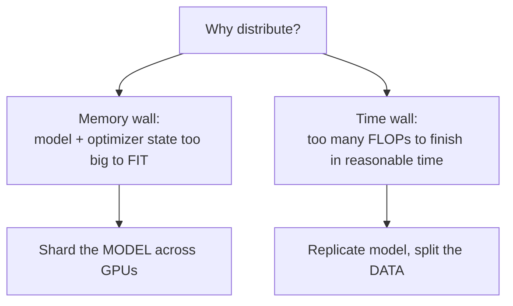
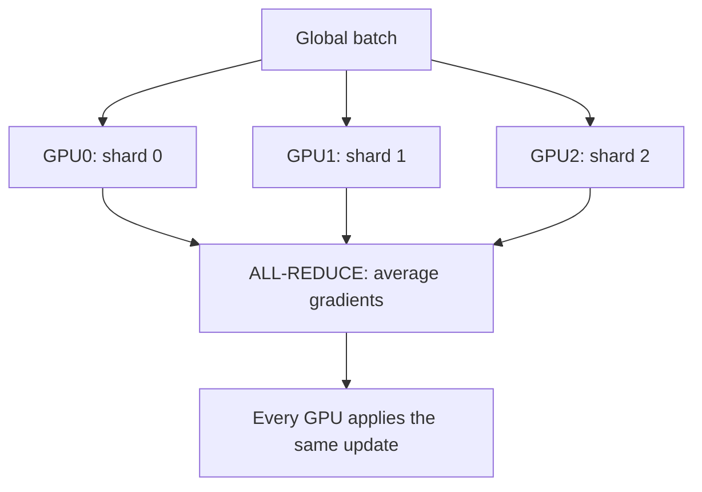
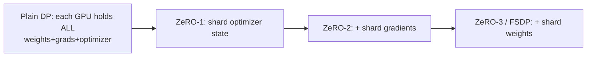
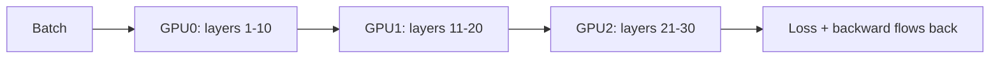
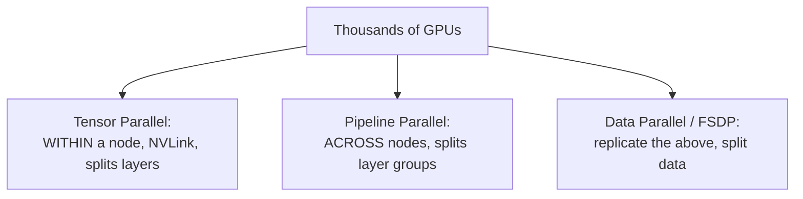

# Chapter 14 — Distributed Training

> One GPU can't train a frontier model — not even close. A 70B model doesn't *fit* on a single GPU, and even if it did, training would take decades. Distributed training spreads the work across thousands of GPUs. The engineers who understand *how* are exactly the ones frontier labs need. This is the heart of the "research/training systems" specialization.

This chapter builds up the parallelism strategies — data, tensor, pipeline, and sharded (FSDP/ZeRO) — explaining the memory problem each one solves, with the communication costs that make it hard.

---

## 14.1 The two reasons one GPU isn't enough



1. **Memory wall.** Recall Chapter 11: training needs ~16 bytes/param (weights + grads + Adam m,v + master). A 70B model → ~1.1TB — far beyond any single GPU's 80GB. The model literally doesn't fit.
2. **Time wall.** Pretraining is ~`6 × params × tokens` FLOPs. For 70B params × 15T tokens that's ~6×10²⁴ FLOPs — millennia on one GPU. You need thousands working in parallel.

Different parallelism strategies attack different walls. Real frontier runs **combine** them ("3D/4D parallelism").

---

## 14.2 Data Parallelism (DP) — the time wall

The simplest and most common: **replicate the full model on every GPU, split the *batch* across them.** Each GPU computes gradients on its slice, then an **all-reduce** (Chapter 4!) averages gradients so every replica applies the identical update and stays in sync.



```python
# PyTorch DistributedDataParallel (DDP) — the standard data-parallel API.
import torch.distributed as dist
from torch.nn.parallel import DistributedDataParallel as DDP

dist.init_process_group("nccl")                 # NCCL = NVIDIA's GPU collective library
model = DDP(model, device_ids=[local_rank])     # wraps model; auto all-reduces grads
# Training loop is otherwise NORMAL — DDP overlaps gradient all-reduce with backprop.
for batch in sharded_loader:                    # each rank gets a different data shard
    loss = model(batch).loss
    loss.backward()                             # gradients all-reduced under the hood
    optimizer.step(); optimizer.zero_grad()
```

> **Why DDP is the default starting point:** it's simple, scales throughput near-linearly *if* communication is hidden, and works whenever the model *fits* on one GPU. Its key optimization: **overlap** the gradient all-reduce with the backward pass (start reducing early-computed gradients while later ones are still computing) so communication is nearly free. **Its limitation:** every GPU holds a *full* copy of the model and optimizer state — so DP alone does *nothing* for the memory wall. That's what the next strategies fix.

---

## 14.3 ZeRO / FSDP — shard the redundancy away

The insight behind **ZeRO** (Zero Redundancy Optimizer, from DeepSpeed) and PyTorch's **FSDP** (Fully Sharded Data Parallel): in plain data parallelism, every GPU stores the *same* optimizer state, gradients, and weights — massively redundant. **Shard them across GPUs instead**, and gather pieces only when needed.



| Stage | Shards | Memory saved | Cost |
|-------|--------|--------------|------|
| **ZeRO-1** | optimizer state | ~4× | minimal extra comm |
| **ZeRO-2** | + gradients | ~8× | moderate comm |
| **ZeRO-3 / FSDP** | + parameters | ~N× (linear in GPUs) | most comm (gather weights per layer) |

In **FSDP/ZeRO-3**, each GPU permanently stores only a *slice* of every layer. Just before a layer runs, an **all-gather** reconstructs its full weights; after use, the non-local slices are freed. Gradients are reduced with **reduce-scatter** so each GPU ends up with only its slice's gradient.

```python
# PyTorch FSDP — shards params, grads, and optimizer state across data-parallel ranks.
from torch.distributed.fsdp import FullyShardedDataParallel as FSDP
model = FSDP(model)        # now each GPU holds only 1/N of the model at rest
# Memory per GPU drops ~linearly with GPU count -> fit models that never could before.
```

> **Why FSDP/ZeRO is a workhorse:** it lets you train models *far* larger than one GPU's memory **without** the code complexity of manually splitting the model (tensor/pipeline parallelism below). You trade extra communication (gathering weights each layer) for memory. It's often the *first* thing teams reach for beyond DDP, and ZeRO-Offload can even push state to CPU/NVMe to stretch further. Knowing the ZeRO stages and *what each shards* is a very common interview question.

---

## 14.4 Tensor Parallelism (TP) — split individual layers

When a *single layer* is too big (or you want to cut latency), **tensor parallelism splits the matrices themselves across GPUs.** A big matmul `Y = XW` is divided — e.g., split `W` by columns, each GPU computes part of the output, then an all-gather/all-reduce combines them.

```python
# Conceptual column-parallel linear: split W across GPUs, each does part, then combine.
# GPU g holds W[:, g*cols:(g+1)*cols]
def column_parallel_linear(x, W_shard):
    y_shard = x @ W_shard                 # each GPU computes a SLICE of the output
    return all_gather(y_shard)            # concatenate slices across GPUs -> full output
# Megatron-LM cleverly arranges attention & MLP so each block needs only TWO all-reduces.
```

> **Why and when:** TP (pioneered by **Megatron-LM**) is essential when even one layer's weights/activations exceed a GPU, and it reduces *per-step latency* (work is split, not just replicated). **But** it demands *very high-bandwidth* interconnect (NVLink) because GPUs communicate *within every layer, every step* — so TP is kept **within a single node** (8 GPUs linked by NVLink). Across nodes, the slower network would make it a bottleneck. This locality constraint is the key practical insight.

---

## 14.5 Pipeline Parallelism (PP) — split the layers across GPUs

**Pipeline parallelism puts different *layers* on different GPUs** — GPU0 has layers 1–10, GPU1 has 11–20, etc. Data flows through like an assembly line.



**The problem — the "bubble":** naively, while GPU0 works on the first stage, GPUs 1–3 sit *idle* waiting; then GPU0 idles while later stages run. This idle time is the **pipeline bubble**, and it wastes expensive hardware.

**The fix — micro-batching:** split each batch into many **micro-batches** and keep them flowing so all stages stay busy (like a CPU instruction pipeline). Schemes like **GPipe** and **1F1B** (one-forward-one-backward, from PipeDream) minimize the bubble.

```python
# The bubble shrinks as you add micro-batches:  bubble_fraction ~ (stages - 1) / num_microbatches
def bubble_fraction(num_stages, num_microbatches):
    return (num_stages - 1) / (num_microbatches + num_stages - 1)

print(bubble_fraction(4, 1))    # 0.75  -> 75% wasted with no micro-batching!
print(bubble_fraction(4, 32))   # ~0.086 -> under 9% with 32 micro-batches
```

> **Why PP exists despite the bubble:** unlike TP, pipeline stages communicate only at *stage boundaries* (pass activations to the next GPU) — far less communication than TP — so it works **across nodes** over slower interconnects. The cost is scheduling complexity and the bubble. PP is how you span *many* nodes; TP handles within-node.

---

## 14.6 3D parallelism — combining all three (how frontier models train)

No single strategy scales to thousands of GPUs. Real runs **compose** them, each at the network level it suits:



| Dimension | Splits | Network level | Why there |
|-----------|--------|---------------|-----------|
| **Tensor** | individual matrices | within node (NVLink) | needs highest bandwidth |
| **Pipeline** | groups of layers | across nodes | only boundary comm |
| **Data/FSDP** | the batch | outermost | overlap-friendly all-reduce |

> **The mental model interviewers love:** "Tensor parallelism within a node where NVLink is fast, pipeline parallelism across nodes where bandwidth is lower, and data/sharded parallelism on the outside to scale throughput — matching each parallelism dimension to the interconnect that suits its communication pattern." Add **expert parallelism** for MoE (Chapter 7) and **sequence/context parallelism** for long context and you have the full toolkit (frameworks: Megatron-LM, DeepSpeed, and increasingly composable APIs in PyTorch).

---

## 14.7 The communication bottleneck — the real challenge

Distributed training is, fundamentally, a battle against communication. Compute is fast; moving data between GPUs is slow by comparison. The whole game is **hiding communication behind computation** and **minimizing how much you must communicate.**

| Concept | Why it matters |
|---------|----------------|
| **NCCL** | NVIDIA's optimized collectives (all-reduce, all-gather, reduce-scatter) over NVLink/InfiniBand |
| **Interconnect hierarchy** | NVLink (intra-node, fast) ≫ InfiniBand/Ethernet (inter-node, slower) — drives the 3D layout |
| **Overlap comm & compute** | start communicating finished gradients while others still compute → comm is "free" |
| **Gradient/comm compression** | reduce bytes on the wire (quantized/compressed gradients) |
| **Topology awareness** | place communicating ranks on fast links |

> **Real-world:** a poorly-laid-out distributed run can spend *more than half* its time waiting on communication — i.e., paying for thousands of idle GPUs. The difference between 35% and 55% **Model FLOPs Utilization (MFU)** is millions of dollars on a big run. Optimizing the parallelism layout and overlap is one of the highest-paid skills in the field. **MFU** (fraction of theoretical peak FLOPs you actually achieve) is *the* headline efficiency metric — quote it to sound like a training-systems engineer.

---

## 14.8 Fault tolerance at scale

With thousands of GPUs running for weeks, failures are routine, not exceptional (Chapter 4). Essentials:

- **Checkpointing** (Chapter 8): save model + optimizer + scheduler + RNG + dataloader position so a crash resumes from the last checkpoint. **Asynchronous/sharded checkpointing** avoids stalling all GPUs while saving.
- **Elastic training:** continue (at reduced scale) when nodes drop, rather than crashing the whole run.
- **Health monitoring:** detect a "straggler" or failing GPU before it corrupts or stalls the run.

> A frontier run without robust, *fast* checkpointing is one cosmic-ray bit-flip away from losing days of progress across thousands of GPUs. Checkpoint frequency is itself a tradeoff: too rare risks large loss on failure, too frequent wastes I/O.

---

## Interview signal

- **Q: "Data vs tensor vs pipeline parallelism?"** → DP replicates model/splits data (time wall, but no memory help). TP splits matrices within a layer (within-node, NVLink). PP splits layers across GPUs (across nodes, has a bubble fixed by micro-batching).
- **Q: "Explain ZeRO / FSDP stages."** → Shard optimizer state (1), + gradients (2), + parameters (3/FSDP); gathers weights per layer; trades comm for ~linear memory savings.
- **Q: "How do you train a model that doesn't fit on one GPU?"** → FSDP/ZeRO-3 first (simplest), or TP+PP if a layer is too big; combine as 3D parallelism.
- **Q: "What's the pipeline bubble and how do you reduce it?"** → Idle time from sequential stages; micro-batching (GPipe/1F1B) keeps stages busy.
- **Q: "Why is TP within a node but PP across nodes?"** → TP communicates every layer/step → needs NVLink bandwidth; PP only at stage boundaries → tolerates slower inter-node links.
- **Q: "What is MFU and why care?"** → Model FLOPs Utilization — fraction of peak FLOPs achieved; the efficiency/cost metric; communication overhead is the main drag.

---

## Exercises

1. Run PyTorch DDP on 2 GPUs (or a multi-process CPU "gloo" simulation); verify all replicas end with identical weights after an all-reduce.
2. Implement a toy ZeRO-1: shard optimizer state across 4 "ranks" (lists) and confirm correct updates with less per-rank memory.
3. Compute pipeline bubble fraction for 4/8/16 stages across micro-batch counts; plot it.
4. Implement a manual column-parallel linear across 2 processes and verify it matches the single-GPU result after all-gather.
5. Estimate the memory per GPU for a 13B model under DDP vs FSDP across 8/64 GPUs.

## Key takeaways

- One GPU fails on two fronts: memory (model doesn't fit) and time (too many FLOPs). Different parallelisms attack different walls.
- Data parallelism splits the batch and all-reduces gradients — simple, scales throughput, but doesn't save memory.
- FSDP/ZeRO shards optimizer state, gradients, then parameters for ~linear memory savings — the go-to beyond DDP.
- Tensor parallelism splits matrices (within-node, NVLink); pipeline parallelism splits layers (across nodes, bubble fixed by micro-batching).
- Frontier runs combine all three (3D parallelism), matching each to its interconnect; MoE adds expert parallelism.
- The real battle is communication: hide it behind compute, minimize bytes, and chase high MFU. Robust checkpointing makes weeks-long runs survivable.

**Next:** [Chapter 15 — GPU Programming](15-gpu-programming.md)
