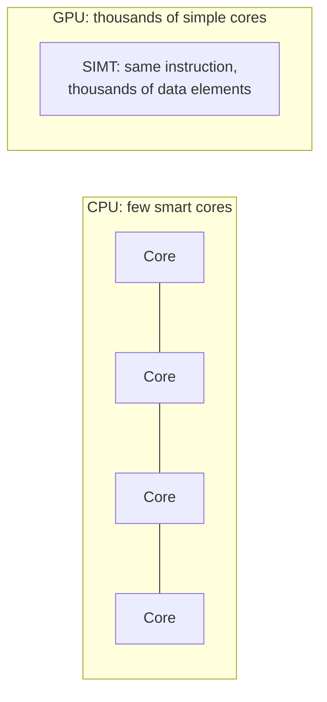
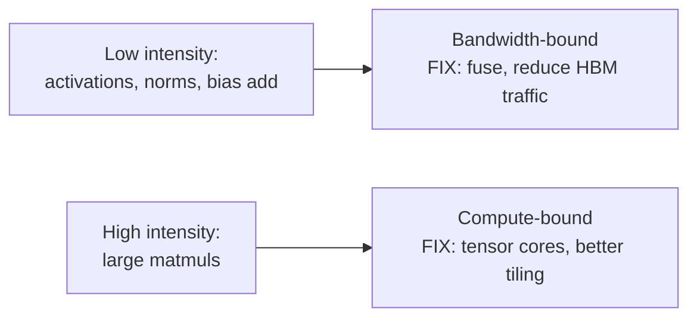
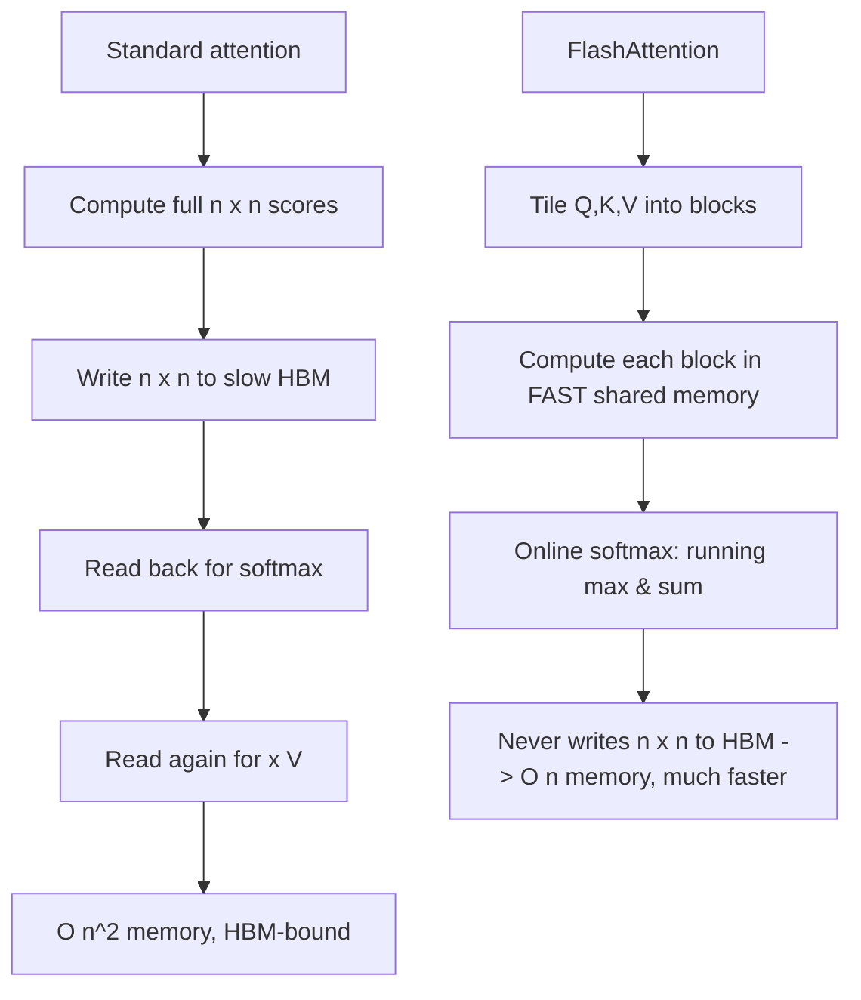
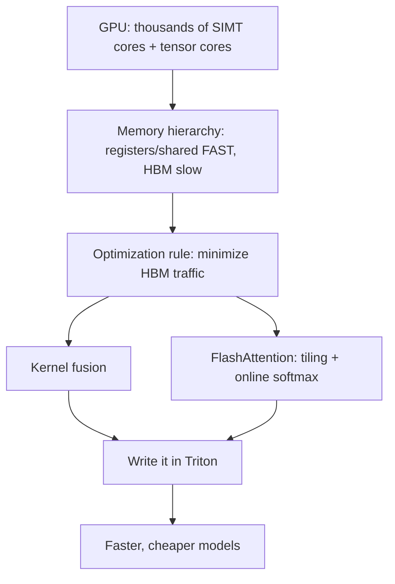

# Chapter 15 — GPU Programming

> This chapter is where "good" becomes "cracked." Most ML engineers treat the GPU as a black box. The ones who can write a custom kernel, understand *why* FlashAttention is faster, and reason with a roofline model are the rarest and most valuable — they're the people who make models actually run fast. This is the technical core of the inference/systems specialization.

We cover the GPU execution model, CUDA basics, the memory hierarchy that governs everything, Triton (the practical way to write kernels today), kernel fusion, and FlashAttention as the canonical case study.

---

## 15.1 Why GPUs, and how they think differently from CPUs

A CPU has a few powerful cores optimized for *latency* — finish one complex task fast. A GPU has *thousands* of simple cores optimized for *throughput* — do the same operation on mountains of data in parallel. Neural networks are billions of identical, independent multiply-adds → a perfect match.



The model is **SIMT** (Single Instruction, Multiple Threads): you write what *one* thread does, and thousands run it simultaneously on different data — exactly the mental shift from Chapter 3.

---

## 15.2 The CUDA execution model

CUDA organizes parallel work in a hierarchy. You must know this vocabulary cold:

| Level | What | Key fact |
|-------|------|----------|
| **Thread** | one execution of the kernel | handles one (or a few) data elements |
| **Warp** | 32 threads | execute *in lockstep* — the real unit of execution |
| **Block** | group of threads | share fast **shared memory**, can synchronize |
| **Grid** | all blocks for a launch | covers the whole problem |

```cpp
// Vector add: each thread computes ONE output element. Launch thousands at once.
__global__ void add(const float* a, const float* b, float* c, int n) {
    int i = blockIdx.x * blockDim.x + threadIdx.x;   // this thread's global index
    if (i < n) c[i] = a[i] + b[i];                   // guard for n not divisible by block size
}
// Host launches a grid of blocks: add<<<num_blocks, threads_per_block>>>(a, b, c, n);
```

> **Warps are where performance secrets hide.** The 32 threads in a warp run the *same* instruction together. Two consequences you must know:
> - **Warp divergence:** if threads in a warp take different `if`/`else` branches, the GPU executes *both* paths serially (masking threads) — branches in kernels are expensive. Write branch-light code.
> - **Memory coalescing:** when the 32 threads access *consecutive* memory addresses, the hardware combines them into one efficient transaction. Scattered access = many slow transactions. Coalesced access can be *many times* faster. This is the #1 CUDA performance rule.

---

## 15.3 The GPU memory hierarchy — the thing that governs everything

Just like the CPU hierarchy (Chapter 4), but the gaps are even more dramatic and *more* of your job to manage:

```
Registers       (per-thread, ~TB/s, tiny)            fastest
Shared memory   (per-block, ~10s TB/s, ~100s KB)     fast, programmer-managed scratchpad
L2 cache        (shared, automatic)
HBM / global    (whole GPU, ~1-3 TB/s, 10s-100s GB)  the "GPU RAM" — relatively SLOW
```

> **This hierarchy is the secret to nearly all GPU optimization.** HBM (the GPU's main memory) is *huge* but, relative to compute, *slow*. The art is: **load data from HBM once into fast shared memory/registers, do as much work as possible there, then write back once.** Minimizing HBM traffic is the central objective — and it's *exactly* what FlashAttention does (§15.7). Shared memory is a *programmer-managed* cache; using it well is the difference between a slow kernel and a fast one.

---

## 15.4 Compute-bound vs memory-bound & the roofline (revisited with teeth)

From Chapter 4, every kernel is limited by either compute (FLOPs) or memory bandwidth (bytes moved). The deciding factor is **arithmetic intensity** = FLOPs ÷ bytes moved.

```python
def arithmetic_intensity(flops, bytes_moved):
    return flops / bytes_moved      # high -> compute-bound; low -> memory-bound

# Elementwise add of two N-vectors: N flops, ~12N bytes (read 2, write 1, fp32)
print(arithmetic_intensity(1_000_000, 12_000_000))   # ~0.08 -> deeply memory-bound
# Big square matmul NxN: ~2N^3 flops, ~12N^2 bytes -> intensity ~ N/6 -> compute-bound for large N
```

The **roofline model** plots achievable performance vs arithmetic intensity. Low-intensity ops hit the *bandwidth* ceiling (sloped line); high-intensity ops hit the *compute* ceiling (flat line). Where your kernel sits tells you what to fix:



> **Why this framing is so powerful:** it tells you *whether optimizing math or memory will help at all*. Trying to speed up a memory-bound LayerNorm by using tensor cores is wasted effort — it's starved on bandwidth. The fix is **fusion** (next). A surprising amount of an LLM's runtime is memory-bound elementwise ops, which is exactly why fusion and FlashAttention give such big wins.

---

## 15.5 Tensor Cores — the matmul engines

Modern NVIDIA GPUs have **Tensor Cores**: specialized units that do small matrix multiply-accumulate operations astonishingly fast in lower precision (bf16/fp16/fp8). They're why bf16 training (Chapter 8) is both faster *and* memory-lighter. To use them you need the right data types and shapes (dimensions that are multiples of 8/16) — frameworks and libraries (cuBLAS, cuDNN) handle this, but knowing tensor cores exist and *why shape alignment matters* is real signal.

---

## 15.6 Triton — writing kernels without the CUDA pain

Writing raw CUDA is hard: manual memory management, indexing, shared-memory choreography. **Triton** (from OpenAI) lets you write GPU kernels in *Python* at the **block level** — you operate on blocks of data and the compiler handles thread scheduling, coalescing, and shared memory. It's how a huge amount of modern kernel work (including parts of PyTorch 2.0) actually gets done.

```python
import triton
import triton.language as tl

@triton.jit
def add_kernel(x_ptr, y_ptr, out_ptr, n, BLOCK: tl.constexpr):
    pid = tl.program_id(0)                       # this program handles one BLOCK of elements
    offsets = pid * BLOCK + tl.arange(0, BLOCK)  # the indices this program owns
    mask = offsets < n                           # guard the tail
    x = tl.load(x_ptr + offsets, mask=mask)      # coalesced load from HBM
    y = tl.load(y_ptr + offsets, mask=mask)
    tl.store(out_ptr + offsets, x + y, mask=mask)  # compute + store

# You think in BLOCKS, not threads. The compiler handles coalescing & scheduling.
```

> **Why Triton matters for your career:** it dramatically lowers the barrier to custom kernels, so "writing a fused kernel" is now achievable for a motivated engineer, not just CUDA veterans. Many performance contributions to open-source ML libraries are Triton kernels. **Writing a custom Triton kernel and benchmarking it against the naive PyTorch version is one of the most impressive portfolio projects you can do** (Chapter 19) — it directly proves systems depth.

---

## 15.7 Kernel fusion & FlashAttention — the canonical case study

### Fusion: do more per memory trip

Separate operations each round-trip through slow HBM: `softmax` reads from HBM, writes to HBM; the next op reads it back. **Fusion** merges multiple operations into *one* kernel so intermediate results stay in fast on-chip memory — slashing HBM traffic. For memory-bound chains (activation → bias → norm), fusion is *the* win. `torch.compile` does much of this automatically now.

### FlashAttention: the most important kernel in modern AI

Standard attention (Chapter 6) computes the full `n × n` attention matrix and **writes it to HBM**, then reads it back for softmax, then again for the value multiply. For long sequences that `n × n` matrix is enormous → attention becomes **memory-bound**, dominated by HBM traffic, and its memory grows O(n²).

**FlashAttention's insight:** never materialize the full attention matrix in HBM. Instead, **tile** the computation: load blocks of Q, K, V into fast shared memory, compute attention for that block, and combine results using an **online softmax** (a running-max/running-sum trick that produces the exact softmax without ever seeing all scores at once).



> **Why FlashAttention changed everything:**
> - It's an **exact** algorithm — same math, same outputs as standard attention, **no approximation**. It's purely an *IO-aware* reorganization. This is the elegance interviewers love: *"FlashAttention doesn't change what attention computes, only the order and where data lives, eliminating HBM round-trips for the n×n matrix."*
> - It makes attention **memory-linear (O(n))** instead of O(n²), enabling the long-context models of Chapter 7.
> - It delivers large real-world speedups and memory savings, so it's now the **default** attention in PyTorch (`scaled_dot_product_attention`), vLLM, and essentially every serious LLM stack.
> - It's the textbook demonstration that **understanding the memory hierarchy beats clever math** for performance. The whole win comes from §15.3.

Mastering the *idea* of FlashAttention — tiling + online softmax to avoid HBM traffic — is one of the highest-value things in this entire book for a systems-focused engineer.

---

## 15.8 Profiling GPU code — measure, never guess (Chapter 3, GPU edition)

| Tool | Use |
|------|-----|
| **PyTorch Profiler** | per-op CPU/GPU time, find the hot kernel, spot CPU-bound gaps |
| **NVIDIA Nsight Systems** | timeline view: are GPUs idle? is it comm- or compute-bound? |
| **NVIDIA Nsight Compute** | per-kernel deep dive: occupancy, memory throughput, roofline |
| **`nvidia-smi` / DCGM** | utilization, memory, power, temperature |

> **The discipline never changes:** measure first, find the *actual* bottleneck, fix that, re-measure. A common shock: the GPU shows 100% "utilization" in `nvidia-smi` but is mostly *stalled on memory* — only Nsight Compute reveals the true picture (low compute throughput, high memory pressure). Reasoning about **occupancy** (how many warps are active to hide memory latency) and memory throughput is what separates real GPU engineers from those who just read the utilization number.

---

## 15.9 How it all connects



Everything reduces to one principle from §15.3: **the GPU computes faster than it can fetch from HBM, so minimize HBM traffic.** Coalescing, fusion, FlashAttention, tensor-core tiling — all serve that goal.

---

## Interview signal

- **Q: "Why are GPUs good for deep learning?"** → Thousands of SIMT cores for massively parallel identical matmuls; tensor cores accelerate low-precision matmul.
- **Q: "What is memory coalescing / warp divergence?"** → Coalescing: consecutive addresses across a warp combine into one transaction (fast). Divergence: branching threads in a warp serialize both paths (slow).
- **Q: "Explain the GPU memory hierarchy and its optimization implication."** → Registers/shared fast, HBM slow; load once into shared memory, compute there, write once — minimize HBM traffic.
- **Q: "Why is FlashAttention faster if it computes the same thing?"** → It's IO-aware: tiles Q/K/V into shared memory and uses online softmax to avoid writing the n×n matrix to HBM → memory-linear, fewer HBM round-trips. Exact, not approximate.
- **Q: "Compute-bound vs memory-bound — how do you tell and what do you do?"** → Arithmetic intensity / roofline; memory-bound → fuse and cut HBM traffic; compute-bound → tensor cores, better tiling.
- **Q: "What is Triton?"** → Python-level, block-based GPU kernel language; compiler handles threads/coalescing/shared memory; how much modern kernel work is done.

---

## Exercises

1. Write a Triton (or CUDA) vector-add kernel; benchmark vs naive PyTorch and verify correctness.
2. Write a fused kernel for `x * sigmoid(x)` (SiLU); compare HBM traffic and speed to the unfused version.
3. Compute arithmetic intensity for elementwise add, LayerNorm, and a large matmul; place each on a roofline and predict its bottleneck.
4. Use the PyTorch profiler on your Chapter 6 GPT; identify the most expensive kernel and whether it's compute- or memory-bound.
5. Read the FlashAttention paper's algorithm box and implement a small *online softmax* (running max & sum) in NumPy; verify it equals the standard softmax.

## Key takeaways

- GPUs are throughput machines (SIMT, thousands of cores, tensor cores); you write one thread's work and launch thousands.
- Warps run in lockstep — avoid divergence; coalesce memory accesses. This is the #1 CUDA performance rule.
- The memory hierarchy governs everything: HBM is big but slow; minimize HBM traffic by working in fast shared memory/registers.
- Arithmetic intensity / roofline tells you whether to optimize compute or memory; many LLM ops are memory-bound → fuse them.
- FlashAttention = tiling + online softmax to avoid materializing the n×n matrix in HBM: exact, memory-linear, and now the default — the canonical "memory hierarchy beats clever math" result.
- Triton makes custom kernels accessible in Python; a benchmarked custom kernel is a top portfolio piece.

**Next:** [Chapter 16 — Frameworks: PyTorch & JAX](16-frameworks.md)
