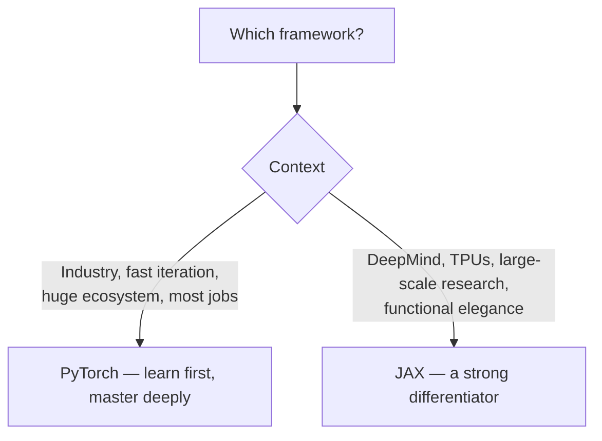

# Chapter 16 — Frameworks: PyTorch & JAX

> You built autograd from scratch in Chapter 5. Now meet the industrial-strength versions. **PyTorch** is the lingua franca of AI — you must master it. **JAX** is the framework of choice at Google DeepMind and a growing slice of research — knowing it sets you apart. This chapter is about *understanding the abstractions*, not memorizing APIs, so you can debug and extend them.

---

## 16.1 Why frameworks exist

A framework gives you three things you'd otherwise rebuild every time: **autograd** (automatic differentiation — Chapter 5), **hardware acceleration** (dispatch to optimized GPU/TPU kernels — Chapter 15), and **building blocks** (layers, optimizers, data loading). The value is letting you express *what* to compute and handling *how* it runs fast.

---

## 16.2 PyTorch — the one you must know

PyTorch won research and most of industry through **define-by-run** (eager) execution: the computation graph is built dynamically *as your Python runs*, so you can use normal control flow, print tensors, and debug with a regular debugger. It feels like NumPy with autograd and a GPU.

### Tensors and autograd in practice

```python
import torch

# A tensor that tracks gradients — this is your Chapter 5 Value, but n-dimensional & on GPU.
x = torch.tensor([2.0], requires_grad=True)
y = x**3 + 2*x                  # builds a graph dynamically as it runs
y.backward()                    # reverse-mode autodiff (your engine, industrialized)
print(x.grad)                   # dy/dx = 3x^2 + 2 = 14 at x=2
```

### The `nn.Module` pattern — how all PyTorch models are structured

```python
import torch.nn as nn

class TransformerBlock(nn.Module):
    def __init__(self, d_model, n_heads):
        super().__init__()
        self.attn = nn.MultiheadAttention(d_model, n_heads, batch_first=True)
        self.norm1 = nn.LayerNorm(d_model)
        self.norm2 = nn.LayerNorm(d_model)
        self.ff = nn.Sequential(                  # the FFN from Chapter 6
            nn.Linear(d_model, 4 * d_model), nn.GELU(),
            nn.Linear(4 * d_model, d_model),
        )

    def forward(self, x):
        # Pre-norm + residual, exactly as you built by hand in Chapter 6.
        x = x + self.attn(self.norm1(x), self.norm1(x), self.norm1(x))[0]
        x = x + self.ff(self.norm2(x))
        return x
```

> **Why `nn.Module` is everywhere:** it auto-registers parameters (so `.parameters()` feeds the optimizer), handles device movement (`.to("cuda")`), train/eval mode switching (affects dropout/batchnorm), and nested composition. Every model on Hugging Face is a tree of `nn.Module`s. Understanding it = understanding the entire ecosystem.

### The canonical training loop (Chapter 5, in real PyTorch)

```python
model = MyModel().to("cuda")
optimizer = torch.optim.AdamW(model.parameters(), lr=3e-4)   # Chapter 2's AdamW

for batch in dataloader:
    x, y = batch[0].to("cuda"), batch[1].to("cuda")
    with torch.autocast("cuda", dtype=torch.bfloat16):       # mixed precision (Ch.8)
        logits = model(x)
        loss = torch.nn.functional.cross_entropy(logits, y)  # Ch.2 loss
    loss.backward()                                          # autograd
    torch.nn.utils.clip_grad_norm_(model.parameters(), 1.0)  # Ch.2 grad clipping
    optimizer.step()
    optimizer.zero_grad()                                    # Ch.5: don't forget!
```

> Notice how *every* line traces back to a concept you built from scratch. That's the payoff of Part II — PyTorch stops being magic and becomes "the fast version of what I already understand."

### `torch.compile` — eager ergonomics, graph speed

PyTorch 2.0's `torch.compile` traces your eager code into an optimized graph, applies **operator fusion** (Chapter 15), and often generates **Triton** kernels — frequently a free 1.3–2× speedup from one line.

```python
model = torch.compile(model)    # captures a graph, fuses ops, emits fast (often Triton) kernels
```

> **Why this matters:** it closes much of the historical gap between PyTorch's friendly eager mode and the raw speed of static graphs — you get both. Knowing that `torch.compile` works by *graph capture + fusion + codegen* (not magic) lets you debug when it fails (graph "breaks" on unsupported Python) and reason about its wins.

### The ecosystem you'll actually use

| Library | Purpose |
|---------|---------|
| **Hugging Face Transformers** | pretrained models + standard architectures |
| **HF Datasets / Tokenizers** | data loading (streaming) + fast Rust tokenizers |
| **PEFT / TRL** | LoRA/QLoRA (Ch.11) + SFT/DPO/PPO (Ch.9) |
| **Accelerate / DeepSpeed / FSDP** | distributed training (Ch.14) |
| **vLLM / TensorRT-LLM** | fast inference (Ch.10) |

---

## 16.3 JAX — the DeepMind/research powerhouse

JAX is **NumPy + autograd + JIT + automatic parallelism**, built around **functional programming** and composable function transformations. It's favored at Google DeepMind and in cutting-edge research for its speed (XLA compiler), TPU support, and elegant scaling.

### The core idea: pure functions + transformations

JAX code is **functional and stateless** — no in-place mutation, parameters passed explicitly. The power is *composable transformations* that take a function and return a transformed function:

| Transform | What it does |
|-----------|--------------|
| **`grad`** | returns a function computing the gradient |
| **`jit`** | compiles a function with XLA for speed |
| **`vmap`** | auto-vectorizes (batch a single-example function for free) |
| **`pmap` / `shard_map`** | parallelizes across devices (TPUs/GPUs) |

```python
import jax, jax.numpy as jnp

def loss_fn(w, x, y):
    pred = x @ w
    return jnp.mean((pred - y)**2)             # pure function, no hidden state

grad_fn = jax.grad(loss_fn)                    # transform -> gradient function
fast_grad = jax.jit(grad_fn)                   # transform -> XLA-compiled version
g = fast_grad(w, x, y)                         # compiled, fused, fast

# vmap: write the logic for ONE example, get the batched version automatically.
def predict_one(w, x): return x @ w
batched_predict = jax.vmap(predict_one, in_axes=(None, 0))   # batch over x, share w
```

> **Why JAX appeals to researchers:** the transformations *compose* — `jax.jit(jax.vmap(jax.grad(f)))` is a compiled, vectorized gradient, expressed in one readable line. The functional purity makes parallelism and compilation clean and predictable. **`vmap` is the standout idea**: you write math for a single example and get efficient batching for free, eliminating a whole class of fiddly batch-dimension bugs.

### The tradeoff (state both sides in interviews)

- **JAX strengths:** elegant scaling, top-tier TPU performance, composable transforms, reproducibility via explicit functional state, strong for research.
- **JAX costs:** steeper learning curve (functional purity, explicit PRNG keys, `jit` shape constraints), smaller ecosystem than PyTorch, and the famous "functional gymnastics" for stateful things like optimizers (handled by libraries like **Optax** and **Flax**/**Equinox** for model definitions).

```python
# JAX handles randomness EXPLICITLY — no global seed. Every random op needs a key.
key = jax.random.PRNGKey(0)
key, subkey = jax.random.split(key)            # you must thread keys through
noise = jax.random.normal(subkey, (3, 3))
# Verbose, but it makes randomness perfectly reproducible and parallelism-safe.
```

> **Real-world:** explicit PRNG keys feel tedious but solve a real problem — reproducible, parallel-safe randomness with no hidden global state (the bane of distributed reproducibility). It's a microcosm of JAX's philosophy: more upfront discipline, fewer subtle bugs at scale.

---

## 16.4 PyTorch vs JAX — which, when



| Dimension | PyTorch | JAX |
|-----------|---------|-----|
| Style | imperative / eager | functional / transformed |
| Debugging | easy (normal Python) | harder (traced/compiled) |
| Ecosystem | massive | smaller, growing |
| Hardware | GPU-first, TPU ok | TPU-first, GPU great |
| Where | most of industry, OpenAI, Meta, HF | Google DeepMind, research |

> **Career advice:** **learn PyTorch first and deeply** — it's used in the overwhelming majority of jobs, codebases, and tutorials. Then learn **JAX** as a differentiator, *especially* if you target DeepMind or research roles. Being genuinely fluent in both — and able to articulate the eager-vs-functional, debuggability-vs-scaling tradeoffs — is a strong, uncommon signal. The deep skill is *framework-agnostic*: you understand autograd, compilation, and parallelism, so you can pick up any framework fast.

---

## 16.5 The unifying mental model

Both frameworks are the same three ideas you already own:

1. **Autograd** — your Chapter 5 engine, generalized to tensors (PyTorch's `.backward()`, JAX's `grad`).
2. **Compilation/fusion** — turn ops into fast kernels (`torch.compile`, JAX `jit`), applying Chapter 15's fusion.
3. **Parallelism** — scale across devices (FSDP/DDP, `pmap`/`shard_map`), applying Chapter 14.

Master the *concepts* and the framework is just syntax.

---

## Interview signal

- **Q: "Eager vs graph execution — tradeoffs?"** → Eager (PyTorch): easy to write/debug, dynamic control flow. Graph (compiled): faster via fusion/optimization, harder to debug. `torch.compile`/`jit` aim to get both.
- **Q: "What does `torch.compile` do?"** → Graph capture + operator fusion + kernel codegen (often Triton) for speedups, without leaving eager-style code.
- **Q: "PyTorch vs JAX?"** → Imperative vs functional; PyTorch's huge ecosystem and debuggability vs JAX's composable transforms, TPU performance, and scaling elegance. Learn PyTorch first; JAX as a differentiator.
- **Q: "What is `vmap`?"** → Auto-vectorization: write single-example logic, get efficient batching for free; eliminates batch-dim bugs.
- **Q: "Why does JAX use explicit PRNG keys?"** → No global state → reproducible, parallel-safe randomness; thread keys explicitly.
- **Q: "What does `nn.Module` give you?"** → Parameter registration, device movement, train/eval mode, composability — the backbone of the PyTorch ecosystem.

---

## Exercises

1. Reimplement your Chapter 6 GPT as `nn.Module`s and train it; confirm it matches your from-scratch version's behavior.
2. Apply `torch.compile` and benchmark the speedup; intentionally trigger a graph break and observe the warning.
3. In JAX, implement linear regression training with `grad` + `jit`; compare speed with and without `jit`.
4. Use `jax.vmap` to batch a per-example function and verify it equals an explicit loop.
5. Write the *same* small MLP training loop in both PyTorch and JAX; reflect in writing on the stylistic differences (a great blog post).

## Key takeaways

- Frameworks bundle autograd + hardware acceleration + building blocks — the industrial versions of what you built in Part II.
- PyTorch (eager, `nn.Module`, the dominant ecosystem) is the must-master framework; `torch.compile` adds graph-level fusion/codegen for speed.
- JAX is functional with composable transforms (`grad`/`jit`/`vmap`/`pmap`), excels on TPUs and at-scale research, and is the DeepMind favorite — a real differentiator.
- Every training-loop line maps to a first-principles concept you already know; the deep skill is framework-agnostic.
- Learn PyTorch deeply first; add JAX to stand out, and be able to argue the tradeoffs both ways.

**Next:** [Chapter 17 — Serving & MLOps](17-serving-mlops.md)
