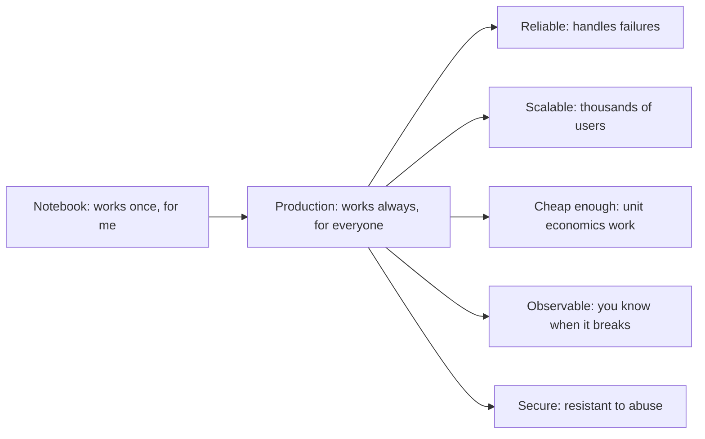
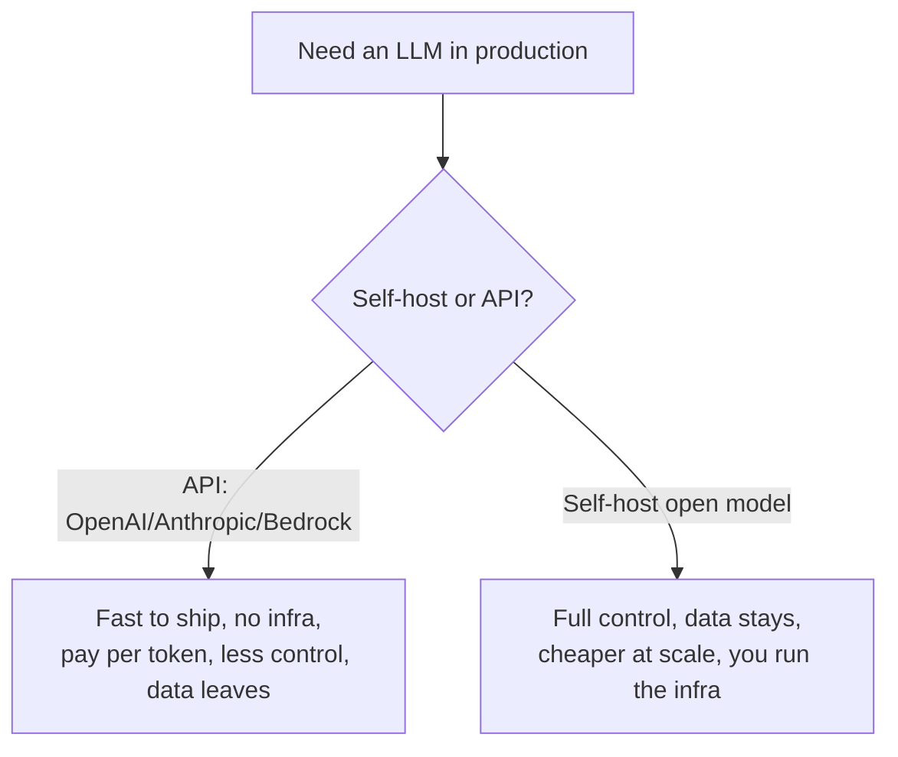
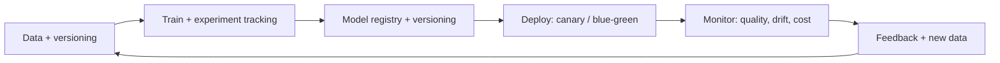
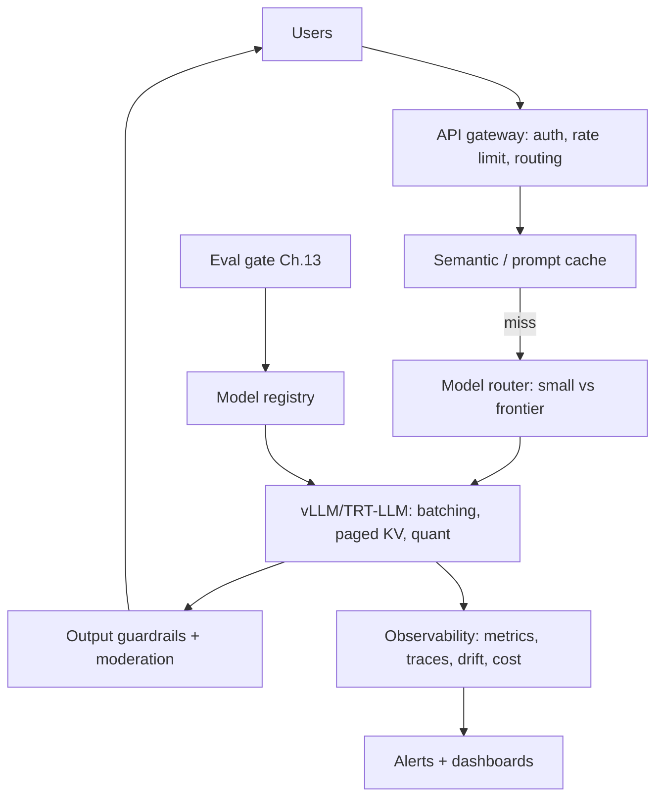

# Chapter 17 — Serving & MLOps

> A model that only runs in your notebook is worth nothing. **Serving** turns a trained model into a reliable, scalable, affordable product; **MLOps** keeps the whole system healthy in production. This is the "last mile" that most learners skip — and exactly why engineers who can ship are so valued. It's the core of the "applied/production AI" specialization.

This chapter covers deploying LLMs, the serving stack, containerization and orchestration, observability, cost engineering, and the operational discipline that keeps models working after launch.

---

## 17.1 What changes when you go to production

In a notebook you run one request at a time and crashes don't matter. In production you face concurrency, latency SLAs, cost ceilings, failures, security, and the fact that **the world changes after you deploy**. The mindset shift:



---

## 17.2 Serving LLMs — use a purpose-built engine

You *could* wrap a model in a Flask API. **Don't** — naive serving wastes the GPU catastrophically (no batching, no KV-cache management). Use a dedicated **inference engine** that implements everything from Chapter 10.

| Engine | Strength |
|--------|----------|
| **vLLM** | continuous batching + PagedAttention; great throughput, popular default |
| **TensorRT-LLM** | NVIDIA's max-performance compiled engine |
| **TGI** (Text Generation Inference) | HF's production server |
| **SGLang** | fast, strong for structured output & prefix caching |
| **Ollama / llama.cpp** | local/edge, quantized, CPU-friendly |

```python
# vLLM exposes an OpenAI-compatible server with all of Chapter 10 built in:
#   python -m vllm.entrypoints.openai.api_server --model my-model --tensor-parallel-size 2
# It handles continuous batching, PagedAttention KV cache, and quantization for you.
from openai import OpenAI
client = OpenAI(base_url="http://localhost:8000/v1", api_key="x")
resp = client.chat.completions.create(
    model="my-model",
    messages=[{"role": "user", "content": "Explain MLOps in one line."}],
    stream=True,          # STREAM tokens for low perceived latency (see below)
)
```

> **Why a real engine is non-negotiable:** the difference between naive serving and vLLM-style serving is often **10×+ throughput** on the same GPU — i.e., 10× lower cost per token. Continuous batching and PagedAttention (Chapter 10) are not optional niceties; they're the economics of the entire product. "I'd serve with vLLM for continuous batching and paged KV cache" is the expected production answer.

### Streaming — the UX multiplier

Stream tokens as they're generated (Server-Sent Events) so the user sees output *immediately* instead of waiting for the full response. It doesn't change total latency but transforms *perceived* latency — the reason chatbots feel responsive. TTFT (Chapter 10) becomes the metric users actually feel.

---

## 17.3 The build/buy decision (a real architectural choice)



| Factor | Hosted API | Self-hosted |
|--------|-----------|-------------|
| Time to ship | fastest | slower |
| Cost | per-token (great low volume, pricey high volume) | fixed GPU cost (wins at scale) |
| Control / customization | limited | full (fine-tunes, quantization) |
| Data privacy | leaves your boundary | stays in-house |
| Ops burden | none | significant |

> **Real-world judgment:** start with an API to validate the product fast; consider self-hosting when volume makes per-token costs hurt, when you need a custom fine-tune, or when data residency/privacy demands it. There's a clear **crossover point** where fixed GPU costs beat per-token pricing — computing it is a genuine engineering exercise interviewers respect. The wrong call in either direction wastes a lot of money.

---

## 17.4 Containerization & orchestration

| Tool | Role |
|------|------|
| **Docker** | package model + code + deps + CUDA into a reproducible image |
| **Kubernetes** | orchestrate containers: scaling, scheduling, self-healing, rollouts |
| **KServe / Ray Serve / BentoML** | ML-aware serving on top of K8s |
| **GPU operator** | expose GPUs to containers, manage drivers |

> **Why containers matter for ML specifically:** ML environments are dependency nightmares (exact CUDA/cuDNN/driver/torch version matrices). Docker makes "works on my machine" into "works everywhere," and is the *unit of deployment* for virtually all production ML. Kubernetes then handles the hard parts of running many containers reliably — autoscaling with traffic, restarting failed pods, rolling out new versions without downtime.

**GPU-specific autoscaling challenges:** GPUs are expensive and slow to spin up (large model weights to load), so naive "scale on CPU%" doesn't work. You scale on queue depth / GPU utilization / latency SLAs, often keep warm pools to avoid cold-start latency, and bin-pack models onto GPUs carefully.

---

## 17.5 The MLOps lifecycle — it doesn't end at deploy

Shipping is the *start*. MLOps is the discipline of operating ML systems continuously.



| Practice | What & why |
|----------|-----------|
| **Experiment tracking** | log configs, metrics, artifacts (W&B, MLflow) — reproducibility & comparison |
| **Data/model versioning** | know *exactly* what data and weights produced a result (DVC, model registry) |
| **CI/CD for models** | automated eval gates (Chapter 13!) before promotion |
| **Progressive rollout** | canary / blue-green / shadow to limit blast radius of a bad model |
| **Rollback** | one click back to the last good version when metrics drop |

> **The eval gate is the heart of ML CI/CD:** before any model reaches users, it must pass the regression suite from Chapter 13. This is how you avoid the classic disaster of shipping a model that scores higher on one metric but is worse for real users. Evals + progressive rollout + fast rollback = safe iteration.

---

## 17.6 Monitoring & observability — you can't fix what you can't see

Traditional software monitors latency/errors. ML systems need *that* **plus** quality and data monitoring, because a model can fail **silently** — still returning 200 OK, just with worse answers.

| Signal | Watch for |
|--------|-----------|
| **System metrics** | latency (TTFT/TPOT), throughput, error rate, GPU util/memory |
| **Quality metrics** | online eval scores, user feedback (thumbs), refusal/complaint rates |
| **Data drift** | input distribution shifting away from training/eval data |
| **Concept drift** | the right answer changing over time (the world moved) |
| **Cost** | tokens/request, $/request, cache hit rate |
| **Tracing** | full request traces for RAG/agents (which tool, which chunks) — LangSmith, Langfuse, OpenTelemetry |

> **The defining ML-ops problem — silent degradation:** a fraud model trained on last year's patterns slowly rots as fraud evolves (**concept drift**); a RAG system degrades as your docs change (**data drift**). Nothing *errors* — quality just quietly drops. Detecting drift and degradation, then triggering retraining or alerts, is the core of ML monitoring and a frequent interview topic. **Tracing** is especially vital for agents/RAG (Chapter 12): when an agent gives a bad answer, you need to see *every* reasoning step, tool call, and retrieved chunk to debug it.

---

## 17.7 Cost engineering — the skill that pays for itself

At scale, inference cost dominates and small optimizations compound into huge savings. A production AI engineer is, partly, a cost engineer.

| Lever | Savings | From |
|-------|---------|------|
| **Right-size the model** | huge | use the smallest model that passes evals; route easy queries to small models |
| **Quantization** | 2–4× memory/throughput | Chapter 10 |
| **Continuous batching** | several× throughput | Chapter 10 |
| **Prompt/prefix caching** | big for repeated prompts | Chapter 10 — Anthropic/OpenAI expose this |
| **Semantic caching** | skip the model entirely for repeat questions | embed query, return cached answer if similar |
| **Spot/preemptible GPUs** | up to ~70% off | for fault-tolerant batch/training work |
| **Model routing / cascades** | big | try cheap model first, escalate only if needed |

```python
# Semantic cache: if a new query is very similar to a past one, skip the LLM entirely.
def semantic_cache_lookup(query, cache, embed, threshold=0.95):
    q = embed(query)
    for cached_q, cached_answer in cache.items():
        if cosine_similarity(q, embed(cached_q)) > threshold:
            return cached_answer        # cache hit -> zero LLM cost, instant
    return None                         # miss -> call the model, then store

def cosine_similarity(a, b):
    import numpy as np
    return (a @ b) / (np.linalg.norm(a) * np.linalg.norm(b))
```

> **Real-world impact:** **model routing/cascades** — answer easy queries with a small cheap model and escalate only the hard ones to a frontier model — can cut costs dramatically while preserving quality, because most production traffic is easy. Combined with caching and right-sizing, cost engineering routinely saves *the majority* of an inference bill. Framing your work in dollars-saved is exactly how to get noticed and promoted.

---

## 17.8 Production security & reliability

Tie back to the book's security posture — production LLMs are attack surfaces:

- **Prompt injection / jailbreaks** (Chapters 12–13): treat user and retrieved content as untrusted; filter inputs/outputs; least-privilege tools.
- **Rate limiting & abuse prevention:** stop cost-bombing and scraping.
- **PII handling:** redaction, data-retention policies, compliance (GDPR, etc.).
- **Output guardrails:** moderation/safety classifiers on responses; refuse policy-violating output.
- **Graceful degradation:** fall back to a smaller model or cached/templated response when the primary is down or overloaded — never hard-fail the user.

> A production AI system must be **reliable *and* safe**, not just accurate. Designing fallbacks, guardrails, and abuse defenses is part of senior engineering — and, per this book's operational rules, you confirm before destructive actions and never bypass safety controls.

---

## 17.9 The full production picture



Every piece traces to earlier chapters: the engine is Chapter 10, the eval gate is Chapter 13, the guardrails are Chapters 12–13, the cost levers are Chapter 10. Serving/MLOps is where the whole book becomes a *product*.

---

## Interview signal

- **Q: "How would you deploy an LLM in production?"** → Dedicated engine (vLLM) for continuous batching + paged KV; containerize (Docker), orchestrate (K8s) with GPU-aware autoscaling; stream tokens; gate releases on evals; monitor quality/drift/cost.
- **Q: "API vs self-hosting?"** → API to ship fast / low volume; self-host for scale economics, customization, or data privacy; compute the cost crossover.
- **Q: "How do you monitor an LLM in production?"** → System metrics + quality (online evals, user feedback) + data/concept drift + cost + request tracing; watch for *silent* degradation.
- **Q: "How do you cut inference cost?"** → Right-size/route models, quantize, continuous batching, prompt/semantic caching, spot instances; frame in dollars saved.
- **Q: "What is concept/data drift?"** → Input distribution or correct-answer mapping changing over time → silent quality decay → detect and trigger retraining.
- **Q: "Why not just use Flask for serving?"** → No batching/KV management → terrible GPU utilization; purpose-built engines give 10×+ throughput.

---

## Exercises

1. Serve an open model with vLLM; load-test it (concurrent requests) and measure throughput vs a naive single-request Flask baseline.
2. Containerize a small model API with Docker (CUDA base image); run it and document the dependency pinning.
3. Build a semantic cache in front of an LLM; measure hit rate and cost savings on repeated queries.
4. Implement a model router: classify query difficulty and send easy ones to a small model; measure cost vs quality.
5. Add observability: log TTFT, TPOT, tokens, and cost per request to a dashboard; simulate drift and alert on it.
6. Compute the API-vs-self-host cost crossover for a given QPS and model size.

## Key takeaways

- Production demands reliability, scale, cost-efficiency, observability, and security — far beyond "it works in a notebook."
- Serve LLMs with purpose-built engines (vLLM/TRT-LLM) that implement Chapter 10; never naive Flask. Stream tokens for perceived latency.
- API vs self-host is a real cost/control/privacy tradeoff with a computable crossover point.
- Docker + Kubernetes are the deployment substrate; GPU autoscaling needs queue/utilization/SLA signals and warm pools.
- MLOps is continuous: experiment tracking, versioning, eval-gated CI/CD, progressive rollout, fast rollback.
- Monitor for *silent* failure (quality, data/concept drift) and trace agents/RAG; cost engineering (routing, caching, quantization) saves the majority of inference spend.

**Next:** [Chapter 18 — Specialization Tracks](../part-5-career/18-specialization.md)
