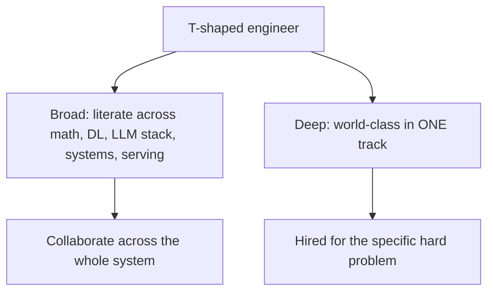
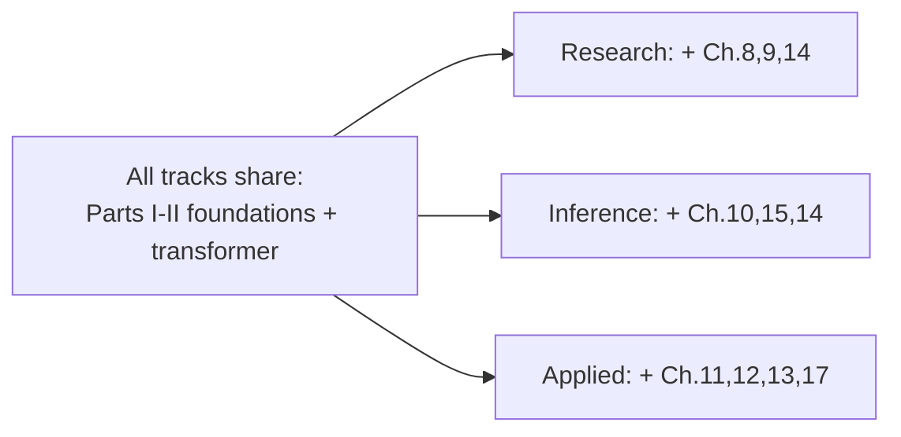

# Chapter 18 — Specialization Tracks

> You cannot be world-class at everything. The cracked engineers are **T-shaped**: broad literacy across the whole stack (Parts I–IV) plus *world-class depth* in one area. This chapter helps you pick that depth — the spike on your T — and shows what mastery looks like in each track.

Depth is what gets you hired for the *specific* hard problem a team has. Breadth is what lets you collaborate across the system. You need both, but the spike is what makes you memorable.

---

## 18.1 Why specialize (the T-shaped engineer)

> **The hard truth:** a generalist who knows a little of everything competes with thousands of others. A specialist who is *the person* for, say, inference kernels competes with a handful — and gets the offer. Pick a spike, go deep enough to contribute at the frontier, and *keep* your breadth so you can work across teams.

The three tracks below map to how frontier labs actually structure work. They overlap, and you can shift between them over a career, but at any moment, aim your deepest energy at one.

---

## 18.2 Track 1 — Research / Training Engineer

**You make models *smarter*.** You work on architectures, training, pretraining data, and alignment — turning research ideas into trained models, and reproducing/extending papers.

**Core chapters:** 5, 6, 8, 9 (the heart), plus 14 (you train at scale) and 2 (deep math).

| You master | Why |
|------------|-----|
| Training dynamics & stability | you debug divergence, tune schedules, fix loss spikes (Ch.8) |
| Architecture design | you propose and ablate model changes (Ch.7) |
| Post-training & alignment | SFT/DPO/RLHF/RLAIF, the frontier of capability + safety (Ch.9) |
| Data pipelines | the real quality moat (Ch.8) |
| Distributed training | you run thousand-GPU jobs (Ch.14) |
| Reading/reproducing papers | your daily bread |

**What mastery looks like:** you can read a new paper, reproduce its core result in days, identify its weakness, and propose an improvement. You think in experiments and ablations.

> **Who hires this:** the *research* orgs at Anthropic, DeepMind, OpenAI, Meta FAIR, plus well-funded startups. **The #1 proof of work:** a clean reproduction of a notable paper *with* an extension or insight, written up clearly. This single artifact is the strongest signal for this track.

**Signature portfolio project:** reproduce DPO (or a small RLHF pipeline) on a 1B model, ablate a design choice, and publish the writeup + code.

---

## 18.3 Track 2 — Inference / Systems / Performance Engineer

**You make models *faster and cheaper*.** You live in the GPU, the kernels, the serving stack. This is the rarest skill set relative to demand, and arguably the most defensible.

**Core chapters:** 15 (the heart), 10, 14, plus 4 (architecture) and 3 (a systems language).

| You master | Why |
|------------|-----|
| GPU programming (CUDA/Triton) | you write the fast kernels (Ch.15) |
| Memory hierarchy & roofline | you find and fix the real bottleneck (Ch.4, 15) |
| Inference optimization | KV cache, quantization, speculative decoding, batching (Ch.10) |
| Distributed systems | TP/PP/FSDP, communication overlap, MFU (Ch.14) |
| Compilers/runtimes | torch.compile, XLA, TensorRT (Ch.16) |

**What mastery looks like:** given a slow model, you profile it, identify whether it's compute- or memory-bound, write a fused/custom kernel or fix the parallelism layout, and produce a measured multiple-X speedup.

> **Who hires this:** *everyone*, desperately — frontier labs, NVIDIA, inference startups (together.ai, Fireworks, Baseten), and every company with a serving bill. Demand vastly exceeds supply because few engineers go this deep. **The #1 proof of work:** a custom kernel (Triton/CUDA) or an inference-engine contribution (e.g., to vLLM) with **benchmarks** proving the speedup.

**Signature portfolio project:** implement a fused attention or a custom Triton kernel, benchmark it against the PyTorch baseline, and write up the memory-hierarchy reasoning — or land a performance PR in vLLM.

---

## 18.4 Track 3 — Applied AI / Agents / Product Engineer

**You make models *useful*.** You build the products: RAG systems, agents, tool use, evals, and the production serving that makes them reliable. You're closest to users and impact.

**Core chapters:** 12 (the heart), 13, 17, plus 11 (fine-tuning) and 10 (serving knowledge).

| You master | Why |
|------------|-----|
| RAG & retrieval | grounded, cited, production-grade (Ch.12) |
| Agents & tool use | reason→act loops, function calling, MCP (Ch.12) |
| Evaluation | rigorous, domain-specific eval harnesses (Ch.13) |
| Fine-tuning | LoRA/QLoRA to adapt behavior (Ch.11) |
| Serving & MLOps | reliable, observable, cost-engineered (Ch.17) |
| Product judgment | prompt vs RAG vs fine-tune; cost/quality/latency tradeoffs |

**What mastery looks like:** you take a vague product goal and ship a reliable, evaluated, cost-aware LLM system — and you *measure* that it actually works.

> **Who hires this:** the overwhelming majority of companies (every business adopting AI), product teams at the labs, and AI-native startups. It's the largest job market by far. **The #1 proof of work:** a *real, deployed* application people use, with a rigorous eval harness proving it works — evals are the differentiator that separates you from the "I built a chatbot" crowd.

**Signature portfolio project:** a deployed agent or RAG product solving a genuine problem, *with* a public eval harness and a writeup of the tradeoffs (and ideally real users).

---

## 18.5 Comparing the tracks

| | Research/Training | Inference/Systems | Applied/Agents |
|---|---|---|---|
| **You make models** | smarter | faster/cheaper | useful |
| **Lives in** | training runs, papers | GPU, kernels, serving | products, evals |
| **Heart chapters** | 8, 9 | 10, 15 | 12, 13 |
| **Math intensity** | highest | high | moderate |
| **Systems intensity** | high | highest | moderate |
| **Job market size** | smaller, elite | growing, undersupplied | largest |
| **Top proof of work** | reproduce+extend a paper | benchmarked kernel/engine PR | deployed product + evals |

---

## 18.6 How to choose

Ask yourself what you reach for *unprompted*:

- Do you love **math, papers, and "why does this model behave this way?"** → **Research/Training.**
- Do you love **squeezing performance, profiling, and "why is this slow?"** → **Inference/Systems.**
- Do you love **building things people use and "does this actually work for users?"** → **Applied/Agents.**

> **Practical advice:**
> - **Don't choose forever.** Pick the one that excites you *now*, go deep for 6–12 months, ship proof of work. You can pivot later — the foundations transfer.
> - **The market angle:** Inference/Systems is the most *undersupplied* relative to demand, so depth there is disproportionately valuable. Applied has the *most* jobs. Research is the most *competitive* but highest-prestige. Factor this in, but **follow genuine interest** — depth requires sustained obsession, and you only sustain it on something you actually enjoy.
> - **Anthropic/DeepMind/OpenAI specifically** hire heavily across all three, but their *research* and *systems* roles are where "cracked" reputation is forged. Their applied/product teams are growing fast too.

---

## 18.7 The through-line: depth + proof + breadth

Whatever you choose, the formula is identical (and it's the whole book's thesis):

1. **Foundations** (Parts I–II) — non-negotiable for every track.
2. **Depth** in your track's heart chapters — go to the frontier.
3. **Proof of work** — the signature project that *demonstrates* the depth.
4. **Breadth** — stay literate across the rest so you collaborate and aren't boxed in.

Chapter 19 turns this into an actual job offer.

---

## Key takeaways

- Be T-shaped: broad literacy + world-class depth in one track. Depth gets you hired; breadth lets you collaborate.
- **Research/Training:** make models smarter — architectures, training, alignment; proof = reproduce+extend a paper.
- **Inference/Systems:** make models faster/cheaper — kernels, GPU, serving; proof = benchmarked kernel or engine PR. Most undersupplied.
- **Applied/Agents:** make models useful — RAG, agents, evals, serving; proof = deployed product + rigorous evals. Largest market.
- Choose by what you do unprompted; go deep 6–12 months; you can pivot later because foundations transfer.

**Next:** [Chapter 19 — Getting Hired & Interview Prep](19-getting-hired.md)
