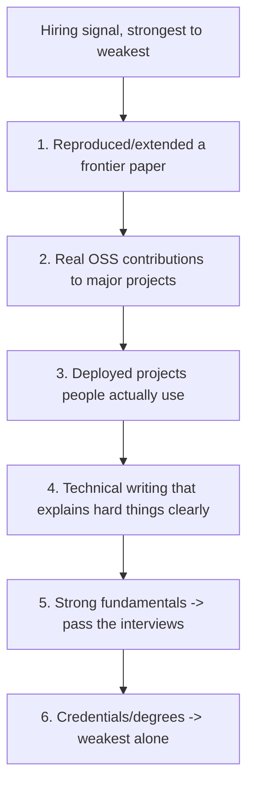
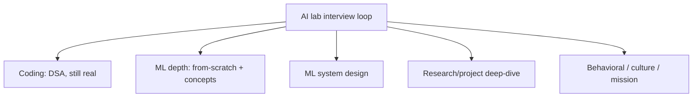

# Chapter 19 — Getting Hired & Interview Prep

> You've done the work: foundations, a transformer from scratch, the LLM stack, the systems. This final chapter converts *ability* into an *offer*. It's about proof of work, the interview loop, the study plan, and the reading list — the bridge from "I can do this" to "they hired me."

The thesis of the whole book, one last time: **depth + public proof beats a checklist of buzzwords.** Here's how to make that legible to the people who hire.

---

## 19.1 What actually gets you hired

The uncomfortable truth: *credentials and course certificates barely move the needle* at top AI labs. What moves it is **evidence you can build hard things.** In rough order of signal strength:

> **The meta-point:** every item above is an **artifact** — something someone else can look at. "I understand transformers" is unverifiable. "Here's my from-scratch transformer, my vLLM PR, and my writeup of why FlashAttention works" is *proof*. Spend your effort producing artifacts, not consuming content. This is the compounding strategy from Chapter 1, cashed in.

---

## 19.2 Build in public — the portfolio

A GitHub full of *real* work beats a polished resume. Quality over quantity — **three genuinely impressive projects** beat thirty tutorial clones.

### What makes a project impressive

- It's **hard** (shows you can do hard things), **original** (not a copied tutorial), **finished** (works end-to-end), **documented** (clear README + writeup), and ideally **used by others** (stars, forks, dependents).

### Portfolio projects by track (pick 2–3 in your track from Chapter 18)

**Foundational (everyone should have one):**
- A transformer/GPT from scratch, trained, with a writeup of each component (Chapter 6).
- A from-scratch autograd engine (Chapter 5).

**Research/Training track:**
- **Reproduce a paper end-to-end** (DPO, LoRA, a small RLHF loop) + an ablation/extension. *The single highest-signal project.*
- A small but complete LLM build: data → tokenizer → pretrain → SFT → DPO (the CS336 capstone).

**Inference/Systems track:**
- A custom **Triton/CUDA kernel** (e.g., fused attention) benchmarked vs PyTorch, with the roofline reasoning written up (Chapter 15).
- A **performance PR to vLLM / TGI / PyTorch** — landing real code in a major inference project is elite signal.

**Applied/Agents track:**
- A **deployed** RAG or agent product solving a real problem, **with a rigorous eval harness** (Chapters 12–13, 17).
- An **MCP server** exposing a useful tool/data source (Chapter 12).

> **Real-world:** people have been hired at top labs essentially *because of* a single viral reproduction or a celebrated OSS contribution. The work *is* the application. A great project also gives you something concrete and genuine to talk about in every interview — which is worth more than any rehearsed answer.

---

## 19.3 Open source — the strongest external credential

Contributing to the tools the field actually uses (PyTorch, Hugging Face `transformers`, **vLLM**, `nanoGPT`, `llama.cpp`, TRL, Triton) proves you can work in a large, real codebase to a standard others accept.

**How to start (realistic path):**
1. *Use* the library deeply for your own project — you'll hit rough edges.
2. Fix a small thing first: a doc error, a clear bug, a "good first issue."
3. Engage the maintainers respectfully; learn their conventions and review culture.
4. Grow into larger features over time.

> **Why a merged PR is so powerful:** it's third-party validation. A maintainer of a project that powers real AI systems reviewed your code and accepted it. That's a credential no certificate matches — and it demonstrates exactly the collaboration skills (Chapter 3's engineering rigor) that labs screen for. Even one solid merged PR to a major project meaningfully changes how your application reads.

---

## 19.4 Write — thinking made visible

These labs hire people who **think clearly**, and writing is thinking made visible. A blog post explaining a hard concept *well* does triple duty: it deepens your own understanding, demonstrates communication, and gets discovered.

**What to write:**
- Explain a hard concept clearly (your FlashAttention writeup, your DPO derivation).
- Document a project and what you learned (including the failures — those read as honest and experienced).
- Reproduce-and-analyze a paper.

> **Real-world:** several influential AI people built their reputations substantially through *writing* (Karpathy's blog/videos, Lilian Weng's deep-dives, Jay Alammar's "Illustrated Transformer"). Clear writing about deep technical work is rare and disproportionately rewarded — it travels, it gets cited, and it makes you *findable* by recruiters and teams. Publish consistently; compounding applies to an audience too.

---

## 19.5 The interview loop — what to expect

Top AI labs typically test across these dimensions. **Map your prep to all of them** — a weakness in any one can sink the loop.

### 1. Coding (yes, still)
Medium/hard DSA, often with an ML flavor (implement attention, top-k sampling, a tokenizer, a small training loop). **Keep LeetCode-style fluency sharp** (Chapter 4) — strong ML knowledge does *not* excuse a failed coding screen.

### 2. ML depth
Implement-from-scratch (attention, backprop, a layer) and concept questions (the "interview signal" sections throughout this book are a question bank). Expect "why?" follow-ups that probe true understanding, not memorization.

### 3. ML system design
Open-ended: *"Design a system to serve a 70B model to 1M users"* or *"design a RAG system for legal documents."* They want structured thinking across the whole stack — model choice, serving (Ch.10/17), retrieval (Ch.12), evals (Ch.13), cost (Ch.17), failure modes. Practice talking through tradeoffs out loud.

### 4. Research / project deep-dive
You present a project or paper; they probe *hard*. This is where your portfolio pays off — **deeply know everything you claim**. They'll push on your design choices, alternatives you rejected, and what you'd do differently. Owning your work's limitations reads as senior.

### 5. Behavioral & mission
Why this lab? How do you handle ambiguity, failure, collaboration? **Mission fit matters a lot** at Anthropic/DeepMind/OpenAI — be genuine about why the work matters to you (recall the strong-vs-weak answer in Chapter 1).

> **The integration insight:** these dimensions aren't separate subjects — they're facets of the *same* understanding this book built. The from-scratch transformer (Ch.6) covers ML depth *and* the coding round; the serving chapter (Ch.17) covers system design; your portfolio (this chapter) covers the deep-dive. Prepared correctly, you're not cramming five topics — you're demonstrating one coherent capability.

---

## 19.6 A 6-question self-check before applying

If you can confidently do all six, you're ready to interview at a serious AI lab:

1. Implement multi-head attention from scratch, from memory, and explain every line.
2. Derive backprop for a 2-layer MLP on a whiteboard.
3. Explain DPO vs RLHF and *why* DPO is more stable.
4. Explain why FlashAttention is faster without changing the math.
5. Design an end-to-end system to serve an LLM at scale, naming the key tradeoffs.
6. Walk through a project you built, defending every design decision under pressure.

(Each maps to a chapter: 6, 5, 9, 15, 10/17, and this one.)

---

## 19.7 The study plan & curated resources

### The 18-month sequence (from the README, now actionable)

```mermaid
gantt
    title Path to Cracked
    dateFormat X
    axisFormat %s
    section Months 0-3
    Math + Python + DSA + NN from scratch :0, 3
    section Months 3-9
    Full LLM build + PyTorch + first serious project :3, 6
    section Months 9-18
    Specialize + reproduce a paper + OSS + writing + apply :9, 9
```

- **Months 0–3 (Foundations):** Math (Ch.2), Python/DSA (Ch.3–4), and **Karpathy's "Zero to Hero"** — build an MLP and a transformer from scratch (Ch.5–6). Artifact: from-scratch GPT.
- **Months 3–9 (Build):** **Stanford CS336** (build an LLM end-to-end), master PyTorch (Ch.16), learn the LLM stack (Ch.7–13). Artifact: first serious project + writeup.
- **Months 9–18 (Specialize & apply):** Pick a track (Ch.18), **reproduce a frontier paper**, make real **OSS** contributions, **write** about it, then apply. Artifact: signature project + merged PR + blog posts.

### High-signal resources (all referenced throughout the book)

| Resource | For |
|----------|-----|
| **Karpathy — "Neural Networks: Zero to Hero"** | the from-scratch foundation (Ch.5–6) |
| **Karpathy — `nanoGPT`, `llm.c`** | a real, minimal GPT to train and modify |
| **Stanford CS336 — "Language Modeling from Scratch"** | the single most relevant course; build an LLM end-to-end |
| **Chip Huyen — *AI Engineering* (2024)** & *Designing ML Systems* | the applied/production bible (Ch.12, 13, 17) |
| **Lilian Weng's blog** | deep, clear surveys (alignment, agents, etc.) |
| **The Illustrated Transformer / The Annotated Transformer** | visual + code intuition for Ch.6 |
| **OpenAI Spinning Up** | RL foundations for the alignment track (Ch.9) |
| **Hugging Face courses (NLP, Deep RL)** | hands-on with the real ecosystem |
| **The vLLM / FlashAttention codebases & papers** | systems depth (Ch.10, 15) |

### Must-read papers (the canon)

> Attention Is All You Need · GPT-2/GPT-3 · InstructGPT (RLHF) · Chinchilla (scaling) · LLaMA · LoRA / QLoRA · DPO · Constitutional AI · FlashAttention · the Mixtral/MoE and DeepSeek-R1 reports.

Don't just *read* them — **reproduce at least one**. Reading builds vocabulary; reproducing builds the ability that gets you hired.

---

## 19.8 Final word

The path is long but the formula is simple, and you now have the whole map:

1. **Master the foundations** so nothing downstream is magic (Parts I–II).
2. **Learn the modern stack** deeply (Part III).
3. **Go deep on systems** to cross from good to cracked (Part IV).
4. **Specialize**, **build public proof**, **write**, and **apply** (Part V).

> Every concept in this book exists to make you the engineer who can take an idea from a blank file to a trained, aligned, deployed, *fast* system — and explain every line. That engineer is rare. That engineer is what Anthropic, DeepMind, OpenAI, and Microsoft are hiring. Now go build the proof. The work *is* the application.

---

## Keep going — the frontier electives

The core path ends here, but the frontier keeps moving. **[Part VI — Frontier & Specialized Topics](../part-6-frontier/20-diffusion-multimodal.md)** is three optional deep-dives that turn your chosen track into world-class depth:

- **[Chapter 20 — Diffusion & Multimodal](../part-6-frontier/20-diffusion-multimodal.md)** — generate images and teach a model to *see* (no longer text-only).
- **[Chapter 21 — Deep Reinforcement Learning](../part-6-frontier/21-deep-rl.md)** — the engine under RLHF and reasoning models.
- **[Chapter 22 — Mechanistic Interpretability](../part-6-frontier/22-interpretability.md)** — the research-engineering differentiator.

**Next:** [Chapter 20 — Diffusion & Multimodal Models](../part-6-frontier/20-diffusion-multimodal.md)

## Key takeaways

- Credentials barely matter; **artifacts** (reproduced papers, OSS PRs, deployed projects, writing) are the real application.
- Build 2–3 genuinely impressive projects in your track; "the work is the application."
- One merged PR to a major project (PyTorch, vLLM, HF) is an unmatched external credential.
- Write to make your thinking visible — it deepens understanding, proves communication, and makes you findable.
- The interview loop tests coding, ML depth, system design, project deep-dive, and mission fit — all facets of the one capability this book built.
- Follow the 18-month plan, use the canonical resources, reproduce at least one paper, then apply. Depth + public proof beats buzzwords — every time.

---

### ← Back to [the Table of Contents](../README.md)
