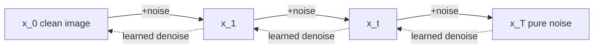
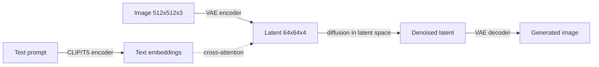
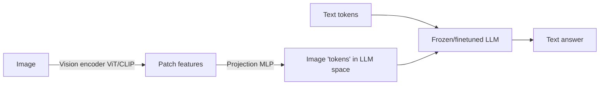

# Chapter 20 — Diffusion & Multimodal Models

> Everything so far in this book has been **text**. But the frontier is multimodal: models that *see*, *hear*, and *generate* pixels and audio. This chapter closes the biggest gap in a text-only education — how images are generated (diffusion) and how an LLM learns to see (vision-language models). If you want to work at a lab shipping Gemini-, GPT-4o-, or Claude-class multimodal systems, you need this.

Two big ideas: **diffusion** (the dominant way to *generate* images/video/audio) and **multimodal fusion** (how you bolt a sense of sight onto a language model). We build both from first principles.

---

## 20.1 The generative landscape

To *generate* data you must model a distribution $p(x)$ and sample from it. Three families dominate:

| Family | Idea | Strength | Weakness |
| --- | --- | --- | --- |
| **Autoregressive** | factor $p(x)=\prod p(x_i\mid x_{<i})$, predict next token/pixel | exact likelihood, one architecture for all modalities | slow (sequential), hard for high-res images |
| **GANs** | a generator vs a discriminator game | sharp, fast sampling | unstable training, mode collapse |
| **Diffusion** | gradually denoise pure noise into data | stable training, SOTA image/video quality, controllable | many sampling steps (slow-ish) |

Diffusion won image/video/audio generation (Stable Diffusion, DALL·E, Imagen, Sora, Midjourney) because it trains stably and scales. Autoregression still rules text — and, increasingly, *unifies* with image generation in native-multimodal models. Let's understand diffusion deeply.

---

## 20.2 The diffusion idea in one picture

**Forward process:** take a clean image and add a little Gaussian noise, over and over, for $T$ steps, until it's indistinguishable from pure noise. This is fixed — no learning.

**Reverse process:** learn a neural network that undoes *one* step of noising. Chain it $T$ times and you turn random noise into a sample from the data distribution.



> **The deep intuition:** generation is *hard*, but **denoising is easy**. We never ask the network to paint a cat from nothing; we ask it to remove a tiny bit of noise — a much easier, well-posed regression problem — and we just do it many times. Breaking an impossible task into many trivial ones is the whole trick.

---

## 20.3 The forward process (fixed noising)

Define a variance schedule $\beta_1,\dots,\beta_T$ (small, increasing). One forward step:

$$q(x_t \mid x_{t-1}) = \mathcal{N}\!\big(x_t;\ \sqrt{1-\beta_t}\,x_{t-1},\ \beta_t \mathbf{I}\big)$$

The magic: with $\alpha_t = 1-\beta_t$ and $\bar\alpha_t = \prod_{s=1}^t \alpha_s$, you can jump to *any* step $t$ in closed form (no loop):

$$x_t = \sqrt{\bar\alpha_t}\,x_0 + \sqrt{1-\bar\alpha_t}\,\epsilon, \qquad \epsilon \sim \mathcal{N}(0,\mathbf{I})$$

> **Why this closed form matters:** training samples a *random* timestep $t$ per example and jumps straight there — no need to simulate all $t$ steps. This is what makes diffusion training cheap and parallelizable. As $t\to T$, $\bar\alpha_t\to 0$ and $x_t$ becomes pure noise.

```python
import numpy as np

T = 200
betas = np.linspace(1e-4, 0.02, T)         # linear schedule (DDPM default)
alphas = 1.0 - betas
alpha_bar = np.cumprod(alphas)             # ᾱ_t

def q_sample(x0, t, eps=None):
    """Jump straight to noised x_t (the closed-form forward process)."""
    if eps is None:
        eps = np.random.randn(*x0.shape)
    return np.sqrt(alpha_bar[t]) * x0 + np.sqrt(1 - alpha_bar[t]) * eps, eps
```

---

## 20.4 The reverse process & the training objective

We train a network $\epsilon_\theta(x_t, t)$ to **predict the noise** $\epsilon$ that was added. The full variational derivation (DDPM, Ho et al. 2020) collapses to a stunningly simple loss:

$$\mathcal{L} = \mathbb{E}_{x_0,\,t,\,\epsilon}\Big[\ \big\|\ \epsilon - \epsilon_\theta\big(\sqrt{\bar\alpha_t}\,x_0 + \sqrt{1-\bar\alpha_t}\,\epsilon,\ t\big)\ \big\|^2\ \Big]$$

In words: noise an image to a random level $t$, ask the network what noise you added, penalize the squared error. **It's just MSE regression on noise.** That's the entire training loop.

```python
# Training loop skeleton (network = any regressor that takes (x_t, t)).
def train_step(model, x0):
    t = np.random.randint(0, T)                  # random noise level
    x_t, eps = q_sample(x0, t)                    # forward noising
    eps_pred = model(x_t, t)                       # predict the noise
    loss = ((eps - eps_pred) ** 2).mean()          # simple MSE
    return loss                                    # .backward() in PyTorch
```

> **Why predict noise, not the image?** Predicting $\epsilon$ (equivalent up to reparameterization to predicting $x_0$ or the "velocity" $v$) empirically gives the best-conditioned targets across noise levels and is the standard. Knowing these three parameterizations — $\epsilon$-, $x_0$-, and $v$-prediction — and that they're algebraically interchangeable is a common interview probe.

### Sampling (turning noise into an image)

Start from $x_T \sim \mathcal{N}(0,\mathbf I)$ and iterate the reverse step:

$$x_{t-1} = \frac{1}{\sqrt{\alpha_t}}\Big(x_t - \frac{1-\alpha_t}{\sqrt{1-\bar\alpha_t}}\,\epsilon_\theta(x_t,t)\Big) + \sigma_t z,\quad z\sim\mathcal N(0,\mathbf I)$$

```python
def ddpm_sample(model, shape):
    x = np.random.randn(*shape)                    # start from pure noise
    for t in reversed(range(T)):
        eps = model(x, t)
        mean = (x - (1 - alphas[t]) / np.sqrt(1 - alpha_bar[t]) * eps) / np.sqrt(alphas[t])
        x = mean + (np.sqrt(betas[t]) * np.random.randn(*shape) if t > 0 else 0)
    return x                                        # a fresh sample
```

---

## 20.5 Faster sampling & guidance

**DDPM needs ~1000 steps** — slow. Two crucial upgrades:

- **DDIM** (Denoising Diffusion *Implicit* Models): a deterministic reverse process that produces good samples in **20–50 steps** instead of 1000. Same trained network, different sampler. Modern distillation (LCM, consistency models) pushes this to **1–4 steps**.
- **Classifier-Free Guidance (CFG):** the single most important trick for *controllable* generation. Train the model both *with* a condition $c$ (e.g., a text prompt) and *without* it (drop $c$ a fraction of the time). At sampling, extrapolate:

$$\tilde\epsilon_\theta(x_t, c) = \epsilon_\theta(x_t, \varnothing) + s\big(\epsilon_\theta(x_t, c) - \epsilon_\theta(x_t, \varnothing)\big)$$

The guidance scale $s>1$ pushes samples *harder* toward the prompt (sharper, more on-prompt, less diverse).

> **Why CFG is everywhere:** it's how "a photo of an astronaut riding a horse" actually looks like the prompt. The scale $s$ is the knob users feel as "prompt strength." It needs *no extra classifier* — just the conditional and unconditional predictions from the same model. Being able to explain the $\epsilon_\varnothing + s(\epsilon_c-\epsilon_\varnothing)$ extrapolation is high signal.

---

## 20.6 Latent Diffusion & Stable Diffusion

Running diffusion on raw $512\times512\times3$ pixels is expensive. **Latent Diffusion** (the basis of Stable Diffusion) does the smart thing:



1. A **VAE** compresses the image into a small latent (e.g., 48× fewer values).
2. Diffusion runs entirely **in latent space** — far cheaper.
3. Text conditioning enters via **cross-attention** in a **U-Net** (or, in newer systems, a **Diffusion Transformer / DiT**): the latent's queries attend to the prompt's key/value embeddings (Chapter 6's attention, reused!).
4. The VAE **decoder** maps the final latent back to pixels.

> **Why latent diffusion was a breakthrough:** it cut the compute ~50× and made high-res text-to-image runnable on a single consumer GPU — which is *why* Stable Diffusion could be open-sourced and ignited the generative-art explosion. The architecture is a beautiful reuse of pieces you already know: VAE + U-Net/DiT + cross-attention.

---

## 20.7 Multimodal LLMs — teaching a language model to see

Generation is half of multimodality; **perception** is the other half. A **Vision-Language Model (VLM)** like GPT-4o, Gemini, or Claude takes images *and* text in and reasons over both. The dominant recipe (LLaVA-style):



1. A **vision encoder** (a ViT, usually CLIP-pretrained) turns the image into a grid of patch embeddings.
2. A small **projection** (an MLP, or a resampler like Flamingo's Perceiver) maps those into the LLM's token embedding space — the image becomes a sequence of "soft tokens."
3. Those visual tokens are **concatenated with the text tokens** and fed to the (often frozen, then lightly fine-tuned) LLM, which attends across both seamlessly.

Training is two-stage: **(1) alignment** — freeze the LLM and vision encoder, train only the projection on image-caption pairs so visual tokens "speak the LLM's language"; **(2) instruction tuning** — fine-tune on multimodal instruction data (visual Q&A, OCR, charts).

> **The key insight:** once an image is a sequence of vectors in token space, the transformer *does not care* that they came from pixels — attention is modality-agnostic. This is why multimodality is mostly a *representation-and-projection* problem, not a new architecture. **Fusion strategies** to know: **late fusion / adapters** (LLaVA, Flamingo — bolt vision onto a text LLM) vs **early/native fusion** (Gemini, GPT-4o — trained multimodal from the start, often with a *unified* tokenizer that can also *generate* images autoregressively).

---

## 20.8 The unifying view & where it's going

- **One objective, many modalities.** Autoregression over a *unified token vocabulary* (text + image + audio tokens from a VQ/where each modality is tokenized) lets a single transformer both understand and generate everything — the direction of GPT-4o and Chameleon.
- **Flow Matching / Rectified Flow** is the modern reframing of diffusion: instead of a noising chain, learn a velocity field that transports noise to data along straight paths. It's simpler, trains stably, and underlies Stable Diffusion 3 and many 2024+ systems. Mentally: diffusion and flow matching are two views of the same "continuously turn noise into data" idea.
- **Video & 3D** (Sora, etc.) are diffusion/flow over space-time latents — same machinery, bigger tensors.

> **Career signal:** multimodal is where the marginal frontier capability is being added right now. Being able to (a) implement a toy diffusion model, (b) explain latent diffusion + CFG, and (c) describe how a VLM wires a vision encoder into an LLM puts you ahead of the "text-only" majority. A great portfolio project: train a small diffusion model on a toy dataset *or* build a LLaVA-style projector on top of a small open LLM and CLIP.

---

## Interview signal

- **Q: "Explain diffusion models from scratch."** → Fixed forward process adds Gaussian noise (closed form $x_t=\sqrt{\bar\alpha_t}x_0+\sqrt{1-\bar\alpha_t}\epsilon$); train $\epsilon_\theta$ to predict the noise with simple MSE; sample by iteratively denoising from $\mathcal N(0,I)$.
- **Q: "Why does diffusion train more stably than GANs?"** → It's a supervised regression (predict noise), not an adversarial minimax game — no discriminator, no mode collapse, no Nash-equilibrium instability.
- **Q: "What is classifier-free guidance?"** → Train with and without the condition; at sampling extrapolate $\epsilon_\varnothing + s(\epsilon_c-\epsilon_\varnothing)$ to push samples toward the prompt; $s$ trades fidelity for diversity.
- **Q: "Why latent diffusion?"** → Run diffusion in a VAE's compressed latent space (~50× cheaper) instead of pixels; condition via cross-attention; that's Stable Diffusion.
- **Q: "How does an LLM process images?"** → Vision encoder (ViT/CLIP) → projection into token-embedding space → concatenate with text tokens → the transformer attends across both; train projector first (alignment), then instruction-tune.
- **Q: "DDPM vs DDIM?"** → Same trained model; DDPM is stochastic, ~1000 steps; DDIM is deterministic, 20–50 steps — a faster sampler, not a different model.
- **Q: "ε-prediction vs x₀- vs v-prediction?"** → Algebraically interchangeable parameterizations of the same target; ε- and v-prediction are best-conditioned across noise levels.

---

> **▶ Run it live:** [`notebooks/20-diffusion-from-scratch.ipynb`](../notebooks/20-diffusion-from-scratch.ipynb) builds a full DDPM on a 2D spiral — the forward noising, a from-scratch denoiser, and the **reverse denoising trajectory** rendered frame by frame. (NumPy + matplotlib only — no PyTorch.)

## Exercises

1. Implement the closed-form forward process `q_sample` and visualize a 2D toy point cloud (e.g., a spiral) getting noised across $t=0\dots T$. Confirm it converges to an isotropic Gaussian.
2. Train a tiny MLP $\epsilon_\theta(x_t,t)$ (with a sinusoidal time embedding) to denoise the 2D spiral, then run the DDPM sampler and plot generated points over the real distribution.
3. Add **classifier-free guidance** to your toy model with two classes; show that increasing $s$ makes samples cluster tighter on the chosen class.
4. Implement DDIM sampling and compare sample quality at 1000 vs 50 vs 20 steps against DDPM.
5. Conceptually (or in code with CLIP + a small LLM): build a projection MLP that maps CLIP image features into an LLM's embedding dimension; describe the two-stage training and what each stage learns.

## Key takeaways

- Diffusion **generates by denoising**: a fixed forward noising process and a learned reverse process trained with **simple MSE on the added noise**.
- The closed-form $x_t=\sqrt{\bar\alpha_t}x_0+\sqrt{1-\bar\alpha_t}\epsilon$ makes training cheap (jump to any noise level).
- **DDIM** and distillation slash sampling steps; **classifier-free guidance** makes generation controllable.
- **Latent diffusion** (VAE + U-Net/DiT + cross-attention) is Stable Diffusion — diffusion in a compressed space.
- **VLMs** bolt sight onto an LLM by projecting vision-encoder features into token space; attention is modality-agnostic, so it "just works."
- **Flow matching** and **unified-token autoregression** are the converging frontier; video/audio/3D reuse the same machinery.

**Next:** [Chapter 21 — Deep Reinforcement Learning](21-deep-rl.md)
