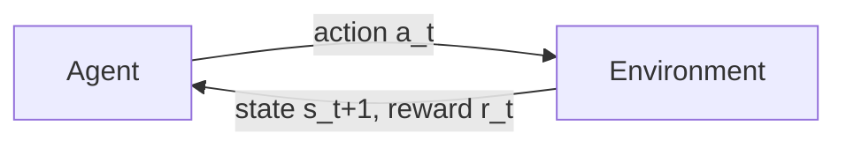
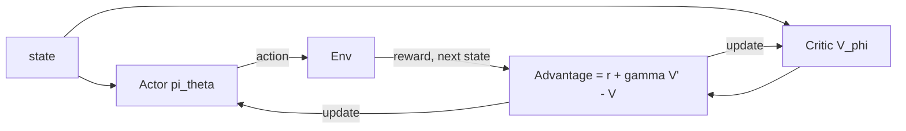

# Chapter 21 — Deep Reinforcement Learning

> In Chapter 9 we used **PPO** as a black box to do RLHF. This chapter opens the box. Reinforcement learning is the engine behind alignment (RLHF), behind reasoning models (RL on verifiable rewards), and behind agents that *act*. If you want to work on post-training or reasoning at a frontier lab, RL is not optional — it's the differentiator.

We build from the MDP up: value functions, Q-learning, policy gradients (REINFORCE), actor-critic, and finally PPO and GRPO — then connect every piece back to how LLMs are actually trained.

---

## 21.1 The RL problem

Supervised learning has labels. RL has only a **reward** — a scalar saying "that was good/bad" — and the agent must *discover* good behavior by trial and error, while its own actions change what it sees next.



Formalized as a **Markov Decision Process (MDP)** $(\mathcal S, \mathcal A, P, R, \gamma)$:

- $\mathcal S$ states, $\mathcal A$ actions.
- $P(s'\mid s,a)$ transition dynamics (often unknown).
- $R(s,a)$ reward.
- $\gamma\in[0,1)$ discount — how much we value future vs immediate reward.

The goal: find a **policy** $\pi(a\mid s)$ maximizing **expected return** (discounted cumulative reward):

$$J(\pi) = \mathbb{E}_{\pi}\Big[\sum_{t=0}^{\infty} \gamma^t r_t\Big]$$

> **What makes RL hard (and different):** (1) **delayed reward** — the move that lost the game happened 20 turns ago (credit assignment); (2) **no supervision** — you're never told the *right* action, only how good your chosen one was; (3) **non-stationarity** — your data distribution depends on your current policy, which keeps changing. These three are why RL is finicky, and exactly the words to say in an interview.

---

## 21.2 Value functions & the Bellman equation

Two central quantities:

- **State value** $V^\pi(s)$ — expected return starting from $s$ and following $\pi$.
- **Action value** $Q^\pi(s,a)$ — expected return from taking $a$ in $s$, then following $\pi$.

They obey the **Bellman equation** — value decomposes into immediate reward plus discounted value of where you land:

$$Q^\pi(s,a) = \mathbb{E}\big[\,r + \gamma\, \mathbb{E}_{a'\sim\pi}\,Q^\pi(s',a')\,\big]$$

The **optimal** policy satisfies the Bellman *optimality* equation (take the best next action, not the average):

$$Q^*(s,a) = \mathbb{E}\big[\,r + \gamma \max_{a'} Q^*(s',a')\,\big]$$

> **Why Bellman is the heart of RL:** it turns one impossibly-long-horizon problem ("sum of all future rewards") into a **recursive one-step** relationship. Almost every value-based algorithm is just a way to make $Q$ satisfy this equation by bootstrapping — estimating a value from another estimated value.

---

## 21.3 Value-based RL: Q-learning

If we knew $Q^*$, the optimal policy is trivial: in each state pick $\arg\max_a Q^*(s,a)$. **Q-learning** learns $Q^*$ from experience with the update:

$$Q(s,a) \leftarrow Q(s,a) + \alpha\Big[\underbrace{r + \gamma \max_{a'} Q(s',a')}_{\text{target}} - Q(s,a)\Big]$$

It's **off-policy** (learns the greedy policy while exploring with another, e.g. $\epsilon$-greedy) and **model-free** (never learns $P$).

```python
import numpy as np

def q_learning(env, n_states, n_actions, episodes=5000,
               alpha=0.1, gamma=0.99, eps=0.1):
    Q = np.zeros((n_states, n_actions))
    for _ in range(episodes):
        s = env.reset()
        done = False
        while not done:
            # epsilon-greedy exploration
            a = np.random.randint(n_actions) if np.random.rand() < eps else Q[s].argmax()
            s2, r, done = env.step(a)
            target = r + gamma * Q[s2].max() * (not done)   # Bellman target
            Q[s, a] += alpha * (target - Q[s, a])           # bootstrap update
            s = s2
    return Q
```

**DQN** (Deep Q-Network) scales this to high-dimensional states (Atari from pixels) by replacing the table with a neural net $Q_\theta(s,a)$, plus two stabilizers you should know: a **replay buffer** (break correlation between consecutive samples) and a **target network** (a slowly-updated copy for the bootstrap target, to stop chasing a moving goal).

> **Why value-based methods struggle for LLMs:** the action space of an LLM is the *entire vocabulary* (~100k actions) at every step, and policies are stochastic over huge sequences. $\arg\max$ over Q-values is awkward here. That's why LLM RL is **policy-based** — we optimize the policy directly.

---

## 21.4 Policy gradients: REINFORCE

Instead of learning values and acting greedily, **directly parameterize the policy** $\pi_\theta(a\mid s)$ and nudge $\theta$ to increase expected return. The **policy gradient theorem** gives the gradient (derived via the "log-derivative trick"):

$$\nabla_\theta J(\theta) = \mathbb{E}_{\pi_\theta}\Big[\nabla_\theta \log \pi_\theta(a\mid s)\, \cdot\, R\Big]$$

In words: **increase the log-probability of actions that led to high return, decrease it for low return** — weighted by how good the outcome was. That's the entire idea.

```python
# REINFORCE: one episode, then a single gradient step (PyTorch-style pseudocode).
def reinforce_loss(log_probs, rewards, gamma=0.99):
    # discounted return-to-go for each timestep
    returns, G = [], 0.0
    for r in reversed(rewards):
        G = r + gamma * G
        returns.insert(0, G)
    returns = normalize(returns)                       # variance reduction
    # maximize sum(logprob * return)  ==  minimize the negative
    return -(stack(log_probs) * tensor(returns)).sum()
```

> **The catch — variance.** The return $R$ is the sum of many noisy rewards, so the gradient estimate is extremely high-variance and learning is slow/unstable. *Every* advanced policy-gradient method exists to **reduce this variance** without adding bias.

### The baseline trick

Subtract a **baseline** $b(s)$ (which doesn't change the gradient in expectation) to reduce variance:

$$\nabla_\theta J = \mathbb{E}\big[\nabla_\theta \log\pi_\theta(a\mid s)\,(R - b(s))\big]$$

The best baseline is the value function $V(s)$. Then $R - V(s)$ becomes the **advantage** $A(s,a)$ — "how much better was this action than average?" — which leads directly to actor-critic.

---

## 21.5 Actor-Critic & advantage estimation

Combine both worlds:

- **Actor** $\pi_\theta(a\mid s)$ — chooses actions (policy gradient).
- **Critic** $V_\phi(s)$ — estimates value, used as the baseline.

$$\nabla_\theta J = \mathbb{E}\big[\nabla_\theta \log \pi_\theta(a\mid s)\, A(s,a)\big], \qquad A(s,a) = r + \gamma V_\phi(s') - V_\phi(s)$$

That $A = r + \gamma V(s') - V(s)$ is the **TD error** — the actor pushes toward actions the critic found better than expected. **GAE** (Generalized Advantage Estimation) interpolates between high-bias/low-variance (one-step TD) and low-bias/high-variance (full Monte-Carlo return) via a parameter $\lambda$ — the standard advantage estimator in modern PPO.



---

## 21.6 PPO — the workhorse (and the RLHF engine)

Vanilla policy gradients take one step per batch of data and can **destroy the policy** with too large an update. **PPO** (Proximal Policy Optimization) lets you reuse data for several epochs while preventing destructive updates — via a **clipped surrogate objective**.

Let $r_t(\theta) = \dfrac{\pi_\theta(a_t\mid s_t)}{\pi_{\theta_{\text{old}}}(a_t\mid s_t)}$ be the probability ratio (new vs old policy). PPO maximizes:

$$\mathcal{L}^{\text{CLIP}}(\theta) = \mathbb{E}_t\Big[\min\big(r_t(\theta)\,A_t,\ \ \text{clip}(r_t(\theta),\,1-\epsilon,\,1+\epsilon)\,A_t\big)\Big]$$

```python
def ppo_clip_loss(logp_new, logp_old, advantages, eps=0.2):
    ratio = (logp_new - logp_old).exp()                  # pi_new / pi_old
    unclipped = ratio * advantages
    clipped = ratio.clamp(1 - eps, 1 + eps) * advantages
    return -torch.min(unclipped, clipped).mean()         # pessimistic bound
```

> **Why the clip works:** if an action was good ($A>0$), we want more of it — but the `min`+`clip` *caps* how far the ratio can move, so a single update can't blow the policy past a trust region. If it was bad ($A<0$), the clip likewise limits the push. It's a cheap, first-order approximation of the trust-region idea (TRPO) — robust enough to have become the default RL algorithm for a decade. **This clipped objective is exactly what runs inside RLHF.**

---

## 21.7 RL for LLMs — connecting it all back

Now Chapter 9 makes mechanical sense. In **RLHF**:

- **State** = the prompt + tokens generated so far. **Action** = the next token. **Policy** = the LLM itself.
- **Reward** = the **reward model**'s score, given once at the end of the response (sparse, terminal reward) — minus the **KL penalty** to the reference model (the trust region from §21.6, now explicit).
- **PPO** optimizes the LLM-policy against that reward. The four models you memorized (policy, reference, reward, value/critic) are exactly: actor, KL anchor, reward signal, and PPO's critic.

**GRPO** (Group Relative Policy Optimization, DeepSeek) is a key modern simplification: **drop the value/critic network**. For each prompt, sample a *group* of $G$ responses, and use their **mean reward as the baseline** — the advantage of a response is just its reward relative to the group average. This halves memory (no critic) and is much of why R1-style reasoning training is tractable.

$$A_i = \frac{r_i - \text{mean}(r_1,\dots,r_G)}{\text{std}(r_1,\dots,r_G)}$$

**RL on verifiable rewards** (reasoning models, §9.7) is the same PPO/GRPO machinery, but the reward is an **objective checker** (did the code pass tests? is the math answer correct?) instead of a learned reward model — so it's far **harder to hack**.

> **The throughline to say in an interview:** "RLHF is contextual-bandit-flavored RL — usually a single action (the whole response) with a terminal reward — optimized with PPO under a KL trust region; reasoning RL swaps the learned reward for a verifier; GRPO drops the critic by using a group baseline. It's all policy gradients with variance reduction and a trust region." That sentence demonstrates you understand RL *and* its application to LLMs.

---

## 21.8 Why RL is hard (the honest part)

- **Sample efficiency** — RL can need millions of interactions; real-world/episodic data is precious.
- **Reward design** — agents optimize *exactly* what you measure, not what you mean (**reward hacking** / specification gaming — the same Goodhart problem as alignment).
- **Exploration vs exploitation** — explore enough to find good strategies, exploit enough to use them.
- **Instability** — moving data distribution + bootstrapped targets make RL notoriously sensitive to hyperparameters and seeds.

> **Career signal:** RL is the rarest of the post-training skills because it's genuinely hard to get stable. Being able to implement REINFORCE and PPO from scratch, and explain how they power RLHF and reasoning models, is a strong differentiator for a research/training role. A great portfolio project: implement PPO, solve a classic control task (CartPole/LunarLander), *then* adapt your PPO into a minimal RLHF loop on a tiny LM.

---

## Interview signal

- **Q: "What is an MDP?"** → States, actions, transition dynamics, reward, discount; the goal is a policy maximizing expected discounted return; the Markov property = future depends only on the current state.
- **Q: "Value-based vs policy-based RL?"** → Value-based (Q-learning/DQN) learns $Q^*$ and acts greedily — great for discrete actions; policy-based (REINFORCE/PPO) optimizes the policy directly — necessary for huge/continuous action spaces like LLM vocabularies.
- **Q: "Derive the policy gradient."** → Log-derivative trick gives $\mathbb E[\nabla\log\pi_\theta(a\mid s)\,R]$: increase log-prob of actions weighted by return; subtract a baseline (value fn) to get the advantage and cut variance.
- **Q: "Why does PPO clip?"** → To keep updates inside a trust region so reused data can't destroy the policy; the `min` of clipped/unclipped is a pessimistic bound — a cheap first-order TRPO.
- **Q: "Map PPO to RLHF."** → Policy = LLM, action = next token, reward = RM score − KL-to-reference (the trust region); the four models are actor/reference/reward/critic.
- **Q: "What is GRPO and why use it?"** → Drop the critic; use the mean reward of a sampled group as the baseline; halves memory and stabilizes reasoning-RL training (DeepSeek-R1).
- **Q: "What is the credit-assignment problem?"** → Attributing a delayed/terminal reward to the earlier actions that caused it; discounting, value bootstrapping, and GAE are how we cope.

---

## Exercises

1. Implement tabular **Q-learning** on a small gridworld or FrozenLake; plot the learned $Q$-table and show the greedy policy reaches the goal. Vary $\epsilon$ and $\gamma$ and explain the effect.
2. Implement **REINFORCE** on CartPole; then add a value-function **baseline** and show the variance drop / faster convergence.
3. Implement the **PPO clipped loss** and train an actor-critic on CartPole or LunarLander; ablate the clip $\epsilon$ and show what too-large updates do.
4. Implement **GAE** and compare advantage variance/bias for $\lambda=0$, $0.95$, $1.0$.
5. Adapt your PPO into a **minimal RLHF loop**: a tiny LM as policy, a hand-coded reward (e.g., reward outputs containing a target word), and a KL penalty to the initial model — observe reward hacking when you remove the KL term.

## Key takeaways

- RL maximizes **expected discounted return** in an **MDP** from reward alone — delayed reward, no supervision, non-stationarity make it hard.
- **Bellman** turns infinite-horizon value into a recursive one-step relation; **Q-learning/DQN** are value-based and great for discrete actions.
- **Policy gradients (REINFORCE)** directly raise the log-prob of high-return actions; they're high-variance, fixed by **baselines → advantage → actor-critic (GAE)**.
- **PPO** clips the policy-ratio to stay in a trust region — robust, reusable-data, the default RL algorithm and the **engine of RLHF**.
- **For LLMs:** PPO with state=context, action=next token, reward=RM−KL; **GRPO** drops the critic via a group baseline; **verifiable rewards** power reasoning models.
- RL's core difficulties — reward hacking, exploration, sample efficiency, instability — are the same themes as alignment.

**Next:** [Chapter 22 — Mechanistic Interpretability](22-interpretability.md)
