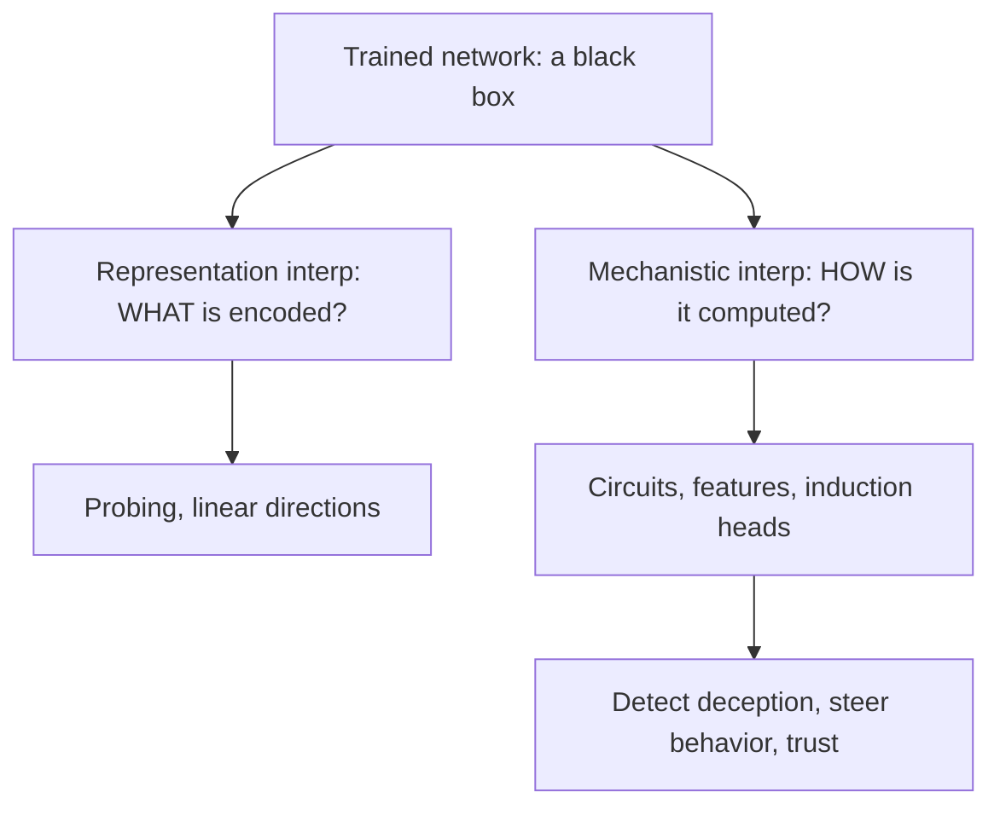
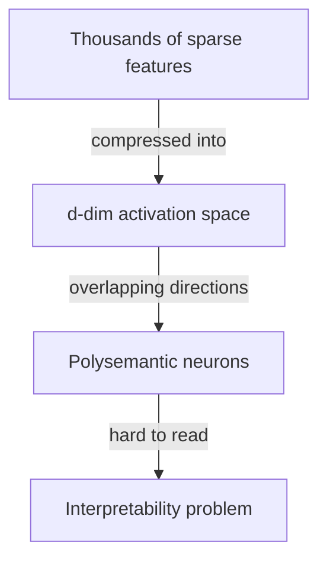

# Chapter 22 — Mechanistic Interpretability

> We can *build* and *align* models, but we mostly can't *explain* them. Mechanistic interpretability is the science of reverse-engineering the computation inside a trained network — turning the black box into something we can read. It is the clearest **research-engineering differentiator**: it demands strong engineering (hooks, caching, interventions at scale) *and* genuine scientific curiosity. It's also central to Anthropic's safety bet — you can't trust what you can't inspect.

This chapter builds the core toolkit: probing, the residual-stream view, superposition, sparse autoencoders, circuits and induction heads, and activation steering — with runnable intuition for each.

---

## 22.1 Why interpretability matters

Three motivations, in increasing ambition:

1. **Debugging & trust** — *why* did the model output that? Which input feature drove it? Essential for high-stakes deployment.
2. **Safety** — detect **deception**, hidden goals, or unsafe capabilities that behavioral testing alone can't reveal. A model can *say* the right thing while *computing* something else; only looking inside can catch that.
3. **Science of deep learning** — understand the *algorithms* gradient descent actually discovers. This is basic science, and it feeds back into better architectures and training.



> **The framing to internalize:** *behavioral* evaluation (Chapter 13) tells you *what* a model does; **interpretability** tells you *how* and *why*. As models grow more capable, "it passed our tests" becomes insufficient — you need to know the mechanism. That's why every frontier safety team invests here.

---

## 22.2 Probing — what is represented?

The simplest tool: **train a small linear classifier on a model's internal activations** to test whether some concept is linearly encoded there.

If a linear probe on layer-$\ell$ activations predicts "is this sentence about sports?" at high accuracy, the concept is **linearly available** at that layer.

```python
import torch, torch.nn as nn

# acts: (N, d_model) activations captured at some layer via a forward hook
# labels: (N,) concept labels (e.g., 0/1)
def linear_probe(acts, labels, steps=300, lr=1e-2):
    probe = nn.Linear(acts.size(1), int(labels.max()) + 1)
    opt = torch.optim.Adam(probe.parameters(), lr=lr)
    for _ in range(steps):
        loss = nn.functional.cross_entropy(probe(acts), labels)
        opt.zero_grad(); loss.backward(); opt.step()
    acc = (probe(acts).argmax(-1) == labels).float().mean()
    return probe, acc.item()
```

```python
# Capturing activations is just a forward hook:
store = {}
def hook(module, inp, out): store["act"] = out.detach()
handle = model.transformer.h[6].register_forward_hook(hook)   # layer 6
_ = model(tokens)
handle.remove()
acts = store["act"]      # now probe these
```

> **The Linear Representation Hypothesis:** many high-level concepts are encoded as **linear directions** in activation space — "this neuron-combination points toward *sentiment*." It's why probing and steering (§22.7) work at all. **Caveat:** a probe finding a concept proves it's *decodable*, not that the model *uses* it — correlation, not causation. To prove causation you must **intervene** (§22.6). Knowing this probe-vs-causal distinction is exactly the nuance interviewers look for.

---

## 22.3 The residual stream — the right way to see a transformer

The key mental model from mechanistic interp: a transformer is a **residual stream** that every layer **reads from and writes to**.


Because of the residual connections (Chapter 6), each attention head and MLP **adds** its output into a shared stream; the final logits are a *sum* of contributions from every component. This linear, additive structure is what makes transformers tractable to reverse-engineer.

**The Logit Lens:** apply the final unembedding to the residual stream at *intermediate* layers to see the model's "current best guess" evolve layer by layer — a cheap, striking window into how predictions form.

> **Why this view is powerful:** it reframes "what does layer 7 do?" into "what does layer 7 *add* to the stream, and which later component *reads* it?" Computation becomes a graph of readers and writers you can trace — the foundation of **circuit** analysis.

---

## 22.4 Superposition — why single neurons are confusing

Naively you'd hope neuron #4,217 means one thing. It doesn't — most neurons are **polysemantic** (fire for unrelated concepts: "academic citations," "HTTP requests," *and* "Korean text"). Why?

**Superposition:** networks represent **more features than they have dimensions** by packing them into *overlapping*, nearly-orthogonal directions. With $d$ dimensions you can fit far more than $d$ "mostly separable" sparse features. The network tolerates the small interference because real features are **sparse** (rarely co-occur).



> **Why this is the crux:** superposition is *why* you can't just read neurons — the model deliberately entangles features to save space. Anthropic's **"Toy Models of Superposition"** showed precisely when and how networks do this. The whole sparse-autoencoder program (next) exists to **un-mix** superposition.

---

## 22.5 Sparse Autoencoders (SAEs) — extracting monosemantic features

The breakthrough idea: train an **autoencoder** that reconstructs activations using a **much wider but sparse** hidden layer. Each sparse hidden unit (a "feature") tends to be **monosemantic** — one clean concept.

$$\mathcal{L}_{\text{SAE}} = \underbrace{\|x - \hat{x}\|_2^2}_{\text{reconstruct}} + \lambda \underbrace{\|f\|_1}_{\text{sparsity}}, \qquad f = \text{ReLU}(W_{\text{enc}}x + b),\ \ \hat x = W_{\text{dec}} f$$

The L1 penalty forces **few features active per input**; the over-completeness (e.g., 8–32× wider than $d$) gives room to *unfold* superposed features into separate dimensions.

```python
import torch, torch.nn as nn

class SAE(nn.Module):
    def __init__(self, d_model, d_hidden):     # d_hidden >> d_model (over-complete)
        super().__init__()
        self.enc = nn.Linear(d_model, d_hidden)
        self.dec = nn.Linear(d_hidden, d_model, bias=False)
    def forward(self, x):
        f = torch.relu(self.enc(x))             # sparse feature activations
        return self.dec(f), f

def sae_loss(x, x_hat, f, l1=1e-3):
    return ((x - x_hat) ** 2).mean() + l1 * f.abs().mean()   # reconstruct + sparsity
```

> **The landmark result:** Anthropic's **"Towards Monosemanticity"** (2023) and **"Scaling Monosemanticity"** (2024) used SAEs to extract millions of interpretable features from Claude — including a "Golden Gate Bridge" feature that, when amplified, made the model obsessed with the bridge ("**Golden Gate Claude**"). This is the most exciting practical interpretability result to date: features you can **name, find, and turn up or down**. Being able to explain the SAE objective and *why* over-completeness + sparsity beats superposition is top-tier signal.

---

## 22.6 Circuits & causal interventions

A **circuit** is a subgraph of components (heads, MLPs, features) that together implement a human-understandable algorithm. The exemplar: **induction heads**.

**Induction heads** implement in-context copying — given "...`[A][B]` ... `[A]`", they predict `[B]`. The mechanism is a two-head composition: a "previous-token" head writes "the token before me was A" into the stream; an induction head then attends "find an earlier place preceded by A, copy what came next." This simple circuit is now believed to be a primary driver of **in-context learning** — a real algorithm, discovered, not designed.

To prove a component *causes* a behavior (not just correlates), you **intervene**:

- **Activation patching / causal tracing:** run a clean prompt, cache activations; run a corrupted prompt; **patch** a clean activation into the corrupted run and see if the correct answer is restored. The components whose patching restores behavior are the causal circuit.
- **Ablation:** zero out / mean-ablate a head and measure the behavior drop.

```python
# Activation patching, conceptually:
clean_cache = run_and_cache(clean_prompt)               # store all activations
def patch_hook(module, inp, out, layer):
    out[:] = clean_cache[layer]                          # overwrite with clean
    return out
# attach patch_hook at a target layer/head while running the CORRUPTED prompt,
# then measure how much the correct-token logit is recovered. High recovery
# => that component is causally responsible.
```

> **Why intervention beats observation:** probing/attention-pattern-staring is *correlational*. Patching is a **controlled experiment** — the gold standard for a causal claim about mechanism. This experimental mindset (hypothesize a circuit → intervene → measure) is the core skill of an interpretability researcher and exactly the engineering+science blend labs prize.

---

## 22.7 Steering & activation engineering

If a concept is a **direction** (§22.2) or an **SAE feature** (§22.5), you can **add it to the activations at inference** to steer behavior — no fine-tuning.

$$h' = h + \alpha\, v_{\text{feature}}$$

Examples: amplify a "Golden Gate" feature → Golden Gate Claude; find and **subtract a "refusal direction"** → a model that stops refusing (a striking, safety-relevant result showing refusal is mediated by a roughly *single direction*); add a "truthfulness" direction to reduce hallucination. This is **activation engineering / representation steering** — cheap, surgical behavioral control.

> **Why this is a big deal for safety and product:** it gives a *mechanistic* lever on behavior that's interpretable and reversible, complementary to RLHF. The flip side — that a single subtractable direction can disable safety refusals — is itself an important security finding (and a reason interpretability and safety are inseparable).

---

## 22.8 Limits & open problems (talk about these to sound senior)

- **Scalability** — SAEs on frontier models need enormous compute; comprehensively interpreting a full model is still out of reach.
- **Faithfulness** — does our tidy story actually match the model's computation, or did we fool ourselves? Validating explanations is hard.
- **Completeness** — we explain fragments (a circuit here, features there), not the whole.
- **Feature splitting / absorption** — SAE features fragment or merge as you change width; the "right" decomposition is unclear.
- **What counts as understanding?** — interpretability lacks crisp success metrics; rigor is an active research problem.

> **Career signal:** interpretability is the purest **research-engineering** track — it rewards people who can write fast hook/caching/patching infrastructure *and* design clean causal experiments. It's a relatively young field where a motivated engineer can still contribute real findings. **The #1 proof of work:** reproduce a known result (induction heads via patching, or train an SAE on a small model and name some features) and write it up clearly. Tooling to know: **TransformerLens** and **nnsight** for hooks/patching, and the **Neuronpedia** ecosystem for SAE features.

---

## Interview signal

- **Q: "Probing vs causal intervention?"** → Probing shows a concept is *decodable* (correlational); patching/ablation shows a component is *causally responsible* (a controlled experiment). Always prefer intervention for mechanism claims.
- **Q: "What is superposition?"** → Networks pack more (sparse) features than dimensions into overlapping directions, causing polysemantic neurons; it's *why* single neurons are hard to read.
- **Q: "What's an SAE and what problem does it solve?"** → An over-complete, L1-sparse autoencoder on activations that un-mixes superposition into (mostly) monosemantic, nameable features; basis of "Scaling Monosemanticity"/Golden Gate Claude.
- **Q: "Explain induction heads."** → A two-head circuit (previous-token head + induction head) that copies `[A][B]…[A]→[B]`; a discovered mechanism behind in-context learning.
- **Q: "What is the residual stream view?"** → Every component reads from and *adds* to a shared stream; final logits are a sum of contributions — the additive structure that makes circuits traceable (logit lens reads it mid-stack).
- **Q: "What is activation steering?"** → Add/subtract a feature/concept direction in activations at inference to control behavior (Golden Gate feature; subtract a refusal direction) — cheap, reversible, no retraining.
- **Q: "Why does interpretability matter for safety?"** → Behavioral tests can't detect deception or hidden goals; only inspecting the computation can — you can't trust what you can't read.

---

> **▶ Run it live:** [`notebooks/22-interpretability-toys.ipynb`](../notebooks/22-interpretability-toys.ipynb) makes the core ideas visible on tiny models — a **linear probe**, **activation steering**, the **superposition pentagon**, and an **SAE** recovering monosemantic features. (NumPy + matplotlib only.)

## Exercises

1. Register a forward hook on a small open model (GPT-2 via TransformerLens), capture residual-stream activations for two concept classes, and train a **linear probe**; report accuracy per layer and find where the concept emerges.
2. Implement the **logit lens**: unembed the residual stream at each layer for a prompt and watch the top prediction evolve.
3. Train a tiny **SAE** on a layer's MLP activations; inspect the top-activating inputs for several features and try to **name** them.
4. Reproduce **induction heads**: feed a repeated random-token sequence, plot per-head attention, and identify the head that attends "one after the previous occurrence."
5. Do an **activation-patching** experiment on a simple task (e.g., subject–verb agreement or the IOI task) and localize which heads are causally responsible.
6. **Steer** the model: extract a concept direction (probe weight or SAE decoder vector), add $\alpha v$ to the residual stream, and show the output shifts toward the concept.

## Key takeaways

- Interpretability explains **how/why** a model computes (vs evaluation's **what**); it's central to **trust and safety** and the purest research-engineering track.
- **Probing** reveals what's *decodable* (correlational); **patching/ablation** reveals what's *causal* — always intervene to claim mechanism.
- The **residual stream** (read/write, additive) is the right mental model; the **logit lens** reads predictions mid-stack.
- **Superposition** packs more features than dimensions into overlapping directions → polysemantic neurons; **SAEs** un-mix them into monosemantic, nameable features (Golden Gate Claude).
- **Circuits** like **induction heads** are real, discovered algorithms (a primary driver of in-context learning).
- **Activation steering** turns interpretable directions into cheap, reversible behavioral control — powerful for both capability and safety.

---

> **One frontier left.** You can now open the black box; the final elective asks whether the box itself — the transformer — is the end of the story. Chapter 23 covers the **sub-quadratic challengers** (Mamba/SSMs, linear attention, hybrids) racing to escape attention's $O(n^2)$ cost.

**Next:** [Chapter 23 — Alternative Architectures: Beyond the Transformer](23-alternative-architectures.md)

**Back to:** [Table of Contents](../README.md) · [Solutions](../solutions/22-interpretability-solutions.md)
