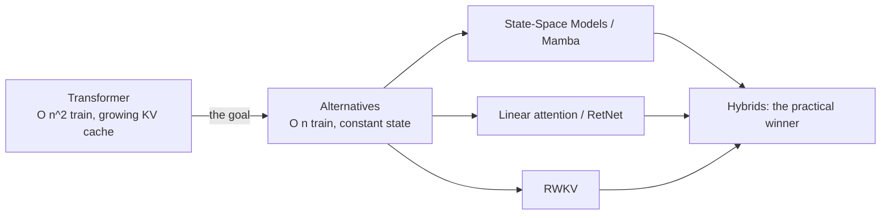
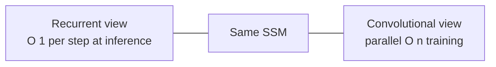
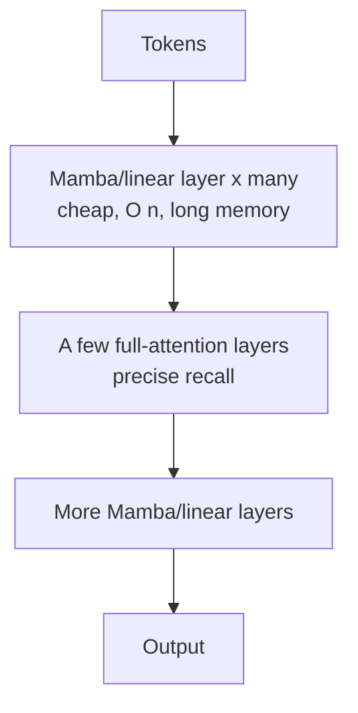

# Chapter 23 — Alternative Architectures: Beyond the Transformer

> The transformer won — but its $O(n^2)$ attention and ever-growing KV cache are a real tax, and a wave of **sub-quadratic** architectures is challenging it: State-Space Models (Mamba), linear attention, RWKV/RetNet, and the **hybrids** that now ship in production. A frontier engineer must know what could replace — or augment — attention, and *why* it hasn't fully yet. This is the "is the transformer the end of history?" chapter.

We build the core ideas from first principles: the recurrence-vs-attention tradeoff, SSMs and Mamba's selectivity, linear attention as a linear RNN, and why the winning systems are *hybrids*.

---

## 23.1 The prize: escaping $O(n^2)$ and the KV cache

Recall the transformer's two costs (Chapters 6, 7, 10):

- **Training/prefill:** attention is $O(n^2)$ in sequence length — every token attends to every other.
- **Inference:** the **KV cache** grows linearly with context, and decode is memory-bound reading it back each step.

What if a model could process a sequence in **$O(n)$** time and generate with a **fixed-size state** (no growing KV cache)? That's the prize these architectures chase: **constant memory per step, linear-time training, unbounded context** — ideally without losing the quality that made transformers win.



> **The fundamental tension:** attention's power *is* its cost. Letting every token look at every other gives perfect recall but quadratic compute. A fixed-size recurrent state gives linear compute but must *compress* history — and compression means forgetting. Every architecture in this chapter is a different answer to "**how do I keep most of attention's quality while paying linear cost?**"

---

## 23.2 The RNN comeback — recurrence reconsidered

Chapter 6 retired RNNs for two reasons: they were **sequential** (can't parallelize training over time) and they **forgot** long-range information. Attention fixed both. So why revisit recurrence?

Because a recurrent model has a superpower at *inference*: it carries a **fixed-size state** and does **$O(1)$ work per token** — no KV cache, no re-reading the past. If we could **train** a recurrence in parallel (the thing RNNs couldn't do) and stop it from forgetting, we'd get the best of both worlds. That is exactly what modern SSMs and linear attention achieve — they are **RNNs you can train in parallel.**

---

## 23.3 State-Space Models (S4 → Mamba)

A **State-Space Model** comes from control theory. A continuous linear system maps input $x(t)$ to output $y(t)$ through a hidden state $h(t)$:

$$h'(t) = \mathbf{A}\,h(t) + \mathbf{B}\,x(t), \qquad y(t) = \mathbf{C}\,h(t)$$

To use it on sequences we **discretize** with a step size $\Delta$ (zero-order hold), giving a *recurrence*:

$$h_t = \bar{\mathbf{A}}\,h_{t-1} + \bar{\mathbf{B}}\,x_t, \qquad y_t = \mathbf{C}\,h_t, \qquad \bar{\mathbf{A}} = \exp(\Delta \mathbf{A})$$

The beautiful part: when $\mathbf{A},\mathbf{B},\mathbf{C}$ are **fixed** (the same at every step — "linear time-invariant"), this recurrence is also a **convolution** with a kernel $\bar{\mathbf{K}} = (\mathbf{C}\bar{\mathbf{B}},\, \mathbf{C}\bar{\mathbf{A}}\bar{\mathbf{B}},\, \mathbf{C}\bar{\mathbf{A}}^2\bar{\mathbf{B}}, \dots)$.



> **Why two views matter:** **train** as a convolution (parallel over the whole sequence, GPU-friendly) and **infer** as a recurrence (constant state, no KV cache). **S4** (2021) used this duality plus a special **HiPPO** initialization of $\mathbf{A}$ to remember long histories, and crushed long-range benchmarks. But S4 has a fatal limit: being *time-invariant*, it applies the **same** dynamics to every token — it can't *selectively* focus on relevant inputs the way attention does (content-based reasoning).

### Mamba — selectivity is all you need (for SSMs)

**Mamba** (2023) makes $\mathbf{B}$, $\mathbf{C}$, and $\Delta$ **input-dependent** (functions of the current token). Now the model can *choose*, per token, what to remember, what to ignore, and how fast to update its state — a **selective** SSM with content-based behavior.

```python
import numpy as np

def selective_ssm(x, A, B, C, delta):
    """Minimal diagonal *selective* SSM (one channel).
    x:(L,) input; A:(N,) diagonal state dynamics (negative reals);
    B,C:(L,N) input-DEPENDENT projections; delta:(L,) input-DEPENDENT step."""
    N = A.shape[0]
    h = np.zeros(N)
    y = np.zeros(len(x))
    for t in range(len(x)):
        Abar = np.exp(delta[t] * A)        # discretized decay — depends on input via delta
        Bbar = delta[t] * B[t]             # input gate — depends on input
        h = Abar * h + Bbar * x[t]         # recurrent state update: O(N) per step, constant memory
        y[t] = C[t] @ h                    # selective read-out
    return y
```

The catch: input-dependent $\bar{\mathbf{A}}$ means it's **no longer a convolution** (not time-invariant), so Mamba can't use the FFT trick. Its breakthrough is a **hardware-aware parallel scan** — a work-efficient associative scan that keeps the state in fast SRAM and never materializes it in HBM (the same IO-aware philosophy as FlashAttention, Chapter 15). That's what makes selective SSMs trainable at scale.

> **Why Mamba mattered:** it matched or beat transformers of equal size on language at up to ~1–3B params with **linear** scaling and **5× higher inference throughput** (constant state, no KV cache). Selectivity closed most of S4's quality gap. Being able to explain "**input-dependent $\mathbf{B},\mathbf{C},\Delta$ + a hardware-aware scan**" is the one-sentence summary that signals you actually understand Mamba.

---

## 23.4 Linear attention — attention *is* a (linear) RNN

A second route to $O(n)$ attacks the softmax directly. Standard attention computes $\text{softmax}(q_i\cdot k_j)$, and the softmax is what *forces* the $O(n^2)$ all-pairs matrix. **Linear attention** replaces $\exp(q\cdot k)$ with a **kernel feature map** $\phi(q)\cdot\phi(k)$:

$$o_i = \frac{\phi(q_i)\sum_{j\le i}\phi(k_j)^\top v_j}{\phi(q_i)\sum_{j\le i}\phi(k_j)}$$

Because the sums are **associative**, you can maintain them as a **running state** $S_i = S_{i-1} + \phi(k_i)^\top v_i$ — turning attention into a **linear RNN** with constant memory and no KV cache.

```python
import numpy as np

def linear_attention(Q, K, V):
    """Causal linear attention as an O(n) recurrence — constant state, no KV cache."""
    phi = lambda z: np.maximum(z, 0) + 1e-6      # a simple positive feature map
    S = np.zeros((Q.shape[1], V.shape[1]))        # running sum of phi(k) outer v
    z = np.zeros(Q.shape[1])                       # running normalizer
    out = []
    for q, k, v in zip(Q, K, V):
        S = S + np.outer(phi(k), v)                # state update: cost independent of sequence length
        z = z + phi(k)
        out.append((phi(q) @ S) / (phi(q) @ z + 1e-6))
    return np.array(out)
```

Two influential members of this family:

- **RetNet (Retention):** adds a **decay** factor so older tokens fade, and supports **three equivalent forms** — *parallel* (train fast), *recurrent* (infer cheap), and *chunkwise* (a hybrid for long sequences). One math, three execution modes.
- **RWKV:** an **RNN dressed as a transformer** — token/channel "mixing" with time-decay that trains in parallel like a transformer but runs as an RNN at inference. Proof that a pure RNN can scale to many billions of parameters.

> **The unifying insight (worth saying out loud):** *linear attention, RetNet, and SSMs are all the same idea* — a **linear recurrence** with a fixed-size state that you can train in parallel and run as an $O(1)$-per-step RNN. They differ mainly in the state-update rule (kernel sum vs decayed sum vs selective SSM). This unification is an active research theme and strong signal that you see past the brand names.

---

## 23.5 Why hybrids win (for now)

Pure sub-quadratic models share one weakness: a **fixed-size state can't store arbitrary history**, so they're worse at **precise recall** — exact copying, retrieving a specific earlier token, the in-context "induction head" behavior (Chapter 22) that powers few-shot learning. Attention, with its growing KV cache, is *perfect* at this by construction.

The pragmatic answer: **interleave a few full-attention layers among many linear/SSM layers.**

| System | Recipe |
| --- | --- |
| **Jamba** | Mamba + Transformer + **MoE**, interleaved |
| **Samba** | Mamba + **sliding-window attention** |
| **Zamba** | Mamba backbone + a shared attention block |
| **Griffin / Hawk** | gated linear recurrence + local attention |



> **Why this is the practical state of the art:** a handful of attention layers restore the exact-recall ability, while the majority-linear backbone keeps cost near-linear and shrinks the KV cache dramatically (only the few attention layers cache). You get most of attention's quality at a fraction of the long-context cost. Most 2024–2025 "transformer alternatives" that reach production are **hybrids**, not pure Mamba — knowing *that*, and *why* (recall vs cost), is the senior take.

---

## 23.6 The tradeoff table (know this cold)

| | Transformer | SSM / Mamba | Linear attention | Hybrid |
| --- | --- | --- | --- | --- |
| **Train cost** | $O(n^2)$ | $O(n)$ | $O(n)$ | ~$O(n)$ |
| **Inference state** | growing KV cache | fixed | fixed | small KV (few layers) |
| **Precise recall / in-context** | excellent | weaker | weaker | strong |
| **Long context** | expensive | cheap | cheap | cheap-ish |
| **Maturity / tooling** | dominant | growing | niche | growing |

> **The honest verdict:** transformers remain the default because of quality, ecosystem, and recall. Sub-quadratic models are compelling for **very long sequences** (genomics, audio, high-resolution) and **cheap inference**, but pure versions trail on the recall-heavy tasks LLMs are judged on. Hybrids are closing the gap. Whether attention is eventually *replaced* or merely *diluted* is genuinely open — a great thing to have an informed opinion about.

---

## 23.7 Where it's going & career signal

- **Long-context & efficiency pressure** keeps this area hot: as context windows push to millions of tokens, $O(n^2)$ hurts more and linear-state models look better.
- **The architecture search is converging on hybrids + MoE** — sparse *and* sub-quadratic, combining Chapter 7's MoE with this chapter's recurrences (Jamba is exactly this).
- **It's still unsettled**, which is the opportunity: a motivated engineer can reproduce a Mamba block, benchmark it against a transformer at equal params, and contribute real findings.

> **Career signal:** most engineers know only transformers. Being able to (a) derive an SSM recurrence and explain Mamba's selectivity, (b) show that linear attention is a linear RNN, and (c) argue *why hybrids win on the recall-vs-cost tradeoff* marks you as someone tracking the genuine architectural frontier — exactly the literacy research-leaning labs probe for. **A standout portfolio project:** implement a small Mamba (or linear-attention) language model, train it next to a transformer baseline at equal parameter count, and write up the quality/throughput/recall tradeoffs with benchmarks.

---

## Interview signal

- **Q: "What problem do Mamba/SSMs solve vs transformers?"** → Linear-time training and constant-state ($O(1)$/step, no KV cache) inference — escaping attention's $O(n^2)$ and growing cache, especially for very long sequences.
- **Q: "What is the key idea of an SSM and the two views?"** → A discretized linear recurrence $h_t=\bar A h_{t-1}+\bar B x_t,\ y_t=Ch_t$; train as a parallel convolution (time-invariant), infer as a recurrence.
- **Q: "What did Mamba add over S4?"** → **Selectivity**: input-dependent $\mathbf{B},\mathbf{C},\Delta$ so the model chooses what to keep/forget (content-based), plus a hardware-aware parallel scan (it's no longer a convolution).
- **Q: "How is linear attention $O(n)$?"** → Replace $\exp(q\cdot k)$ with a kernel $\phi(q)\cdot\phi(k)$; the associative sums become a running state — attention becomes a linear RNN with constant memory.
- **Q: "Why do pure sub-quadratic models underperform?"** → A fixed-size state can't store arbitrary history, so precise recall / in-context copying (induction heads) suffers — attention's growing cache is perfect at that.
- **Q: "Why are hybrids the practical winner?"** → A few full-attention layers restore exact recall while a majority linear/SSM backbone keeps cost near-linear and the KV cache small (Jamba, Samba).
- **Q: "Unify SSMs, linear attention, RetNet."** → All are linear recurrences with fixed-size state, trainable in parallel, differing in the state-update rule (selective SSM vs kernel sum vs decayed sum).

---

> **▶ Run it live:** [`notebooks/23-alt-architecture-benchmarks.ipynb`](../notebooks/23-alt-architecture-benchmarks.ipynb) measures the case for sub-quadratic models — **quadratic vs linear** cost, the **growing KV cache vs flat SSM state**, the recurrence/convolution **duality**, and Mamba's **selectivity**. (NumPy + matplotlib only.)

## Exercises

1. Implement the diagonal **SSM recurrence** `selective_ssm` above; feed an impulse and verify the output is the (decaying) SSM kernel. Make $\Delta$ input-dependent and show the state updates faster/slower with the input.
2. Implement the **convolutional view** of a *time-invariant* SSM (build the kernel $\bar{\mathbf K}$) and confirm it produces the **same output** as the recurrent view — the duality that lets you train in parallel and infer recurrently.
3. Implement **linear attention** as the $O(n)$ recurrence above; compare its output and cost to full softmax attention on increasing sequence lengths, and plot time vs $n$ (linear vs quadratic).
4. Add a **decay** factor (RetNet-style retention) to your linear attention and show it down-weights distant tokens.
5. Build a tiny **hybrid**: stack several linear/SSM layers with one full-attention layer; test it on a **copy/recall task** (reproduce a token seen far earlier) and show the attention layer is what rescues recall.
6. Benchmark **memory at inference**: measure state/KV bytes per generated token for a transformer vs your SSM as context grows — show one is flat and the other grows.

## Key takeaways

- Sub-quadratic architectures chase **linear-time training** and **constant-state inference** (no KV cache) — attention's $O(n^2)$ and growing cache are the costs to beat.
- **SSMs** are discretized linear recurrences with a **dual** convolutional (parallel-train) and recurrent (cheap-infer) form; **S4** added long-memory init, **Mamba** added **selectivity** (input-dependent dynamics) + a hardware-aware scan.
- **Linear attention** removes the softmax via a kernel feature map, turning attention into a **linear RNN** with constant memory; **RetNet** and **RWKV** are the same family.
- Pure sub-quadratic models trade **precise recall** for cost (fixed state can't store everything), which is why **hybrids** (Jamba, Samba) — mostly linear with a few attention layers — are the practical winners.
- Transformers remain dominant on quality/ecosystem/recall; whether attention is replaced or merely diluted is an open, active frontier.

---

> **You've reached the end of the frontier electives — and the book.** You now span the whole arc: foundations → a transformer from scratch → the modern LLM stack → systems → career → and the frontier (diffusion/multimodal, deep RL, interpretability, and alternative architectures). Loop back to your [specialization track](../part-5-career/18-specialization.md) and go reproduce one of these results in public — the artifact *is* the application.

**Back to:** [Table of Contents](../README.md) · [Solutions](../solutions/23-alternative-architectures-solutions.md)
