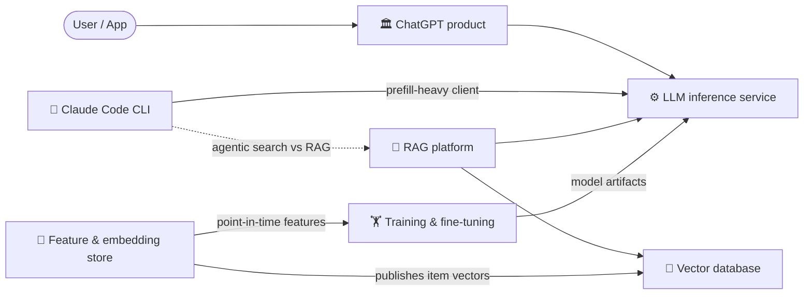

# 🏛️ System Design — LLM & ML Systems

> Seven complete, interview-ready system-design write-ups for **Applied Scientist / ML-systems** interviews. Each design lives in its own folder with a **high-level design (HLD)**, a **42-question practice bank**, a **full worked answer key**, and a **one-page cheat-sheet**. Drive every design top-down: **requirements → estimates → data model → architecture → deep dive → bottlenecks → tradeoffs.**

📚 **Part of the** [LLM Mastery course](../README.md) **— the cross-cutting design track that ties the eight stages together.**

---

## The seven designs

| # | Design | What it's really about | HLD | Practice |
|---|--------|------------------------|-----|----------|
| 1 | 🏛️ **ChatGPT** | Stateful, multi-second, GPU-bound streaming product + the data flywheel | [HLD](chatgpt/README.md) | [Q](chatgpt/questions.md) · [A](chatgpt/answers.md) · [🃏](chatgpt/cheat-sheet.md) |
| 2 | 🔎 **RAG platform** | Retrieval as a funnel: recall → filter → rerank → grounded generation | [HLD](rag-platform/README.md) | [Q](rag-platform/questions.md) · [A](rag-platform/answers.md) · [🃏](rag-platform/cheat-sheet.md) |
| 3 | ⚙️ **LLM inference service** | Prefill/decode, continuous batching, paged KV cache, $/1M tokens | [HLD](llm-inference/README.md) | [Q](llm-inference/questions.md) · [A](llm-inference/answers.md) · [🃏](llm-inference/cheat-sheet.md) |
| 4 | 🏋️ **Training & fine-tuning platform** | Distributed parallelism + fault tolerance across thousands of GPUs | [HLD](training-platform/README.md) | [Q](training-platform/questions.md) · [A](training-platform/answers.md) · [🃏](training-platform/cheat-sheet.md) |
| 5 | 🧭 **Vector database** | ANN index internals (HNSW / IVF / PQ) + the storage engine around them | [HLD](vector-database/README.md) | [Q](vector-database/questions.md) · [A](vector-database/answers.md) · [🃏](vector-database/cheat-sheet.md) |
| 6 | 🧱 **Feature & embedding store** | Point-in-time correctness + eliminating train/serve skew | [HLD](feature-store/README.md) | [Q](feature-store/questions.md) · [A](feature-store/answers.md) · [🃏](feature-store/cheat-sheet.md) |
| 7 | 🤖 **Claude Code (agentic coding CLI)** | The agentic loop + context management over a codebase ≫ the window; safe local tool use | [HLD](claude-code-cli/README.md) | [Q](claude-code-cli/questions.md) · [A](claude-code-cli/answers.md) · [🃏](claude-code-cli/cheat-sheet.md) |

Every folder follows the same layout: `README.md` (the HLD) · `questions.md` (42 Q) · `answers.md` (full key) · `cheat-sheet.md` (one-pager).

## How the designs fit together

- **ChatGPT** is the product; it calls the **inference service** to generate tokens.
- **RAG** wraps the inference service with retrieval, using the **vector database** as its index.
- The **vector database** is the component RAG treats as a black box — here we build it.
- The **training platform** produces the model artifacts the inference service serves.
- The **feature store** produces point-in-time-correct features for training and serves them by key at inference; it **publishes embeddings into** the vector database for retrieve-then-rank.
- **Claude Code** is an agentic coding CLI — another **prefill-heavy client** of the inference service, but its signature problem is **autonomy under a tight context budget**; it mostly uses **agentic search** (grep/glob/LSP) instead of the RAG/vector-DB index, making it the instructive **contrast** to design 2.

## How to use this track

1. **Read the HLD top-down.** Each one starts from requirements + back-of-envelope estimates, then builds the architecture and goes deep on the one thing that design is really testing.
2. **Drill the questions cold.** Try to answer before opening the key; each question lists what a strong answer covers.
3. **Review the answer key**, then keep the **cheat-sheet** for last-minute recall.
4. **Suggested order:** ChatGPT → inference service → RAG → vector database → training platform → feature store → Claude Code CLI (product → serving substrate → retrieval → index internals → training → data layer → agentic systems).

---

[← Back to course index](../README.md)
