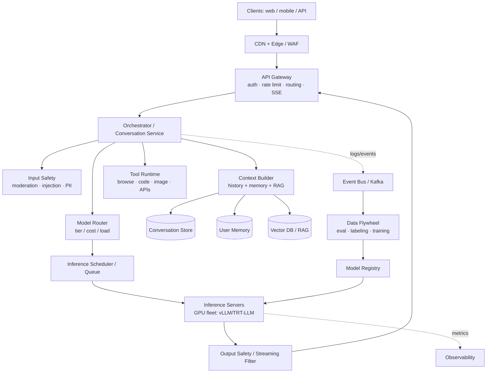
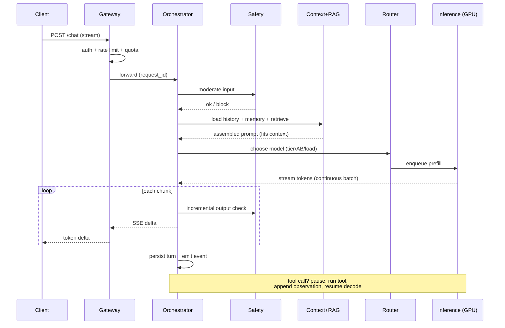
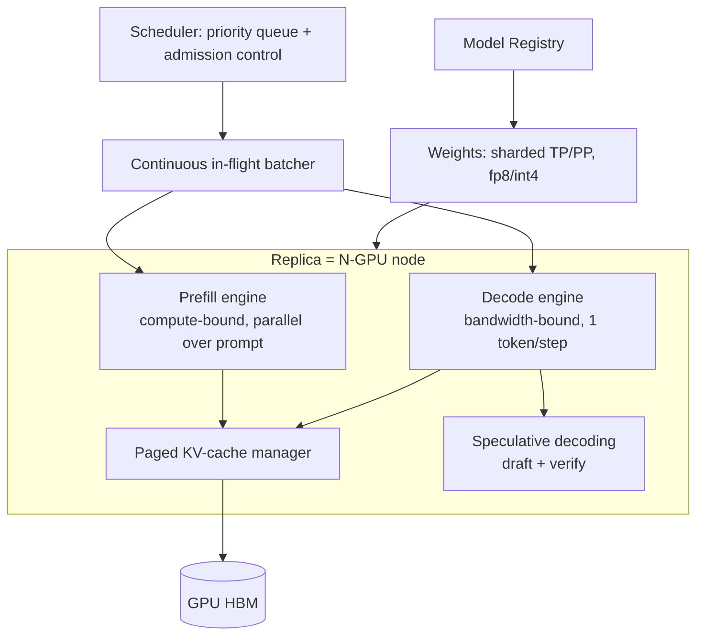
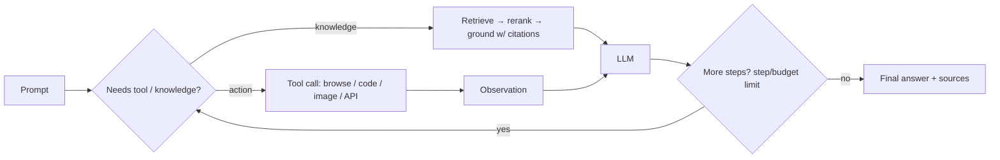
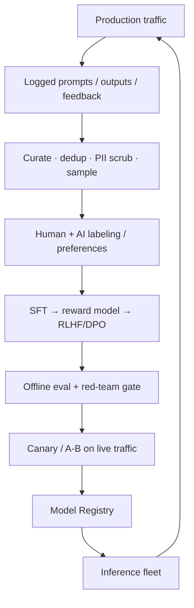
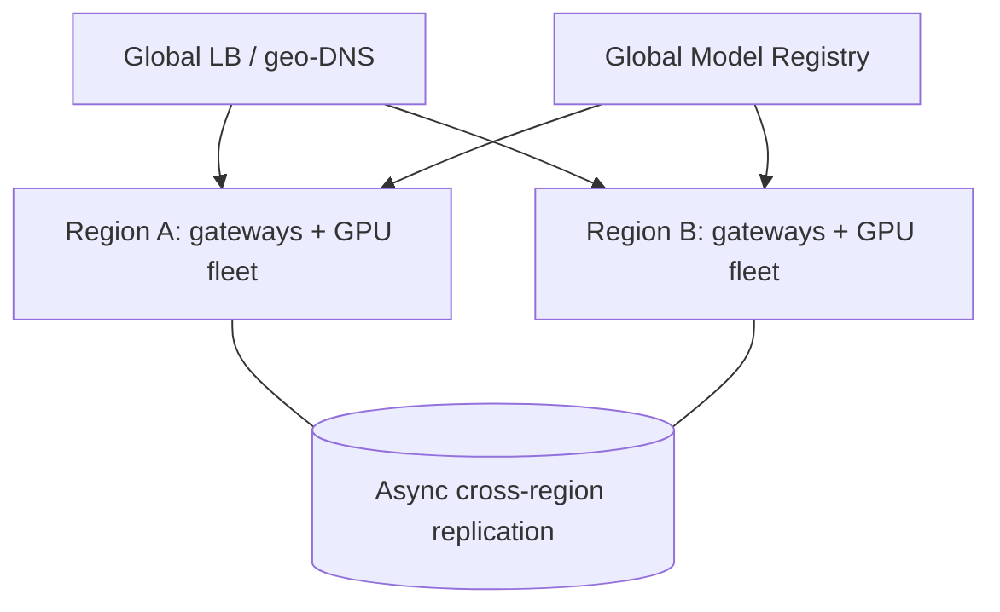

# 🏛️ System Design — Production-Ready ChatGPT (HLD)

> High-level design for a ChatGPT-scale conversational LLM product: a multi-tenant, streaming, safe, continuously-improving assistant with RAG + tools, served on a GPU fleet at planet scale.
>
> This is the classic **"Design ChatGPT"** ML-systems interview. Drive it top-down: **requirements → estimates → architecture → the inference deep-dive (the part that's different from a normal web service) → data flywheel → reliability/cost/safety → tradeoffs.**

📝 **Practice:** [interview questions](questions.md) · ✅ [answer key](answers.md) · 🃏 [one-page cheat-sheet](cheat-sheet.md)

📐 **Sibling designs:** [RAG platform (HLD)](../rag-platform/README.md) · [LLM inference service (HLD)](../llm-inference/README.md) · [Training & fine-tuning platform (HLD)](../training-platform/README.md) · [Vector database (HLD)](../vector-database/README.md) · [Feature store (HLD)](../feature-store/README.md) · [Claude Code CLI (HLD)](../claude-code-cli/README.md)

---

## Contents
1. [Scope & requirements](#1-scope--requirements)
2. [Capacity estimation (back of envelope)](#2-capacity-estimation-back-of-envelope)
3. [API design](#3-api-design)
4. [High-level architecture](#4-high-level-architecture)
5. [Request lifecycle](#5-request-lifecycle)
6. [Deep dive — inference serving (the core)](#6-deep-dive--inference-serving-the-core)
7. [Deep dive — token streaming](#7-deep-dive--token-streaming)
8. [Deep dive — conversation state & memory](#8-deep-dive--conversation-state--memory)
9. [Deep dive — orchestration: RAG, tools, function calling](#9-deep-dive--orchestration-rag-tools-function-calling)
10. [Deep dive — safety & moderation](#10-deep-dive--safety--moderation)
11. [Deep dive — data flywheel & continuous training](#11-deep-dive--data-flywheel--continuous-training)
12. [Storage architecture](#12-storage-architecture)
13. [Caching strategy](#13-caching-strategy)
14. [Multi-region, HA & disaster recovery](#14-multi-region-ha--disaster-recovery)
15. [Observability](#15-observability)
16. [Security, privacy & compliance](#16-security-privacy--compliance)
17. [Cost optimization](#17-cost-optimization)
18. [Bottlenecks, tradeoffs & failure modes](#18-bottlenecks-tradeoffs--failure-modes)
19. [Scaling roadmap](#19-scaling-roadmap)
20. [What strong answers cover](#what-strong-answers-cover)

---

## 1. Scope & requirements

### Functional
- **Conversational chat:** multi-turn, context-aware, **streaming** token-by-token responses.
- **Multiple models & tiers:** small/cheap, large/smart, reasoning ("thinking") models; user- or route-selectable.
- **System prompts / custom instructions / "GPTs":** per-user and per-app persona configuration.
- **RAG & file upload:** answer over user docs and a knowledge corpus with citations.
- **Tools / function calling:** web browse, code execution, image generation, external APIs.
- **Multimodal (extension):** image (and audio) input/output.
- **Memory:** long-term per-user memory across sessions.
- **Feedback:** thumbs up/down, regenerate, edit; flows into the improvement loop.
- **Accounts & plans:** free vs paid, quotas, billing, an API product for developers.

### Non-functional (the SLOs that shape the design)
| Property | Target | Why it drives design |
|---|---|---|
| **TTFT** (time to first token) | p50 < 500 ms, p99 < 2 s | Perceived responsiveness → prefill latency, routing, warm pools |
| **TPOT** (time per output token) | 30–80 ms (≈ 15–40 tok/s) | Must beat reading speed → batching + decode optimization |
| **Availability** | 99.9%+ | Multi-region, graceful degradation, model fallback |
| **Scale** | ~100M DAU, tens of thousands of GPUs | Fleet management, autoscaling, cost |
| **Safety** | High recall on disallowed content | Layered moderation in the request path |
| **Cost** | Minimize $ / 1M tokens | The dominant operating cost is GPU-seconds |
| **Privacy** | Tenant isolation, regional data residency, opt-out | Storage, logging, training-data governance |

**Key insight that makes this different from a normal web service:** the unit of work is not a cheap CPU request but a **stateful, multi-second, GPU-bound token-generation stream**. The entire design optimizes **GPU utilization (MFU) and tail latency** under that constraint.

---

## 2. Capacity estimation (back of envelope)

> State assumptions out loud; interviewers grade the reasoning, not the exact number.

**Traffic**
- $100\text{M DAU} \times 10\ \text{msgs/day} = 1\text{B messages/day}$.
- Average: $\frac{1\text{B}}{86400} \approx 11.6\text{K req/s}$; **peak ≈ 3–4× → ~40K req/s**.

**Token volume**
- Per message: prompt (with history) $\approx 1{,}000$ tokens, completion $\approx 500$ tokens.
- Peak generation load: $40\text{K req/s} \times 500\ \text{tok} = 20\text{M output tokens/s}$ (plus a one-time prefill of ~1K tokens each).

**GPU fleet (the headline number)**
- Serve a flagship ~70B-class model on **8×H100 nodes** (tensor-parallel), fp8 weights.
- Decode is **memory-bandwidth bound**: reading ~70 GB of weights per token-step against ~26 TB/s aggregate node bandwidth, with **continuous batching** a well-tuned node sustains on the order of $\sim10\text{K}$ output tok/s.
- $\frac{20\text{M tok/s}}{10\text{K tok/s/node}} \approx 2{,}000\ \text{nodes} = \mathbf{\sim16{,}000\ H100s}$ for peak decode of one model — before prefill, redundancy, smaller models, regions, and headroom. Realistic fleet: **tens of thousands of GPUs**.
- **MoE** (e.g. activate ~2 of N experts) cuts active params/FLOPs several-fold for the same quality, directly shrinking this number — a core reason frontier serving uses MoE.

**Storage**
- Conversations: $1\text{B msgs/day} \times \sim1\text{KB} \approx 1\text{ TB/day}$ → ~0.4 PB/yr raw; with metadata/indices and multi-year retention, **multi-PB**.
- Vector index (RAG + memory): billions of chunks × ~1.5–3 KB/vector → **multi-PB**, sharded ANN.
- Blobs (uploads, images): object storage, **10s of PB**.

**Bandwidth**
- Streaming is light per stream (~tens of tokens/s × a few bytes), but **millions of concurrent long-lived connections** → the edge/streaming tier must hold massive concurrency, not throughput.

**Takeaways:** (1) GPUs dominate cost → maximize MFU; (2) prefill (compute-bound) and decode (bandwidth-bound) have different bottlenecks → consider **disaggregation**; (3) connection concurrency, not bytes, sizes the edge.

---

## 3. API design

```http
POST /v1/chat/completions
Authorization: Bearer <token>
{
  "model": "gpt-x",
  "messages": [{"role":"system","content":"..."},
               {"role":"user","content":"..."}],
  "stream": true,
  "temperature": 0.7,
  "tools": [...],
  "conversation_id": "conv_123"
}
→ 200 text/event-stream   (SSE: incremental token deltas, then [DONE])
```

- **Streaming via SSE** (simpler than WebSockets, one-directional, proxy-friendly); WebSockets for voice/bidirectional.
- **Idempotency keys** for safe retries; **request IDs** for tracing.
- Supporting endpoints: `/v1/models`, `/v1/files` (upload), `/v1/embeddings`, `/v1/moderations`, feedback (`/v1/feedback`), and async/batch for non-interactive jobs.
- **Backpressure & limits:** per-key rate limits (RPS + tokens/min), max context, max output, concurrency caps.

---

## 4. High-level architecture



**Control vs data plane.** The **data plane** (gateway → orchestrator → inference → stream back) is latency-critical and stateless where possible. The **control plane** (model registry, autoscaler, deployment, eval/training) is asynchronous and off the hot path.

| Layer | Responsibility |
|---|---|
| **Edge / CDN / WAF** | TLS, DDoS, geo-routing, static assets, abuse filtering |
| **API Gateway** | AuthN/Z, API-key & token rate limiting, quotas, SSE plumbing, request IDs |
| **Orchestrator** | Per-conversation brain: assembles context, runs safety, calls router/tools, manages the agent loop |
| **Context Builder** | Fetch history, user memory, RAG retrieval; build & **truncate/compress** the prompt to the context window |
| **Model Router** | Pick model tier (small/large/reasoning), apply A/B & fallback, balance load/cost |
| **Inference Scheduler** | Admission control, priority queues, batch formation, GPU placement |
| **Inference Servers** | The GPU fleet running the LLM with continuous batching + paged KV cache |
| **Tool Runtime** | Sandboxed execution of browse/code/image/external tools |
| **Safety services** | Input and output moderation, prompt-injection & PII filters |
| **Data flywheel** | Logging → eval → labeling → SFT/RLHF → registry → rollout |

---

## 5. Request lifecycle



**Latency budget (illustrative, p50 target).** auth/route ~10 ms · safety ~30 ms · RAG retrieve+rerank ~80 ms · queue+prefill ~200 ms · **first token ≈ 350 ms**; then steady decode at ~40 tok/s. The optimization war is fought in **queueing, prefill, and decode**.

---

## 6. Deep dive — inference serving (the core)

This is where a "design ChatGPT" answer must go deep. Goal: **max throughput (tok/s/GPU) at the SLO tail**, because GPUs are the cost.



**1. Model parallelism.** Shard a model that doesn't fit one GPU:
- **Tensor parallel (TP)** within a node over NVLink (split each matmul).
- **Pipeline parallel (PP)** across nodes (split layers) when needed.
- **Expert parallel (EP)** for MoE (experts across GPUs, all-to-all routing).
- **Data parallel** = many independent replicas behind the scheduler for throughput.

**2. Continuous (in-flight) batching.** Schedule at **token granularity**: finished sequences leave and new ones join every step, so the GPU never idles waiting for the slowest request. This is the single biggest throughput lever (vs. static batching).

**3. KV cache + PagedAttention.** The KV cache grows linearly with sequence length and dominates memory at long context:
$$\text{KV bytes} = 2 \times L \times h_{kv} \times d_{head} \times \text{seq} \times \text{batch} \times \text{bytes}$$
**PagedAttention** stores it in fixed non-contiguous **pages** (like OS virtual memory) → no fragmentation, higher batch occupancy, and **prefix sharing** (system prompts/common prefixes stored once). Reduce it further with **GQA/MQA** and **KV quantization**.

**4. Prefill vs decode are different beasts.**
- **Prefill** processes the whole prompt in parallel → **compute-bound**, sets TTFT.
- **Decode** emits one token at a time, re-reading all weights → **memory-bandwidth-bound**, sets TPOT.
- **Disaggregated serving:** run prefill and decode on **separate pools** sized/optimized independently, avoiding head-of-line blocking where a big prefill stalls everyone's decode. **Chunked prefill** interleaves long prompts so they don't monopolize a step.

**5. Speculative decoding.** A small **draft** model proposes $k$ tokens; the big model **verifies** them in one pass and accepts a prefix (accept token with $\min(1, p_\text{target}/p_\text{draft})$, else resample the residual). Same output distribution, **2–3× fewer big-model steps** when acceptance is high.

**6. Quantization.** fp8/int8 (often int4 weight-only for decode) cuts the bytes moved per token → faster bandwidth-bound decode and smaller footprint, with calibrated (AWQ/GPTQ) accuracy loss. Keep sensitive layers higher precision.

**7. Scheduling & autoscaling.**
- **Admission control + priority queues** (paid > free; interactive > batch); shed/queue load gracefully under saturation.
- **Length-aware scheduling** isolates very long contexts so they don't wreck p99.
- **Autoscale on queue depth / GPU MFU / TTFT**, not CPU. GPUs are slow to spin up → keep **warm pools** and predictive scaling; bin-pack models onto nodes.
- **Multi-model & multi-LoRA:** keep one frozen base resident and hot-swap **LoRA adapters** per tenant/use-case (S-LoRA style) to serve many fine-tunes cheaply.

> **Mental model:** prefill fills the KV cache (compute), decode walks it one token at a time (bandwidth). Every trick above either keeps GPUs **busy** (batching, scheduling), moves **fewer bytes** (quant, GQA, paging), or takes **fewer steps** (speculative).

---

## 7. Deep dive — token streaming

- **Transport:** **SSE** over HTTP/2 for unidirectional token deltas (firewall/proxy friendly, auto-reconnect). WebSockets for voice/bidirectional.
- **Concurrency, not bandwidth:** millions of long-lived idle-ish connections → use **async/event-driven** gateways (epoll/Netty/Go) that hold connections cheaply; avoid thread-per-connection.
- **Sticky routing:** a stream is pinned to the replica generating it; the gateway proxies tokens. If a replica dies mid-stream, either **fail the stream cleanly** (client retries with idempotency key) or **replay from the last persisted token** if the conversation turn is checkpointed.
- **Incremental safety:** moderate output **as it streams** (buffer small windows); on a violation, **stop and redact** rather than ship unsafe text.
- **Backpressure:** if the client reads slowly, bounded buffers + drop/slow the stream so one slow consumer can't pin GPU memory (KV cache) indefinitely → enforce **max generation time**.

---

## 8. Deep dive — conversation state & memory

- **Conversation store:** append-only turns keyed by `conversation_id`; partitioned by user. A wide-column / KV store (Cassandra/DynamoDB/Bigtable-class) for high write throughput and horizontal scale.
- **Context assembly under a token budget:** recent turns verbatim + **summarized older turns** (rolling summary) + retrieved memory/RAG. The Context Builder enforces the model's context window and prioritizes by relevance/recency.
- **Long-term memory:** salient facts extracted from chats, embedded and stored in a **per-user vector namespace**; retrieved and injected when relevant. Must be **user-inspectable and deletable** (privacy).
- **Prompt caching:** stable prefixes (system prompt, long shared context) cached as KV to skip re-prefill — big TTFT/cost win for repeated system prompts.
- **Consistency:** a turn is durably written **before** it's acknowledged as part of history; streaming tokens are checkpointed so a mid-stream failure can resume or cleanly truncate.

---

## 9. Deep dive — orchestration: RAG, tools, function calling



- **RAG path:** embed query → **hybrid retrieve** (dense + BM25) over a sharded ANN index → **cross-encoder rerank** top-N → assemble grounded prompt → generate with **citations**; abstain if unsupported. Evaluate retrieval and generation **separately**.
- **Tools / function calling:** model emits a **typed, schema-validated** call; the **sandboxed Tool Runtime** executes it (network-isolated for code, allow-listed for APIs) and returns an observation appended to context. **ReAct-style** loop with a hard **step/time/cost budget** and loop detection.
- **Least privilege & safety:** tools are scoped per request; high-impact actions need confirmation. Treat **retrieved/tool content as untrusted** (indirect prompt-injection surface — see §10).
- **When NOT to agent:** known workflows run as fixed pipelines (cheaper, more reliable) — reserve open-ended agent loops for genuinely open tasks.

---

## 10. Deep dive — safety & moderation

Layered, defense-in-depth, on the request path (maps to OWASP-LLM):

1. **Input:** moderation classifier (hate/violence/CSAM/self-harm), **prompt-injection & jailbreak** detection, **PII** detection/redaction before logging.
2. **Retrieval/tool boundary:** sanitize and **delimit untrusted content**; strip embedded instructions; this is the **indirect injection** front line for RAG/agents.
3. **Generation:** aligned model (RLHF/DPO) + system-prompt policy + constrained tool scopes (**least privilege / no excessive agency**).
4. **Output:** **insecure-output-handling** guard — never feed raw model text to `eval/SQL/shell/HTML`; validate, escape, parameterize. Stream-time moderation stops unsafe completions mid-flight.
5. **Cross-cutting:** rate-limit abuse, audit logging (redacted), **red-team + attack-success-rate** as a release gate, incident response runbooks.

Balance **over-refusal vs. attack-success-rate** explicitly — measure both; don't optimize one in isolation.

---

## 11. Deep dive — data flywheel & continuous training



- **Signals:** thumbs, regenerate/edit, completion/abandon, explicit ratings → mined into **SFT and preference pairs**.
- **Pipeline:** SFT → reward model → **RLHF (PPO) or DPO**; for reasoning models, **RL on verifiable rewards** (math/code with checkers).
- **Governance:** consent/opt-out honored, PII scrubbed, **contamination checks** vs eval sets, dataset versioning/lineage.
- **Release path:** **offline eval + safety red-team gate → canary → A/B → gradual rollout**, with one-click rollback via the registry. **Never** ship a model on offline metrics alone.
- **Training infra** (separate from serving): large GPU clusters, **3D parallelism + ZeRO/FSDP**, bf16, checkpointing — see Stages 2–3 of the curriculum.

---

## 12. Storage architecture

| Data | Store | Why |
|---|---|---|
| Conversations / turns | Wide-column KV (Cassandra/Dynamo/Bigtable-class) | High write throughput, horizontal scale, partition by user |
| User memory / RAG vectors | Sharded **vector DB** (HNSW/IVF-PQ) | Billions of vectors, ANN search, per-tenant namespaces |
| Documents / source corpus | Object storage + search index | Cheap durable blobs; hybrid (BM25+dense) index |
| Uploads / images / audio | Object storage (S3/GCS-class) + CDN | Large binaries, lifecycle/TTL policies |
| Accounts / billing / config | Relational (Postgres) | Transactions, strong consistency |
| Metadata / quotas / sessions | Redis / in-memory | Low-latency hot path |
| Events / logs / traces | Event bus (Kafka) → data lake | Async flywheel, analytics, audit |
| Model weights / adapters | Object storage + **Model Registry** | Versioned artifacts, fast fleet distribution |

Partition by **tenant/user** for isolation and data residency; apply TTLs and **right-to-be-forgotten** deletes across all stores.

---

## 13. Caching strategy

- **KV / prefix cache** (GPU): reuse system-prompt and shared-context KV → skip re-prefill (biggest latency/cost win).
- **Semantic cache:** serve near-duplicate queries from a prior answer keyed by embedding similarity (with care: staleness, wrong-match risk) — great for FAQ/free-tier traffic.
- **Exact response cache:** identical (prompt, params) → cached completion.
- **Retrieval cache:** embeddings and hot retrieval results.
- **Edge/CDN:** static assets and model metadata.

---

## 14. Multi-region, HA & disaster recovery



- **Regional cells** route users to the nearest healthy region (latency + **data residency**).
- **Stateless data plane** (orchestrator/gateway) → easy horizontal scale and failover; conversation state replicated async.
- **Graceful degradation under GPU shortage:** fall back to a **smaller/quantized model**, shorten context, disable non-essential tools, queue with honest wait — never hard-fail if a degraded answer is possible.
- **Model fallback chain:** flagship → smaller → cached, on overload or model failure.
- **DR:** multi-AZ within region, cross-region failover, regular game-days; GPU capacity is the scarce resource, so plan **capacity headroom and reservations**, not just replicas.

---

## 15. Observability

- **Product/quality:** thumbs rate, regenerate rate, completion rate, refusal rate, **online A/B** quality, drift alerts.
- **Latency:** TTFT, TPOT, end-to-end p50/p95/p99 — **always tail, not mean**.
- **Fleet:** GPU MFU/utilization, KV-cache occupancy, batch size, queue depth, acceptance rate (speculative), tokens/s/GPU, $ / 1M tokens.
- **Reliability:** error rates, saturation/shedding, tool failure rates, safety-filter hits.
- **Tracing:** per-`request_id` spans across gateway → orchestrator → RAG/tools → inference, sampled.
- **Continuous evals** on sampled (privacy-safe) traffic + red-team dashboards feeding the release gate.

---

## 16. Security, privacy & compliance

- **Tenant isolation:** per-user partitions, scoped keys, namespace-isolated retrieval, sandboxed tools.
- **Privacy:** PII detection/redaction at capture, encryption in transit/at rest, **data residency** by region, retention limits, **opt-out of training**, user data export/delete.
- **AuthN/Z:** OAuth/API keys, least-privilege service identities, secrets management.
- **Abuse:** rate limits, anomaly/abuse detection, model-extraction defenses (throttling, monitoring).
- **Supply chain:** signed/verified weights and datasets, safe serialization, dependency scanning.
- **Compliance:** GDPR/CCPA, age/safety policies, audit trails, content provenance.

---

## 17. Cost optimization

GPU-seconds dominate, so cost work = **MFU + fewer/cheaper tokens**:
- **Right-size with routing:** send easy/short turns to small models; reserve the flagship for hard ones (often the biggest single lever).
- **Quantize** (fp8/int4) and use **MoE** to cut active FLOPs/bandwidth.
- **Maximize MFU:** continuous batching, paged KV, disaggregation, speculative decoding.
- **Caching:** prefix/semantic/exact caches avoid recompute.
- **Cap** output length and context; summarize history instead of stuffing.
- **Capacity mix:** reserved baseline + spot/preemptible for batch + autoscaled bursts; off-peak batch workloads.
- **Track $ / 1M tokens** per model/route as a first-class metric.

---

## 18. Bottlenecks, tradeoffs & failure modes

| Concern | Tension / failure | Mitigation |
|---|---|---|
| **GPU scarcity** | Demand spikes, slow provisioning | Warm pools, predictive autoscale, fallback models, admission control |
| **Long context** | KV blowup, p99 collapse, lost-in-the-middle | GQA/MQA, KV quant, paging, length-aware scheduling, retrieval over stuffing |
| **Tail latency** | Head-of-line blocking from big prefills | Disaggregation, chunked prefill, priority queues |
| **Throughput vs latency** | Bigger batch ↑ throughput but ↑ latency | Tune batch to SLO; separate interactive vs batch pools |
| **Quality vs cost** | Small models cheaper but worse | Router + eval; escalate hard queries |
| **Safety vs helpfulness** | Over-refusal vs jailbreaks | Measure both, calibrate, layered defense |
| **Hallucination** | Confident wrong answers | RAG grounding + citations + abstention + eval |
| **Statefulness** | Mid-stream replica failure | Checkpoint turns, idempotent retries, sticky-but-recoverable streams |
| **Indirect injection** | Poisoned RAG/tool content hijacks agent | Untrusted-content isolation, least privilege, output guards |

---

## 19. Scaling roadmap

- **MVP:** single region, one model, basic gateway + vLLM, conversation store, SSE streaming, input/output moderation.
- **Growth:** multi-model routing, RAG + tools, prefix/semantic caching, autoscaling, A/B + flywheel, multi-AZ.
- **Scale:** multi-region cells, disaggregated prefill/decode, MoE + speculative decoding, multi-LoRA, predictive capacity, full red-team/eval gates.
- **Frontier:** reasoning ("thinking") models with test-time compute, multimodal (vision/audio), on-device small models for latency/privacy, continuous RLHF.

---

## What strong answers cover
- **Lead with requirements + estimates**, and call out the one thing that makes this unique: **stateful, multi-second, GPU-bound streaming** → the whole design optimizes **MFU and tail latency**.
- **Go deep on inference**, not just boxes: continuous batching, **paged KV cache**, prefill/decode **disaggregation**, speculative decoding, quantization, MoE, multi-LoRA, scheduling/autoscaling.
- Treat **streaming** as a concurrency problem (SSE, sticky-recoverable streams, incremental safety).
- Show the **data flywheel** (logging → eval/red-team gate → canary → rollout) and that you **never ship on offline metrics alone**.
- Weave **safety, privacy, reliability, and cost** through the design rather than bolting them on.
- Close with **explicit tradeoffs and failure modes** (tail latency, GPU scarcity, long context, hallucination, injection).

---
[← Back to index](../../README.md) · [System Design index](../README.md) · Related: [Stage 5 — Inference](../../stage-5-inference-optimization/README.md) · [Stage 6 — LLMOps/RAG](../../stage-6-production-llmops/README.md) · [Stage 8 — Safety](../../stage-8-safety-security/README.md)
