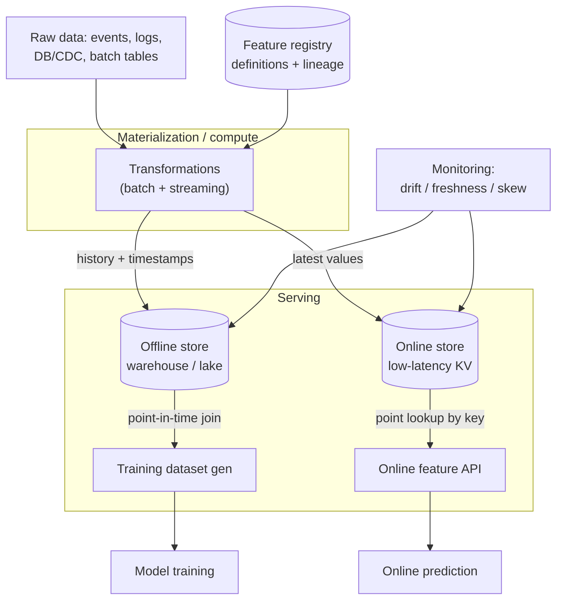
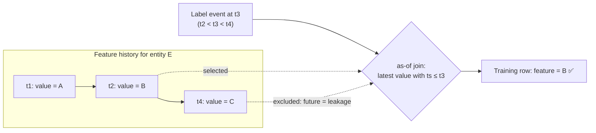
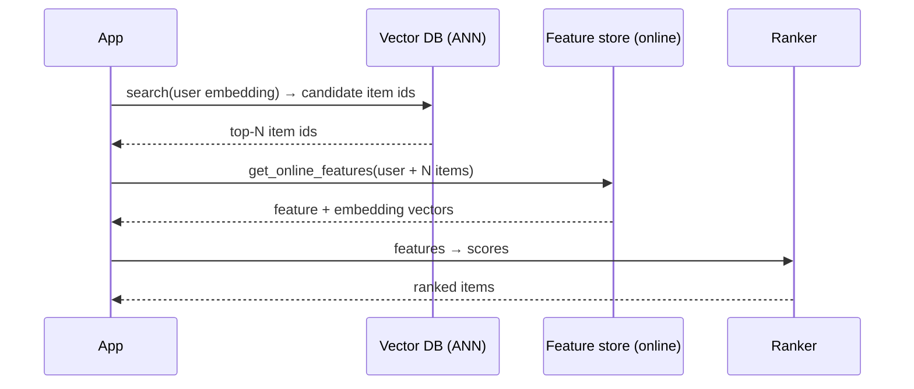

# 🧱 System Design — Feature & Embedding Store (HLD)

> High-level design for the **data layer of an ML system**: define a feature once, then serve it **consistently** for both **offline training** (point-in-time-correct historical joins) and **online inference** (low-latency key lookups) — including **embeddings as features**.
>
> Where the [vector database](../vector-database/README.md) searches by **similarity**, a feature store looks up by **entity key**; together they power retrieve-then-rank. Drive it top-down: **requirements → estimates → data model → dual-store architecture → point-in-time correctness → train/serve consistency → online/offline stores → materialization → embeddings → monitoring → tradeoffs.** The signature problem is **point-in-time correctness** (no label leakage) and **eliminating train/serve skew**.

📐 **Sibling designs:** [ChatGPT (HLD)](../chatgpt/README.md) · [RAG platform](../rag-platform/README.md) · [LLM inference service](../llm-inference/README.md) · [Training platform](../training-platform/README.md) · [Vector database](../vector-database/README.md) · [Claude Code CLI](../claude-code-cli/README.md)

📝 **Practice:** [interview questions](questions.md) · ✅ [answer key](answers.md) · 🃏 [one-page cheat-sheet](cheat-sheet.md)

---

## Contents
1. [Scope & requirements](#1-scope--requirements)
2. [Capacity estimation](#2-capacity-estimation)
3. [API & data model](#3-api--data-model)
4. [High-level architecture](#4-high-level-architecture)
5. [Deep dive — point-in-time correctness (the core)](#5-deep-dive--point-in-time-correctness-the-core)
6. [Deep dive — train/serve skew & consistency](#6-deep-dive--trainserve-skew--consistency)
7. [Deep dive — online store](#7-deep-dive--online-store)
8. [Deep dive — offline store & historical retrieval](#8-deep-dive--offline-store--historical-retrieval)
9. [Deep dive — materialization (batch + streaming)](#9-deep-dive--materialization-batch--streaming)
10. [Deep dive — feature transformations](#10-deep-dive--feature-transformations)
11. [Deep dive — embedding features & the vector-DB contrast](#11-deep-dive--embedding-features--the-vector-db-contrast)
12. [Feature registry & discovery](#12-feature-registry--discovery)
13. [Freshness & TTL](#13-freshness--ttl)
14. [Monitoring — drift, freshness & skew](#14-monitoring--drift-freshness--skew)
15. [Multi-tenancy & governance](#15-multi-tenancy--governance)
16. [Cost optimization](#16-cost-optimization)
17. [Bottlenecks, tradeoffs & failure modes](#17-bottlenecks-tradeoffs--failure-modes)
18. [Scaling roadmap](#18-scaling-roadmap)
19. [What strong answers cover](#what-strong-answers-cover)

---

## 1. Scope & requirements

### Functional
- **Define features** once (a transformation over raw data) with a typed schema, keyed by an **entity** (user, item, merchant…) and a **timestamp**.
- **Materialize** feature values **offline** (batch backfill) and **online** (streaming) from the same definition.
- **Online serving:** low-latency point lookup of the **latest** feature values by entity key, for inference.
- **Offline serving:** **point-in-time-correct** historical retrieval to build training datasets (the as-of join).
- **Embedding features:** store and serve dense vectors (user/item/entity embeddings) as first-class features.
- **Registry & discovery:** searchable catalog of features with lineage, ownership, and **versioning** for reuse.
- **Monitoring:** freshness, drift, and **online/offline consistency** checks.

### Non-functional
| Property | Target | Drives |
|---|---|---|
| **Online latency** | p99 < 10–50 ms for 100s of features | in-memory KV, batching, co-location |
| **Throughput** | 100K+ requests/s × high fan-out | sharded online store, multi-get |
| **Point-in-time correctness** | zero label leakage | timestamped values + as-of join |
| **Train/serve consistency** | identical feature in both paths | one definition, one transform |
| **Freshness** | event → online feature in seconds | streaming materialization |
| **Scale** | billions of entities × 1000s of features | partitioned offline + online stores |
| **Cost** | $ per online read / per stored feature | TTL, tiering, compute reuse |

**Core tension:** **consistency vs. latency vs. freshness vs. cost.** The same feature must be **identical** in a batch training join and a millisecond online lookup, **fresh** from streaming events, and **cheap** at billions of entities — and the historical path must be **leak-free**. A feature store exists to make those guarantees so every model doesn't reinvent them.

> **Why not just a database/cache?** A KV store gives you the *latest* value fast but has **no notion of time-travel** — it can't reconstruct "what was this feature at the moment of the label," and it doesn't enforce that training and serving use the *same* computation. Those two guarantees — **point-in-time correctness** and **train/serve consistency** — are the whole reason the abstraction exists.

---

## 2. Capacity estimation

Anchor: **100M users + 10M items, ~1,000 features each.**

**Online store (latest values only).**
$$\text{size} \approx N_\text{entities} \times F_\text{features} \times \text{bytes}$$
100M users × 1,000 features × ~8 B ≈ **~800 GB** (users) + 10M × 1,000 × 8 B ≈ 80 GB (items) → **~1 TB hot data** → a **sharded in-memory KV** (Redis/Dynamo/Cassandra) cluster. Only the **current** value per (entity, feature) is kept → bounded size.

**Embedding features.** 100M users × 256-dim fp32 (1 KB) ≈ **~100 GB**; items similar. These are stored as feature values (served **by key**), not as an ANN index (that's the [vector DB](../vector-database/README.md)).

**Online read fan-out (the throughput driver).** One recommendation request needs features for **1 user + ~500 candidate items**:
$$10\text{K req/s} \times (1 + 500) \approx \mathbf{5M\ feature\text{-}row\ reads/s}$$
→ the online store must support **batched multi-get** and heavy sharding; per-request latency is bounded by the **slowest key**, so co-locate and batch.

**Offline store (full history).** Every feature value **with its timestamp**, kept for months/years → **100s of TB–PB** in a columnar warehouse/lake. Training-set generation joins features for **billions of (entity, event-time) rows** → a heavy batch **point-in-time join**.

**Why two stores:** online is **small + fast** (latest, ms lookups); offline is **huge + time-versioned** (history, batch joins). Different sizes, SLAs, and engines — fed from one pipeline.

---

## 3. API & data model

```text
Entity        { name: user, join_key: user_id }
FeatureView   { name, entity, source, ttl,
                features: [ {name, dtype}, ... ],     # dtype incl. float[] for embeddings
                timestamp_field }                     # event time -> point-in-time
FeatureService{ name, features: [view.feature, ...] } # the bundle one model consumes
```

```python
# Online (serving) — latest values, low latency
store.get_online_features(
    features=["user_fv:age", "user_fv:emb", "item_fv:ctr_7d"],
    entity_rows=[{"user_id": 42, "item_id": 7}, ...])

# Offline (training) — point-in-time correct historical join
store.get_historical_features(
    entity_df=labels[["user_id","item_id","event_timestamp","label"]],
    features=fs)                                       # joins each row as-of its timestamp
```

- **Entity + timestamp** are the heart of the model: every feature value is `(entity_key, feature, value, event_ts)` — the timestamp is what makes time-travel possible.
- **FeatureService** = the exact feature set a model uses → guarantees training and serving request the **same** bundle.
- **Online** returns the latest values; **offline** returns values **as of each row's `event_timestamp`**.

---

## 4. High-level architecture

The defining pattern is the **dual store** — one definition materialized into an **offline** store (training) and an **online** store (serving), kept consistent by a shared pipeline.



- **Registry:** the source of truth for feature **definitions**, types, ownership, and **lineage** — what feeds the materialization so there is exactly **one** transformation per feature.
- **Materialization/compute:** batch + streaming jobs that compute features and **write to both stores** (the consistency anchor).
- **Offline store:** columnar warehouse/lake holding **timestamped history** → powers point-in-time training joins.
- **Online store:** sharded low-latency KV holding the **latest** value per (entity, feature) → powers inference.
- **Serving API:** `get_online_features` (key lookup) and `get_historical_features` (as-of join).
- **Monitoring:** freshness, drift, and **online↔offline consistency** auditing.

---

## 5. Deep dive — point-in-time correctness (the core)

When you build a training set, each label happened at a **specific moment**; you must join the feature values **as they were at that moment** — never later. Using a *current* or *future* value leaks information the model won't have at inference and **inflates offline metrics**, then the model fails in production.



- **The as-of join:** for each `(entity, event_timestamp)` label row, pick the **most recent feature value with `feature_ts ≤ event_timestamp`** (often within a TTL window). Value **C** (from the future) must never be used.
- **Why it's the signature problem:** get it wrong and offline AUC looks great while online flops — the classic, hard-to-detect **label leakage** bug. The feature store enforces correctness so every team gets it right by default.
- **TTL / staleness window:** bound how old a feature may be (e.g. "ignore values older than 7 days") so missing data becomes null rather than ancient.
- **Implementation:** an efficient **as-of (backward) join** over timestamped offline data — the expensive part of training-set generation (§8).

---

## 6. Deep dive — train/serve skew & consistency

**Train/serve skew** = the same feature computed **differently** in training vs serving (different code, data, or timing) → the model sees inputs at inference that don't match training → silent degradation. The #1 production ML bug the feature store is built to kill.

- **One definition, one transform:** the feature is defined **once** in the registry; the **same transformation** feeds both the offline and online stores — no parallel re-implementation in a serving service.
- **Same values, two access patterns:** training reads history (point-in-time); serving reads the latest — but both are the **output of the identical computation**, so values agree.
- **Backfill from the same logic:** a new feature's history is generated by **running the same transform** over past data, so training and future serving match.
- **Consistency auditing:** **log served feature values** at inference and compare them to the offline store for the same entity/time → an automated **skew detector** (§14).
- **On-demand features** (computed at request time from request data) are the skew danger zone → define them once and reuse the **same function** in training-set generation (§10).

> **Interview signal:** "a feature store's real product is **two guarantees — point-in-time correctness and train/serve consistency**; the dual store and registry are how it delivers them." Everything else is plumbing.

---

## 7. Deep dive — online store

Optimized for **low-latency, high-fan-out point lookups** of the latest values.

- **Engine:** a sharded in-memory / SSD KV — **Redis, DynamoDB, Cassandra, Bigtable**. Key = `(entity_id, feature_view)`, value = the latest feature row (often a serialized struct).
- **Latest-value only:** no history → bounded size and fast reads; the offline store keeps the past.
- **Fan-out + batching:** a request needs many entities (1 user + N items) → **multi-get / pipelined** reads; latency is set by the **slowest key**, so shard evenly and co-locate a feature view's columns in **one value** to avoid N round-trips.
- **Sharding:** partition by entity key; replicate hot partitions for read throughput and HA.
- **Write path:** materialization **upserts** the latest value (streaming for fresh features, batch for the rest).
- **Embeddings:** stored as a `float[]` value, fetched by key in the same multi-get — no ANN here.

---

## 8. Deep dive — offline store & historical retrieval

Optimized for **large-scale, time-versioned batch joins**.

- **Engine:** a columnar **warehouse/lake** (BigQuery/Snowflake/Parquet on object storage) holding **every feature value with its `event_ts`**, partitioned by date.
- **Historical retrieval = point-in-time join:** given a label DataFrame of `(entity, event_timestamp)`, run an **as-of backward join** per feature view, respecting TTL. This is the heavy operation in training-set generation.
- **Making it scale:** partition/prune by time, **bucket by entity key**, push the as-of join into the warehouse engine (window functions) or a distributed compute (Spark), and **co-partition** label rows with feature history to avoid shuffles.
- **Backfill:** computing a new feature's full history by replaying the transform over raw history → feeds correct training labels.
- **Lineage:** every materialized value traces to its source + transform version for reproducibility.

---

## 9. Deep dive — materialization (batch + streaming)

Materialization computes feature values and writes them to **both** stores — the consistency backbone.

- **Batch materialization:** scheduled jobs (hourly/daily) compute features over warehouse data and **load the latest** into the online store + append history to the offline store. Good for slowly-changing / aggregate features.
- **Streaming materialization:** consume an event stream (Kafka/PubSub), compute fresh features (windowed aggregates), and **upsert the online store in seconds** → low freshness lag.
- **The lambda problem:** the same feature via batch (accurate, late) and streaming (fresh, approximate) can **disagree** → reconcile by sharing transform logic, periodic batch correction of streaming values, or a **kappa** (stream-only) design where feasible (§17).
- **Write amplification:** every feature update writes online (upsert) + offline (append) → size the pipeline for the **update rate**, not just entity count.
- **Idempotency & ordering:** upserts keyed by `(entity, ts)` so retries/out-of-order events don't corrupt the latest value.

---

## 10. Deep dive — feature transformations

Three transformation types, by **when** they run:

| Type | When | Example | Skew risk |
|---|---|---|---|
| **Batch** | scheduled, over warehouse | `user_30d_spend` | low (one job both paths) |
| **Streaming** | continuous, over events | `clicks_last_5min` | medium (batch vs stream reconciliation) |
| **On-demand / request-time** | at inference, from request data | `distance(user_loc, store_loc)`, prompt length | **high** — must reuse the same function offline |

- **On-demand features** depend on data only available at request time (the live request, or freshly-fetched values) → compute them with a **registered function** that is **also applied during training-set generation**, so the two paths can't drift.
- **Aggregations** (windowed counts/sums) are the bread-and-butter streaming features → maintain them incrementally with time windows.
- Keep transforms **deterministic and versioned** so a value is always reproducible from inputs + transform version.

---

## 11. Deep dive — embedding features & the vector-DB contrast

Embeddings are first-class feature values — but serving them **by key** is a different job from searching them **by similarity**:

| | **Feature/embedding store** | **[Vector database](../vector-database/README.md)** |
|---|---|---|
| **Query** | "give me **entity 42's** embedding + features" (point lookup by key) | "find items **near** this vector" (ANN search) |
| **Index** | KV by entity key | HNSW / IVF-PQ similarity index |
| **Use** | fetch features for **ranking** a known set | **retrieve** candidates by similarity |
| **Latency** | ms key lookup | ms ANN search |

**They compose in retrieve-then-rank:**



- The **vector DB retrieves** candidates by similarity; the **feature store fetches** the rich features (including embeddings) to **rank** them — they're complementary, not competitors.
- Embeddings produced by a model are **materialized** like any feature (batch for stable entities, streaming for fresh ones) and kept **consistent** across train/serve just like scalar features.
- A feature store may **publish** entity embeddings *into* a vector DB for retrieval — one produces, the other indexes.

---

## 12. Feature registry & discovery

- **Catalog:** every feature's name, type, owner, source, **transformation**, freshness, and **lineage** (raw data → transform → value → which models consume it).
- **Discovery/reuse:** teams **search** for existing features instead of re-deriving them — the network-effect value of a feature store grows as features are shared.
- **Versioning:** features and feature services are **versioned**; changing a definition creates a new version so existing models keep their inputs (schema evolution without silent breakage).
- **Governance hooks:** ownership, PII tags, and access policies live here (§15).
- The registry is what makes "**one definition, used everywhere**" real — and therefore what kills skew.

---

## 13. Freshness & TTL

- **Freshness lag** = event time → value visible in the online store. Streaming features target **seconds**; batch features are hours-fresh by design.
- **Match freshness to the feature:** `clicks_last_5min` needs streaming; `account_age` can be daily batch — don't pay for streaming where batch suffices.
- **TTL / staleness window:** bound how old a value may be served (online) or joined (offline); beyond TTL → serve **null/default**, not a stale value.
- **Freshness SLAs + monitoring:** alert when a feature's lag exceeds its SLA (a stalled pipeline is a silent model-quality bug, §14).

---

## 14. Monitoring — drift, freshness & skew

- **Freshness:** per-feature lag vs SLA; stalled materialization alerts.
- **Drift:** distribution shift of feature values over time (PSI/KL vs a baseline) → data or upstream-pipeline change; flag for retraining.
- **Train/serve skew detection:** **log online-served values**, compare to the offline store for the same `(entity, time)` → alert on mismatch (the automated guard for §6).
- **Data quality:** null rate, out-of-range, type errors, sudden cardinality changes per feature.
- **Coverage:** fraction of requests with a feature present (a spike in missing → a broken upstream).
- **Lineage-aware alerting:** tie an anomaly to the upstream source/transform so on-call knows *what* broke.

---

## 15. Multi-tenancy & governance

- **Sharing with isolation:** features are shared assets, but with **ownership, access control, and quotas** per team/feature.
- **PII & compliance:** tag sensitive features; enforce access policies; support **deletion** (purge an entity's values from both stores for right-to-be-forgotten).
- **Lineage for audit:** trace any feature value to its raw source and transform version.
- **Reliability isolation:** one team's heavy backfill shouldn't starve another's online serving → separate compute pools / rate limits.
- **Embedding privacy:** entity embeddings can leak source attributes → treat as sensitive, govern like PII.

---

## 16. Cost optimization

- **TTL the online store:** keep only what's served; evict cold entities → bounds the expensive in-memory tier.
- **Right-size freshness:** batch over streaming wherever seconds-fresh isn't needed (streaming pipelines are pricey).
- **Reuse over recompute:** the registry lets many models **share** one materialized feature instead of each recomputing it — the biggest org-level saving.
- **Tier storage:** hot latest values in RAM/SSD KV; cold history in cheap object storage.
- **Co-locate columns** of a feature view in one value to cut online round-trips (latency **and** cost).
- **Incremental materialization:** update only changed entities, not full recompute.
- Track **$ per online read** and **$ per stored feature-month**.

---

## 17. Bottlenecks, tradeoffs & failure modes

| Issue | Why | Mitigation |
|---|---|---|
| **Label leakage** | future values join into training | strict **as-of join** + TTL; audit |
| **Train/serve skew** | feature computed two ways | **one definition/transform**, log-and-compare |
| **Online tail latency** | high fan-out, slow key, big values | multi-get, even sharding, co-locate columns, replicate hot keys |
| **Lambda disagreement** | batch vs streaming values differ | shared logic, periodic batch correction, or kappa |
| **Slow point-in-time join** | billions of rows, big shuffles | partition by time, bucket by key, co-partition, push to engine |
| **Stale features** | pipeline lag/stall | freshness SLAs + alerts, mutable streaming path |
| **Feature drift** | upstream data shift | drift monitors → retrain/fix source |
| **Missing/null in prod** | upstream broke or TTL expired | coverage monitor, defaults, alert on null spike |
| **On-demand skew** | request-time logic differs offline | one registered function used in both paths |
| **Hot entity** | celebrity user/item read storm | replicate/cache hot keys |
| **Write amplification** | dual-store upserts at high rate | size for update rate, idempotent keyed upserts |
| **Schema change breaks model** | feature redefined in place | **versioned** features/services |

---

## 18. Scaling roadmap
- **MVP:** offline (warehouse) + online (KV) stores, batch materialization, a registry, **point-in-time join** for training, online key lookup for serving.
- **Growth:** streaming materialization for fresh features, on-demand features, embedding features, freshness/drift monitoring, feature versioning + discovery UI, multi-get serving.
- **Scale:** billions of entities (sharded/replicated online store, partitioned offline lake), automated **skew detection**, lambda/kappa reconciliation, governance/PII + deletion, per-tenant isolation, push embeddings to the [vector DB](../vector-database/README.md).
- **Frontier:** real-time feature pipelines at scale, automated feature monitoring → retraining loops, streaming-first (kappa) materialization, feature/embedding co-design with retrieval, unified batch+stream compute.

---

## What strong answers cover
- **Name the two guarantees up front:** **point-in-time correctness** (no label leakage via the **as-of join**) and **train/serve consistency** (one definition → both paths). Everything else serves these.
- **The dual store is the architecture:** small/fast **online** KV (latest values, ms key lookups, high fan-out) + huge/time-versioned **offline** lake (history, point-in-time joins), fed by **one materialization** pipeline + **registry**.
- **Point-in-time join in detail:** for each label row, take the latest feature value with `ts ≤ event_time` within a TTL — and *why* future values inflate offline metrics then fail online.
- **Kill skew:** one transform, **log-and-compare** auditing, and the **on-demand feature** danger zone (same function offline and online).
- **Batch vs streaming materialization** and the **lambda** reconciliation problem; match freshness to each feature.
- **Embeddings as features, contrasted with the vector DB:** lookup **by key** (rank a known set) vs search **by similarity** (retrieve) — they **compose** in retrieve-then-rank.
- **Operate it:** freshness SLAs, drift, coverage, and skew monitors; versioning for safe schema evolution; reuse for cost.

---

[← Back to ChatGPT HLD](../chatgpt/README.md) · [RAG platform](../rag-platform/README.md) · [LLM inference service](../llm-inference/README.md) · [Training platform](../training-platform/README.md) · [Vector database](../vector-database/README.md) · [Claude Code CLI](../claude-code-cli/README.md) · [Index](../../README.md) · [System Design index](../README.md) · Related: [Stage 6 — LLMOps/RAG](../../stage-6-production-llmops/README.md)
