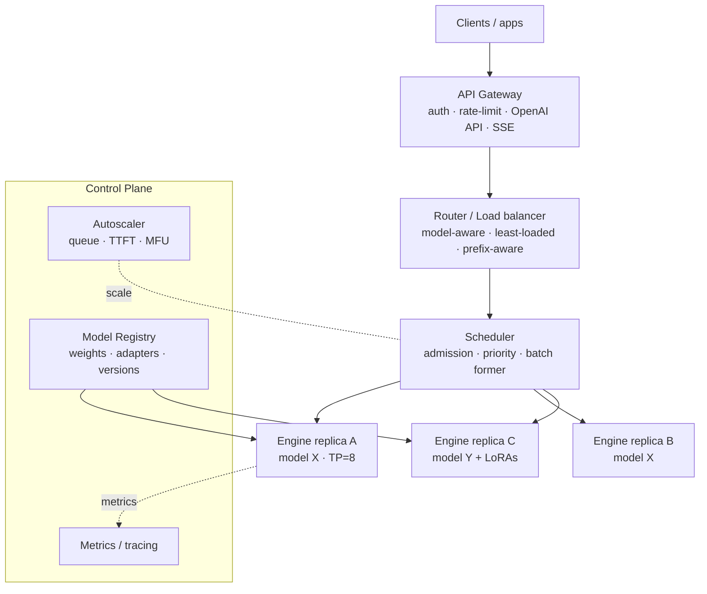
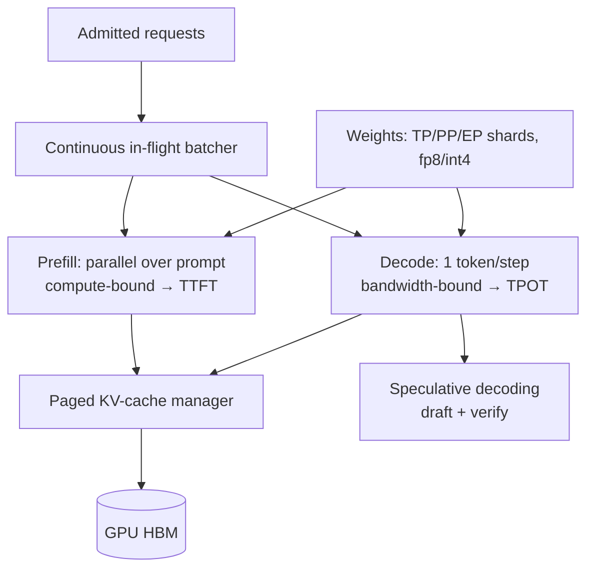
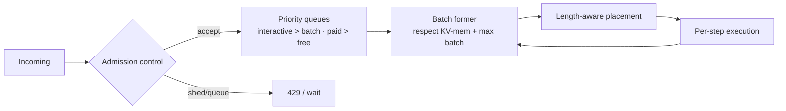

# ⚙️ System Design — LLM Inference Service (HLD)

> High-level design for a **multi-tenant, multi-model LLM inference service** — "vLLM/TGI-as-a-service": take completion/chat/embedding requests over an OpenAI-compatible API and serve them on a GPU fleet at **max throughput per GPU** within **TTFT/TPOT SLOs**.
>
> Drive it top-down: **requirements → estimates → architecture → the engine (prefill/decode, batching, paged KV) → scheduling → multi-model/LoRA + autoscaling → reliability/cost → tradeoffs.** This is the **serving substrate** the [ChatGPT](../chatgpt/README.md) and [RAG](../rag-platform/README.md) designs call into.

📐 **Sibling designs:** [ChatGPT (HLD)](../chatgpt/README.md) · [RAG platform](../rag-platform/README.md) · [Training platform](../training-platform/README.md) · [Vector database](../vector-database/README.md) · [Feature store](../feature-store/README.md) · [Claude Code CLI](../claude-code-cli/README.md)

📝 **Practice:** [interview questions](questions.md) · ✅ [answer key](answers.md) · 🃏 [one-page cheat-sheet](cheat-sheet.md)

---

## Contents
1. [Scope & requirements](#1-scope--requirements)
2. [Capacity estimation](#2-capacity-estimation)
3. [API design](#3-api-design)
4. [High-level architecture](#4-high-level-architecture)
5. [Deep dive — the inference engine](#5-deep-dive--the-inference-engine)
6. [Deep dive — scheduling & batching](#6-deep-dive--scheduling--batching)
7. [Deep dive — KV-cache management](#7-deep-dive--kv-cache-management)
8. [Deep dive — multi-model & multi-LoRA](#8-deep-dive--multi-model--multi-lora)
9. [Deep dive — autoscaling & capacity](#9-deep-dive--autoscaling--capacity)
10. [Deep dive — routing & load balancing](#10-deep-dive--routing--load-balancing)
11. [Multi-tenancy & fairness](#11-multi-tenancy--fairness)
12. [Reliability & failure handling](#12-reliability--failure-handling)
13. [Observability](#13-observability)
14. [Security](#14-security)
15. [Cost optimization](#15-cost-optimization)
16. [Bottlenecks, tradeoffs & failure modes](#16-bottlenecks-tradeoffs--failure-modes)
17. [Scaling roadmap](#17-scaling-roadmap)
18. [What strong answers cover](#what-strong-answers-cover)

---

## 1. Scope & requirements

### Functional
- **OpenAI-compatible API:** `/v1/chat/completions`, `/v1/completions`, `/v1/embeddings`, streaming (SSE).
- **Many models, many sizes:** serve dozens of base models + thousands of **LoRA adapters** concurrently.
- **Sampling controls:** temperature/top-k/top-p, stop sequences, max tokens, logprobs, seed.
- **Structured output / function-calling passthrough:** grammar/JSON-constrained decoding.
- **Batch/async API** for offline high-throughput jobs (non-streaming, cheaper).
- **Model lifecycle:** load/unload, versioned **registry**, warmups, canary.

### Non-functional (the SLOs)
| Property | Target | Drives |
|---|---|---|
| **TTFT** | p99 < 1–2 s | prefill + queue + scheduling |
| **TPOT** | 30–80 ms (15–40 tok/s) | decode optimization + batching |
| **Throughput** | maximize **tokens/s/GPU** (MFU) | batching, paging, quant, speculation |
| **Utilization** | high MFU, low idle | continuous batching, bin-packing |
| **Multi-tenancy** | fairness + isolation | quotas, priority classes |
| **Availability** | 99.9%+, zero-downtime deploys | draining, replicas, health checks |
| **Cost** | min **$/1M tokens** | the whole point |

**Core fact (everything follows from this):** **prefill is compute-bound, decode is memory-bandwidth-bound.** Decode re-reads all weights per token at arithmetic intensity ≈ 1, so a single stream can't saturate a GPU — **batching is mandatory** to turn idle bandwidth into throughput. The service exists to **maximize tokens/s/GPU at the SLO tail**.

---

## 2. Capacity estimation

**Per-GPU/per-node throughput**
- Flagship ~70B in fp8 on an **8×H100 node** (tensor-parallel), ~26 TB/s aggregate HBM.
- Decode reads ~70 GB weights/step → single-stream floor $\approx 70/26000 \approx 2.7$ ms/token (~370 tok/s).
- **Continuous batching** reuses each weight load across the batch → aggregate **~10K+ output tok/s/node** at batch ~64–128 (KV-memory permitting).

**Arithmetic intensity / why batch**
$$\text{intensity} \approx \frac{\text{FLOPs}}{\text{bytes moved}} \approx 1 \ \text{(decode, batch 1)} \;\Rightarrow\; \text{memory-bound}$$
Batching B tokens reuses the loaded weights B times → intensity ≈ B → moves toward compute-bound and **MFU rises**. This is the single most important lever.

**Fleet sizing example**
- Target 2M output tok/s for a model → $\frac{2\text{M}}{10\text{K}} = 200$ nodes = **1,600 H100s** (+ prefill, redundancy, headroom). MoE/quantization shrink it.

**KV-cache budget (caps batch size)**
$$\text{KV bytes} = 2 \cdot L \cdot h_{kv} \cdot d_{head} \cdot \text{seq} \cdot \text{batch} \cdot \text{dtype}$$
At long context, KV — not weights — limits concurrency → GQA/MQA, KV-quant, paging.

---

## 3. API design

```http
POST /v1/chat/completions
{ "model": "llama-70b", "messages": [...], "stream": true,
  "temperature": 0.7, "max_tokens": 512, "stop": ["\n\n"],
  "lora": "tenant-42-support" }      # optional adapter
→ SSE: token deltas → [DONE]
```
- **OpenAI-compatible** (drop-in for clients/tooling); SSE streaming.
- **Batch endpoint:** submit a file of requests → async, non-streaming, lower priority, cheaper.
- **Per-key** auth, rate limits (RPS + tokens/min), quotas; idempotency keys; request IDs.
- Expose `logprobs`, `seed`, grammar/JSON schema for constrained decoding.

---

## 4. High-level architecture



**Data plane:** gateway → router → scheduler → **engine replicas** (the GPU workers) → stream back. **Control plane:** registry (artifacts), autoscaler, observability — async, off the hot path.

| Component | Responsibility |
|---|---|
| **Gateway** | OpenAI-compatible API, auth, rate/quota, SSE, request IDs |
| **Router / LB** | Pick a replica for the requested model: **least-loaded**, **prefix-aware**, session-affinity |
| **Scheduler** | Admission control, **priority queues**, **continuous batch** formation, chunked prefill |
| **Engine replica** | One model (sharded TP/PP/EP) running prefill+decode with paged KV |
| **Model Registry** | Versioned weights + LoRA adapters; drives loading/canary/rollback |
| **Autoscaler** | Scale replicas on queue depth / TTFT / MFU; manage warm pools |

---

## 5. Deep dive — the inference engine

The GPU worker. Goal: **max tokens/s/GPU at the SLO tail.**



- **Model parallelism:** **TP** within node (NVLink), **PP** across nodes, **EP** for MoE; many replicas = data parallel for throughput.
- **Continuous batching:** token-granular scheduling; finished sequences leave, new ones join each step → no idle waiting on the slowest. Biggest throughput win.
- **Prefill vs decode:** prefill (parallel, compute-bound) sets TTFT; decode (one token, bandwidth-bound) sets TPOT. **Chunked prefill** interleaves long prompts so they don't stall decode; **disaggregation** runs them on separate pools at scale.
- **Speculative decoding:** small draft proposes $k$ tokens, target verifies in one pass, accept w/ $\min(1, p_t/p_d)$, else resample residual → 2–3× fewer target steps when acceptance is high.
- **Quantization:** fp8/int8, int4 weight-only for decode → fewer bytes moved → faster bandwidth-bound decode; calibrated (AWQ/GPTQ) to limit accuracy loss.
- **Kernels:** FlashAttention (IO-aware, no $T^2$ materialization), fused/CUDA-graph decode to cut launch overhead.

---

## 6. Deep dive — scheduling & batching



- **Admission control:** when the fleet is saturated, queue or shed (429 with `Retry-After`) instead of accepting work that will miss SLOs.
- **Priority classes:** interactive > batch; paid > free; per-tenant fairness (weighted fair queuing) so no tenant starves others.
- **Batch formation** is bounded by **KV-cache memory**, not just count — the scheduler tracks free KV pages and admits only what fits.
- **Length-aware scheduling:** isolate very long prompts/contexts so they don't cause head-of-line blocking; **chunked prefill** splits them across steps.
- **Preemption:** lower-priority sequences can be **paused** (KV swapped to CPU) to admit interactive traffic, then resumed.

---

## 7. Deep dive — KV-cache management

- **The constraint:** KV grows with context × batch × layers × heads → it, not weights, usually caps concurrency.
- **PagedAttention:** store KV in fixed **non-contiguous pages** with a block table (OS-virtual-memory style) → ~zero fragmentation, higher occupancy, **prefix sharing** (common system prompts stored once), copy-on-write for parallel samples.
- **Shrink it:** **GQA/MQA** (fewer KV heads), **KV quantization** (int8), shorter context budgets.
- **Eviction/offload:** under pressure, **swap** cold sequences' KV to CPU/NVMe and recompute or page back; **evict** by priority. Backpressure to the scheduler so HBM is never over-committed (prevents OOM).
- **Prefix cache:** reuse KV for identical prompt prefixes across requests → skip re-prefill (big TTFT/cost win for shared system prompts).

---

## 8. Deep dive — multi-model & multi-LoRA

- **Multi-model packing:** **bin-pack** models onto GPUs by memory + load; big models get dedicated multi-GPU replicas (TP), small models share GPUs. The registry drives placement.
- **Cold start:** loading 100s of GB of weights is slow → **warm pools**, predictive preloading, weight streaming/mmap, and **scale-to-zero** for rarely-used models (accept a cold-start penalty, keep popular ones warm).
- **Multi-LoRA (the key efficiency trick):** keep **one frozen base resident** and apply per-request **LoRA adapters** in-kernel, **batching requests with different adapters together** (S-LoRA/punica). Adapters are tiny (MBs) and paged in/out → serve **thousands of fine-tunes** at ~base-model cost instead of one deployment each.
- **Versioning & canary:** registry holds model+adapter versions; roll out via canary with instant rollback to the warm previous version.

---

## 9. Deep dive — autoscaling & capacity

- **Don't autoscale on CPU.** Scale on **queue depth, TTFT, and MFU/GPU saturation**.
- **GPUs provision slowly (minutes)** → **warm/standby pools** + **predictive scaling** on diurnal/weekly patterns; reactive-only autoscaling misses spikes.
- **Capacity mix:** reserved baseline + autoscaled burst + **spot/preemptible** for the batch/async tier (checkpoint + requeue on preemption).
- **Scale-to-zero** cold models to reclaim GPUs; keep hot models warm.
- **Right-sizing:** match parallelism (TP/PP) and replica count to each model's latency target and load; over-sharding adds comms overhead, under-sharding misses SLOs.

---

## 10. Deep dive — routing & load balancing

- **Model-aware:** route to replicas that have the requested model/adapter loaded.
- **Least-loaded / least-queue** rather than round-robin (request costs vary wildly by prompt/output length).
- **Prefix-aware routing:** send requests sharing a long prefix (e.g. same system prompt / same conversation) to the **same replica** to maximize **prefix-cache** hits and reuse KV.
- **Session affinity:** keep a streaming request pinned to its generating replica; keep a multi-turn conversation on a warm-KV replica when possible.
- **Backpressure:** router honors per-replica admission signals; spills to others or queues.

---

## 11. Multi-tenancy & fairness
- **Isolation:** per-tenant API keys, quotas (RPS + tokens/min), and **priority classes**; optional dedicated replicas for large/regulated tenants.
- **Fairness:** weighted fair queuing so a heavy tenant can't monopolize a shared model; token-bucket rate limits.
- **Noisy-neighbor control:** cap per-request max tokens/context; isolate batch jobs from interactive traffic.
- **Metering:** per-tenant token accounting → billing and **$/1M tokens** visibility.

---

## 12. Reliability & failure handling
- **Health checks + draining:** unhealthy replicas removed from routing; **graceful drain** (finish in-flight, stop accepting) for zero-downtime deploys.
- **Zero-downtime model updates:** rolling/canary via the registry with warm previous version for instant rollback.
- **Mid-stream replica failure:** the stateful case → either **fail the stream cleanly** + idempotent client retry, or **resume** from a checkpointed token (KV recompute). Idempotency keys dedupe.
- **Overload:** admission control + 429 + autoscale; degrade to smaller/quantized model if configured.
- **Multi-AZ/region** replicas; capacity reservations since GPUs are the scarce resource.

---

## 13. Observability
- **Latency:** TTFT, TPOT, end-to-end **p50/p95/p99** (always the tail).
- **Efficiency:** **tokens/s/GPU**, **MFU**, batch size, KV-cache occupancy, prefix-cache hit rate, **speculative acceptance rate**.
- **Saturation:** queue depth, admission rejects, preemptions, GPU memory headroom.
- **Per-tenant/model:** token usage, error rates, **$/1M tokens**.
- **Tracing:** per-request spans (gateway→router→scheduler→engine), sampled; alerting on SLO burn.

---

## 14. Security
- **AuthN/Z** per key, least-privilege service identities, secrets management.
- **Tenant isolation** of requests/logs; **no prompt/we­ight leakage** across tenants; redact logs.
- **Model-extraction defenses:** rate limits, anomaly detection, optional output/logprob limits.
- **Supply chain:** verify/sign model + adapter artifacts; safe deserialization (no arbitrary pickle); scan dependencies.

---

## 15. Cost optimization
Cost = GPU-seconds, so **MFU is the budget**:
- **Maximize batching** (continuous batching, paged KV, prefix sharing) — the biggest lever.
- **Quantize** (fp8/int4) + **MoE** to cut bytes/FLOPs per token.
- **Speculative decoding** for fewer target steps (when acceptance high).
- **Multi-LoRA** instead of per-tenant deployments.
- **Scale-to-zero** idle models; **spot** for batch; **bin-pack** to avoid stranded GPUs.
- **Right-size** model per request (offer small/large tiers) and **cap** output/context.
- Track **$/1M tokens** per model/tenant as a first-class SLO.

---

## 16. Bottlenecks, tradeoffs & failure modes

| Concern | Tension / failure | Mitigation |
|---|---|---|
| **Decode is bandwidth-bound** | One stream can't saturate a GPU | **Continuous batching** (raise intensity) |
| **KV memory** | Caps batch; OOM under long context | Paging, GQA/MQA, KV-quant, eviction, backpressure |
| **Throughput vs latency** | Bigger batch ↑ tok/s but ↑ TTFT/TPOT | Tune batch to SLO; separate interactive/batch pools |
| **Prefill vs decode interference** | Big prefill stalls decode (p99) | Chunked prefill; disaggregation; length-aware sched |
| **Cold start** | Loading huge weights is slow | Warm pools, predictive preload, scale-to-zero only cold models |
| **Many fine-tunes** | A deployment per tenant is unaffordable | **Multi-LoRA** on one base |
| **Hot/cold model skew** | Idle GPUs vs overloaded ones | Bin-packing, scale-to-zero, autoscale on queue/MFU |
| **Mid-stream failure** | Stateful KV lost | Idempotent retry or checkpoint+resume |
| **Speculative no-win** | Low acceptance / big batch | Aligned small draft; disable when batch large |
| **GPU scarcity** | Spiky demand, slow provisioning | Reservations, warm pools, predictive + spot mix |

---

## 17. Scaling roadmap
- **MVP:** one model, continuous batching + paged KV (vLLM/TGI), OpenAI API, SSE, basic autoscale.
- **Growth:** multi-model + **multi-LoRA**, prefix-aware routing, prefix caching, priority queues, batch API, canary/rollback.
- **Scale:** disaggregated prefill/decode, speculative decoding, MoE, scale-to-zero, multi-AZ/region, full SLO/MFU observability.
- **Frontier:** reasoning-model (long test-time-compute) scheduling, heterogeneous hardware tiers, KV offload hierarchies, per-tenant SLA isolation.

---

## What strong answers cover
- **Start from the bottleneck:** decode is **bandwidth-bound** (intensity ≈ 1) → **continuous batching** is mandatory; prefill is compute-bound → split/chunk it.
- **Go deep on the engine + scheduler:** paged KV, KV-memory-bounded batch formation, chunked prefill/disaggregation, speculative decoding, quantization, model parallelism.
- **Multi-model reality:** **multi-LoRA** on a shared base, bin-packing, **cold starts**, scale-to-zero, **prefix-aware routing**.
- **Autoscale on the right signals** (queue/TTFT/MFU, warm pools) — never CPU — because GPUs provision slowly and dominate cost.
- **Tail latency and $/1M tokens** as the headline SLOs, with explicit throughput↔latency and KV-memory tradeoffs.

---
[← Back to ChatGPT HLD](../chatgpt/README.md) · [RAG platform](../rag-platform/README.md) · [Training platform](../training-platform/README.md) · [Vector database](../vector-database/README.md) · [Feature store](../feature-store/README.md) · [Claude Code CLI](../claude-code-cli/README.md) · [Index](../../README.md) · [System Design index](../README.md) · Related: [Stage 5 — Inference](../../stage-5-inference-optimization/README.md)
