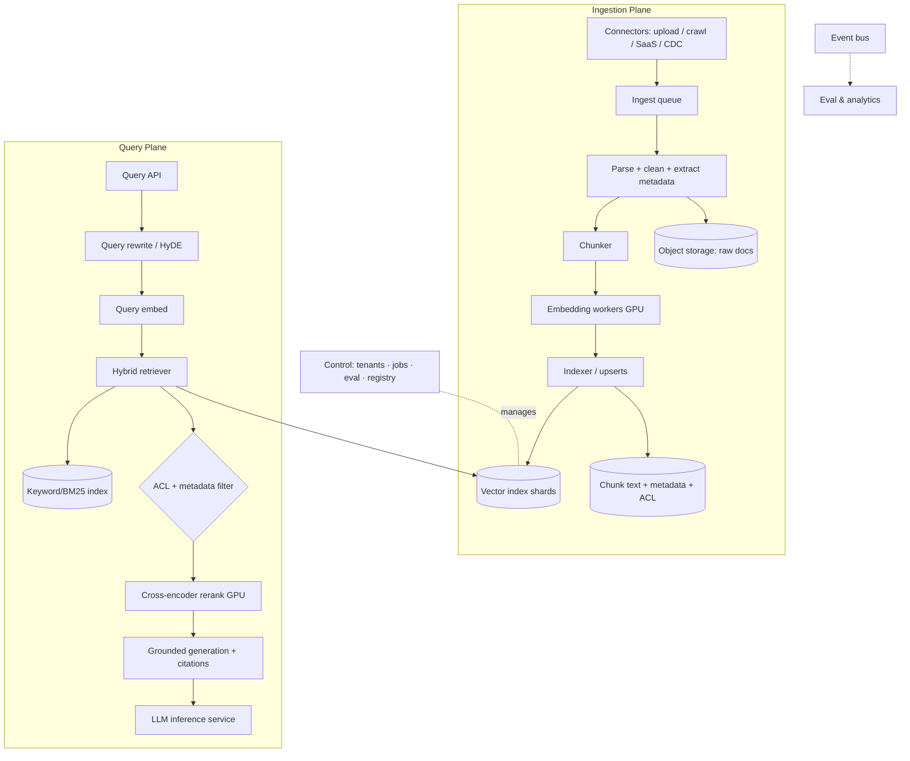
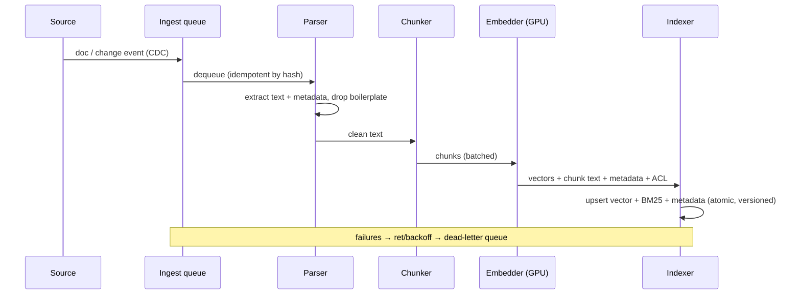
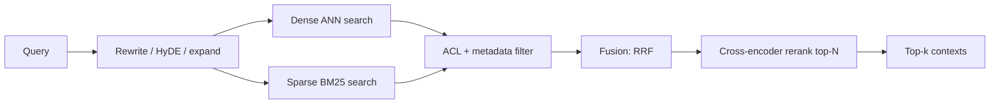

# 🔎 System Design — RAG Platform (HLD)

> High-level design for a **multi-tenant Retrieval-Augmented Generation platform**: ingest any corpus, index it, and serve **grounded, cited, access-controlled** answers — "RAG as a service" that many apps/teams build on.
>
> Drive it top-down: **requirements → estimates → architecture → ingestion plane → retrieval plane → generation/grounding → freshness + ACLs + eval → cost/reliability → tradeoffs.** The two hard parts are **retrieval quality** and **keeping a huge index fresh and access-controlled**.

📐 **Sibling designs:** [ChatGPT (HLD)](../chatgpt/README.md) · [LLM inference service](../llm-inference/README.md) · [Training platform](../training-platform/README.md) · [Vector database](../vector-database/README.md) · [Feature store](../feature-store/README.md) · [Claude Code CLI](../claude-code-cli/README.md)

📝 **Practice:** [interview questions](questions.md) · ✅ [answer key](answers.md) · 🃏 [one-page cheat-sheet](cheat-sheet.md)

---

## Contents
1. [Scope & requirements](#1-scope--requirements)
2. [Capacity estimation](#2-capacity-estimation)
3. [API design](#3-api-design)
4. [High-level architecture](#4-high-level-architecture)
5. [Deep dive — ingestion pipeline](#5-deep-dive--ingestion-pipeline)
6. [Deep dive — chunking](#6-deep-dive--chunking)
7. [Deep dive — retrieval](#7-deep-dive--retrieval)
8. [Deep dive — generation & grounding](#8-deep-dive--generation--grounding)
9. [Deep dive — vector index & storage](#9-deep-dive--vector-index--storage)
10. [Deep dive — multi-tenancy & access control](#10-deep-dive--multi-tenancy--access-control)
11. [Deep dive — freshness & incremental updates](#11-deep-dive--freshness--incremental-updates)
12. [Evaluation & quality](#12-evaluation--quality)
13. [Caching](#13-caching)
14. [Observability](#14-observability)
15. [Security & privacy](#15-security--privacy)
16. [Cost optimization](#16-cost-optimization)
17. [Bottlenecks, tradeoffs & failure modes](#17-bottlenecks-tradeoffs--failure-modes)
18. [Scaling roadmap](#18-scaling-roadmap)
19. [What strong answers cover](#what-strong-answers-cover)

---

## 1. Scope & requirements

### Functional
- **Ingestion connectors:** file upload (PDF/DOCX/HTML/MD), web crawl, SaaS sources (GDrive, Confluence, Slack, S3, DBs) with **incremental sync** (CDC).
- **Processing:** parse → clean → **chunk** → **embed** → index, with dedup and metadata extraction.
- **Retrieval:** **hybrid** (dense + keyword) search, metadata filtering, **reranking**, query rewriting/HyDE.
- **Generation:** grounded answers with **inline citations** and **abstention** when unsupported.
- **Access control:** per-document **ACLs** enforced at query time; strict **tenant isolation**.
- **Lifecycle:** update/delete/re-embed documents; reflect deletions fast (compliance).
- **Evaluation:** built-in retrieval + generation quality metrics and dashboards.
- **Developer surface:** SDK/API to create knowledge bases, ingest, and query.

### Non-functional
| Property | Target | Drives |
|---|---|---|
| **Query latency** | p95 < 1–2 s end-to-end (retrieval ≤ 200 ms) | ANN tuning, rerank budget, caching |
| **Freshness** | new/changed docs searchable in seconds–minutes | streaming ingest, incremental index |
| **Retrieval quality** | high recall@k + precision after rerank | hybrid + rerank + eval loop |
| **Scale** | billions of chunks, 10K+ tenants | sharded ANN, horizontal ingest |
| **Isolation** | no cross-tenant leakage, per-doc ACL | namespacing + ACL filtering |
| **Cost** | $ per ingested doc & per query | embed/index/rerank/LLM costs |

**Core tension:** **quality vs. latency vs. cost vs. freshness.** Better recall (bigger k, reranking, larger embeddings) costs latency and money; fresher indexes cost re-embedding and compaction. The platform exposes knobs and defaults that balance these per tenant.

---

## 2. Capacity estimation

**Corpus & index (state assumptions)**
- Anchor: **1B chunks** across all tenants (frontier scale 10–100B).
- Embedding dim 1024, fp16 → **2 KB/vector** → $1\text{B} \times 2\text{KB} = 2\text{ TB}$ raw vectors; with HNSW graph overhead (~2–3×) → **~5 TB index**, sharded into ~50–100 shards (~50–100 GB each) + replicas.
- Source docs: 1B docs × ~50 KB → **~50 TB** in object storage; chunk text + metadata in a document store.

**Query load**
- Peak **~5K QPS**. Per query: embed query (~5 ms GPU) + **ANN search** across shards (scatter-gather, ~20–50 ms) + **rerank** top-100 with a cross-encoder (~50–100 ms GPU) + LLM generation (seconds, streamed).
- Retrieval is **latency-bound on ANN + rerank**; generation dominates wall-clock but streams.

**Ingestion**
- Embedding throughput ≈ **2–5K chunks/s/GPU**. Indexing 1B chunks once ≈ $\frac{10^9}{3000} \approx 3.3\times10^5$ GPU-s ≈ **~90 GPU-hours**, easily parallelized. Steady-state, scale embed workers to the change rate (CDC).

**Takeaways:** the index doesn't fit one node → **shard + replicate**; embedding and reranking are **GPU** workloads (size them like a fleet); deletions/updates must be cheap → index design must support them.

---

## 3. API design

```http
POST /v1/knowledge-bases            # create a KB (tenant-scoped)
POST /v1/knowledge-bases/{id}/ingest
  { "source": {...}, "chunking": {...}, "metadata": {...} }
GET  /v1/knowledge-bases/{id}/jobs/{job}   # async ingest status

POST /v1/knowledge-bases/{id}/query
  { "query": "...", "top_k": 8, "filters": {"dept":"legal"},
    "rerank": true, "generate": true, "user_acl": ["grp:legal"] }
→ { "answer": "...", "citations": [{doc_id, span, score}], "contexts": [...] }
```

- **Async ingestion** (returns a job id; webhook/poll for status) — parsing/embedding is slow.
- **Synchronous query** with optional `generate` (retrieve-only vs. full RAG).
- **ACL context** passed per query (the caller's identity/groups) for access filtering.
- Per-tenant **rate limits/quotas**; idempotent ingest by content hash.

---

## 4. High-level architecture



**Two planes.** The **ingestion plane** is throughput-oriented and async (parse→chunk→embed→index). The **query plane** is latency-critical (rewrite→embed→retrieve→filter→rerank→generate). They meet at the **index** + **metadata store**.

| Component | Responsibility |
|---|---|
| **Connectors** | Pull/receive data; **CDC** for incremental sync; auth to sources |
| **Parser** | Extract clean text + structure (tables, headings) from many formats |
| **Chunker** | Split into retrievable units with overlap + metadata |
| **Embedding workers** | GPU batch-embed chunks (and queries) |
| **Indexer** | Upsert vectors + keyword postings + metadata atomically |
| **Vector index** | Sharded ANN (HNSW/IVF-PQ) with filtering |
| **Retriever** | Hybrid dense+sparse fusion, ACL/metadata filtering |
| **Reranker** | Cross-encoder precision stage on top-N |
| **Generator** | Grounded answer + citations + abstention (calls the LLM service) |
| **Control plane** | Tenants, ingest jobs, eval, embedding-model registry/versioning |

---

## 5. Deep dive — ingestion pipeline



- **Idempotency & dedup:** key by content hash so re-ingest/duplicates don't bloat the index; near-dup detection (MinHash) optional.
- **Parsing** is the messy part: PDFs/tables/scans (OCR), HTML boilerplate removal, structure preservation (headings → metadata). Bad parsing → bad retrieval downstream.
- **Backpressure & reliability:** durable queue, retries with backoff, **dead-letter queue** for poison docs, per-tenant rate isolation so one big import can't starve others.
- **Versioning:** track embedding-model version per chunk so you can **re-embed** on model upgrades without losing old data.
- **Atomic upsert:** vector + keyword + metadata written together (or reconciled) so a chunk is never half-indexed.

---

## 6. Deep dive — chunking

The highest-leverage, most underrated knob.
- **Tradeoff:** small chunks = precise matches but fragmented context; large chunks = more context but diluted/noisy embeddings and wasted tokens.
- **Strategies:** fixed-size with **overlap**; **structure-aware** (by heading/section/paragraph, code by function); **semantic** chunking (split on topic shifts); **sentence-window** (embed small, return neighbors).
- **Parent–child / hierarchical:** embed small child chunks for matching but return the **parent** section for context.
- **Always attach metadata** (source, title, section, timestamp, ACL) — used for filtering, citations, and freshness.
- **Tune per corpus** and measure with the retrieval eval set; defaults of ~256–512 tokens with ~10–20% overlap are sane starting points.

---

## 7. Deep dive — retrieval



- **Hybrid search:** **dense** (semantic, embeddings) + **sparse** (BM25, exact keywords/rare terms/IDs) fused with **Reciprocal Rank Fusion** ($\sum 1/(k+\text{rank})$). Each covers the other's blind spots.
- **Query understanding:** **rewrite/expand** (resolve pronouns, add synonyms), **HyDE** (embed a hypothetical answer to bridge the question↔answer vocabulary gap), multi-query for recall.
- **Filtering:** apply **ACL + metadata** predicates — ideally **pre-filter** inside the ANN search (filtered ANN) so you don't retrieve then drop (which wrecks recall); post-filter as fallback.
- **Reranking:** a **cross-encoder** scores query+doc jointly on the top-N (e.g. 100→8) for a big precision lift; cost is GPU latency, so cap N and rerank only when quality needs it.
- **Bi-encoder vs cross-encoder:** bi-encoder (separate embeddings) is fast and indexable for **recall**; cross-encoder is slow but accurate for **precision** — hence the two-stage retrieve→rerank funnel.

---

## 8. Deep dive — generation & grounding

- **Context assembly:** take reranked top-k, order by relevance, fit the LLM context budget, and include source ids for citation.
- **Grounding prompt:** instruct *answer only from context*, require **per-claim citations**, and **abstain** ("I don't know / not in the sources") when support is missing.
- **Citation verification:** post-check that cited spans actually support each claim; drop or flag unsupported claims (reduces hallucination).
- **Faithfulness vs. helpfulness:** strict grounding cuts hallucination but can over-abstain; tune and measure both.
- **Calls the [LLM inference service](../llm-inference/README.md)** for generation (streaming, model choice by tenant/SLA).

---

## 9. Deep dive — vector index & storage

- **ANN algorithms:** **HNSW** (great recall/latency, higher memory, slower build/updates) vs **IVF-PQ** (compressed, memory-efficient, tunable recall) — pick by scale/memory/freshness needs.
- **Sharding:** partition vectors across shards; queries **scatter-gather** to all shards then merge top-k. Shard by tenant for isolation, or by hash for balance (large tenants may need dedicated shards).
- **Replication:** replicas per shard for HA and read throughput.
- **Filtered search:** index metadata alongside vectors so ACL/filters apply during traversal (avoid post-filter recall loss).
- **Quantization:** **PQ/scalar** compression shrinks memory at a small recall cost; keep full-precision for reranking if needed.
- **Build vs. serve:** HNSW updates are incremental but fragmentation grows → periodic **compaction/rebuild**; IVF may need re-training centroids as the distribution drifts.
- **Storage split:** vectors in the ANN store; **chunk text + metadata + ACL** in a document/KV store (cheap, queryable); raw docs in **object storage**.

---

## 10. Deep dive — multi-tenancy & access control

- **Isolation:** per-tenant **namespaces** (or dedicated indexes for big/regulated tenants); never mix tenant vectors in a way that allows cross-tenant hits.
- **Per-document ACLs:** store the allowed principals/groups per chunk; the caller passes their identity/groups; retrieval **filters to authorized docs** — ideally **pre-filtered ANN** so unauthorized docs never surface (post-filtering can leak existence via counts/latency and hurts recall).
- **The "RAG access-control trap":** the LLM will happily summarize anything in its context → **authorization must happen at retrieval, not generation**. Enforce before a doc ever reaches the prompt.
- **Residency:** tenant data pinned to a region; encryption per tenant; key management for hard isolation.
- **Noisy-neighbor protection:** per-tenant quotas on ingest and query so one tenant can't degrade others.

---

## 11. Deep dive — freshness & incremental updates

- **Incremental ingest (CDC):** connectors stream creates/updates/deletes; only changed docs are re-parsed/re-embedded.
- **Deletes must be fast (compliance/right-to-be-forgotten):** support **tombstones** for immediate exclusion from results + background physical purge across vector, keyword, metadata, and blob stores.
- **Updates:** re-chunk/re-embed changed docs, upsert by stable chunk id, retire stale chunks; version so in-flight queries stay consistent.
- **Model upgrades:** changing the embedding model invalidates all vectors → **background re-embed** with dual-index (serve old, build new, atomic swap) — a major operational event; version vectors to make it possible.
- **Index hygiene:** scheduled **compaction**, orphan cleanup, and drift checks (centroids/quality) keep latency and recall stable.

---

## 12. Evaluation & quality

- **Evaluate the two stages separately** (so you can localize failures):
  - **Retrieval:** recall@k, MRR, nDCG against a **golden query→doc** set.
  - **Generation:** **faithfulness** (claims supported by context), **answer relevance**, citation correctness — via LLM-judge + human spot-checks.
- **Attribution matrix:** for a wrong answer, was the gold doc retrieved? No → retrieval bug (embeddings/chunking/rerank/filter). Yes but ignored/contradicted → generation bug (prompt/grounding).
- **Offline gate + online signals:** CI eval on PRs (index/prompt/model changes) + live thumbs/citation-click/abstention rates with drift alerts.
- **Per-tenant evals:** quality varies by corpus; let tenants bring golden sets.

---

## 13. Caching
- **Query/result cache:** identical or **semantically similar** queries → cached contexts/answers (TTL'd, tenant-scoped; careful with freshness/personalization).
- **Embedding cache:** dedup identical chunk/query text → skip re-embedding.
- **Retrieval cache:** hot query → cached top-k.
- **LLM prefix cache:** stable grounding-prompt prefix cached as KV (see inference service).

---

## 14. Observability
- **Quality:** recall@k, rerank lift, faithfulness, abstention rate, citation-click-through, thumbs.
- **Latency:** per-stage p50/p95/p99 (embed, ANN, rerank, generate) — find the bottleneck stage.
- **Index health:** shard size/balance, recall vs. ground truth, fragmentation, freshness lag (ingest→searchable).
- **Ingestion:** throughput, parse-failure/dead-letter rates, queue depth, per-tenant usage.
- **Tracing:** per-query spans across the retrieval funnel; sample contexts for eval (privacy-safe).

---

## 15. Security & privacy
- **AuthN/Z** to sources and at query time; **per-doc ACL** enforced at retrieval.
- **Tenant isolation** (namespaces, encryption, residency), **PII** detection/redaction at ingest, retention + **right-to-be-forgotten** deletes across all stores.
- **Untrusted content = indirect prompt-injection** surface: retrieved text can carry hidden instructions → sanitize/delimit before the prompt, least-privilege generation, output guards.
- **Source-side safety:** respect robots/permissions when crawling; audit ingestion provenance.

---

## 16. Cost optimization
- **Embedding cost:** dedup, batch on GPU, right-size embedding dim/model; only re-embed on real changes.
- **Index memory:** **quantize** (PQ) and tier cold tenants to cheaper storage; scale-to-zero idle tenants.
- **Rerank/LLM cost:** rerank only when needed; cap N and k; route generation to **smaller models** when sufficient; cache aggressively.
- **Ingestion bursts:** spot/preemptible workers for backfills; throttle to change rate in steady state.
- Track **$ per ingested doc** and **$ per query** per tenant.

---

## 17. Bottlenecks, tradeoffs & failure modes

| Concern | Tension / failure | Mitigation |
|---|---|---|
| **Chunking** | Too small → fragmented; too big → diluted | Tune per corpus; parent-child; measure with eval |
| **Filtered ANN** | Post-filter kills recall / leaks | Pre-filter inside ANN; index metadata with vectors |
| **Recall vs latency/cost** | Bigger k + rerank = slower/pricier | Two-stage funnel, cap N, cache |
| **Freshness vs cost** | Re-embed/compaction is expensive | CDC, incremental upsert, dual-index swaps |
| **ACL at generation** | LLM summarizes unauthorized context | Authorize at **retrieval**, never at the prompt |
| **Parsing quality** | Bad PDF/table extraction → bad retrieval | Robust parsers, OCR, structure preservation, eval |
| **Hallucination** | Confident unsupported answers | Grounding + citations + abstention + faithfulness eval |
| **Index drift** | HNSW fragmentation / IVF centroid drift | Compaction, periodic rebuild, drift monitoring |
| **Embedding upgrade** | Invalidates the whole index | Versioned vectors + background dual-index re-embed |
| **Indirect injection** | Poisoned docs hijack generation | Sanitize/delimit, least privilege, output guards |

---

## 18. Scaling roadmap
- **MVP:** single-tenant, upload + fixed chunking + one embedding model + HNSW + top-k + grounded generation with citations.
- **Growth:** hybrid + rerank, metadata/ACL filtering, incremental CDC ingest, eval harness, caching, multi-tenant namespaces.
- **Scale:** sharded/replicated index, filtered ANN, dedicated big-tenant indexes, dual-index re-embedding, per-tenant quotas + residency, full eval/observability.
- **Frontier:** agentic/multi-hop retrieval, multimodal (image/table) RAG, auto-tuned chunking/retrieval per corpus, GraphRAG/structured fusion.

---

## What strong answers cover
- **Separate the planes:** throughput-oriented **ingestion** vs latency-critical **query**, meeting at a **sharded index + metadata store**.
- **Retrieval is a funnel:** hybrid recall → **filtered** → **cross-encoder rerank** → grounded generation; **evaluate retrieval and generation separately**.
- **Name the RAG-specific traps:** chunking tradeoffs, **pre-filtered ANN for ACLs** (authorize at retrieval, not generation), **freshness/deletes**, and **embedding-model upgrades invalidating the index**.
- **Ground hard:** citations + abstention + faithfulness eval to control hallucination; treat retrieved content as **untrusted** (indirect injection).
- **Cost/latency/quality/freshness** as explicit, tunable tradeoffs per tenant.

---
[← Back to ChatGPT HLD](../chatgpt/README.md) · [LLM inference service](../llm-inference/README.md) · [Training platform](../training-platform/README.md) · [Vector database](../vector-database/README.md) · [Feature store](../feature-store/README.md) · [Claude Code CLI](../claude-code-cli/README.md) · [Index](../../README.md) · [System Design index](../README.md) · Related: [Stage 6 — LLMOps/RAG](../../stage-6-production-llmops/README.md)
