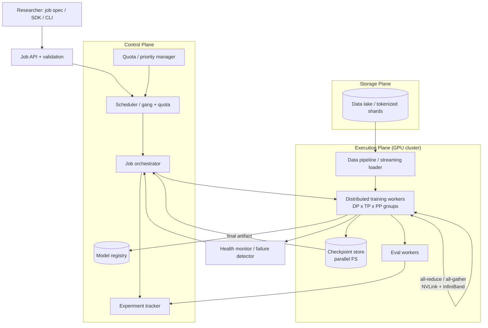
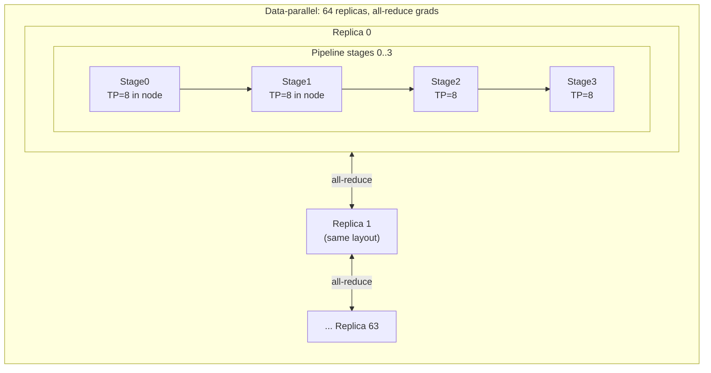

# 🏋️ System Design — LLM Training & Fine-Tuning Platform (HLD)

> High-level design for a **multi-tenant platform that pretrains and fine-tunes LLMs at scale**: submit a declarative job, and the platform handles **distributed training across thousands of GPUs, data pipelines, checkpointing, fault tolerance, and a registered model artifact** — the other half of the LLM lifecycle from serving.
>
> Drive it top-down: **requirements → estimates → job API → architecture → parallelism → memory → data → fault tolerance → scheduling → fine-tuning paths → cost/observability → tradeoffs.** The two hard parts are **fitting a model that doesn't fit one GPU** (parallelism + sharding) and **keeping a multi-week job alive on flaky hardware** (checkpointing + elasticity).

📐 **Sibling designs:** [ChatGPT (HLD)](../chatgpt/README.md) · [RAG platform](../rag-platform/README.md) · [LLM inference service](../llm-inference/README.md) · [Vector database](../vector-database/README.md) · [Feature store](../feature-store/README.md) · [Claude Code CLI](../claude-code-cli/README.md)

📝 **Practice:** [interview questions](questions.md) · ✅ [answer key](answers.md) · 🃏 [one-page cheat-sheet](cheat-sheet.md)

---

## Contents
1. [Scope & requirements](#1-scope--requirements)
2. [Capacity estimation](#2-capacity-estimation)
3. [Job API & specification](#3-job-api--specification)
4. [High-level architecture](#4-high-level-architecture)
5. [Deep dive — distributed training & parallelism](#5-deep-dive--distributed-training--parallelism)
6. [Deep dive — memory & optimizer-state sharding](#6-deep-dive--memory--optimizer-state-sharding)
7. [Deep dive — data pipeline](#7-deep-dive--data-pipeline)
8. [Deep dive — fault tolerance & checkpointing](#8-deep-dive--fault-tolerance--checkpointing)
9. [Deep dive — scheduling & multi-tenancy](#9-deep-dive--scheduling--multi-tenancy)
10. [Deep dive — fine-tuning paths (SFT / PEFT / RLHF / DPO)](#10-deep-dive--fine-tuning-paths-sft--peft--rlhf--dpo)
11. [Throughput & MFU optimization](#11-throughput--mfu-optimization)
12. [Experiment tracking & reproducibility](#12-experiment-tracking--reproducibility)
13. [Evaluation integration](#13-evaluation-integration)
14. [Storage](#14-storage)
15. [Observability](#15-observability)
16. [Security & data governance](#16-security--data-governance)
17. [Cost optimization](#17-cost-optimization)
18. [Bottlenecks, tradeoffs & failure modes](#18-bottlenecks-tradeoffs--failure-modes)
19. [Scaling roadmap](#19-scaling-roadmap)
20. [What strong answers cover](#what-strong-answers-cover)

---

## 1. Scope & requirements

### Functional
- **Job types:** **pretraining** (from scratch), **continued pretraining** (domain adaptation), **SFT** (instruction tuning), **PEFT** (LoRA/QLoRA), **preference alignment** (RLHF/PPO, DPO).
- **Data:** ingest raw corpora → clean → dedup → tokenize → shard → **mix** multiple sources with weights/curriculum; streaming to keep GPUs fed.
- **Distributed training:** orchestrate a job across many GPUs/nodes with **data / tensor / pipeline / expert** parallelism; overlap compute and communication.
- **Checkpoint & resume:** periodic, resumable checkpoints; **auto-resume** after failure; elastic resize.
- **Experiment tracking:** configs, metrics, curves, artifacts, lineage — reproducible runs.
- **Evaluation:** periodic in-loop eval + downstream benchmarks; eval gates before registry.
- **Model registry:** versioned output artifacts (weights, tokenizer, config, eval card) consumable by the [inference service](../llm-inference/README.md).
- **Developer surface:** declarative job spec (YAML/SDK), CLI/API, dashboards, hyperparameter sweeps.

### Non-functional
| Property | Target | Drives |
|---|---|---|
| **Scale** | thousands of GPUs in one job; many concurrent jobs | parallelism, topology-aware scheduling |
| **Efficiency (MFU)** | 40–55% model-FLOPs utilization | kernels, overlap, sharding, packing |
| **Fault tolerance** | survive node loss on multi-week runs | checkpoint + auto-resume + elasticity |
| **Reproducibility** | same spec → same model (bitwise-ish) | seed/data-order/version control |
| **Throughput** | data loader never starves GPUs | sharded streaming, prefetch, packing |
| **Multi-tenancy** | fair sharing, quotas, isolation | gang scheduler, priority, preemption |
| **Cost** | $ per trained token / per run | MFU, spot, scheduling efficiency |

**Core tension:** **scale vs. efficiency vs. reliability vs. cost.** More GPUs finish sooner but add communication overhead (lower MFU) and more failure surface; bigger batches help MFU but can hurt convergence; frequent checkpoints aid recovery but stall training. The platform's job is to expose these knobs and pick good defaults.

> **Train vs. serve:** this platform is **throughput- and durability-oriented** (jobs run for days, optimize total cost to a target loss), the mirror image of the latency-oriented [inference service](../llm-inference/README.md). Same hardware, opposite objective.

---

## 2. Capacity estimation

Anchor on one concrete target: **pretrain a 70B-param model on 15T tokens.**

**Compute (the headline number).** Training FLOPs follow the rule of thumb:

$$C \approx 6 \, N \, D$$

where $N$ = parameters, $D$ = training tokens (the 6 = roughly 2 FLOPs/MAC × 3 passes — forward + two for backward).

$$C \approx 6 \times 70\text{e}9 \times 15\text{e}12 \approx 6.3 \times 10^{24}\ \text{FLOPs}$$

**Wall-clock on $N_{\text{gpu}}$ GPUs.** An H100 does ~990 TFLOP/s bf16 (dense) peak; at ~45% MFU that's **~440 TFLOP/s effective**:

$$T = \frac{C}{440\text{e}12 \times N_{\text{gpu}}}$$

| GPUs | Wall-clock | GPU-days |
|---|---|---|
| 1,024 | ~166 days | ~170K |
| 4,096 | ~41 days | ~170K |
| 8,192 | ~21 days | ~170K |

The product (~**170K GPU-days**) is fixed by compute; GPUs only buy you wall-clock — and only if MFU holds as you scale out. This is why frontier pretraining needs **thousands of GPUs** and why **every MFU point is worth millions of dollars**.

**Memory (why it can't fit one GPU).** AdamW mixed-precision keeps **~16 bytes/param** (fp16 weight 2 + fp16 grad 2 + fp32 master 4 + Adam $m$ 4 + $v$ 4):

$$70\text{e}9 \times 16\ \text{B} \approx 1.12\ \text{TB of model states}$$

— vs. **80 GB** on one H100. So states alone need **~14 GPUs** before a single activation, forcing **sharding (ZeRO/FSDP) + tensor/pipeline parallelism**.

**Checkpoint size.** A full resumable checkpoint stores weights **and** optimizer states ≈ 16 bytes/param ≈ **~1.1 TB** for 70B. Written every ~30–60 min, that's a serious load on the **parallel filesystem** — motivating async/sharded checkpointing.

**Data.** 15T tokens at ~2 bytes/token packed ≈ **~30 TB** of tokenized shards streamed repeatedly; the loader must sustain GPU-matching throughput across thousands of readers.

---

## 3. Job API & specification

A **declarative spec** is the contract — the platform reconciles reality to it (like Kubernetes for training).

```yaml
job:
  name: llama-70b-domain-v3
  type: continued_pretrain        # pretrain | continued_pretrain | sft | lora | dpo | ppo
  base_model: llama-70b@v1        # registry ref (omit for from-scratch)
  model:
    arch: llama
    n_params: 70B
    seq_len: 8192
  data:
    mix:                          # source weights / curriculum
      - {dataset: web@v4, weight: 0.6}
      - {dataset: code@v2, weight: 0.3}
      - {dataset: domain_docs@v1, weight: 0.1}
    pack: true
  parallelism:                    # platform can auto-suggest
    data: 64
    tensor: 8
    pipeline: 4
    zero_stage: 1
  optim: {name: adamw, lr: 3e-4, schedule: cosine, warmup: 2000, grad_clip: 1.0}
  train: {global_batch_tokens: 4M, max_steps: 100000, precision: bf16}
  checkpoint: {every_steps: 500, keep_last: 5, async: true}
  eval: {every_steps: 2000, suites: [loss_holdout, mmlu, domain_bench]}
  resources: {gpus: 2048, topology: single_island, priority: high}
```

- **Lifecycle:** `QUEUED → SCHEDULED → RUNNING → (CHECKPOINTING ↔ RUNNING) → EVALUATING → COMPLETED | FAILED | PREEMPTED`, with **auto-resume** re-entering `RUNNING` from the last checkpoint.
- **Submit/query:** `POST /jobs`, `GET /jobs/{id}` (state, step, loss, MFU, ETA), `POST /jobs/{id}/cancel`, `GET /jobs/{id}/logs|metrics`.
- **Sweeps:** a parent spec + search space fans out child jobs (grid/random/ASHA) sharing the scheduler.

---

## 4. High-level architecture

Split a **control plane** (orchestration, stateless-ish, cheap) from a **data/execution plane** (GPUs + data + storage, expensive).



- **Scheduler/quota:** gang-schedules whole jobs onto **topology-aligned** GPU sets; enforces per-team quotas, priority, preemption.
- **Orchestrator:** launches workers, watches health, triggers **auto-resume** from the last checkpoint on failure, drives the eval/registry handoff.
- **Training workers:** the GPU mesh executing the parallelism plan; the heart of the system.
- **Data pipeline:** streams tokenized, mixed, shuffled shards to every worker without starving them.
- **Checkpoint store / registry / tracker:** durability, the final artifact, and reproducible run metadata.

---

## 5. Deep dive — distributed training & parallelism

A big job composes **four orthogonal kinds of parallelism** (often called 3D/4D parallelism). Each splits a different thing and trades a different cost.

| Parallelism | Splits | Communication | Use when |
|---|---|---|---|
| **Data (DP)** | the **batch** (full model replica per group) | **all-reduce** gradients/step | always; scales throughput |
| **Tensor (TP)** | individual **matmuls** (within a layer) | all-reduce **inside** each layer (chatty) | model too big for one GPU; keep **inside a node** (NVLink) |
| **Pipeline (PP)** | **layers** into stages | activations across **stage boundaries** | very deep/large models; across nodes |
| **Expert (EP)** | **MoE experts** across devices | all-to-all token routing | sparse MoE models |
| **Sequence/Context (SP/CP)** | the **sequence** dimension | along the sequence | very long context |

**How they compose (a 2048-GPU example):** put **TP=8 inside a node** (NVLink-fast, high comm), **PP=4 across a few nodes** (cheap point-to-point), and **DP=64 across the rest** (one all-reduce/step). $8 \times 4 \times 64 = 2048$.



**Golden rules:**
- **Match comms to the network:** TP on the fastest link (intra-node NVLink), PP/DP across slower inter-node InfiniBand.
- **Overlap comms with compute** (bucketed all-reduce during backward, async PP sends) so MFU stays high.
- **Pipeline bubbles** waste compute at fill/drain — shrink with more micro-batches or interleaved (1F1B) schedules.
- **Prefer the cheapest split that fits:** DP first; add ZeRO/FSDP; then TP within a node; PP last; EP only for MoE.

---

## 6. Deep dive — memory & optimizer-state sharding

What lives in GPU memory during training:

| Bucket | Size (AdamW, mixed precision) |
|---|---|
| **Model states** (weight + grad + fp32 master + Adam $m,v$) | **~16 bytes/param** |
| **Activations** | depends on batch × seq × layers (often the biggest, and the most variable) |
| **Fragmentation / workspace** | allocator slack, comm buffers |

**ZeRO / FSDP — shard the 16 bytes/param across DP ranks** instead of replicating:

| Stage | Shards | Per-GPU model-state memory (DP degree $P$) |
|---|---|---|
| **ZeRO-1** | optimizer states | weight+grad + (12/P) bytes/param |
| **ZeRO-2** | + gradients | weight + (14/P) bytes/param |
| **ZeRO-3 / FSDP** | + parameters | **~16/P bytes/param** (gather weights just-in-time per layer) |

ZeRO-3 makes per-GPU memory shrink ~linearly with the number of data-parallel GPUs, at the cost of extra **all-gather** traffic to reconstruct each layer's weights on the fly (overlap hides most of it).

**Activation checkpointing (recomputation):** don't store all activations — keep a few and **recompute** the rest in backward. Cuts activation memory roughly from $O(L)$ to $O(\sqrt{L})$ for ~**one extra forward pass (~33% more compute)**. The standard lever for fitting long sequences / big models.

**Offload (last resort):** push optimizer states/grads to **CPU/NVMe** (ZeRO-Offload) to fit on fewer GPUs — big memory win, but PCIe becomes the bottleneck and MFU drops. Use only when you can't add GPUs.

**Decision order to fit a model:** mixed precision → ZeRO/FSDP sharding → activation checkpointing → TP within node → PP across nodes → offload.

---

## 7. Deep dive — data pipeline

Garbage in, garbage model — and a slow loader idles a million-dollar cluster. The offline pipeline turns raw corpora into **tokenized, shuffled, mixed shards**:

```mermaid
graph LR
    RAW[Raw corpora<br/>web / code / books / domain] --> CLEAN[Clean / normalize<br/>strip boilerplate, lang-id]
    CLEAN --> FILTER[Quality filter<br/>heuristics + classifier]
    FILTER --> DEDUP[Dedup<br/>exact + near-dup MinHash]
    DEDUP --> DECON[Decontaminate<br/>remove eval-set leakage]
    DECON --> TOK[Tokenize]
    TOK --> PACK[Pack to seq_len<br/>no padding waste]
    PACK --> SHARD[(Sharded shuffled<br/>token store)]
    SHARD --> LOADER[Streaming loader<br/>mix + curriculum]
    LOADER --> GPUs[Training workers]
```



- **Dedup** (exact + near-duplicate via MinHash/LSH): duplicates waste compute and hurt generalization/memorization — one of the highest-leverage quality steps.
- **Quality filtering:** heuristic rules + a learned classifier (keep "high-quality" prose/code); language ID.
- **Decontamination:** strip documents overlapping eval benchmarks so reported scores are real.
- **Tokenize + pack:** concatenate documents to fill `seq_len` exactly (with separators) so you don't waste FLOPs on padding.
- **Mixing & curriculum:** sample sources by weight (e.g., 60% web / 30% code / 10% domain); optionally **anneal** the mix (more high-quality data late). Mixing weights are a first-class hyperparameter.
- **Streaming & throughput:** shard across thousands of readers, **prefetch** and overlap I/O with compute; tokenization is precomputed offline so the GPU loop only reads token IDs.
- **Determinism:** a seeded, resumable sampler so a restart replays the **exact same data order** (key for reproducibility and clean resumes).

---

## 8. Deep dive — fault tolerance & checkpointing

On thousands of GPUs for weeks, **failures are the norm** — a single GPU/NIC/host failure can kill a synchronous job. Mean time between failures shrinks as you scale, so recovery must be cheap and automatic.

**Checkpointing:**
- **What:** model weights + optimizer states + **data-loader position** + RNG state + step — everything needed to resume bit-for-bit.
- **Distributed/sharded:** each rank writes its own shard in parallel (no single-writer bottleneck) to the parallel FS / object store.
- **Asynchronous:** snapshot tensors to a **CPU buffer**, then flush to storage in the background so the GPU step resumes in seconds, not minutes — keeps checkpoint stalls off the critical path.
- **Cadence:** balance overhead vs. lost work. Rule of thumb: checkpoint interval so that *(checkpoint cost) ≪ (expected work lost per failure)*; more GPUs / bigger models → checkpoint **more often**.
- **Retention:** keep last *k* + periodic "milestone" checkpoints (for divergence rollback and eval).

**Auto-resume & elasticity:**
- **Health monitor** detects a dead/slow rank (heartbeat, NCCL timeout, ECC errors) → orchestrator **kills the job, swaps in a spare node, and relaunches from the last checkpoint** automatically.
- **Elastic training:** resize the world (e.g., 2048 → 1920 GPUs) and continue, rescaling the DP degree — survive partial capacity loss without waiting for a replacement.
- **Spares:** keep a small hot pool so replacement is seconds, not a re-queue.

**Straggler mitigation:** one slow GPU stalls every all-reduce (sync training moves at the slowest rank). Detect via per-rank step-time outliers → fence the bad host, redistribute, and blocklist it from future placement.

---

## 9. Deep dive — scheduling & multi-tenancy

Many teams share one expensive cluster; the scheduler is where fairness and utilization are won or lost.

- **Gang scheduling:** a job needs **all** its GPUs at once (synchronous training) — schedule all-or-nothing to avoid partial allocations deadlocking each other.
- **Topology-aware placement:** keep a job's GPUs on **one InfiniBand island / rack** so collectives stay fast; fragmenting a job across the fabric tanks MFU. Bin-pack with topology as a first-class constraint.
- **Quotas & fair-share:** per-team GPU budgets; hierarchical fair-share so no team starves; **priority tiers** (production runs > experiments).
- **Preemption:** a high-priority job can preempt low-priority ones — safe **because training checkpoints**, so preempted work resumes later with little loss. This is what makes high utilization possible.
- **Backfill:** slot small/short jobs (fine-tunes, sweeps) into gaps while a big job waits for a full gang.
- **Heterogeneity:** match jobs to GPU types (H100 for big pretrains, cheaper/older for small fine-tunes).

**The mixed workload:** a few **huge, long, high-priority pretraining** jobs + **many small, short fine-tune/sweep** jobs. Reserve capacity for big gangs, backfill the gaps with small jobs, and use preemption + checkpointing to keep utilization high.

---

## 10. Deep dive — fine-tuning paths (SFT / PEFT / RLHF / DPO)

Most platform *usage* is fine-tuning, not from-scratch pretraining. The paths differ sharply in cost and complexity:

| Path | What it does | Memory / cost | Notes |
|---|---|---|---|
| **SFT** | supervised next-token on curated (prompt, response) pairs | full-model train (16 B/param states) | standard instruction tuning |
| **LoRA / PEFT** | freeze base, train small **low-rank adapters** | **tiny** — only adapter states + base weights (no optimizer state for base) | many tenants share one base; cheap, fast |
| **QLoRA** | LoRA on a **4-bit quantized** frozen base | smallest — fits big models on few GPUs | great for democratized fine-tuning |
| **RLHF / PPO** | optimize a **reward model** via RL rollouts | **heaviest** — up to **4 models in memory** (actor, critic, reward, frozen reference) + generation rollouts | powerful, complex, unstable |
| **DPO** | preference optimization **without** a separate reward model or rollouts | ~2 models (policy + reference); no RL loop | simpler/cheaper than PPO, often comparable |

**Design implications:**
- **LoRA/QLoRA** → a high-throughput **multi-tenant fine-tune service**: one shared frozen base, many cheap adapters trained/stored/served independently (mirrors multi-LoRA serving in the [inference service](../llm-inference/README.md)).
- **RLHF** needs a **generation/rollout engine** (the policy must sample completions during training) — so the training platform borrows inference machinery; it's effectively train + serve in one loop.
- **DPO** is the pragmatic default for preference alignment: most of the win, far less infra than PPO.

---

## 11. Throughput & MFU optimization

**MFU** (model-FLOPs utilization) = achieved model-FLOPs ÷ hardware peak. It's the single best efficiency metric — it directly sets **cost and time-to-train**. Levers:

- **Fused, efficient kernels:** **FlashAttention** (memory-efficient, IO-aware attention), fused optimizer/layernorm — fewer memory round-trips, higher utilization.
- **Lower precision:** **bf16** standard; **fp8** on Hopper/Blackwell for big matmuls — more FLOP/s and less memory (with loss-scaling/range care).
- **Overlap communication with compute:** bucketed gradient all-reduce during backward; async pipeline sends; prefetch ZeRO-3 weight gathers. Exposed comms = idle GPUs.
- **Sequence packing:** eliminate padding so every token does useful work.
- **Big enough batch:** large global batch amortizes comms and improves arithmetic intensity (but watch convergence/critical-batch-size).
- **Gradient accumulation:** reach a large effective batch when memory caps the per-step batch.
- **Shrink pipeline bubbles:** more micro-batches, interleaved 1F1B schedules.
- **Right-size parallelism:** the cheapest split that fits — every unnecessary TP/PP boundary adds comms and lowers MFU.

> **Rule of thumb:** healthy large-model training runs **~40–55% MFU**. Below ~30% something is wrong — usually exposed communication, a data-loader stall, pipeline bubbles, or fragmented placement.

---

## 12. Experiment tracking & reproducibility

- **Track everything:** full resolved config, code/git SHA, container image, dataset **versions + mix**, seeds, hardware, and time-series metrics (loss, grad-norm, LR, MFU, tokens/s).
- **Lineage:** base model → data versions → job → output artifact → eval results, queryable end-to-end (which data produced this checkpoint?).
- **Reproducibility levers:** fixed seeds, **deterministic resumable data order**, pinned library/CUDA versions, recorded parallelism layout. Note that bitwise determinism is hard across different GPU counts (reduction order changes) — reproduce on the **same** topology, and treat small run-to-run variance as expected.
- **Artifacts:** every checkpoint + final model versioned with its metadata and **eval card** before promotion to the registry.

---

## 13. Evaluation integration

- **In-loop:** held-out **loss/perplexity** every *N* steps — the primary health/convergence signal.
- **Periodic benchmarks:** spin up **eval workers** (often a snapshot served by the [inference service](../llm-inference/README.md)) on a milestone checkpoint to run MMLU/HumanEval/domain suites — off the critical path so they don't stall training.
- **Eval gates:** a model only promotes to the registry if it **beats the incumbent** on the agreed suite (no regressions); attach an eval card to the artifact.
- **Alignment runs:** add preference/safety/red-team evals for SFT/RLHF/DPO outputs.
- **Decontamination tie-in:** trustworthy benchmark numbers depend on the pipeline having removed eval-set leakage (§7).

---

## 14. Storage

| Tier | Holds | Needs |
|---|---|---|
| **Data lake / object store** | raw + tokenized shards | high aggregate read bandwidth, cheap capacity |
| **Parallel filesystem** (Lustre/GPFS) or fast object store | checkpoints (~1 TB each) | high **write** bandwidth, parallel shard writes |
| **Model registry** | final artifacts + metadata + eval cards | versioning, immutability, access control |
| **Metadata DB** | job/experiment/lineage records | queryable, durable |

Checkpoint write bandwidth is a real design constraint: thousands of ranks each flushing a shard of a ~1 TB checkpoint will saturate a naive store — hence **sharded + async** writes and a high-throughput parallel FS.

---

## 15. Observability

- **Training health:** loss curve, **grad-norm** (spike = instability), LR schedule, **NaN/Inf detection** (halt + rollback).
- **Efficiency:** **MFU**, tokens/s, GPU util/SM occupancy, per-rank step time (straggler detection), comm vs compute time.
- **Infra:** GPU temp/power/ECC errors, NCCL/network health, NVLink/IB bandwidth, checkpoint write latency.
- **Cluster:** queue depth, allocation/fragmentation, utilization per team, preemption rate.
- **Alerting:** loss divergence, MFU drop, stalled job (no step progress), failed/looping auto-resume, checkpoint failures.

A loss-divergence or NaN alert should be able to **auto-halt and roll back** to the last good checkpoint rather than burn days of compute on a dead run.

---

## 16. Security & data governance

- **Data provenance & consent:** track licensing/consent per dataset; enforce that only approved data enters a mix (legal + compliance).
- **PII handling:** detect/scrub PII in the pipeline; honor deletion requests (which may require excluding data from future training).
- **Tenant isolation:** namespaced data, checkpoints, and artifacts; one team can't read another's data or models.
- **Access control:** RBAC on datasets, jobs, and registry; protect base models/weights as sensitive IP.
- **Secrets:** data-source credentials in a vault, not specs.
- **Supply chain:** pinned, scanned container images; signed artifacts.
- **Memorization risk:** dedup + (optionally) differential-privacy or canary monitoring to limit verbatim training-data regurgitation.

---

## 17. Cost optimization

- **Maximize MFU:** the biggest lever — halving idle time halves cost to a target loss.
- **Right-size compute (Chinchilla):** for a fixed FLOP budget, balance params vs. tokens (~20 tokens/param) instead of an oversized under-trained model; don't burn compute past diminishing returns.
- **Spot/preemptible GPUs:** training is checkpointed and restartable → safe to run low-priority/fine-tune jobs on cheaper preemptible capacity (auto-resume absorbs reclaims).
- **PEFT first:** default tenants to **LoRA/QLoRA** — a fraction of the cost of full fine-tuning for most adaptation needs.
- **Scheduling efficiency:** preemption + backfill + topology-aware packing keep the cluster busy (idle GPUs are pure loss).
- **Early stopping / eval gates:** kill diverging or plateaued runs early; don't train past the point evals stop improving.
- **Right precision:** bf16/fp8 where stable to cut both time and memory.

---

## 18. Bottlenecks, tradeoffs & failure modes

| Issue | Why it happens | Mitigation |
|---|---|---|
| **Loss spike / divergence** | LR too high, bad batch, fp16 overflow, instability | grad clipping, LR warmup/decay, bf16, **rollback** to last good ckpt + skip/lower LR |
| **NaN/Inf in loss** | overflow, bad data, division issues | loss scaling, NaN guards, halt + rollback, inspect the batch |
| **Low MFU (<30%)** | exposed comms, data stall, pipeline bubbles, fragmented placement | overlap comms, fix loader, more micro-batches, topology-aware placement |
| **Stragglers** | one slow/failing GPU; sync moves at the slowest | detect per-rank step-time, fence + blocklist host, elastic resize |
| **Hardware failure** | GPUs/NICs fail constantly at scale | sharded checkpoints + **auto-resume** + spares + elasticity |
| **Checkpoint stall** | synchronous write of a ~1 TB checkpoint | **async + sharded** writes, parallel FS, snapshot-to-CPU then flush |
| **Data-loader bottleneck** | I/O can't feed the GPUs | precompute tokenization, shard + prefetch, more readers |
| **OOM at long seq** | activations scale with seq/batch | activation checkpointing, sequence/context parallel, smaller micro-batch |
| **Comm bottleneck at scale** | all-reduce volume grows; cross-island traffic | hierarchical/overlapped collectives, keep TP intra-node, topology placement |
| **Non-reproducibility** | unseeded order, version drift, different GPU count | seed + resumable order, pin versions, reproduce on same topology |
| **Pipeline bubbles** | fill/drain idle time in PP | more micro-batches, interleaved 1F1B |
| **Scheduler fragmentation** | big gangs can't fit among small jobs | reservations for big jobs, backfill + preemption |

---

## 19. Scaling roadmap
- **MVP:** single-node multi-GPU; DDP + ZeRO; SFT/LoRA on a base model; sync checkpoint; manual eval; one team.
- **Growth:** multi-node 3D parallelism, FSDP/ZeRO-3, async sharded checkpoint + auto-resume, data pipeline with dedup/mixing, experiment tracker, gang scheduler with quotas.
- **Scale:** thousands of GPUs, topology-aware scheduling + preemption/backfill, elastic fault-tolerant training, full RLHF/DPO paths, multi-tenant data governance, fp8, in-loop eval gates + registry.
- **Frontier:** auto-tuned parallelism/HP search, MoE/expert parallelism, very-long-context (sequence/context parallel), spot-heavy elastic fleets, continuous/streaming pretraining, tight train↔serve co-design.

---

## What strong answers cover
- **Lead with the two estimates:** **$C \approx 6ND$** (→ thousands of GPUs, ~170K GPU-days) and **~16 bytes/param** (→ can't fit one GPU → must shard). Everything else follows from these.
- **Separate the planes:** a cheap **control plane** (scheduler, orchestrator, tracker, registry) over an expensive **execution plane** (GPU mesh + data + checkpoints); train is **throughput/durability-oriented**, the mirror of latency-oriented serving.
- **Parallelism as a toolkit:** know what **DP/TP/PP/EP** each split and cost, **match comms to the network** (TP intra-node, PP/DP inter-node), **overlap comms with compute**, and pick the **cheapest split that fits** (DP → ZeRO/FSDP → activation checkpointing → TP → PP → offload).
- **Reliability is the hard part at scale:** **sharded + async checkpoints**, **auto-resume**, **elasticity**, and **straggler/divergence handling** — multi-week jobs on flaky hardware.
- **Know the fine-tuning ladder:** SFT vs **LoRA/QLoRA** (cheap, multi-tenant) vs **RLHF/PPO** (4 models + rollouts, heavy) vs **DPO** (no reward model, the pragmatic default).
- **MFU is the money metric:** name the levers (kernels, fp8, overlap, packing, batch size, right-sized parallelism) and the "<30% means something's wrong" heuristic.
- **Scheduling makes the cluster economical:** gang + topology-aware placement, quotas, **preemption (safe because checkpoints)**, backfill, and spot for restartable jobs.

---

[← Back to ChatGPT HLD](../chatgpt/README.md) · [RAG platform](../rag-platform/README.md) · [LLM inference service](../llm-inference/README.md) · [Vector database](../vector-database/README.md) · [Feature store](../feature-store/README.md) · [Claude Code CLI](../claude-code-cli/README.md) · [Index](../../README.md) · [System Design index](../README.md) · Related: [Stage 2 — Pretraining at Scale](../../stage-2-pretraining-at-scale/README.md) · [Stage 3 — Adaptation & Alignment](../../stage-3-adaptation-alignment/README.md)
