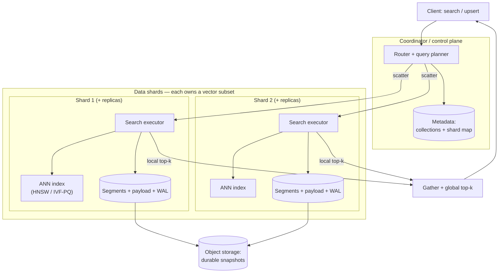
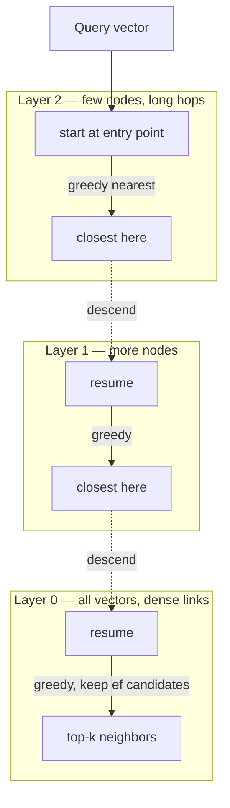
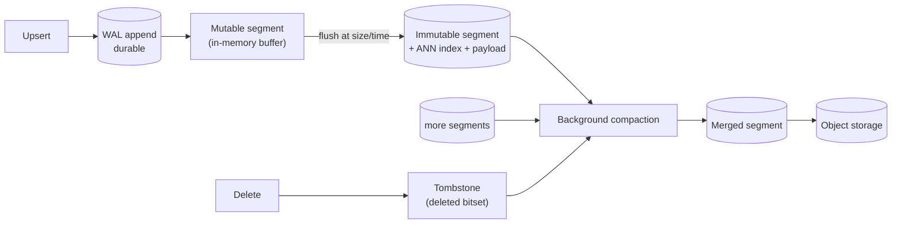

# 🧭 System Design — Vector Database Internals (HLD)

> High-level design for the **vector database itself** — the specialized data system that stores billions of embeddings and answers **approximate nearest-neighbor (ANN)** queries in milliseconds, with filtering, updates, durability, and horizontal scale.
>
> The [RAG platform](../rag-platform/README.md) *uses* a vector index as a black-box component — **here we build that component.** Drive it top-down: **requirements → estimates → data model → architecture → ANN algorithms → storage engine → updates/deletes → filtered search → distribution → durability → tuning → tradeoffs.** The core tension is **recall vs. latency vs. memory vs. freshness**, and the deep skill is knowing the **ANN index internals** (HNSW, IVF, PQ) and their math.

📐 **Sibling designs:** [ChatGPT (HLD)](../chatgpt/README.md) · [RAG platform](../rag-platform/README.md) · [LLM inference service](../llm-inference/README.md) · [Training platform](../training-platform/README.md) · [Feature store](../feature-store/README.md) · [Claude Code CLI](../claude-code-cli/README.md)

📝 **Practice:** [interview questions](questions.md) · ✅ [answer key](answers.md) · 🃏 [one-page cheat-sheet](cheat-sheet.md)

---

## Contents
1. [Scope & requirements](#1-scope--requirements)
2. [Capacity estimation](#2-capacity-estimation)
3. [API & data model](#3-api--data-model)
4. [High-level architecture](#4-high-level-architecture)
5. [Deep dive — ANN algorithms (the core)](#5-deep-dive--ann-algorithms-the-core)
6. [Deep dive — HNSW internals](#6-deep-dive--hnsw-internals)
7. [Deep dive — IVF + product quantization](#7-deep-dive--ivf--product-quantization)
8. [Deep dive — storage engine & segments](#8-deep-dive--storage-engine--segments)
9. [Deep dive — inserts, deletes & updates](#9-deep-dive--inserts-deletes--updates)
10. [Deep dive — filtered search](#10-deep-dive--filtered-search)
11. [Deep dive — distribution: sharding & replication](#11-deep-dive--distribution-sharding--replication)
12. [Quantization & the memory hierarchy](#12-quantization--the-memory-hierarchy)
13. [Freshness & index build](#13-freshness--index-build)
14. [Consistency & durability](#14-consistency--durability)
15. [Benchmarking & tuning](#15-benchmarking--tuning)
16. [Observability](#16-observability)
17. [Multi-tenancy & security](#17-multi-tenancy--security)
18. [Cost optimization](#18-cost-optimization)
19. [Bottlenecks, tradeoffs & failure modes](#19-bottlenecks-tradeoffs--failure-modes)
20. [Scaling roadmap](#20-scaling-roadmap)
21. [What strong answers cover](#what-strong-answers-cover)

---

## 1. Scope & requirements

### Functional
- **Store** billions of high-dimensional vectors (embeddings) + a **payload** (metadata) per vector.
- **CRUD:** insert/**upsert**, delete, update vectors and payloads.
- **ANN search:** top-$k$ nearest neighbors by **cosine / dot-product / L2**, with a tunable speed↔accuracy knob.
- **Filtered search:** combine vector similarity with **metadata predicates** (`category = X AND price < Y`).
- **Batch + streaming ingest;** persistence, **snapshots/backup**, and crash recovery.
- **Collections/namespaces:** logical isolation, per-collection schema (dim, metric, index params).
- **(Optional) hybrid:** fuse with keyword/sparse scores (the [RAG platform](../rag-platform/README.md) layers this on top).

### Non-functional
| Property | Target | Drives |
|---|---|---|
| **Recall@k** | e.g. ≥ 0.95 vs exact | index type + ef/nprobe tuning |
| **Query latency** | p99 < 10–50 ms | in-memory index, quantization, sharding |
| **Throughput** | 10K–100K QPS | replicas, SIMD, batching |
| **Ingest rate** | 10K–1M vectors/s | segmented write path, async build |
| **Memory/cost** | vectors are huge → $ per vector | quantization, disk tiering |
| **Freshness** | insert searchable in seconds | mutable segment + incremental index |
| **Durability/scale** | no data loss; billions of vectors | WAL + replication + horizontal shards |

**Core tension:** **recall vs. latency vs. memory vs. freshness.** The index is **approximate** — you trade a little accuracy for orders-of-magnitude speed and memory savings, and every knob (ef, nprobe, PQ bits, segment count) moves you along these curves. A vector DB is fundamentally *"a storage engine wrapped around an ANN index."*

> **Why not a normal database?** B-trees and hash indexes answer **exact** lookups and **range** queries on scalars. Nearest-neighbor in 100s of dimensions has **no useful sort order** and exact search degrades to a full scan (§5) — so vector DBs are built around fundamentally different, approximate index structures.

---

## 2. Capacity estimation

Anchor: **1 billion 768-dim embeddings.**

**Raw vector memory** dominates everything:

$$\text{bytes} = N \times d \times \text{bytes/component}$$

| Precision | Per vector | 1B vectors |
|---|---|---|
| fp32 | 768 × 4 = **3,072 B** | **~3.0 TB** |
| fp16 | 768 × 2 = 1,536 B | ~1.5 TB |
| int8 | 768 × 1 = 768 B | ~0.75 TB |
| **PQ (m=96, 8-bit)** | **96 B** | **~96 GB** |

So full-precision **1B vectors won't fit one machine's RAM** → either **shard across ~50–100 nodes**, or **compress with PQ** (~32× here → fits on a few nodes), or **tier to SSD** (DiskANN). This single fact drives most of the design.

**Index overhead.** HNSW adds graph links: ~$M$ neighbors/node × layers ≈ **+50–100% memory** on top of the vectors. IVF adds only centroid tables (small). PQ replaces the vectors entirely (huge win) at the cost of approximate distances.

**Query cost.**
- **HNSW:** ~$O(\log N)$ greedy hops, each scoring ~$M$·ef candidates → **tens–hundreds of distance computes** → sub-ms to low-ms in RAM.
- **IVF-PQ:** scan `nprobe` lists of ~$N/\text{nlist}$ vectors each, using fast PQ table lookups → tune `nprobe` for recall.
- **Exact (flat):** $N$ distance computes/query → 1B × 768 mults ≈ **hopeless** per query without GPUs/batching → why ANN exists.

**Build cost.** HNSW insertion is ~$O(\log N)$ each → building 1B vectors is **hours, parallelized across shards**; IVF needs a one-time **k-means** to train centroids on a sample.

---

## 3. API & data model

```text
Collection {
  name, dim, metric: cosine|dot|l2,
  index: { type: hnsw|ivf_pq|flat, M, ef_construct, nlist, pq_m, pq_bits },
  replication, shards
}
Point { id, vector: float[dim], payload: {json metadata} }
```

```text
PUT  /collections/{c}/points          # upsert batch [{id, vector, payload}]
POST /collections/{c}/points/search   # { vector, k, ef|nprobe, filter, with_payload }
POST /collections/{c}/points/delete   # by id or by filter
POST /collections/{c}/snapshot        # durable backup
```

- **Search request knobs:** `k` (results), **`ef`/`nprobe`** (the recall↔latency dial), `filter` (metadata predicate), `params` (exact-rerank on/off).
- **Search response:** ids + distances (+ optional payload/vector). Distances let the caller threshold/abstain.
- **Consistency knobs:** write `wait`/`async`, read consistency level (per replica).
- The [RAG platform](../rag-platform/README.md) is a **client** of this API: it owns chunking/embedding/reranking and calls `search` with ACL predicates as filters.

---

## 4. High-level architecture

A **coordinator** (routing + metadata) over **data shards** (each an independent ANN index + storage engine), with replicas for HA and object storage for durability.



- **Router/query planner:** resolves the collection, **scatters** the query to all shards (or a routed subset), then **gathers and merges** local top-$k$ into a global top-$k$.
- **Shard:** an autonomous unit — its own **ANN index** in memory + **storage engine** (WAL + segments + payload). Scales the data horizontally.
- **Replicas:** copies of a shard for HA and read throughput; one leader for writes.
- **Metadata store:** collection schemas, shard map, versions — small but critical (often a Raft-backed KV).
- **Object storage:** durable home for snapshots/segments so a node can be rebuilt.

---

## 5. Deep dive — ANN algorithms (the core)

Exact nearest-neighbor in high dimensions is **fundamentally hard**: the **curse of dimensionality** makes tree/space-partitioning methods (kd-trees) degrade to scanning everything, and a brute-force **flat** scan is $O(Nd)$ per query (1B × 768 = ~$10^{12}$ ops). So production systems use **Approximate** NN — accept ~95–99% recall for 100–1000× speedup. Three families:

| Family | Idea | Strength | Weakness |
|---|---|---|---|
| **Graph (HNSW)** | navigable small-world graph; greedy-walk to the query | **best recall/latency in RAM**; great for updates-ish | high memory (vectors + links); harder to delete |
| **IVF (cluster)** | k-means partitions; scan only the nearest `nprobe` cells | tunable, lower memory, fast build | recall sensitive to `nprobe`; needs training |
| **PQ (quantization)** | compress vectors into codes; approximate distances via lookup tables | **massive memory savings** (8–64×) | lossy → lower recall; usually paired with IVF |
| **IVF-PQ** | IVF to narrow, PQ to store/score cheaply | **billion-scale on modest RAM** | most knobs to tune |
| **DiskANN** | graph index on **SSD** + in-RAM compressed vectors | billion-scale on **one node** | SSD latency; complex build |

**How to choose (rule of thumb):**
- **< ~10M vectors, recall-critical, fits RAM →** HNSW.
- **100M–10B vectors, memory-bound →** IVF-PQ (or HNSW+PQ).
- **Billion-scale on one box / cost-bound →** DiskANN.
- Always consider **PQ + a full-precision rerank** of the top candidates to recover recall.

---

## 6. Deep dive — HNSW internals

**Hierarchical Navigable Small World** = a multi-layer proximity graph. Upper layers are sparse with **long-range** links (express lanes); the bottom layer (L0) holds **all** vectors with dense short links.



**Search:** start at the top entry point, **greedily hop** to the neighbor closest to the query until no improvement, **descend** a layer, repeat. At L0, keep a dynamic candidate list of size **`ef`** and return the best $k$. Complexity ~**$O(\log N)$** hops.

**Key parameters:**
- **`M`** — links per node. Higher M → better recall, more memory (~$M$ neighbors/node), slower build.
- **`ef_construction`** — candidate breadth while building → higher = better graph, slower build.
- **`ef_search`** — candidate breadth at query time → **the recall↔latency dial** (higher ef = more recall, more latency). Set ef ≥ k.

**Tradeoffs:** HNSW gives the **best recall/latency in RAM**, but: **memory-heavy** (store vectors + the graph), **deletes are awkward** (you can't cleanly remove a node from a navigable graph → use **tombstones** + periodic rebuild, §9), and build is non-trivial to parallelize. It's the default for in-memory, recall-critical workloads.

---

## 7. Deep dive — IVF + product quantization

**IVF (inverted file).** Train **`nlist`** centroids with k-means; assign each vector to its nearest centroid's list. At query time, find the **`nprobe`** nearest centroids and scan **only those lists** (≈ `nprobe`·$N/\text{nlist}$ vectors instead of $N$).
- **`nprobe`** is the recall↔latency dial (more lists scanned = more recall, more cost).
- Cheap memory (just centroids + assignments) and fast build, but recall is sensitive to `nprobe` and to how well centroids fit the data (boundary vectors get missed).

**Product Quantization (PQ).** Compress each vector to a tiny code:
1. Split the $d$-dim vector into **$m$ subvectors** of length $d/m$.
2. For each subspace, learn a **codebook** of $2^{b}$ centroids (e.g. $b=8$ → 256) via k-means.
3. Encode each subvector by its nearest centroid id → vector becomes **$m$ bytes** (at $b=8$).

$$768\text{-dim fp32 } (3072\text{ B}) \xrightarrow{m=96,\ b=8} 96\text{ B} \quad (32\times \text{ smaller})$$

**Why it's also fast — the lookup-table trick (ADC).** For a query, precompute a table of distances from each **query subvector** to all 256 sub-centroids (one $m \times 256$ table). Then any database vector's distance ≈ **sum of $m$ table lookups** — no full distance math per vector. This is what makes scanning millions of compressed codes cheap.

**IVF-PQ** combines them: IVF narrows to `nprobe` lists, PQ stores/scores those candidates cheaply → **billion-scale ANN on modest RAM**. Add **residual PQ** (quantize the residual after subtracting the centroid) for better accuracy, and a **full-precision rerank** of the final top candidates to recover recall lost to quantization.

---

## 8. Deep dive — storage engine & segments

Under the index sits a **storage engine** that must be append-friendly (ANN indexes hate in-place edits) and durable. The standard pattern is **LSM-like immutable segments**:



- **WAL (write-ahead log):** every write is appended durably first → crash recovery replays it.
- **Mutable segment:** new vectors land in an in-memory buffer (searched by brute force or a small index) so they're **immediately queryable**.
- **Flush:** when the buffer fills, write an **immutable segment** with its own built ANN index + payload columns.
- **Search = fan-out over all segments** (mutable + immutable) then merge — so segment count directly affects latency.
- **Compaction:** background job merges small segments into bigger ones, **rebuilds** the ANN index, and **drops tombstoned** vectors — the moment deletes are actually reclaimed.

This gives fast, durable writes and bounded read amplification, at the cost of compaction work and a freshness/segment-count tradeoff.

---

## 9. Deep dive — inserts, deletes & updates

Updates are the **hard part** of vector DBs — ANN indexes are optimized for static data.

- **Insert/upsert:** append to WAL → mutable segment (instantly searchable) → later flushed and indexed. Cheap.
- **Delete:** you **can't cleanly remove** a node from an HNSW graph or an IVF list without corrupting navigability. So mark it in a **tombstone bitset**, **filter it out at query time**, and **physically reclaim it during compaction/rebuild**. Until then deleted vectors still cost memory and search work.
- **Update = delete + insert** (vectors are immutable in a segment); payload-only updates can be done in a side column.
- **The degradation trap:** heavy delete/update churn bloats segments with tombstones → recall drops (the graph is full of dead ends) and memory grows → **schedule compaction by tombstone ratio**, not just size.

> **Interview signal:** knowing that *deletes in a graph index are tombstone-then-rebuild* (not in-place) — and why — separates people who've used a vector DB from people who've built one.

---

## 10. Deep dive — filtered search

Combining a metadata predicate with vector search is deceptively hard (same problem the [RAG platform](../rag-platform/README.md) hits for ACLs, here at the engine level):

- **Post-filter** (ANN first, then drop non-matching): if the filter is **selective**, the top-$k$ ANN results may contain **few or zero** matches → recall collapses, or you must over-fetch wildly.
- **Pre-filter** (find matching ids first, then search only those): correct, but a naive pre-filter means **brute-forcing** the matching subset — fine if small, bad if it's millions.
- **In-filter / filterable index (the good answer):** evaluate the predicate **during** graph traversal / list scan — only traverse to neighbors that satisfy the filter (filterable HNSW), or keep **per-attribute indexes** and intersect. Needs the metadata **co-located with the vectors**.
- **Selectivity-aware planning:** the query planner picks the strategy by estimated selectivity — **highly selective → pre-filter** (small candidate set); **non-selective → in-filter ANN**. Maintaining recall under selective filters is a known hard problem; payload indexes + adaptive ef are the mitigation.

---

## 11. Deep dive — distribution: sharding & replication

- **Sharding:** partition vectors across nodes so the dataset (and index memory) scales horizontally.
  - **Random/round-robin** (default): even load; every query **scatters to all shards** and merges → simple, balanced, but fan-out grows with shard count.
  - **Clustered** (route by centroid/topic): a query can hit **fewer shards**, but risks skew/hot spots and needs rebalancing.
- **Scatter-gather:** router sends the query to shards, each returns local top-$k$, router merges to global top-$k$. Latency = **slowest shard** (watch tail/stragglers).
- **Replication:** each shard has replicas (leader for writes, followers for reads) → HA + read throughput. Replicate via **WAL shipping**.
- **Rebalancing:** adding capacity means **splitting/moving shards** (and rebuilding their indexes) — expensive; do it in the background from snapshots.
- **Consistency:** typically **leader writes + async replica catch-up** (eventually consistent reads), with a tunable read consistency level.

---

## 12. Quantization & the memory hierarchy

Because raw vectors dominate cost (§2), a vector DB is largely an exercise in **memory tiering**:

| Tier | Form | Use |
|---|---|---|
| **Full precision (fp32/fp16)** | exact vectors in RAM | small data, or **rerank** stage |
| **Scalar quant (int8)** | 4× smaller, fast SIMD | cheap recall boost, light loss |
| **PQ / OPQ codes** | 8–64× smaller | billion-scale in RAM |
| **On-disk (DiskANN)** | graph on SSD + compressed vectors in RAM | billion-scale on one node |

**The standard recipe:** search a **compressed** index (PQ/int8) to get candidates fast and cheap, then **rerank the top-$N$ with full-precision vectors** to recover the recall quantization lost. **OPQ** (a learned rotation before PQ) reduces quantization error further. The art is choosing the compression that hits your recall target at the lowest memory/$$.

---

## 13. Freshness & index build

ANN indexes are built for **static** data, but production data **streams in** — the central friction:

- **Immediate searchability:** new vectors live in the **mutable segment** (brute-forced) so they appear in results within seconds, *before* they're in a built index.
- **Incremental build:** flush + build a fresh immutable segment in the background; HNSW supports incremental insertion, IVF-PQ typically **batches** new vectors into new segments.
- **Periodic rebuild/compaction:** merge segments and rebuild to keep recall high and reclaim tombstones (§9).
- **Centroid drift (IVF):** as the data distribution shifts, the original k-means centroids fit worse → recall decays → **retrain centroids** periodically and re-encode (a background re-index, like the RAG embedding-upgrade swap).
- **Build at scale** is parallelized per shard/segment; a from-scratch global rebuild is a heavyweight background operation done from snapshots.

---

## 14. Consistency & durability

- **Durability:** **WAL** (fsync'd) ahead of the in-memory buffer; periodic **snapshots** of segments to **object storage** so any node is rebuildable; replicas as live copies.
- **Crash recovery:** reload last snapshot + **replay the WAL** tail.
- **Consistency model:** usually **eventual** — a write is durable on the leader immediately but visible on replicas after catch-up; offer a **read-your-writes / wait-for-flush** option for clients that need it.
- **Index ↔ payload consistency:** the vector and its metadata must commit **atomically** (a search that returns an id whose payload was already deleted is a bug) → write both under the same WAL record / transaction boundary.
- **Snapshots** are also the unit of **backup/restore** and shard **rebalancing**.

---

## 15. Benchmarking & tuning

The whole game is the **recall–latency–memory** surface. You **cannot** report latency without recall (you can always be fast at low recall).

- **Measure:** **recall@k** (vs an exact brute-force ground truth on a sample) against **QPS / p99 latency** and **memory**, sweeping the knobs.
- **The knobs:** HNSW **`M` / `ef_search`**; IVF **`nlist` / `nprobe`**; PQ **`m` / bits**; rerank depth $N$; segment count.
- **Method:** fix a recall target (e.g. 0.95), then minimize latency/memory at that recall — or plot the full **recall-vs-QPS** curve (à la `ann-benchmarks`).
- **Rerank to cheat the curve:** compressed search + full-precision rerank often gives the best recall at a given memory.
- **Watch the tail:** scatter-gather latency = slowest shard; compaction and GC cause **p99 spikes** (§19).

---

## 16. Observability

- **Quality:** recall@k on a **shadow exact-search** sample, distance distributions, empty/low-result rate.
- **Latency:** p50/p95/**p99** for search and ingest, split by stage (router, shard, merge, rerank); per-shard tail.
- **Index health:** segment count, **tombstone ratio**, compaction backlog, build time, centroid age/drift.
- **Resources:** RAM per shard (the binding constraint), SSD IOPS (DiskANN), CPU/SIMD utilization, cache hit rate.
- **Alerts:** recall regression, p99 spike, compaction falling behind, shard memory near limit, replica lag.

---

## 17. Multi-tenancy & security

- **Isolation:** per-tenant **collections/namespaces**; big tenants get **dedicated shards**, small ones share (with payload/namespace filters). Beware noisy-neighbor on shared shards.
- **Access control:** authn/authz per collection; the [RAG platform](../rag-platform/README.md) passes **ACL predicates as filters** — enforce them in the engine (§10), never assume the caller filtered.
- **Encryption:** at rest (segments, snapshots) and in transit.
- **Quotas:** per-tenant vector count / QPS / memory caps; fair scheduling so one tenant's huge scan doesn't starve others.
- **Privacy:** vectors can **leak source content** (embedding inversion) → treat them as sensitive data; support hard delete + purge.

---

## 18. Cost optimization

- **Quantize aggressively** (PQ/int8) + **full-precision rerank** — the biggest memory lever (vectors are the cost).
- **Tier to SSD** (DiskANN) for cold/huge collections instead of paying for RAM.
- **Right-size the index:** don't over-provision `ef`/`nprobe` past your recall target; tune to the curve.
- **Scale-to-zero / archive** idle collections to object storage; reload on demand.
- **Share shards** for small tenants; dedicate only for large ones.
- **Compaction scheduling:** enough to hold recall, not so much that it burns CPU and spikes p99.
- Track **$ per million vectors stored** and **$ per million queries**.

---

## 19. Bottlenecks, tradeoffs & failure modes

| Issue | Why | Mitigation |
|---|---|---|
| **Low recall at target latency** | ef/nprobe too low, over-aggressive PQ, too many segments | raise ef/nprobe, add full-precision rerank, compact, less aggressive quant |
| **Won't fit in RAM** | raw vectors are huge | PQ/int8, DiskANN (SSD), shard out |
| **Selective-filter recall collapse** | post-filter on a small match set | pre-filter / in-filter, payload indexes, adaptive ef |
| **Delete/update degradation** | tombstones bloat the graph | compaction by tombstone ratio, periodic rebuild |
| **p99 latency spikes** | compaction / GC / segment merges / slow shard | throttle compaction, isolate, hedged requests, watch tail shard |
| **Stale results after insert** | new vectors not yet in built index | mutable-segment brute force for fresh data |
| **Centroid drift (IVF)** | data distribution shifted | retrain centroids + re-encode periodically |
| **OOM during build** | building a big index is memory-heavy | build per-segment, stream, more shards, lower M |
| **Scatter-gather tail** | query = slowest shard | balanced sharding, hedged reads, straggler handling |
| **Index ↔ payload mismatch** | non-atomic writes/deletes | commit vector + payload under one WAL record |
| **Curse of dimensionality** | exact NN ≈ full scan | ANN by design; never promise exact at scale |

---

## 20. Scaling roadmap
- **MVP:** single node, in-memory **HNSW**, flat payload filter (post-filter), WAL + snapshot, one collection.
- **Growth:** segmented storage + compaction, mutable segment for freshness, **filterable** search, int8/PQ, snapshots to object storage, basic sharding + replicas.
- **Scale:** **IVF-PQ / HNSW+PQ** for billions, scatter-gather across many shards, leader/follower replication, full-precision rerank, selectivity-aware filter planning, multi-tenant collections, centroid-drift re-index.
- **Frontier:** **DiskANN** billion-scale per node, GPU-accelerated build/search, learned/adaptive indexes, OPQ, real-time streaming upserts at scale, tiered hot/cold storage, vector + structured query fusion.

---

## What strong answers cover
- **Lead with the memory estimate:** $N \times d \times$ bytes → raw vectors dominate, **1B × 768 fp32 ≈ 3 TB** → the whole design is about **fitting and searching that** (shard / quantize / tier).
- **Know the ANN families cold:** **HNSW** (graph, best in-RAM recall/latency, heavy memory, awkward deletes), **IVF** (cluster + nprobe), **PQ** (compress + lookup-table distances), **IVF-PQ / DiskANN** for billion-scale — and *when* to pick each.
- **Explain the math:** HNSW ~$O(\log N)$ greedy search with **ef** as the recall dial; PQ as $m$ subvector codebooks giving ~32× compression + **ADC table lookups**; IVF `nprobe` as the recall dial.
- **Storage engine mindset:** **LSM-style immutable segments + WAL + compaction**; **deletes are tombstone-then-rebuild** (you can't edit a graph in place); freshness via a **mutable segment**.
- **Filtered search is a first-class hard problem:** post vs pre vs **in-filter**, selectivity-aware planning — don't let a selective filter collapse recall.
- **Always pair recall with latency/memory:** quote the **recall–latency–memory** tradeoff, rerank to recover quantization loss, and call out **p99 spikes from compaction** and **scatter-gather tail** as the real-world failure modes.

---

[← Back to ChatGPT HLD](../chatgpt/README.md) · [RAG platform](../rag-platform/README.md) · [LLM inference service](../llm-inference/README.md) · [Training platform](../training-platform/README.md) · [Feature store](../feature-store/README.md) · [Claude Code CLI](../claude-code-cli/README.md) · [Index](../../README.md) · [System Design index](../README.md) · Related: [Stage 6 — LLMOps/RAG](../../stage-6-production-llmops/README.md)
